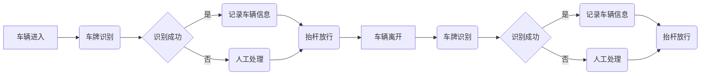

## 基于B/S架构的园区车辆出入管理系统的设计与开发

作者：禅与计算机程序设计艺术

## 1. 引言

### 1.1 背景介绍

随着社会经济的快速发展和城市化进程的加快，各种类型的园区如雨后春笋般涌现，例如：企业园区、科技园区、住宅小区等。这些园区通常规模较大、人员密集、车辆流动性强，传统的车辆管理方式已经难以满足现代化园区管理的需求。为了提高园区管理效率、保障园区安全、提升园区形象，越来越多的园区开始采用智能化的车辆出入管理系统。

### 1.2  传统车辆管理方式的弊端

传统的车辆管理方式主要依靠人工登记、保安巡逻等方式进行，存在着以下弊端:

* **效率低下:** 人工登记车辆信息速度慢，容易出现排队拥堵现象。
* **安全性差:**  人工管理难以有效识别假冒伪劣车辆证件，存在安全隐患。
* **数据统计困难:** 人工记录的数据难以进行统计分析，无法为园区管理提供数据支撑。

### 1.3  智能化车辆出入管理系统的优势

智能化车辆出入管理系统利用现代化信息技术手段，实现了车辆信息的自动化识别、记录和管理，具有以下优势:

* **提高效率:**  车辆自动识别，无需人工干预，提高了通行效率。
* **增强安全性:**  系统可以自动识别假冒伪劣车辆证件，有效保障园区安全。
* **方便管理:**  系统可以自动记录车辆出入信息，方便管理人员进行查询、统计和分析。

## 2.  核心概念与联系

### 2.1  B/S架构

B/S架构（Browser/Server，浏览器/服务器模式）是一种网络架构模式，其特点是客户端只需要安装浏览器即可访问系统，而系统的核心业务逻辑和数据存储则由服务器端完成。

#### 2.1.1  B/S架构的优势

* **部署维护方便:**  客户端无需安装专门的软件，只需使用浏览器即可访问系统，大大降低了系统部署和维护的成本。
* **易于扩展:**  当系统需要进行功能扩展时，只需修改服务器端代码即可，无需修改客户端软件。
* **跨平台性好:**  B/S架构的系统可以在不同的操作系统平台上运行，例如Windows、Linux、Mac OS等。

#### 2.1.2  B/S架构的劣势

* **对网络环境要求较高:**  B/S架构的系统需要依赖稳定的网络环境，如果网络状况不佳，会影响系统的使用体验。
* **安全性方面存在一定风险:**  由于客户端和服务器端之间需要进行数据传输，因此存在一定的安全风险。


### 2.2  车辆识别技术

车辆识别技术是车辆出入管理系统的核心技术之一，主要包括车牌识别技术和RFID射频识别技术。

#### 2.2.1  车牌识别技术

车牌识别技术(License Plate Recognition，LPR)是指利用计算机视觉技术自动识别车辆车牌号码的技术。

#### 2.2.2  RFID射频识别技术

RFID射频识别技术(Radio Frequency Identification)是一种非接触式的自动识别技术，可以通过射频信号自动识别目标对象并获取相关数据。

### 2.3  数据库技术

数据库技术用于存储和管理车辆信息、用户信息、出入记录等数据。

#### 2.3.1 关系型数据库

关系型数据库管理系统(Relational Database Management System，RDBMS)是基于关系模型的数据库管理系统，例如MySQL、Oracle、SQL Server等。

#### 2.3.2  非关系型数据库

非关系型数据库(NoSQL数据库)是不遵循关系模型的数据库管理系统，例如MongoDB、Redis、Cassandra等。

### 2.4  核心概念之间的联系

* B/S架构为用户提供访问车辆出入管理系统的接口。
* 车辆识别技术用于识别车辆信息，并将信息传输给服务器端进行处理。
* 数据库技术用于存储和管理车辆信息、用户信息、出入记录等数据。

## 3.  核心算法原理具体操作步骤

### 3.1  车牌识别算法

车牌识别算法主要包括以下步骤:

1. **图像采集:**  通过摄像头采集车辆图像。
2. **图像预处理:**  对采集到的图像进行去噪、增强等处理，以便于后续的特征提取。
3. **车牌定位:**  利用图像处理技术定位车牌在图像中的位置。
4. **字符分割:**  将车牌区域的字符分割出来。
5. **字符识别:**  利用OCR技术识别分割出来的字符。

### 3.2  RFID射频识别技术原理

RFID射频识别技术的工作原理是:

1. **读写器发射射频信号:**  读写器发射一定频率的射频信号。
2. **电子标签接收信号并返回数据:**  电子标签接收到射频信号后，会将自身存储的数据通过射频信号返回给读写器。
3. **读写器读取数据:**  读写器接收到电子标签返回的数据后，对其进行解码，获取电子标签存储的信息。

### 3.3  数据库操作

数据库操作主要包括以下步骤:

1. **连接数据库:**  使用数据库连接工具连接到数据库服务器。
2. **执行SQL语句:**  使用SQL语句对数据库进行增删改查等操作。
3. **关闭数据库连接:**  操作完成后，及时关闭数据库连接，释放资源。

## 4.  数学模型和公式详细讲解举例说明

### 4.1  车牌定位算法

车牌定位算法可以使用基于边缘检测的算法，例如Canny边缘检测算法。

**Canny边缘检测算法步骤:**

1. **高斯滤波:**  对图像进行高斯滤波，去除图像噪声。
2. **计算梯度幅值和方向:**  使用Sobel算子计算图像的梯度幅值和方向。
3. **非极大值抑制:**  对梯度幅值进行非极大值抑制，细化边缘。
4. **双阈值检测:**  使用双阈值检测确定边缘点。
5. **边缘连接:**  将边缘点连接成轮廓。

**Sobel算子:**

```
Gx =  [-1 0 1]
      [-2 0 2]
      [-1 0 1]

Gy =  [ 1  2  1]
      [ 0  0  0]
      [-1 -2 -1]
```

**梯度幅值:**

```
G = sqrt(Gx^2 + Gy^2)
```

**梯度方向:**

```
theta = arctan(Gy/Gx)
```

### 4.2  车辆通行时间计算

车辆通行时间 = 出入时间差

**时间差计算:**

```
时间差 = 出入时间 - 进入时间
```

### 4.3  车流量统计

车流量 = 单位时间内通过的车辆数量

**车流量计算:**

```
车流量 = 通过车辆数量 / 统计时间段
```


## 5. 项目实践：代码实例和详细解释说明

### 5.1 开发环境搭建

#### 5.1.1 后端开发环境

* 操作系统: Windows 10
* 开发语言: Java
* Web服务器: Tomcat 9
* 数据库: MySQL 8.0
* 开发工具: IntelliJ IDEA

#### 5.1.2 前端开发环境

* 操作系统: Windows 10
* 开发语言: JavaScript
* 前端框架: Vue.js
* 开发工具: Visual Studio Code

### 5.2 数据库设计

#### 5.2.1  车辆信息表(car_info)

| 字段名         | 数据类型    | 备注                                                         |
| :--------------- | :-------- | :----------------------------------------------------------- |
| car_id          | INT         | 车辆ID，主键                                                 |
| plate_number    | VARCHAR(20) | 车牌号码                                                     |
| car_type        | VARCHAR(20) | 车辆类型，例如：小型汽车、大型汽车、摩托车等                     |
| owner_name      | VARCHAR(20) | 车主姓名                                                     |
| owner_phone     | VARCHAR(20) | 车主电话                                                     |
| create_time     | DATETIME    | 创建时间                                                     |
| update_time     | DATETIME    | 更新时间                                                     |

#### 5.2.2  用户信息表(user_info)

| 字段名     | 数据类型    | 备注                                                         |
| :----------- | :-------- | :----------------------------------------------------------- |
| user_id      | INT         | 用户ID，主键                                                 |
| username    | VARCHAR(20) | 用户名                                                     |
| password     | VARCHAR(50) | 密码                                                         |
| real_name    | VARCHAR(20) | 真实姓名                                                     |
| phone_number | VARCHAR(20) | 手机号码                                                     |
| role_id      | INT         | 角色ID，外键关联角色表                                         |
| create_time | DATETIME    | 创建时间                                                     |
| update_time | DATETIME    | 更新时间                                                     |

#### 5.2.3 车辆出入记录表(car_access_record)

| 字段名         | 数据类型    | 备注                                                         |
| :--------------- | :-------- | :----------------------------------------------------------- |
| record_id       | INT         | 记录ID，主键                                                 |
| car_id          | INT         | 车辆ID，外键关联车辆信息表                                     |
| access_time     | DATETIME    | 出入时间                                                     |
| access_type     | VARCHAR(20) | 出入类型，例如：进入、离开                                     |
| access_gate     | VARCHAR(20) | 出入门禁，例如：东门、西门、南门、北门                           |
| image_url       | VARCHAR(255) | 车辆抓拍图片URL                                               |
| create_time     | DATETIME    | 创建时间                                                     |

### 5.3  核心代码实现

#### 5.3.1  车牌识别接口

```java
@RestController
@RequestMapping("/api/car")
public class CarController {

    @Autowired
    private CarService carService;

    @PostMapping("/recognize")
    public Result<CarInfo> recognize(@RequestParam("imageUrl") String imageUrl) {
        // 调用车牌识别服务识别车牌号码
        String plateNumber = carService.recognizePlateNumber(imageUrl);

        // 根据车牌号码查询车辆信息
        CarInfo carInfo = carService.getCarInfoByPlateNumber(plateNumber);

        return Result.success(carInfo);
    }
}
```

#### 5.3.2  车辆出入记录接口

```java
@RestController
@RequestMapping("/api/record")
public class CarAccessRecordController {

    @Autowired
    private CarAccessRecordService carAccessRecordService;

    @PostMapping("/save")
    public Result<Void> save(@RequestBody CarAccessRecord carAccessRecord) {
        carAccessRecordService.save(carAccessRecord);
        return Result.success();
    }

    @GetMapping("/list")
    public Result<PageInfo<CarAccessRecord>> list(@RequestParam(defaultValue = "1") Integer pageNum,
                                                  @RequestParam(defaultValue = "10") Integer pageSize,
                                                  @RequestParam(required = false) String plateNumber,
                                                  @RequestParam(required = false) String startTime,
                                                  @RequestParam(required = false) String endTime) {
        PageInfo<CarAccessRecord> pageInfo = carAccessRecordService.list(pageNum, pageSize, plateNumber, startTime, endTime);
        return Result.success(pageInfo);
    }
}
```

## 6. 实际应用场景

### 6.1  企业园区车辆管理

企业园区车辆出入管理系统可以实现以下功能:

* 车辆自动识别、记录车辆出入信息。
* 对接访客系统，实现访客车辆预约登记、自动放行。
* 对接停车场系统，实现车辆自动计费、缴费。
* 生成报表，统计分析车辆出入数据。

### 6.2  住宅小区车辆管理

住宅小区车辆出入管理系统可以实现以下功能:

* 业主车辆自动识别、记录车辆出入信息。
* 外来车辆登记、访客车辆预约登记。
* 对接物业收费系统，实现物业费自动缴纳。
* 生成报表，统计分析车辆出入数据。

### 6.3  其他应用场景

除了以上场景外，车辆出入管理系统还可以应用于以下场景:

* 物流园区
* 停车场
* 收费站
* 校园

## 7. 工具和资源推荐

### 7.1 车牌识别SDK

* **百度AI开放平台:**  提供车牌识别API接口，支持多种开发语言调用。
* **腾讯云文字识别:**  提供车牌识别API接口，支持多种开发语言调用。
* **阿里云视觉智能开放平台:**  提供车牌识别API接口，支持多种开发语言调用。

### 7.2  RFID读写器

* **Impinj:**  提供高性能的RFID读写器和天线。
* **Alien Technology:**  提供各种类型的RFID读写器和标签。
* **Zebra Technologies:**  提供企业级的RFID解决方案。

### 7.3  数据库

* **MySQL:**  开源免费的关系型数据库管理系统，性能优异、稳定可靠。
* **Oracle:**  商业化的关系型数据库管理系统，功能强大、性能卓越。
* **MongoDB:**  开源的文档型数据库管理系统，灵活易用、可扩展性强。


## 8. 总结：未来发展趋势与挑战

### 8.1 未来发展趋势

* **人工智能技术的应用:**  未来，人工智能技术将更加广泛地应用于车辆出入管理系统中，例如：人脸识别、车辆行为分析等。
* **云计算技术的应用:**  云计算技术可以为车辆出入管理系统提供更加灵活、可扩展的计算和存储资源。
* **物联网技术的应用:**  物联网技术可以将车辆、门禁、摄像头等设备连接起来，实现更加智能化的管理。

### 8.2  挑战

* **数据安全问题:**  车辆出入管理系统涉及大量的车辆和用户信息，如何保障数据安全是一个重要的挑战。
* **系统稳定性问题:**  车辆出入管理系统需要7x24小时不间断运行，如何保障系统的稳定性也是一个重要的挑战。
* **成本控制问题:**  智能化车辆出入管理系统的建设和维护成本较高，如何控制成本也是一个需要考虑的问题。


## 9. 附录：常见问题与解答

### 9.1  问：车牌识别率不高怎么办？

**答:**  车牌识别率受多种因素影响，例如：

* **摄像头角度:**  摄像头安装角度不当，会导致车牌图像变形，影响识别率。
* **光线环境:**  光线过强或过弱，都会影响车牌图像质量，进而影响识别率。
* **车牌污损:**  车牌表面有污渍、遮挡物等，也会影响识别率。

**解决办法:**

* 调整摄像头角度，使其正对车辆行驶方向。
* 选择合适的安装位置，避免强光直射或光线不足。
* 定期清洁车牌，保持车牌表面清洁。

### 9.2  问：RFID卡容易被复制吗？

**答:**  RFID卡存在被复制的风险，但可以通过以下措施降低风险:

* **采用高安全等级的RFID卡:**  选择安全等级较高的RFID卡，例如：Mifare Plus、Desfire等。
* **数据加密:**  对RFID卡中的数据进行加密，即使被复制，也无法读取数据。
* **访问控制:**  设置访问权限，只有授权用户才能读取或修改RFID卡中的数据。

### 9.3  问：系统如何实现远程监控？

**答:**  可以通过以下方式实现远程监控:

* **Web端远程监控:**  开发Web端管理平台，管理员可以通过Web浏览器远程访问系统，查看车辆出入记录、监控视频等信息。
* **移动端远程监控:**  开发移动端APP，管理员可以通过手机APP远程访问系统，接收报警信息、查看监控视频等。


## 10.  Mermaid流程图


