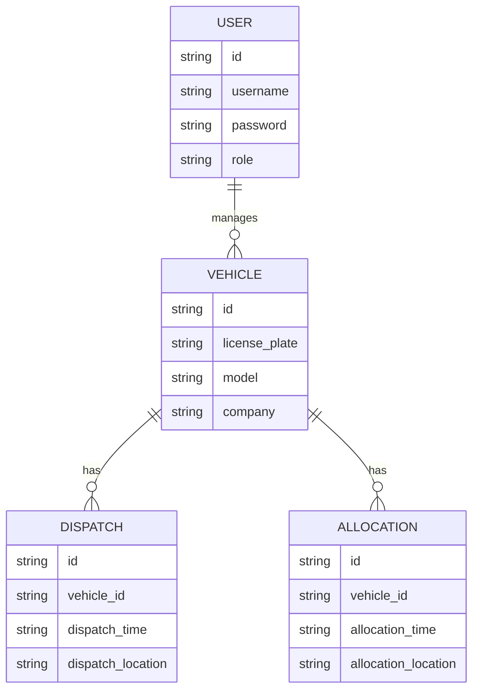

# 基于B/S结构的车辆管理系统详细设计与具体代码实现

作者：禅与计算机程序设计艺术

## 1. 背景介绍

### 1.1 车辆管理系统的需求

随着城市化进程的不断推进，车辆数量的急剧增长对城市交通管理提出了巨大的挑战。传统的车辆管理系统由于其架构和技术的局限性，已经无法满足现代化管理的需求。因此，开发一套基于B/S（Browser/Server，浏览器/服务器）结构的车辆管理系统成为一种趋势。

### 1.2 B/S结构的优势

B/S结构相较于传统的C/S（Client/Server，客户端/服务器）结构，具有以下显著优势：
- **部署简单**：只需在服务器端进行维护和更新，客户端只需使用浏览器访问即可。
- **跨平台**：不依赖于具体的操作系统和硬件平台，只要有浏览器就能访问。
- **易于扩展**：可以方便地进行功能扩展和系统升级。

### 1.3 本文目标

本文旨在详细介绍基于B/S结构的车辆管理系统的设计与实现，包括系统的核心概念、算法原理、数学模型、代码实例、实际应用场景、工具和资源推荐，以及未来发展趋势与挑战。

## 2. 核心概念与联系

### 2.1 车辆管理系统的基本功能

一个完善的车辆管理系统应包含以下基本功能：
- **车辆信息管理**：包括车辆的基本信息录入、修改、删除等。
- **车辆调度管理**：实现车辆的调度、分配、跟踪等。
- **统计分析**：对车辆的使用情况进行统计和分析，生成报表。
- **权限管理**：不同用户具有不同的权限，确保系统的安全性。

### 2.2 B/S结构的基本原理

B/S结构是一种三层架构，通常包括以下三层：
- **表示层（Presentation Layer）**：负责用户界面的显示和用户交互，通常由HTML、CSS、JavaScript等技术实现。
- **业务逻辑层（Business Logic Layer）**：负责处理应用程序的业务逻辑，通常由服务器端的程序（如Java、Python、Node.js等）实现。
- **数据层（Data Layer）**：负责数据的存储和管理，通常由数据库系统（如MySQL、PostgreSQL等）实现。

### 2.3 核心技术栈

本文所介绍的车辆管理系统将使用以下核心技术栈：
- **前端技术**：HTML、CSS、JavaScript、React.js
- **后端技术**：Node.js、Express.js
- **数据库**：MongoDB
- **其他工具**：Docker、Nginx

## 3. 核心算法原理具体操作步骤

### 3.1 车辆信息管理

车辆信息管理是车辆管理系统的核心功能之一，主要包括车辆信息的录入、修改、删除和查询。其具体操作步骤如下：

1. **车辆信息录入**：
   - 用户在前端界面填写车辆的基本信息（如车牌号、车型、所属公司等）。
   - 前端将填写的信息通过HTTP POST请求发送到服务器端。
   - 服务器端接收到请求后，将信息存储到数据库中。

2. **车辆信息修改**：
   - 用户在前端界面选择需要修改的车辆信息，并进行修改。
   - 前端将修改后的信息通过HTTP PUT请求发送到服务器端。
   - 服务器端接收到请求后，更新数据库中的相应记录。

3. **车辆信息删除**：
   - 用户在前端界面选择需要删除的车辆信息。
   - 前端将删除请求通过HTTP DELETE请求发送到服务器端。
   - 服务器端接收到请求后，删除数据库中的相应记录。

4. **车辆信息查询**：
   - 用户在前端界面输入查询条件（如车牌号、车型等）。
   - 前端将查询条件通过HTTP GET请求发送到服务器端。
   - 服务器端接收到请求后，从数据库中查询符合条件的记录，并将结果返回给前端。

### 3.2 车辆调度管理

车辆调度管理是车辆管理系统的另一项重要功能，主要包括车辆的调度、分配和跟踪。其具体操作步骤如下：

1. **车辆调度**：
   - 用户在前端界面选择需要调度的车辆，并填写调度信息（如调度时间、调度地点等）。
   - 前端将调度信息通过HTTP POST请求发送到服务器端。
   - 服务器端接收到请求后，将调度信息存储到数据库中。

2. **车辆分配**：
   - 用户在前端界面选择需要分配的车辆，并填写分配信息（如分配时间、分配地点等）。
   - 前端将分配信息通过HTTP POST请求发送到服务器端。
   - 服务器端接收到请求后，将分配信息存储到数据库中。

3. **车辆跟踪**：
   - 用户在前端界面查看车辆的实时位置和行驶轨迹。
   - 前端通过HTTP GET请求从服务器端获取车辆的位置信息。
   - 服务器端从数据库中查询车辆的位置信息，并将结果返回给前端。

### 3.3 统计分析

统计分析功能主要用于对车辆的使用情况进行统计和分析，生成各种报表。其具体操作步骤如下：

1. **数据采集**：
   - 系统自动采集车辆的使用数据（如行驶里程、油耗等）。
   - 采集到的数据通过HTTP POST请求发送到服务器端。
   - 服务器端接收到请求后，将数据存储到数据库中。

2. **数据处理**：
   - 服务器端对采集到的数据进行处理和分析，生成各种统计报表（如车辆使用率报表、油耗报表等）。
   - 处理后的数据存储到数据库中。

3. **报表生成**：
   - 用户在前端界面选择需要生成的报表类型和时间范围。
   - 前端将请求通过HTTP GET请求发送到服务器端。
   - 服务器端从数据库中查询相应的数据，生成报表，并将结果返回给前端。

### 3.4 权限管理

权限管理功能主要用于对系统的用户进行管理，确保系统的安全性。其具体操作步骤如下：

1. **用户注册**：
   - 用户在前端界面填写注册信息（如用户名、密码等）。
   - 前端将注册信息通过HTTP POST请求发送到服务器端。
   - 服务器端接收到请求后，将注册信息存储到数据库中。

2. **用户登录**：
   - 用户在前端界面填写登录信息（如用户名、密码等）。
   - 前端将登录信息通过HTTP POST请求发送到服务器端。
   - 服务器端接收到请求后，验证用户信息，并生成会话（Session）。

3. **权限分配**：
   - 管理员在前端界面为用户分配权限（如车辆管理权限、调度管理权限等）。
   - 前端将权限分配信息通过HTTP POST请求发送到服务器端。
   - 服务器端接收到请求后，将权限分配信息存储到数据库中。

## 4. 数学模型和公式详细讲解举例说明

### 4.1 数据库设计

车辆管理系统的数据存储是基于关系数据库的，因此需要设计合理的数据库模型。以下是车辆管理系统的主要数据库表及其关系：

### 4.2 车辆调度优化算法

为了提高车辆调度的效率，可以使用优化算法来进行车辆调度。以下是一个简单的车辆调度优化算法示例：

假设有 $n$ 辆车辆和 $m$ 个任务，每辆车辆的调度成本为 $c_{ij}$，其中 $i$ 表示车辆，$j$ 表示任务。目标是找到一个最优的调度方案，使得总成本最小。

可以使用线性规划模型来解决这个问题：

$$
\text{Minimize} \quad \sum_{i=1}^{n} \sum_{j=1}^{m} c_{ij} x_{ij}
$$

Subject to:

$$
\sum_{j=1}^{m} x_{ij} = 1 \quad \forall i \in \{1, 2, \ldots, n\}
$$

$$
\sum_{i=1}^{n} x_{ij} =