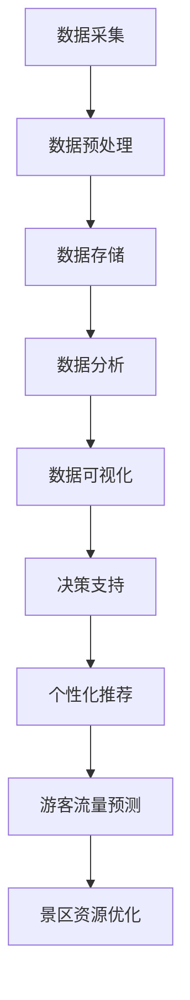

# 基于Hadoop的全国热门景点旅游管理系统的设计与实现

作者：禅与计算机程序设计艺术

## 1. 背景介绍

### 1.1 旅游行业现状与挑战

旅游行业是全球经济的重要组成部分，特别是在中国，随着国民生活水平的提高和休闲时间的增加，旅游需求呈现爆发式增长。热门景点在旅游旺季常常人满为患，给景区管理带来了极大的挑战。如何高效地管理游客流量、优化资源配置、提升游客体验成为了亟待解决的问题。

### 1.2 大数据技术在旅游管理中的应用

大数据技术的迅猛发展为旅游管理提供了新的思路和解决方案。通过对游客行为数据的收集与分析，可以实现精准的游客流量预测、个性化旅游推荐、智能化景区管理等功能，从而提升景区的管理效率和服务质量。Hadoop作为大数据处理的核心技术，具有强大的数据存储和处理能力，成为实现这一目标的理想选择。

### 1.3 项目目标与意义

本项目旨在设计并实现一个基于Hadoop的全国热门景点旅游管理系统，通过对游客行为数据的分析与处理，提供游客流量预测、景区资源优化配置、个性化旅游推荐等功能，提升景区的管理效率和游客的旅游体验。该系统的实现不仅能够为景区管理者提供决策支持，还能够为游客提供更好的服务，具有重要的实际意义。

## 2. 核心概念与联系

### 2.1 Hadoop生态系统概述

Hadoop是一个开源的大数据处理框架，主要由HDFS（Hadoop Distributed File System）、MapReduce、YARN（Yet Another Resource Negotiator）和HBase等组件组成。HDFS负责数据的存储，MapReduce负责数据的处理，YARN负责资源的管理和调度，HBase则是一个分布式数据库，用于存储和管理大规模结构化数据。

### 2.2 数据来源与数据类型

在旅游管理系统中，数据来源主要包括以下几类：
- **游客行为数据**：包括游客的地理位置、行程规划、景点停留时间等。
- **景区管理数据**：包括景区的开放时间、游客容量、设施情况等。
- **社交媒体数据**：包括游客在社交媒体上的评论、照片、打卡记录等。

这些数据可以分为结构化数据、半结构化数据和非结构化数据，分别存储在HBase、HDFS等不同的存储系统中。

### 2.3 数据处理与分析

数据处理与分析是旅游管理系统的核心功能，主要包括以下几个方面：
- **数据预处理**：对原始数据进行清洗、转换和归一化处理，保证数据的质量和一致性。
- **数据存储与管理**：使用HDFS和HBase等存储系统对数据进行存储和管理，保证数据的可靠性和可扩展性。
- **数据分析与挖掘**：使用MapReduce、Spark等计算框架对数据进行分析和挖掘，提取有价值的信息和知识。
- **数据可视化**：使用Tableau、D3.js等工具对分析结果进行可视化展示，帮助用户更直观地理解数据。

### 2.4 系统架构设计

系统架构设计是实现旅游管理系统的关键步骤。一个典型的基于Hadoop的旅游管理系统架构如下：

## 3. 核心算法原理具体操作步骤

### 3.1 游客流量预测算法

游客流量预测是旅游管理系统的重要功能之一，通过对历史游客流量数据的分析，预测未来的游客流量。常用的预测算法包括时间序列分析、回归分析、机器学习等。

#### 3.1.1 时间序列分析

时间序列分析是一种常用的预测方法，通过对时间序列数据的建模和分析，预测未来的趋势和变化。常用的时间序列分析方法包括ARIMA（AutoRegressive Integrated Moving Average）、SARIMA（Seasonal ARIMA）等。

#### 3.1.2 回归分析

回归分析是一种统计方法，通过建立变量之间的关系模型，预测因变量的值。常用的回归分析方法包括线性回归、多元回归等。

#### 3.1.3 机器学习

机器学习是一种数据驱动的预测方法，通过对大量历史数据的训练，建立预测模型。常用的机器学习方法包括决策树、随机森林、支持向量机、神经网络等。

### 3.2 个性化推荐算法

个性化推荐是旅游管理系统的另一重要功能，通过对游客行为数据的分析，向游客推荐符合其兴趣和需求的景点和活动。常用的推荐算法包括协同过滤、基于内容的推荐、混合推荐等。

#### 3.2.1 协同过滤

协同过滤是一种基于用户行为的推荐方法，通过分析用户的历史行为，发现与当前用户兴趣相似的用户，并推荐这些用户喜欢的景点和活动。协同过滤可以分为基于用户的协同过滤和基于物品的协同过滤。

#### 3.2.2 基于内容的推荐

基于内容的推荐是一种基于景点和活动特征的推荐方法，通过分析景点和活动的特征，向用户推荐符合其兴趣的景点和活动。基于内容的推荐通常需要对景点和活动进行特征提取和建模。

#### 3.2.3 混合推荐

混合推荐是一种结合多种推荐方法的推荐方法，通过综合考虑用户行为和景点特征，向用户推荐符合其兴趣和需求的景点和活动。混合推荐通常需要对多种推荐方法进行融合和优化。

## 4. 数学模型和公式详细讲解举例说明

### 4.1 时间序列分析模型

时间序列分析模型是预测游客流量的重要工具。常用的时间序列分析模型包括ARIMA和SARIMA。

#### 4.1.1 ARIMA模型

ARIMA模型是一种常用的时间序列预测模型，由自回归（AutoRegressive, AR）、差分（Integrated, I）和移动平均（Moving Average, MA）三部分组成。ARIMA模型的数学表达式为：

$$
Y_t = c + \phi_1 Y_{t-1} + \phi_2 Y_{t-2} + ... + \phi_p Y_{t-p} + \theta_1 \epsilon_{t-1} + \theta_2 \epsilon_{t-2} + ... + \theta_q \epsilon_{t-q} + \epsilon_t
$$

其中，$Y_t$ 是时间序列的当前值，$c$ 是常数项，$\phi_i$ 是自回归系数，$\theta_i$ 是移动平均系数，$\epsilon_t$ 是误差项。

#### 4.1.2 SARIMA模型

SARIMA模型是在ARIMA模型的基础上，加入了季节性成分，用于处理具有季节性变化的时间序列数据。SARIMA模型的数学表达式为：

$$
Y_t = c + \phi(B) Y_{t-1} + \theta(B) \epsilon_t + \Phi(B^s) Y_{t-s} + \Theta(B^s) \epsilon_{t-s} + \epsilon_t
$$

其中，$B$ 是滞后算子，$s$ 是季节周期，$\phi(B)$ 和 $\theta(B)$ 分别为非季节性自回归和移动平均多项式，$\Phi(B^s)$ 和 $\Theta(B^s)$ 分别为季节性自回归和移动平均多项式。

### 4.2 回归分析模型

回归分析模型用于建立变量之间的关系，通过自变量预测因变量。常用的回归分析模型包括线性回归和多元回归。

#### 4.2.1 线性回归模型

线性回归模型是一种简单的回归分析方法，通过建立自变量和因变量之间的线性关系，预测因变量的值。线性回归模型的数学表达式为：

$$
Y = \beta_0 + \beta_1 X_1 + \beta_2 X_2 + ... + \beta_n X_n + \epsilon
$$

其中，$Y$ 是因变量，$X_i$ 是自变量，$\beta_i$ 是回归系数，$\epsilon$ 是误差项。

#### 4.2.2 多元回归模型

多元回归模型是线性