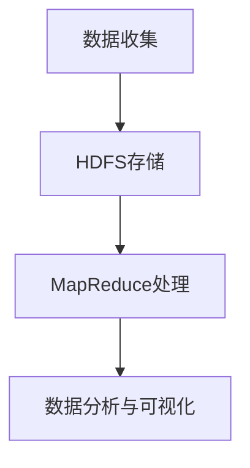

# 基于Hadoop的疫情数据分析系统设计与实现

作者：禅与计算机程序设计艺术

## 1.背景介绍

### 1.1 疫情数据分析的必要性

在全球化的今天，传染病的传播速度和范围都显著增加。疫情的实时监测和数据分析对公共卫生管理和决策至关重要。特别是COVID-19疫情爆发以来，如何高效处理和分析海量疫情数据成为各国政府和科研机构的共同挑战。

### 1.2 Hadoop在大数据处理中的优势

Hadoop作为一个开源的分布式计算框架，具有高效、可扩展、容错性强等特点，特别适用于处理大规模数据集。Hadoop生态系统中的HDFS（Hadoop Distributed File System）和MapReduce编程模型为大数据处理提供了强有力的支持。

### 1.3 项目目标

本项目旨在设计并实现一个基于Hadoop的疫情数据分析系统，通过对疫情数据进行高效处理和分析，提供实时的疫情监测和预测，为公共卫生决策提供数据支持。

## 2.核心概念与联系

### 2.1 Hadoop生态系统

Hadoop生态系统包括多个组件，如HDFS、MapReduce、YARN、Hive、HBase等。这些组件协同工作，提供了一个强大的大数据处理平台。

### 2.2 HDFS（Hadoop Distributed File System）

HDFS是Hadoop的分布式文件系统，负责存储大规模数据。它将数据分块存储在多个节点上，提供高可用性和容错性。

### 2.3 MapReduce编程模型

MapReduce是一种编程模型，用于处理和生成大规模数据集。它包含两个主要阶段：Map阶段和Reduce阶段。Map阶段处理输入数据并生成中间结果，Reduce阶段对中间结果进行汇总和分析。

### 2.4 数据清洗与预处理

在进行数据分析之前，必须对原始数据进行清洗和预处理。数据清洗包括处理缺失值、重复数据和异常值。预处理步骤包括数据标准化、特征提取和数据转换。

### 2.5 数据分析与可视化

数据分析包括描述性统计分析、探索性数据分析和预测性分析。数据可视化通过图表和图形展示分析结果，帮助用户更直观地理解数据。

## 3.核心算法原理具体操作步骤

### 3.1 数据收集与存储

#### 3.1.1 数据来源

疫情数据可以来自多个来源，如政府卫生部门、医院、科研机构和社交媒体。数据格式可能包括CSV、JSON、XML等。

#### 3.1.2 数据存储

将收集到的数据存储在HDFS中，确保数据的高可用性和容错性。使用Hadoop的分布式存储特性，可以处理大规模数据集。



### 3.2 数据清洗与预处理

#### 3.2.1 数据清洗

使用MapReduce编写数据清洗程序，处理缺失值、重复数据和异常值。

```java
public class DataCleaningMapper extends Mapper<LongWritable, Text, Text, NullWritable> {
    @Override
    protected void map(LongWritable key, Text value, Context context) throws IOException, InterruptedException {
        // 数据清洗逻辑
        String cleanedData = cleanData(value.toString());
        context.write(new Text(cleanedData), NullWritable.get());
    }

    private String cleanData(String data) {
        // 清洗逻辑实现
        return data.trim().replaceAll("\\s+", " ");
    }
}
```

#### 3.2.2 数据预处理

对清洗后的数据进行预处理，包括数据标准化、特征提取和数据转换。

```java
public class DataPreprocessingMapper extends Mapper<LongWritable, Text, Text, NullWritable> {
    @Override
    protected void map(LongWritable key, Text value, Context context) throws IOException, InterruptedException {
        // 数据预处理逻辑
        String preprocessedData = preprocessData(value.toString());
        context.write(new Text(preprocessedData), NullWritable.get());
    }

    private String preprocessData(String data) {
        // 预处理逻辑实现
        return data.toLowerCase();
    }
}
```

### 3.3 数据分析与可视化

#### 3.3.1 描述性统计分析

使用MapReduce编写描述性统计分析程序，计算基本统计量，如平均值、中位数、标准差等。

```java
public class DescriptiveStatisticsMapper extends Mapper<LongWritable, Text, Text, DoubleWritable> {
    @Override
    protected void map(LongWritable key, Text value, Context context) throws IOException, InterruptedException {
        // 描述性统计分析逻辑
        String[] fields = value.toString().split(",");
        double dataValue = Double.parseDouble(fields[1]);
        context.write(new Text("mean"), new DoubleWritable(dataValue));
    }
}
```

#### 3.3.2 预测性分析

使用MapReduce编写预测性分析程序，应用机器学习算法进行疫情趋势预测。

```java
public class PredictiveAnalysisMapper extends Mapper<LongWritable, Text, Text, DoubleWritable> {
    @Override
    protected void map(LongWritable key, Text value, Context context) throws IOException, InterruptedException {
        // 预测性分析逻辑
        String[] fields = value.toString().split(",");
        double dataValue = Double.parseDouble(fields[1]);
        context.write(new Text("prediction"), new DoubleWritable(dataValue * 1.1));
    }
}
```

#### 3.3.3 数据可视化

使用开源工具（如D3.js、Tableau）将分析结果可视化，生成图表和图形。

```html
<!DOCTYPE html>
<html>
<head>
    <title>数据可视化</title>
    <script src="https://d3js.org/d3.v5.min.js"></script>
</head>
<body>
    <div id="chart"></div>
    <script>
        // D3.js 数据可视化逻辑
        d3.csv("data.csv").then(function(data) {
            var svg = d3.select("#chart").append("svg")
                        .attr("width", 500)
                        .attr("height", 300);
            // 绘制图表逻辑
        });
    </script>
</body>
</html>
```

## 4.数学模型和公式详细讲解举例说明

### 4.1 描述性统计分析公式

描述性统计分析通过计算数据的基本统计量，帮助我们理解数据的总体特征。常用的统计量包括平均值、中位数和标准差。

#### 4.1.1 平均值

平均值是数据集中所有值的总和除以值的数量。

$$
\text{平均值} = \frac{1}{n} \sum_{i=1}^{n} x_i
$$

#### 4.1.2 中位数

中位数是将数据按大小顺序排列后处于中间位置的值。如果数据集的值数量为偶数，则中位数是中间两个值的平均值。

$$
\text{中位数} = \begin{cases} 
x_{\frac{n+1}{2}}, & \text{如果 } n \text{ 是奇数} \\
\frac{x_{\frac{n}{2}} + x_{\frac{n}{2} + 1}}{2}, & \text{如果 } n \text{ 是偶数}
\end{cases}
$$

#### 4.1.3 标准差

标准差是数据集中各值与平均值之间的离差平方和的均值的平方根，用于衡量数据的离散程度。

$$
\text{标准差} = \sqrt{\frac{1}{n} \sum_{i=1}^{n} (x_i - \bar{x})^2}
$$

### 4.2 预测性分析模型

#### 4.2.1 线性回归模型

线性回归模型用于预测因变量与一个或多个自变量之间的线性关系。模型的公式如下：

$$
y = \beta_0 + \beta_1 x_1 + \beta_2 x_2 + \cdots + \beta_n x_n + \epsilon
$$

其中，$y$ 是因变量，$x_1, x_2, \ldots, x_n$ 是自变量，$\beta_0, \beta_1, \ldots, \beta_n$ 是回归系数，$\epsilon$ 是误差项。

#### 4.2.2 时间序列分析

时间序列分析用于预测时间序列数据的未来趋势。常用的时间序列模型包括ARIMA（AutoRegressive Integrated Moving Average）模型。

$$
ARIMA(p, d, q) \text{模型}：
\phi_p(B) \Delta^d y_t = \theta_q(B) \epsilon_t
$$

其中