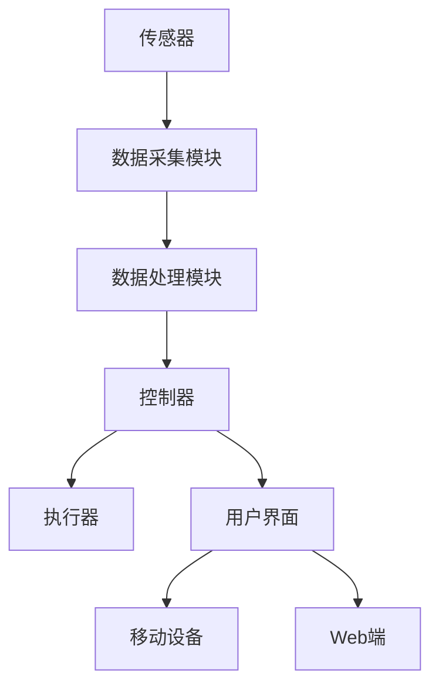

# 基于Java的智能家居设计：开发跨平台智能家居应用的技术要点

作者：禅与计算机程序设计艺术

## 1.背景介绍

### 1.1 智能家居的发展历程

智能家居概念最早可以追溯到20世纪80年代，随着计算机技术和互联网的迅猛发展，智能家居的实现变得越来越现实。智能家居不仅仅是一个科技概念，更是现代生活方式的象征，旨在通过智能化手段提升家居生活的舒适度、安全性和便利性。

### 1.2 Java在智能家居中的角色

Java作为一种跨平台的编程语言，具有良好的可移植性和丰富的库支持，使其成为智能家居应用开发的理想选择。无论是嵌入式设备、移动设备还是服务器端，Java都能提供一致的开发体验和高效的性能。

### 1.3 跨平台智能家居应用的需求

随着智能家居设备的多样化和用户需求的不断增加，开发一个能够跨平台运行的智能家居应用变得尤为重要。这不仅可以降低开发成本，还能提升用户体验，满足不同设备和操作系统的需求。

## 2.核心概念与联系

### 2.1 智能家居系统的组成

智能家居系统通常由以下几个部分组成：

- **传感器**：用于监测环境参数，如温度、湿度、光照等。
- **控制器**：处理传感器数据并发出控制指令。
- **执行器**：接收控制指令并执行相应操作，如开关灯、调节温度等。
- **通信网络**：连接各个设备，实现数据传输和命令执行。
- **用户界面**：供用户与系统交互的界面，如手机应用、网页端等。

### 2.2 Java技术栈

在智能家居应用开发中，Java技术栈主要包括以下几个方面：

- **Java SE（Standard Edition）**：提供核心的编程接口和库。
- **Java EE（Enterprise Edition）**：用于开发企业级应用，提供丰富的API和工具。
- **Java ME（Micro Edition）**：专为嵌入式设备设计，适用于资源受限的环境。
- **Spring Framework**：提供全面的解决方案，简化企业级应用开发。
- **JavaFX**：用于构建富客户端应用，支持多种平台。

### 2.3 跨平台开发框架

为了实现跨平台智能家居应用开发，可以使用以下框架：

- **Apache Cordova**：允许使用HTML、CSS和JavaScript开发跨平台移动应用。
- **Flutter**：由Google开发的跨平台UI框架，支持Android和iOS。
- **React Native**：由Facebook开发的跨平台移动应用框架，使用JavaScript和React。

## 3.核心算法原理具体操作步骤

### 3.1 数据采集与传感器集成

智能家居系统的核心在于数据采集和处理。传感器是数据采集的关键组件，它们可以监测环境中的各种参数，并将数据传输到控制器。以下是集成传感器的基本步骤：

1. **选择传感器**：根据需求选择合适的传感器，如温度传感器、湿度传感器等。
2. **连接传感器**：将传感器与控制器连接，通常使用I2C、SPI或UART接口。
3. **编写驱动程序**：在Java中编写传感器的驱动程序，读取传感器数据。
4. **数据处理**：对采集到的数据进行处理，如滤波、校准等。

### 3.2 数据传输与通信协议

智能家居系统中的设备需要通过通信网络进行数据传输，常用的通信协议包括：

- **Wi-Fi**：适用于高带宽需求的设备，如视频监控。
- **Zigbee**：低功耗、低带宽，适用于传感器网络。
- **Bluetooth**：短距离通信，适用于个人设备。
- **MQTT**：轻量级消息传输协议，适用于物联网设备。

### 3.3 数据存储与处理

智能家居系统需要对采集到的数据进行存储和处理，以便后续分析和决策。常见的数据存储和处理方法包括：

- **本地存储**：将数据存储在本地设备上，适用于小规模系统。
- **云存储**：将数据上传到云端，适用于大规模系统和数据分析。
- **数据库**：使用关系型数据库（如MySQL）或NoSQL数据库（如MongoDB）存储数据。

## 4.数学模型和公式详细讲解举例说明

### 4.1 数据处理与分析模型

在智能家居系统中，数据处理和分析是关键环节。以下是常用的数据处理和分析模型：

- **线性回归**：用于预测和趋势分析。
- **决策树**：用于分类和回归问题。
- **神经网络**：用于复杂的模式识别和预测任务。

#### 线性回归模型

线性回归模型用于建立因变量 $y$ 与自变量 $x$ 之间的线性关系，模型公式如下：

$$
y = \beta_0 + \beta_1 x + \epsilon
$$

其中，$\beta_0$ 是截距，$\beta_1$ 是斜率，$\epsilon$ 是误差项。

#### 决策树模型

决策树模型通过树状结构进行决策，节点表示特征，边表示特征值，叶子节点表示决策结果。决策树的构建过程包括以下步骤：

1. **选择最优特征**：根据信息增益或基尼指数选择最优特征。
2. **划分数据集**：根据最优特征将数据集划分为子集。
3. **递归构建子树**：对每个子集递归构建子树，直到满足停止条件。

### 4.2 实际应用中的数学模型

在智能家居系统中，常用的数学模型包括：

- **温度预测模型**：使用线性回归或神经网络预测未来的温度变化。
- **能耗优化模型**：使用决策树或随机森林分析能耗数据，优化能源使用。

## 5.项目实践：代码实例和详细解释说明

### 5.1 项目架构设计

在开始编写代码之前，首先需要设计项目的架构。以下是一个典型的智能家居项目架构图：



### 5.2 传感器数据采集代码示例

以下是一个使用Java采集温度传感器数据的示例代码：

```java
import java.io.BufferedReader;
import java.io.InputStreamReader;

public class TemperatureSensor {
    private String sensorPath;

    public TemperatureSensor(String sensorPath) {
        this.sensorPath = sensorPath;
    }

    public double readTemperature() throws Exception {
        Process process = Runtime.getRuntime().exec("cat " + sensorPath);
        BufferedReader reader = new BufferedReader(new InputStreamReader(process.getInputStream()));
        String line = reader.readLine();
        reader.close();
        return Double.parseDouble(line);
    }

    public static void main(String[] args) {
        try {
            TemperatureSensor sensor = new TemperatureSensor("/sys/bus/w1/devices/28-000006b4a1ff/w1_slave");
            double temperature = sensor.readTemperature();
            System.out.println("Current Temperature: " + temperature + "°C");
        } catch (Exception e) {
            e.printStackTrace();
        }
    }
}
```

### 5.3 数据传输与通信代码示例

以下是一个使用MQTT协议进行数据传输的示例代码：

```java
import org.eclipse.paho.client.mqttv3.MqttClient;
import org.eclipse.paho.client.mqttv3.MqttMessage;
import org.eclipse.paho.client.mqttv3.persist.MemoryPersistence;

public class MqttPublisher {
    private String broker;
    private String clientId;

    public MqttPublisher(String broker, String clientId) {
        this.broker = broker;
        this.clientId = clientId;
    }

    public void publish(String topic, String content) throws Exception {
        MqttClient client = new MqttClient(broker, clientId, new MemoryPersistence());
        client.connect();
        MqttMessage message = new MqttMessage(content.getBytes());
        message.setQos(2);
        client.publish(topic, message);
        client.disconnect();
    }

    public static void main(String[] args) {
        try {
            MqttPublisher publisher = new MqttPublisher("tcp://localhost:1883", "JavaClient");
            publisher.publish("home/temperature",