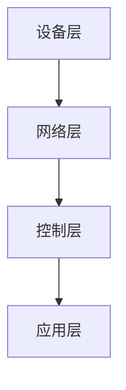
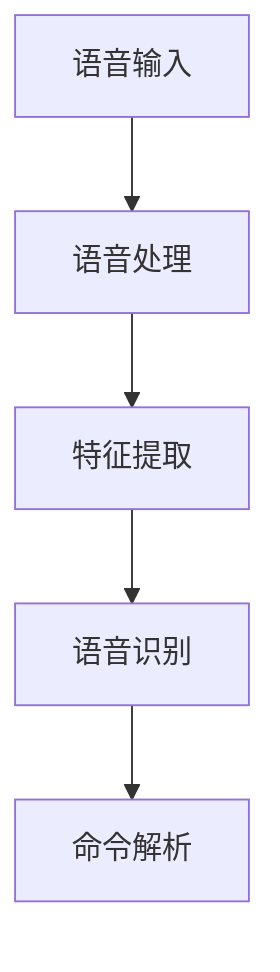

# 基于Java的智能家居设计：集成语音识别功能到智能家居系统

作者：禅与计算机程序设计艺术

## 1. 背景介绍

### 1.1 智能家居的发展历程

智能家居的概念最早可以追溯到20世纪80年代，当时的智能家居系统主要集中在家庭自动化控制方面。随着技术的进步，特别是互联网和物联网（IoT）的发展，智能家居系统逐渐变得更加智能和互联。今天，智能家居不仅包括自动化控制，还集成了人工智能（AI）和大数据分析，提供了更加个性化和智能化的用户体验。

### 1.2 语音识别技术的崛起

语音识别技术的发展同样经历了漫长的历程。从早期的简单语音命令识别到如今能够理解自然语言的复杂系统，语音识别技术已经成为现代智能设备的重要组成部分。特别是在智能家居领域，语音识别技术的应用使得用户可以通过语音命令控制家中的各种设备，极大地提升了用户体验和便利性。

### 1.3 本文的目标

本文旨在探讨如何基于Java语言设计一个智能家居系统，并集成语音识别功能。通过详细的技术分析和代码实例，帮助读者理解和实现这一目标。

## 2. 核心概念与联系

### 2.1 智能家居系统概述

智能家居系统通过集成各种传感器、控制器和家电设备，实现对家庭环境的智能化控制。核心组件包括：

- **中央控制单元（CCU）**：负责处理来自各个传感器的数据，并发送控制命令。
- **传感器**：用于检测环境参数，如温度、湿度、光线强度等。
- **执行器**：用于执行控制命令，如开关灯、调节温度等。
- **通信协议**：用于设备之间的数据传输，如Zigbee、Z-Wave、Wi-Fi等。

### 2.2 语音识别技术概述

语音识别技术是指将人类的语音转换为文本的技术。主要包括以下几个步骤：

- **语音信号处理**：对语音信号进行预处理，包括降噪、归一化等。
- **特征提取**：从语音信号中提取特征参数，如梅尔频率倒谱系数（MFCC）。
- **模式匹配**：将提取的特征与预先训练的模型进行匹配，识别出语音内容。
- **自然语言处理（NLP）**：对识别出的文本进行语义理解，实现更复杂的语音交互。

### 2.3 Java在智能家居中的应用

Java作为一种跨平台的编程语言，具有良好的稳定性和广泛的应用基础。在智能家居系统中，Java可以用于开发中央控制单元的软件，提供设备管理、数据处理和用户交互等功能。同时，Java的丰富库和框架也为集成语音识别功能提供了便利。

## 3. 核心算法原理具体操作步骤

### 3.1 智能家居系统的设计

#### 3.1.1 系统架构

智能家居系统的架构可以分为以下几个层次：

- **设备层**：包括各种传感器和执行器。
- **网络层**：负责设备之间的数据传输。
- **控制层**：中央控制单元，负责数据处理和命令发送。
- **应用层**：用户界面和应用程序，提供用户交互和控制功能。

#### 3.1.2 数据流

数据流的处理包括以下几个步骤：

1. **数据采集**：传感器采集环境数据。
2. **数据传输**：通过网络层将数据传输到中央控制单元。
3. **数据处理**：中央控制单元对数据进行处理和分析。
4. **命令发送**：根据处理结果发送控制命令到执行器。
5. **用户交互**：通过应用层与用户进行交互，提供控制和监控功能。

### 3.2 语音识别系统的设计

#### 3.2.1 系统架构

语音识别系统的架构包括以下几个部分：

- **语音输入**：通过麦克风采集用户的语音。
- **语音处理**：对采集的语音信号进行预处理。
- **特征提取**：从语音信号中提取特征参数。
- **语音识别**：将特征参数与模型进行匹配，识别出语音内容。
- **命令解析**：对识别出的文本进行解析，生成控制命令。

#### 3.2.2 数据流

数据流的处理包括以下几个步骤：

1. **语音采集**：通过麦克风采集用户的语音。
2. **信号预处理**：对语音信号进行降噪、归一化等处理。
3. **特征提取**：从语音信号中提取特征参数，如MFCC。
4. **模式匹配**：将特征参数与预先训练的模型进行匹配，识别出语音内容。
5. **命令生成**：对识别出的文本进行解析，生成控制命令。

## 4. 数学模型和公式详细讲解举例说明

### 4.1 语音信号处理

#### 4.1.1 语音信号的时域分析

语音信号是随时间变化的声波，可以表示为时间的函数 $x(t)$。在时域分析中，我们主要关注语音信号的波形和幅度变化。

$$
x(t) = A \sin(2 \pi f t + \phi)
$$

其中，$A$ 是振幅，$f$ 是频率，$\phi$ 是初相位。

#### 4.1.2 语音信号的频域分析

通过傅里叶变换，可以将语音信号从时域转换到频域，得到频谱表示。

$$
X(f) = \int_{-\infty}^{\infty} x(t) e^{-j 2 \pi f t} dt
$$

频域分析可以帮助我们理解语音信号的频率成分和能量分布。

### 4.2 特征提取

#### 4.2.1 梅尔频率倒谱系数（MFCC）

MFCC 是语音识别中常用的特征参数，通过以下步骤计算得到：

1. **预加重**：对语音信号进行预加重处理，增强高频成分。
2. **分帧**：将语音信号分成若干帧，每帧长度为 $N$。
3. **加窗**：对每帧信号加窗，常用汉明窗。
4. **快速傅里叶变换（FFT）**：对每帧信号进行 FFT，得到频谱。
5. **梅尔滤波器组**：将频谱通过梅尔滤波器组，得到梅尔频率能量谱。
6. **离散余弦变换（DCT）**：对梅尔频率能量谱进行 DCT，得到 MFCC。

$$
\text{MFCC}(n) = \sum_{k=1}^{K} \log(E_k) \cos\left[\frac{\pi n}{K} (k - 0.5)\right]
$$

其中，$E_k$ 是第 $k$ 个梅尔滤波器的能量，$K$ 是滤波器数量，$n$ 是倒谱系数的序号。

### 4.3 模式匹配

#### 4.3.1 动态时间规整（DTW）

DTW 是一种用于计算两个时间序列相似度的算法，常用于语音识别中的模式匹配。通过动态规划，DTW 可以找到两个序列之间的最佳对齐路径。

$$
DTW(i, j) = d(i, j) + \min \{ DTW(i-1, j), DTW(i, j-1), DTW(i-1, j-1) \}
$$

其中，$d(i, j)$ 是序列 $i$ 和 $j$ 之间的距离。

## 5. 项目实践：代码实例和详细解释说明

### 5.1 智能家居系统的实现

#### 5.1.1 项目结构

智能家居系统的项目