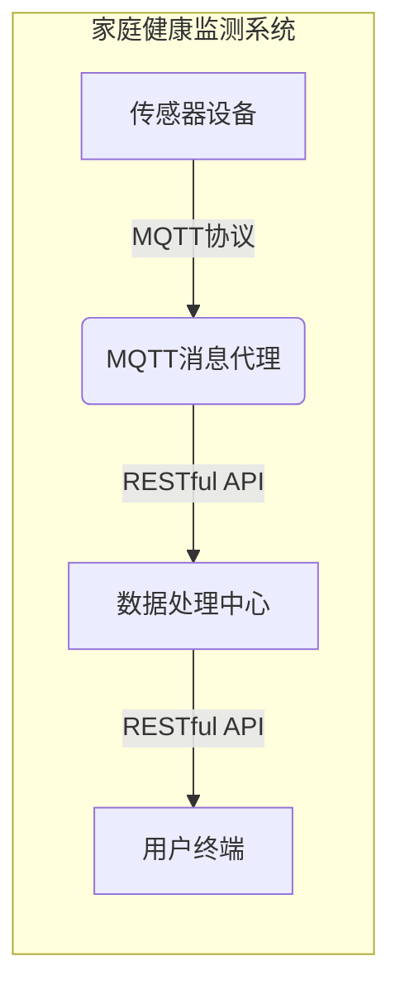

## 基于MQTT协议和RESTful API的家庭健康监测系统

作者：禅与计算机程序设计艺术


## 1. 引言

### 1.1  家庭健康监测的兴起与挑战

近年来，随着物联网、大数据、人工智能等技术的快速发展，家庭健康监测系统逐渐走进千家万户，为人们的健康管理提供了便捷、高效的手段。然而，传统的家庭健康监测系统大多采用独立的设备和平台，数据孤岛现象严重，难以实现数据的互联互通和深度分析，限制了系统的功能扩展和服务质量提升。

### 1.2  MQTT与RESTful API：构建高效、可扩展的健康监测系统

为了解决传统家庭健康监测系统存在的问题，本文提出一种基于MQTT协议和RESTful API的家庭健康监测系统架构。该架构利用MQTT协议实现设备与平台之间轻量级、实时的消息传输，并结合RESTful API提供统一的数据访问接口，为系统提供高并发、可扩展的数据处理能力。

## 2. 核心概念与联系

### 2.1  物联网技术

#### 2.1.1 物联网概述
物联网（IoT）是指通过各种信息传感器、射频识别技术、全球定位系统、红外感应器、激光扫描器等各种装置与技术，实时采集任何需要监控、连接、互动的物体的信息，并通过各类可能的网络接入，实现物与物、物与人的泛在连接，实现对物品和过程的智能化感知、识别和管理。

#### 2.1.2 物联网架构
物联网架构通常分为三层：
* 感知层：负责采集环境数据，例如温度、湿度、光照强度等。
* 网络层：负责传输数据，例如WiFi、蓝牙、ZigBee等。
* 应用层：负责处理和展示数据，例如手机APP、Web应用等。

#### 2.1.3 物联网的关键技术
* 传感器技术：用于采集各种环境数据。
* 通信技术：用于传输数据，例如WiFi、蓝牙、ZigBee等。
* 云计算技术：用于存储和处理海量数据。
* 数据分析技术：用于挖掘数据价值，提供智能化服务。

### 2.2  MQTT协议

#### 2.2.1 MQTT协议概述
MQTT（Message Queuing Telemetry Transport，消息队列遥测传输）是一种基于发布/订阅模式的轻量级消息协议，专为低带宽、高延迟的网络环境设计。

#### 2.2.2 MQTT协议的特点
* 轻量级：MQTT协议报文结构简单，占用带宽小，非常适合资源受限的设备。
* 发布/订阅模式：MQTT协议采用发布/订阅模式，消息发送者和接收者不需要建立直接连接，而是通过消息代理进行消息转发，实现了解耦。
* QoS保障：MQTT协议提供三种消息质量服务等级（QoS），保证消息可靠传输。
* 实时性：MQTT协议支持消息实时推送，适用于对实时性要求较高的应用场景。

#### 2.2.3 MQTT协议的应用场景
* 物联网设备数据采集
* 智能家居
* 车联网
* 工业控制

### 2.3  RESTful API

#### 2.3.1 RESTful API概述
RESTful API（Representational State Transfer Application Programming Interface，表述性状态转移应用程序编程接口）是一种基于HTTP协议的网络应用接口风格，它利用HTTP协议的GET、POST、PUT、DELETE等方法对资源进行操作。

#### 2.3.2 RESTful API的设计原则
* 资源标识：每个资源都有唯一的URI标识。
* 状态转移：客户端通过HTTP方法对资源状态进行操作。
* 无状态性：每个请求都是独立的，服务器不保存客户端状态。
* 可缓存性：响应结果可以被缓存，提高效率。

#### 2.3.3 RESTful API的优点
* 简单易用：基于HTTP协议，易于理解和使用。
* 可扩展性强：可以方便地添加新的资源和操作。
* 松耦合：客户端和服务器之间松耦合，易于维护和扩展。

## 3. 系统架构设计

### 3.1 系统架构图



### 3.2  系统模块设计

#### 3.2.1  传感器设备模块

* 负责采集用户的健康数据，例如体温、血压、心率、血氧饱和度等。
* 通过MQTT协议将采集到的数据发送到MQTT消息代理。

#### 3.2.2  MQTT消息代理模块

* 接收来自传感器设备的数据。
* 根据预先定义的主题将数据转发给订阅者。

#### 3.2.3  数据处理中心模块

* 接收来自MQTT消息代理的数据。
* 对数据进行清洗、转换、存储和分析。
* 通过RESTful API提供数据访问接口。

#### 3.2.4  用户终端模块

* 通过RESTful API获取数据。
* 将数据展示给用户，例如图表、报表等。
* 提供用户交互功能，例如设置报警阈值、查看历史数据等。

## 4. 核心算法原理具体操作步骤

### 4.1 数据采集

1. 传感器设备采集用户的健康数据。
2. 传感器设备将数据打包成MQTT消息。
3. 传感器设备将MQTT消息发送到MQTT消息代理。

### 4.2 数据传输

1. MQTT消息代理接收来自传感器设备的MQTT消息。
2. MQTT消息代理根据预先定义的主题将MQTT消息转发给订阅者。

### 4.3 数据处理

1. 数据处理中心接收来自MQTT消息代理的MQTT消息。
2. 数据处理中心对MQTT消息进行解析，提取出健康数据。
3. 数据处理中心对健康数据进行清洗、转换、存储和分析。

### 4.4 数据展示

1. 用户终端通过RESTful API向数据处理中心发送数据请求。
2. 数据处理中心接收数据请求，并返回相应的数据。
3. 用户终端接收数据，并将其展示给用户。

## 5. 数学模型和公式详细讲解举例说明

本系统中未使用复杂的数学模型，主要涉及数据处理和分析，例如：

### 5.1 数据清洗

* 异常值检测：使用箱线图、3σ原则等方法检测异常值，并进行处理。
* 缺失值填充：使用均值填充、线性插值等方法填充缺失值。

### 5.2 数据分析

* 统计分析：计算健康数据的均值、方差、标准差等统计指标。
* 时序分析：分析健康数据的变化趋势，例如使用移动平均、指数平滑等方法。
* 关联分析：分析不同健康数据之间的相关性，例如使用相关系数、回归分析等方法。

## 6. 项目实践：代码实例和详细解释说明

### 6.1 传感器设备代码示例 (Python)

```python
import paho.mqtt.client as mqtt

# MQTT Broker地址
MQTT_BROKER_HOST = "mqtt.example.com"
MQTT_BROKER_PORT = 1883

# 主题
TOPIC = "health/data"

# 模拟健康数据
health_data = {
    "temperature": 36.5,
    "blood_pressure": "120/80",
    "heart_rate": 75,
}

# 创建MQTT客户端
client = mqtt.Client()

# 连接MQTT Broker
client.connect(MQTT_BROKER_HOST, MQTT_BROKER_PORT)

# 发布消息
client.publish(TOPIC, payload=str(health_data))

# 断开连接
client.disconnect()
```

### 6.2 数据处理中心代码示例 (Python)

```python
from flask import Flask, request, jsonify
from flask_mqtt import Mqtt

app = Flask(__name__)
app.config['MQTT_BROKER_URL'] = 'mqtt.example.com'
app.config['MQTT_BROKER_PORT'] = 1883
app.config['MQTT_USERNAME'] = ''
app.config['MQTT_PASSWORD'] = ''
app.config['MQTT_KEEPALIVE'] = 5

mqtt = Mqtt(app)

# 存储健康数据的列表
health_data_list = []

@mqtt.on_message()
def handle_mqtt_message(client, userdata, message):
    # 解析MQTT消息
    health_data = eval(message.payload.decode())

    # 将健康数据添加到列表中
    health_data_list.append(health_data)

    # 打印接收到的消息
    print(f"Received message: {health_data}")

@app.route('/api/health_data', methods=['GET'])
def get_health_data():
    # 返回健康数据列表
    return jsonify(health_data_list)

if __name__ == '__main__':
    # 启动Flask应用
    app.run(debug=True)
```

## 7. 实际应用场景

* **家庭健康管理:**  监测家庭成员的健康状况，例如血压、血糖、心率等，并提供健康预警和建议。
* **老年人看护:**  实时监测老年人的活动状态、健康指标，及时发现异常情况并发出警报。
* **慢性病管理:**  帮助慢性病患者进行自我管理，例如记录血糖、血压数据，并根据数据调整用药方案。
* **运动健康:**  监测运动过程中的心率、步数、卡路里消耗等数据，并提供运动建议。

## 8. 工具和资源推荐

### 8.1 MQTT Broker

* **EMQX:** 开源、高性能、分布式 MQTT 消息服务器。
* **Mosquitto:** 轻量级、易于使用的 MQTT Broker。
* **HiveMQ:** 企业级 MQTT 平台，提供高可用性和安全性。

### 8.2 RESTful API 开发框架

* **Flask:** Python Web 开发框架，轻量级、易于使用。
* **Django:** Python Web 开发框架，功能强大、适用于大型项目。
* **Spring Boot:** Java Web 开发框架，易于使用、生态丰富。

### 8.3 传感器设备

* **小米智能家居套装:** 包含各种传感器，例如温湿度传感器、人体传感器等。
* **华为智能家居套装:**  提供丰富的传感器选择，例如门窗传感器、烟雾传感器等。

## 9. 总结：未来发展趋势与挑战

### 9.1 未来发展趋势

* **更加智能化:**  利用人工智能技术对健康数据进行深度分析，提供更加个性化的健康服务。
* **更加便捷化:**  开发更加便捷易用的健康监测设备，例如可穿戴设备、智能马桶等。
* **更加场景化:**  将健康监测融入到更多的生活场景中，例如智能家居、智慧城市等。

### 9.2 面临的挑战

* **数据安全:**  如何保障用户健康数据的安全和隐私。
* **系统可靠性:**  如何保证系统的稳定性和可靠性，避免数据丢失和系统崩溃。
* **成本控制:**  如何降低系统的开发和维护成本。

## 10. 附录：常见问题与解答

### 10.1 MQTT协议与HTTP协议的区别是什么？

* MQTT协议是一种基于发布/订阅模式的轻量级消息协议，适用于低带宽、高延迟的网络环境。
* HTTP协议是一种请求/响应模式的协议，适用于客户端与服务器之间的数据交互。

### 10.2 RESTful API的设计原则是什么？

* 资源标识：每个资源都有唯一的URI标识。
* 状态转移：客户端通过HTTP方法对资源状态进行操作。
* 无状态性：每个请求都是独立的，服务器不保存客户端状态。
* 可缓存性：响应结果可以被缓存，提高效率。

### 10.3 如何保障用户健康数据的安全和隐私？

* 数据加密：对传输和存储的健康数据进行加密，防止数据泄露。
* 访问控制：设置严格的访问权限，只允许授权用户访问数据。
* 匿名化处理：对数据进行匿名化处理，去除用户敏感信息。