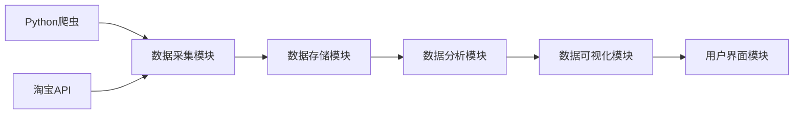

# 基于Python爬虫的淘宝商品销售量分析和可视化系统实现

作者：禅与计算机程序设计艺术

## 1. 背景介绍

### 1.1 电商数据分析的兴起

近年来，随着电子商务的迅猛发展，海量的交易数据在电商平台上不断产生。这些数据蕴藏着巨大的商业价值，如何有效地挖掘和分析这些数据，成为了电商企业提升竞争力的关键。数据分析可以帮助企业更好地了解市场需求、优化产品策略、提高运营效率，从而在激烈的市场竞争中脱颖而出。

### 1.2 淘宝商品销售数据分析的意义

淘宝作为中国最大的电商平台之一，拥有海量的商品和交易数据。对淘宝商品销售数据进行分析，可以帮助我们：

* **了解市场趋势:** 分析不同品类、不同品牌的商品销售情况，可以洞察市场趋势，预测未来市场发展方向。
* **优化产品策略:** 通过分析商品销量、用户评价等数据，可以优化产品设计、定价策略和营销策略，提升产品竞争力。
* **精准营销推广:** 分析用户购买行为和偏好，可以进行精准营销推广，提高广告投放效率。
* **监控竞争对手:** 分析竞争对手的商品销售情况、价格策略和营销活动，可以制定更有针对性的竞争策略。

### 1.3 Python爬虫技术的应用

Python爬虫技术可以高效地从网站上抓取数据，为电商数据分析提供了强有力的工具。利用Python爬虫，我们可以轻松地获取淘宝商品的销量、价格、评价等信息，为后续的数据分析工作奠定基础。

## 2. 核心概念与联系

### 2.1 Python爬虫

Python爬虫是一种自动化程序，可以模拟浏览器行为，从网站上抓取数据。Python语言拥有丰富的第三方库，例如Requests、BeautifulSoup、Selenium等，可以方便地进行网页请求、HTML解析、浏览器自动化等操作，使得Python成为爬虫开发的首选语言。

### 2.2 淘宝API

淘宝开放平台提供了一系列API接口，可以方便地获取淘宝商品、店铺、交易等数据。使用淘宝API可以避免直接爬取网页带来的反爬虫问题，同时数据获取效率更高，数据质量更有保障。

### 2.3 数据分析与可视化

数据分析是指对数据进行清洗、转换、分析和解释的过程，目的是从数据中提取有价值的信息。数据可视化则是指将数据以图形化的方式展示出来，使数据更加直观、易于理解。常用的数据分析和可视化工具包括Pandas、NumPy、Matplotlib、Seaborn等。

### 2.4 系统架构

本系统采用模块化设计，主要包括以下几个模块：

* **数据采集模块:** 负责从淘宝平台上抓取商品数据，可以使用Python爬虫或淘宝API实现。
* **数据存储模块:** 负责将抓取到的数据存储到数据库中，可以使用MySQL、MongoDB等数据库。
* **数据分析模块:** 负责对数据进行清洗、转换、分析和挖掘，可以使用Pandas、NumPy等数据分析库。
* **数据可视化模块:** 负责将分析结果以图表的形式展示出来，可以使用Matplotlib、Seaborn等数据可视化库。
* **用户界面模块:** 负责与用户交互，提供数据查询、分析结果展示等功能，可以使用Flask、Django等Web框架实现。

### 2.5  核心概念关系图



## 3. 核心算法原理具体操作步骤

### 3.1 数据采集

#### 3.1.1 使用Python爬虫抓取数据

使用Python爬虫抓取淘宝商品数据，需要遵循 robots.txt 协议，并设置合理的请求频率，避免对淘宝服务器造成压力。

具体步骤如下：

1. 使用Requests库发送HTTP请求，获取网页HTML代码。
2. 使用BeautifulSoup库解析HTML代码，提取商品标题、价格、销量、评价等信息。
3. 将提取到的数据存储到列表或字典中。

```python
import requests
from bs4 import BeautifulSoup

def get_taobao_data(keyword, page_num):
    """
    抓取淘宝商品数据
    :param keyword: 搜索关键词
    :param page_num: 页码
    :return: 商品数据列表
    """
    headers = {
        'User-Agent': 'Mozilla/5.0 (Windows NT 10.0; Win64; x64) AppleWebKit/537.36 (KHTML, like Gecko) Chrome/58.0.3029.110 Safari/537.36',
    }
    url = f'https://s.taobao.com/search?q={keyword}&s={(page_num - 1) * 44}'
    response = requests.get(url, headers=headers)
    soup = BeautifulSoup(response.text, 'lxml')
    items = soup.select('.item.J_MouserOnverClick')
    data_list = []
    for item in items:
        title = item.select_one('.title a').text.strip()
        price = item.select_one('.price strong').text.strip()
        sales = item.select_one('.deal-cnt').text.strip()
        comments = item.select_one('.rates a').text.strip()
        data_list.append({
            'title': title,
            'price': price,
            'sales': sales,
            'comments': comments,
        })
    return data_list

# 示例：抓取关键词为"手机"的商品数据，共抓取10页
data = []
for i in range(1, 11):
    data.extend(get_taobao_data('手机', i))

# 打印抓取到的数据
print(data)
```

#### 3.1.2 使用淘宝API获取数据

使用淘宝API获取商品数据，需要先注册淘宝开放平台账号，并创建应用获取App Key和App Secret。

具体步骤如下：

1. 使用App Key和App Secret获取Access Token。
2. 调用淘宝API接口，传入查询参数，获取商品数据。
3. 解析API返回结果，提取商品信息。

```python
from taobao import api

# 设置App Key和App Secret
app_key = 'your_app_key'
app_secret = 'your_app_secret'

# 获取Access Token
req = api.Token(app_key=app_key, app_secret=app_secret)
resp = req.get()
access_token = resp.json()['access_token']

# 调用淘宝API接口，获取商品数据
req = api.ItemGet(app_key=app_key, app_secret=app_secret)
req.set_params(q='手机', fields='num_iid,title,price,sales')
resp = req.invoke(access_token=access_token)

# 解析API返回结果，提取商品信息
data = []
for item in resp.json()['items']['item']:
    data.append({
        'id': item['num_iid'],
        'title': item['title'],
        'price': item['price'],
        'sales': item['sales'],
    })

# 打印获取到的数据
print(data)
```

### 3.2 数据存储

抓取到的数据可以存储到数据库中，方便后续的数据分析和可视化。

#### 3.2.1 使用MySQL数据库

MySQL是一种常用的关系型数据库，可以使用SQL语句进行数据操作。

```python
import pymysql

# 连接数据库
conn = pymysql.connect(host='localhost', user='root', password='password', database='taobao')

# 创建游标对象
cursor = conn.cursor()

# 插入数据
sql = "INSERT INTO products (title, price, sales, comments) VALUES (%s, %s, %s, %s)"
cursor.executemany(sql, data)

# 提交事务
conn.commit()

# 关闭游标和连接
cursor.close()
conn.close()
```

#### 3.2.2 使用MongoDB数据库

MongoDB是一种常用的非关系型数据库，使用JSON格式存储数据。

```python
import pymongo

# 连接数据库
client = pymongo.MongoClient('mongodb://localhost:27017/')

# 获取数据库对象
db = client['taobao']

# 获取集合对象
collection = db['products']

# 插入数据
collection.insert_many(data)

# 关闭连接
client.close()
```

### 3.3 数据分析

#### 3.3.1 数据清洗

数据清洗是指对数据进行预处理，去除无效数据、重复数据和错误数据，保证数据的准确性和一致性。

```python
import pandas as pd

# 读取数据
df = pd.read_csv('products.csv')

# 去除重复数据
df.drop_duplicates(inplace=True)

# 去除空值
df.dropna(inplace=True)

# 数据类型转换
df['price'] = df['price'].astype(float)
df['sales'] = df['sales'].astype(int)

# 保存清洗后的数据
df.to_csv('cleaned_products.csv', index=False)
```

#### 3.3.2 数据转换

数据转换是指对数据进行格式转换、计算和聚合等操作，为后续的数据分析做好准备。

```python
# 计算商品销量排名
df['sales_rank'] = df['sales'].rank(ascending=False)

# 将商品价格分为不同的区间
df['price_range'] = pd.cut(df['price'], bins=[0, 100, 500, 1000, float('inf')], labels=['0-100', '100-500', '500-1000', '1000以上'])

# 统计不同价格区间的商品数量
price_range_counts = df['price_range'].value_counts()
```

#### 3.3.3 数据分析

数据分析是指对数据进行统计分析、关联分析、趋势预测等操作，从数据中提取有价值的信息。

```python
# 计算商品平均价格
mean_price = df['price'].mean()

# 计算商品销量前10名的商品信息
top_10_products = df.sort_values(by='sales', ascending=False).head(10)

# 分析商品价格与销量的关系
correlation = df['price'].corr(df['sales'])
```

### 3.4 数据可视化

数据可视化是指将数据以图表的形式展示出来，使数据更加直观、易于理解。

#### 3.4.1 使用Matplotlib库

Matplotlib是一个常用的Python数据可视化库，可以绘制各种类型的图表。

```python
import matplotlib.pyplot as plt

# 绘制商品销量排名柱状图
plt.bar(top_10_products['title'], top_10_products['sales'])
plt.xlabel('商品名称')
plt.ylabel('销量')
plt.title('商品销量排名')
plt.show()

# 绘制商品价格分布直方图
plt.hist(df['price'], bins=10)
plt.xlabel('价格')
plt.ylabel('数量')
plt.title('商品价格分布')
plt.show()

# 绘制商品价格与销量散点图
plt.scatter(df['price'], df['sales'])
plt.xlabel('价格')
plt.ylabel('销量')
plt.title('商品价格与销量关系')
plt.show()
```

#### 3.4.2 使用Seaborn库

Seaborn是一个基于Matplotlib的数据可视化库，提供更美观、更易用的API。

```python
import seaborn as sns

# 绘制商品销量排名条形图
sns.barplot(x='sales', y='title', data=top_10_products)
plt.xlabel('销量')
plt.ylabel('商品名称')
plt.title('商品销量排名')
plt.show()

# 绘制商品价格分布直方图
sns.histplot(df['price'], bins=10)
plt.xlabel('价格')
plt.ylabel('数量')
plt.title('商品价格分布')
plt.show()

# 绘制商品价格与销量散点图
sns.scatterplot(x='price', y='sales', data=df)
plt.xlabel('价格')
plt.ylabel('销量')
plt.title('商品价格与销量关系')
plt.show()
```

## 4. 数学模型和公式详细讲解举例说明

### 4.1 数据标准化

数据标准化是指将数据按照一定的比例缩放，使其落入一个特定的区间内。常用的数据标准化方法包括最小-最大规范化、Z-score标准化等。

#### 4.1.1 最小-最大规范化

最小-最大规范化是指将数据缩放到[0, 1]区间内。

公式：

$$x' = \frac{x - min(x)}{max(x) - min(x)}$$

其中，$x$表示原始数据，$x'$表示标准化后的数据，$min(x)$表示数据的最小值，$max(x)$表示数据的最大值。

#### 4.1.2 Z-score标准化

Z-score标准化是指将数据转换为均值为0，标准差为1的分布。

公式：

$$x' = \frac{x - \mu}{\sigma}$$

其中，$x$表示原始数据，$x'$表示标准化后的数据，$\mu$表示数据的均值，$\sigma$表示数据的标准差。

### 4.2 相关性分析

相关性分析是指分析两个变量之间是否存在线性关系。常用的相关性系数包括Pearson相关系数、Spearman等级相关系数等。

#### 4.2.1 Pearson相关系数

Pearson相关系数用于度量两个连续变量之间的线性相关程度。

公式：

$$\rho_{X,Y} = \frac{cov(X,Y)}{\sigma_X \sigma_Y}$$

其中，$cov(X,Y)$表示变量$X$和$Y$的协方差，$\sigma_X$表示变量$X$的标准差，$\sigma_Y$表示变量$Y$的标准差。

#### 4.2.2 Spearman等级相关系数

Spearman等级相关系数用于度量两个变量之间的单调关系，适用于不服从正态分布的数据。

公式：

$$\rho_s = 1 - \frac{6 \sum d_i^2}{n(n^2 - 1)}$$

其中，$d_i$表示变量$X$和$Y$的等级差，$n$表示样本量。

## 5. 项目实践：代码实例和详细解释说明

```python
# 导入必要的库
import requests
from bs4 import BeautifulSoup
import pandas as pd
import matplotlib.pyplot as plt

# 定义抓取函数
def get_taobao_data(keyword, page_num):
    """
    抓取淘宝商品数据
    :param keyword: 搜索关键词
    :param page_num: 页码
    :return: 商品数据列表
    """
    headers = {
        'User-Agent': 'Mozilla/5.0 (Windows NT 10.0; Win64; x64) AppleWebKit/537.36 (KHTML, like Gecko) Chrome/58.0.3029.110 Safari/537.36',
    }
    url = f'https://s.taobao.com/search?q={keyword}&s={(page_num - 1) * 44}'
    response = requests.get(url, headers=headers)
    soup = BeautifulSoup(response.text, 'lxml')
    items = soup.select('.item.J_MouserOnverClick')
    data_list = []
    for item in items:
        title = item.select_one('.title a').text.strip()
        price = item.select_one('.price strong').text.strip()
        sales = item.select_one('.deal-cnt').text.strip()
        comments = item.select_one('.rates a').text.strip()
        data_list.append({
            'title': title,
            'price': price,
            'sales': sales,
            'comments': comments,
        })
    return data_list

# 设置搜索关键词和抓取页数
keyword = '手机'
page_num = 10

# 抓取数据
data = []
for i in range(1, page_num + 1):
    data.extend(get_taobao_data(keyword, i))

# 将数据转换为DataFrame
df = pd.DataFrame(data)

# 数据清洗
df.drop_duplicates(inplace=True)
df.dropna(inplace=True)
df['price'] = df['price'].astype(float)
df['sales'] = df['sales'].str.replace('人付款', '').astype(int)

# 数据分析
# 计算商品平均价格
mean_price = df['price'].mean()
print(f'商品平均价格：{mean_price:.2f}元')

# 计算商品销量前10名的商品信息
top_10_products = df.sort_values(by='sales', ascending=False).head(10)
print('\n商品销量排名：')
print(top_10_products[['title', 'sales']])

# 分析商品价格与销量的关系
correlation = df['price'].corr(df['sales'])
print(f'\n商品价格与销量相关系数：{correlation:.2f}')

# 数据可视化
# 绘制商品销量排名柱状图
plt.bar(top_10_products['title'], top_10_products['sales'])
plt