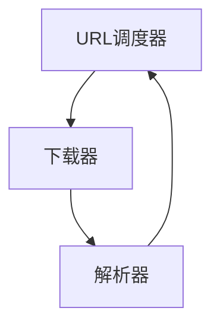
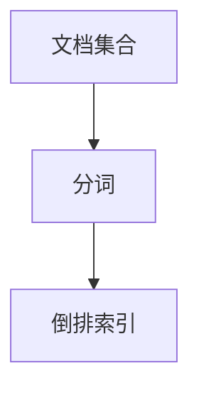
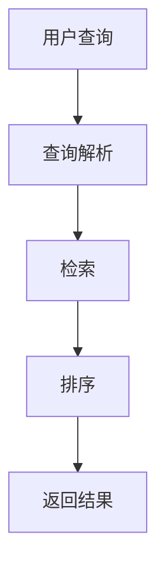

# 基于Python的搜索引擎的设计与实现

作者：禅与计算机程序设计艺术

## 1. 背景介绍

### 1.1 搜索引擎的历史与发展

搜索引擎的起源可以追溯到20世纪90年代初期。最早的搜索引擎，如Archie和Veronica，主要用于索引和搜索FTP站点上的文件。随着互联网的迅猛发展，搜索引擎的需求和复杂度也随之增加。1998年，Google成立并引入了PageRank算法，这一算法极大地提升了搜索结果的相关性和准确性，标志着现代搜索引擎的诞生。

### 1.2 搜索引擎的基本功能

现代搜索引擎的核心功能包括：

1. **爬取（Crawling）**：通过网络爬虫（Web Crawler）自动访问和下载网页内容。
2. **索引（Indexing）**：将爬取到的网页内容进行分析和存储，以便快速检索。
3. **查询处理（Query Processing）**：用户输入查询后，搜索引擎根据索引快速找到相关内容并返回结果。

### 1.3 Python在搜索引擎开发中的优势

Python作为一种高级编程语言，以其简洁易懂的语法和丰富的库资源在搜索引擎开发中具有显著优势。Python的库如BeautifulSoup、Scrapy和Whoosh可以极大地简化爬虫和索引的实现过程。

## 2. 核心概念与联系

### 2.1 网络爬虫

网络爬虫是搜索引擎的基础组件之一。它的主要任务是自动访问和下载网页内容。一个高效的爬虫需要具备以下特性：

- **多线程或异步处理**：提高爬取速度和效率。
- **遵守robots.txt协议**：避免爬取不允许访问的内容。
- **处理动态内容**：能够抓取JavaScript生成的内容。

### 2.2 索引

索引是搜索引擎的核心数据结构，它将网页内容组织成一种便于快速检索的形式。常见的索引结构包括倒排索引（Inverted Index）和正排索引（Forward Index）。

- **倒排索引**：记录每个关键词出现在哪些文档中。
- **正排索引**：记录每个文档包含哪些关键词。

### 2.3 查询处理

查询处理是用户与搜索引擎交互的关键环节。它包括查询解析、检索和排序三个主要步骤：

- **查询解析**：将用户输入的查询转换为可处理的格式。
- **检索**：根据索引找到与查询相关的文档。
- **排序**：根据相关性对检索到的文档进行排序。

## 3. 核心算法原理具体操作步骤

### 3.1 网络爬虫的实现

#### 3.1.1 爬虫架构设计

一个高效的爬虫通常包括以下几个组件：

- **URL调度器（URL Scheduler）**：管理待爬取的URL队列。
- **下载器（Downloader）**：负责下载网页内容。
- **解析器（Parser）**：解析下载的网页内容，提取有用信息和新URL。



#### 3.1.2 代码实现

以下是一个简单的Python网络爬虫示例：

```python
import requests
from bs4 import BeautifulSoup
from queue import Queue
import threading

class SimpleCrawler:
    def __init__(self, start_url, max_pages=100):
        self.start_url = start_url
        self.max_pages = max_pages
        self.visited = set()
        self.queue = Queue()
        self.queue.put(start_url)
        self.lock = threading.Lock()

    def crawl(self):
        while not self.queue.empty() and len(self.visited) < self.max_pages:
            url = self.queue.get()
            if url not in self.visited:
                self.download_page(url)

    def download_page(self, url):
        try:
            response = requests.get(url)
            if response.status_code == 200:
                self.parse_page(response.content, url)
        except requests.RequestException as e:
            print(f"Failed to download {url}: {e}")

    def parse_page(self, content, url):
        soup = BeautifulSoup(content, 'html.parser')
        self.lock.acquire()
        self.visited.add(url)
        self.lock.release()
        for link in soup.find_all('a', href=True):
            full_url = requests.compat.urljoin(url, link['href'])
            if full_url not in self.visited:
                self.queue.put(full_url)

if __name__ == "__main__":
    crawler = SimpleCrawler("https://example.com")
    threads = []
    for _ in range(5):
        t = threading.Thread(target=crawler.crawl)
        t.start()
        threads.append(t)
    for t in threads:
        t.join()
```

### 3.2 索引的实现

#### 3.2.1 倒排索引的构建

倒排索引是搜索引擎索引的核心。它记录每个关键词出现在哪些文档中，以及关键词在文档中的位置。



#### 3.2.2 代码实现

以下是一个简单的倒排索引构建示例：

```python
import os
from collections import defaultdict

class InvertedIndex:
    def __init__(self):
        self.index = defaultdict(list)

    def add_document(self, doc_id, text):
        words = text.split()
        for word in words:
            self.index[word].append(doc_id)

    def search(self, query):
        return self.index.get(query, [])

if __name__ == "__main__":
    index = InvertedIndex()
    documents = {
        1: "the quick brown fox",
        2: "jumps over the lazy dog",
        3: "the quick blue hare"
    }
    for doc_id, text in documents.items():
        index.add_document(doc_id, text)

    print(index.search("quick"))
```

### 3.3 查询处理的实现

#### 3.3.1 查询解析与检索

查询解析将用户输入的查询转换为可处理的格式。检索过程则根据倒排索引找到与查询相关的文档。



#### 3.3.2 代码实现

以下是一个简单的查询处理示例：

```python
class SearchEngine:
    def __init__(self, index):
        self.index = index

    def search(self, query):
        words = query.split()
        results = [set(self.index.search(word)) for word in words]
        if results:
            return set.intersection(*results)
        return set()

if __name__ == "__main__":
    index = InvertedIndex()
    documents = {
        1: "the quick brown fox",
        2: "jumps over the lazy dog",
        3: "the quick blue hare"
    }
    for doc_id, text in documents.items():
        index.add_document(doc_id, text)

    search_engine = SearchEngine(index)
    print(search_engine.search("quick fox"))
```

## 4. 数学模型和公式详细讲解举例说明

### 4.1 倒排索引的数学模型

倒排索引的数学模型可以表示为一个稀疏矩阵，其中行表示文档，列表示关键词，矩阵元素表示关键词在文档中的出现次数。

$$
M_{ij} = \begin{cases} 
1 & \text{如果关键词 } j \text{ 出现在文档 } i \text{ 中} \\
0 & \text{否则}
\end{cases}
$$

### 4.2 PageRank算法

PageRank是Google提出的一种用于网页排序的算法。其核心思想是通过计算网页的链接结构来评估网页的重要性。

PageRank公式为：

$$
PR(A) = \frac{1 - d}{N} + d \left( \sum_{i=1}^n \frac{PR(T_i)}{C(T_i)} \right)
$$

其中：
- \( PR(A) \) 是网页A的PageRank值。
- \( d \) 是阻尼因子，通常取值为0.85。
- \( N \) 是总网页数。
- \( PR(T_i) \) 是网页 \( T_i \) 的PageRank值。
- \( C(T_i) \) 是网页 \( T_i \) 的出链数量。

### 4.3 TF-IDF算法

TF-IDF（Term Frequency-Inverse Document Frequency）是一种用于评估一个词语对于一个文档的重要程度的统计方法。

TF（词频）公式为：

