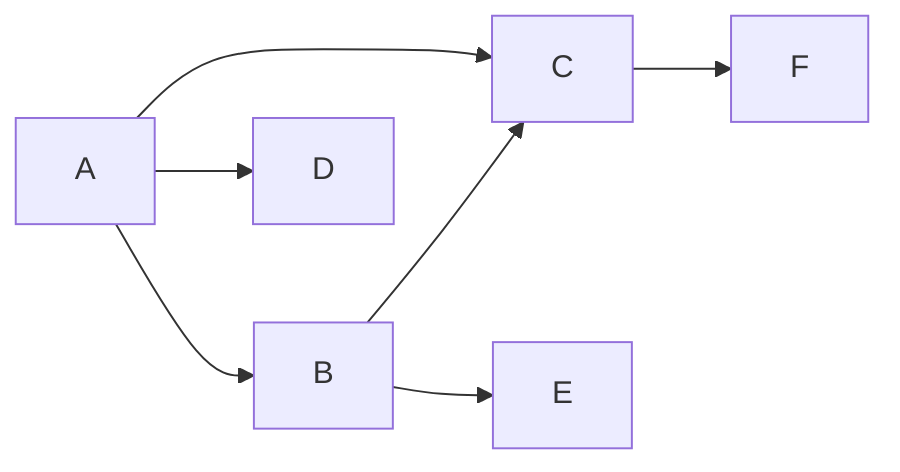

##  基于Python的新浪微博用户信息爬取与分析

作者：禅与计算机程序设计艺术

## 1. 背景介绍

### 1.1 社交媒体数据的重要性

在当今信息爆炸的时代，社交媒体已经成为人们获取信息、分享观点和互动交流的重要平台。微博作为国内最具影响力的社交媒体平台之一，拥有数亿活跃用户，每天产生海量的用户数据。这些数据蕴含着丰富的社会价值和商业价值，对于企业、政府、科研机构等各个领域都具有重要的意义。

### 1.2 微博用户信息爬取的意义

微博用户信息爬取是指利用网络爬虫技术，自动获取微博平台上的用户信息，例如用户ID、昵称、性别、年龄、地区、关注列表、粉丝列表、微博内容等。通过对这些数据的分析，可以帮助我们：

* **了解用户画像和行为特征：** 分析用户的基本信息、兴趣爱好、行为习惯等，构建用户画像，为精准营销、个性化推荐等提供数据支持。
* **监测舆情和社会热点：** 跟踪分析微博平台上的热门话题、用户情绪、事件发展趋势等，及时发现潜在的社会问题和风险。
* **进行市场调研和竞品分析：** 收集竞争对手的微博数据，分析其营销策略、用户反馈等，为企业制定市场策略提供参考。
* **开展科学研究和社会调查：** 利用微博数据进行社会学、传播学、心理学等领域的科学研究和社会调查。

### 1.3 Python在微博用户信息爬取中的优势

Python作为一种简洁易用、功能强大的编程语言，拥有丰富的第三方库和工具，非常适合用于网络爬虫开发。在微博用户信息爬取方面，Python具有以下优势：

* **强大的网络请求库：** `requests`库可以方便地发送HTTP请求，获取网页内容。
* **高效的HTML解析库：** `BeautifulSoup`、`lxml`等库可以快速解析HTML网页，提取所需信息。
* **灵活的数据处理库：** `pandas`、`numpy`等库可以对爬取到的数据进行清洗、转换、分析等操作。
* **丰富的可视化工具：** `matplotlib`、`seaborn`等库可以将分析结果可视化，直观地展示数据特征。

## 2. 核心概念与联系

### 2.1 网络爬虫

网络爬虫（Web Crawler）是一种按照一定的规则，自动地抓取万维网信息的程序或者脚本。它可以模拟浏览器行为，发送HTTP请求，获取网页内容，并提取所需的信息。

### 2.2 HTTP协议

HTTP（Hypertext Transfer Protocol，超文本传输协议）是一种用于分布式、协作式和超媒体信息系统的应用层协议。它是万维网数据通信的基础，规定了浏览器和服务器之间如何进行数据交互。

### 2.3 HTML语言

HTML（Hypertext Markup Language，超文本标记语言）是一种用于创建网页的标准标记语言。它使用标签来描述网页的结构和内容，例如标题、段落、图片、链接等。

### 2.4 数据解析

数据解析是指将非结构化或半结构化的数据转换为结构化数据的过程。在微博用户信息爬取中，我们需要将HTML网页解析成结构化的数据，例如字典、列表等。

### 2.5 数据存储

数据存储是指将爬取到的数据保存到本地文件或数据库中，以便后续分析和使用。常用的数据存储方式包括：

* **文本文件：** 例如txt、csv、json等格式。
* **数据库：** 例如MySQL、MongoDB等。

## 3. 核心算法原理具体操作步骤

### 3.1 确定目标用户

在进行微博用户信息爬取之前，首先需要确定目标用户群体。例如，我们可以根据关键词、话题、地区等条件，筛选出目标用户。

### 3.2 获取用户ID列表

微博平台的用户ID是用户的唯一标识。我们可以通过以下方式获取目标用户的ID列表：

* **手动收集：** 如果目标用户数量较少，可以通过手动复制粘贴的方式获取用户ID。
* **利用微博API：** 微博开放平台提供了一些API接口，可以根据关键词、话题等条件搜索用户，并获取用户ID。
* **分析网页结构：** 通过分析微博网页的HTML结构，可以找到用户ID的规律，并编写代码自动提取用户ID。

### 3.3 爬取用户信息

获取到用户ID列表后，就可以使用网络爬虫技术，自动访问每个用户的个人主页，并提取用户信息。具体操作步骤如下：

1. **构造请求URL：** 根据微博平台的URL规则，构造访问用户个人主页的URL，例如`https://weibo.com/u/用户ID`。
2. **发送HTTP请求：** 使用`requests`库发送HTTP请求，获取网页内容。
3. **解析HTML网页：** 使用`BeautifulSoup`、`lxml`等库解析HTML网页，提取用户信息，例如用户昵称、性别、年龄、地区、关注列表、粉丝列表、微博内容等。
4. **存储数据：** 将提取到的用户信息存储到本地文件或数据库中。

### 3.4 数据清洗和处理

爬取到的数据往往包含一些噪声和冗余信息，需要进行清洗和处理。例如：

* **去除重复数据：** 由于网络延迟等原因，可能会爬取到重复的用户数据，需要进行去重处理。
* **处理缺失值：** 一些用户的信息可能不完整，例如没有填写性别、年龄等，需要进行缺失值处理。
* **数据格式转换：** 将爬取到的数据转换为统一的格式，例如日期格式、字符串编码等。

## 4. 数学模型和公式详细讲解举例说明

### 4.1 用户活跃度分析

用户活跃度是衡量用户参与微博平台程度的重要指标。我们可以根据用户的发帖频率、互动次数、登录时间等数据，计算用户的活跃度。

**公式：**

```
用户活跃度 = w1 * 发帖频率 + w2 * 互动次数 + w3 * 登录时间
```

其中，`w1`、`w2`、`w3`为权重系数，可以根据实际情况进行调整。

**举例说明：**

假设用户A在过去一个月内发了100条微博，评论了50条微博，点赞了200条微博，登录了20天。用户B在过去一个月内发了50条微博，评论了10条微博，点赞了100条微博，登录了10天。

根据上述公式，我们可以计算出用户A和用户B的活跃度：

```
用户A活跃度 = 0.5 * 100 + 0.3 * (50 + 200) + 0.2 * 20 = 115
用户B活跃度 = 0.5 * 50 + 0.3 * (10 + 100) + 0.2 * 10 = 57
```

从计算结果可以看出，用户A的活跃度明显高于用户B。

### 4.2 用户关系网络分析

用户关系网络是微博平台的重要组成部分。我们可以根据用户的关注关系和粉丝关系，构建用户关系网络，并分析用户之间的影响力和传播路径。

**举例说明：**

假设用户A关注了用户B、用户C、用户D，用户B关注了用户C、用户E，用户C关注了用户F。

根据上述关注关系，我们可以构建如下用户关系网络图：



从用户关系网络图中，可以看出用户C的粉丝数量最多，影响力最大。

## 5. 项目实践：代码实例和详细解释说明

### 5.1 环境搭建

在进行微博用户信息爬取之前，需要先搭建Python开发环境，并安装相关的第三方库。

```
pip install requests beautifulsoup4 lxml pandas
```

### 5.2 代码实例

以下是一个简单的微博用户信息爬取代码实例：

```python
import requests
from bs4 import BeautifulSoup
import pandas as pd

# 设置请求头
headers = {
    'User-Agent': 'Mozilla/5.0 (Windows NT 10.0; Win64; x64) AppleWebKit/537.36 (KHTML, like Gecko) Chrome/58.0.3029.110 Safari/537.36',
    'Cookie': 'your cookie'
}

# 设置目标用户ID列表
user_ids = ['1234567890', '9876543210']

# 创建空列表，用于存储用户信息
user_data = []

# 遍历用户ID列表
for user_id in user_ids:
    # 构造请求URL
    url = f'https://weibo.com/u/{user_id}'

    # 发送HTTP请求
    response = requests.get(url, headers=headers)

    # 解析HTML网页
    soup = BeautifulSoup(response.content, 'lxml')

    # 提取用户信息
    user_name = soup.find('h1', class_='username').text.strip()
    user_gender = soup.find('span', class_='icon-sex').get('title')
    user_location = soup.find('span', class_='location').text.strip()

    # 将用户信息添加到列表中
    user_data.append({
        'user_id': user_id,
        'user_name': user_name,
        'user_gender': user_gender,
        'user_location': user_location
    })

# 将用户信息存储到CSV文件中
df = pd.DataFrame(user_data)
df.to_csv('user_info.csv', index=False)
```

### 5.3 代码解释

* **设置请求头：** 为了模拟浏览器行为，需要设置请求头，包括User-Agent、Cookie等信息。
* **设置目标用户ID列表：** 将目标用户的ID存储在一个列表中。
* **构造请求URL：** 根据微博平台的URL规则，构造访问用户个人主页的URL。
* **发送HTTP请求：** 使用`requests`库发送HTTP请求，获取网页内容。
* **解析HTML网页：** 使用`BeautifulSoup`库解析HTML网页，并使用`find()`方法查找特定的HTML元素。
* **提取用户信息：** 使用`text`属性获取HTML元素的文本内容，使用`strip()`方法去除文本两端的空格。
* **存储数据：** 使用`pandas`库将用户信息存储到CSV文件中。

## 6. 实际应用场景

### 6.1 精准营销

通过爬取和分析微博用户信息，可以了解目标用户的基本信息、兴趣爱好、行为习惯等，构建用户画像，为精准营销提供数据支持。例如，电商平台可以根据用户的购买历史、浏览记录、微博内容等，推荐相关的商品和服务。

### 6.2 舆情监测

通过爬取和分析微博平台上的热门话题、用户情绪、事件发展趋势等，可以及时发现潜在的社会问题和风险，为政府部门、企业等提供舆情监测服务。

### 6.3 市场调研

通过爬取和分析竞争对手的微博数据，可以了解其营销策略、用户反馈等，为企业制定市场策略提供参考。

## 7. 工具和资源推荐

### 7.1 开发工具

* **PyCharm：** 一款功能强大的Python IDE，提供代码自动补全、调试、版本控制等功能。
* **VS Code：** 一款轻量级的代码编辑器，支持多种编程语言，拥有丰富的插件生态。

### 7.2 爬虫框架

* **Scrapy：** 一个功能强大的网络爬虫框架，可以快速构建高效的爬虫程序。
* **Selenium：** 一个自动化测试工具，可以模拟浏览器行为，用于爬取动态网页。

### 7.3 数据分析库

* **pandas：** 一个强大的数据分析库，提供数据清洗、转换、分析等功能。
* **numpy：** 一个科学计算库，提供高性能的数组和矩阵运算功能。

## 8. 总结：未来发展趋势与挑战

### 8.1 未来发展趋势

* **人工智能技术应用：** 随着人工智能技术的不断发展，未来微博用户信息爬取和分析将会更加智能化，例如使用自然语言处理技术分析用户情感、使用机器学习算法预测用户行为等。
* **数据隐私保护：** 随着用户隐私保护意识的不断增强，未来微博用户信息爬取将会面临更大的挑战，需要更加注重数据安全和用户隐私保护。

### 8.2 面临的挑战

* **反爬虫机制：** 微博平台为了防止恶意爬虫，不断升级反爬虫机制，例如IP封禁、验证码识别等，给微博用户信息爬取带来了更大的难度。
* **数据量大、更新快：** 微博平台每天产生海量的用户数据，数据量大、更新快，对数据存储和处理能力提出了更高的要求。

## 9. 附录：常见问题与解答

### 9.1 爬虫被封禁怎么办？

* **降低爬取频率：** 不要频繁地发送请求，可以设置合理的爬取间隔时间。
* **使用代理IP：** 使用代理IP可以隐藏真实IP地址，避免被封禁。
* **模拟浏览器行为：** 设置请求头，模拟浏览器行为，可以降低被封禁的风险。

### 9.2 如何提取动态加载的内容？

* **使用Selenium：** Selenium可以模拟浏览器行为，可以用于爬取动态加载的内容。
* **分析Ajax请求：** 动态加载的内容通常是通过Ajax请求获取的，可以分析Ajax请求的URL和参数，使用`requests`库发送请求，获取数据。
