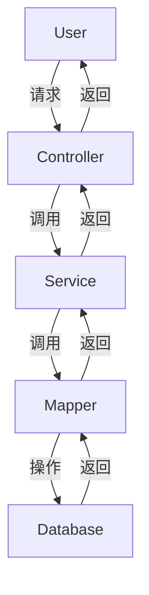

# 基于SSM的安居客房产信息网站(新房二手房租房)

作者：禅与计算机程序设计艺术

## 1. 背景介绍

### 1.1 房产信息网站的现状与需求

随着互联网的普及和人们生活水平的提高，房产信息网站成为了买房、卖房、租房的重要平台。安居客作为国内知名的房产信息网站，涵盖了新房、二手房、租房等多种房产信息，极大地方便了用户的需求。然而，如何设计一个高效、可靠、可扩展的房产信息网站，仍然是一个具有挑战性的任务。

### 1.2 SSM框架简介

SSM（Spring、Spring MVC、MyBatis）框架是目前主流的Java企业级应用开发框架之一。它结合了Spring的依赖注入和面向切面编程、Spring MVC的灵活控制器和视图解析、以及MyBatis的高效持久化层操作，能够帮助开发者快速构建高性能的Web应用。

### 1.3 本文目标

本文旨在通过详细介绍基于SSM框架的安居客房产信息网站的设计与实现，帮助读者理解SSM框架在实际项目中的应用，并提供相关的最佳实践和技术洞察。

## 2. 核心概念与联系

### 2.1 Spring

Spring是一个开源的Java平台，为Java应用程序提供了全面的基础设施支持。其核心特性包括依赖注入（DI）、面向切面编程（AOP）、数据访问、事务管理等。

### 2.2 Spring MVC

Spring MVC是Spring框架的一部分，提供了构建Web应用的全功能MVC模块。它通过控制器（Controller）处理HTTP请求，并将结果返回给视图（View）进行呈现。

### 2.3 MyBatis

MyBatis是一款优秀的持久层框架，支持定制SQL、存储过程以及高级映射。MyBatis消除了几乎所有的JDBC代码和手动设置参数以及获取结果集的工作。

### 2.4 SSM框架的协作

SSM框架通过Spring进行依赖注入和事务管理，Spring MVC处理Web层请求，MyBatis负责数据持久化层操作。三者协同工作，共同构建高效的Web应用。



## 3. 核心算法原理具体操作步骤

### 3.1 用户认证与授权

用户认证与授权是任何Web应用的基础。我们将使用Spring Security来实现这一功能。

#### 3.1.1 用户注册

用户注册需要提供用户名、密码、邮箱等基本信息。服务器端需要对这些信息进行验证，并将用户信息存储到数据库中。

#### 3.1.2 用户登录

用户登录时，需要提供用户名和密码。系统将验证用户提供的信息是否正确，并生成一个会话或JWT令牌，以维护用户的登录状态。

### 3.2 房产信息管理

房产信息管理是房产信息网站的核心功能，包括房产信息的添加、修改、删除和查询。

#### 3.2.1 添加房产信息

用户（如房产经纪人）可以通过表单提交房产信息，包括房产名称、地址、价格、面积、房型等。服务器端将这些信息存储到数据库中。

#### 3.2.2 修改房产信息

用户可以修改已发布的房产信息。系统将验证用户的权限，并更新数据库中的相应记录。

#### 3.2.3 删除房产信息

用户可以删除已发布的房产信息。系统将验证用户的权限，并从数据库中删除相应记录。

#### 3.2.4 查询房产信息

用户可以根据各种条件（如位置、价格、房型等）查询房产信息。系统将根据用户的查询条件生成相应的SQL语句，并返回查询结果。

### 3.3 搜索与推荐算法

为了提升用户体验，房产信息网站需要提供强大的搜索与推荐功能。

#### 3.3.1 搜索算法

搜索算法需要根据用户输入的关键词，在数据库中查找匹配的房产信息。常用的搜索算法包括全文搜索和模糊搜索。

#### 3.3.2 推荐算法

推荐算法根据用户的浏览历史、搜索记录等，推荐可能感兴趣的房产信息。常用的推荐算法包括协同过滤和基于内容的推荐。

## 4. 数学模型和公式详细讲解举例说明

### 4.1 搜索算法中的TF-IDF

TF-IDF（Term Frequency-Inverse Document Frequency）是一种常用的文本挖掘算法，用于评估一个词语对一个文档的重要程度。其公式为：

$$
\text{TF-IDF}(t, d) = \text{TF}(t, d) \times \text{IDF}(t)
$$

其中，$\text{TF}(t, d)$ 表示词语 $t$ 在文档 $d$ 中出现的频率，$\text{IDF}(t)$ 表示词语 $t$ 的逆文档频率，计算公式为：

$$
\text{IDF}(t) = \log \frac{N}{|\{d \in D : t \in d\}|}
$$

### 4.2 推荐算法中的协同过滤

协同过滤是一种常用的推荐算法，根据用户的历史行为数据，推荐可能感兴趣的物品。其核心思想是相似用户的相似行为。协同过滤可以分为基于用户的协同过滤和基于物品的协同过滤。

#### 4.2.1 基于用户的协同过滤

基于用户的协同过滤通过计算用户之间的相似度，推荐其他相似用户喜欢的物品。相似度计算常用的公式包括余弦相似度：

$$
\text{sim}(u, v) = \frac{\sum_{i \in I} r_{u,i} \cdot r_{v,i}}{\sqrt{\sum_{i \in I} r_{u,i}^2} \cdot \sqrt{\sum_{i \in I} r_{v,i}^2}}
$$

其中，$r_{u,i}$ 表示用户 $u$ 对物品 $i$ 的评分，$I$ 表示用户 $u$ 和用户 $v$ 都评分过的物品集合。

#### 4.2.2 基于物品的协同过滤

基于物品的协同过滤通过计算物品之间的相似度，推荐与用户喜欢的物品相似的其他物品。相似度计算常用的公式包括皮尔逊相关系数：

$$
\text{sim}(i, j) = \frac{\sum_{u \in U} (r_{u,i} - \bar{r}_i) \cdot (r_{u,j} - \bar{r}_j)}{\sqrt{\sum_{u \in U} (r_{u,i} - \bar{r}_i)^2} \cdot \sqrt{\sum_{u \in U} (r_{u,j} - \bar{r}_j)^2}}
$$

其中，$\bar{r}_i$ 表示物品 $i$ 的平均评分，$U$ 表示评分过物品 $i$ 和物品 $j$ 的用户集合。

## 5. 项目实践：代码实例和详细解释说明

### 5.1 项目结构

本项目采用Maven进行构建，主要包括以下模块：

- `controller`：处理HTTP请求，调用服务层。
- `service`：业务逻辑层，调用持久层。
- `mapper`：持久层，操作数据库。
- `model`：数据模型层，定义实体类。

### 5.2 配置文件

#### 5.2.1 Spring配置

Spring配置文件`applicationContext.xml`：

```xml
<beans xmlns="http://www.springframework.org/schema/beans"
       xmlns:xsi="http://www.w3.org/2001/XMLSchema-instance"
       xmlns:context="http://www.springframework.org/schema/context"
       xsi:schemaLocation="http://www.springframework.org/schema/beans
           http://www.springframework.org/schema/beans/spring-beans.xsd
           http://www.springframework.org/schema/context
           http://www.springframework.org/schema/context/spring-context.xsd">

    <context:component-scan base-package="com.example.anjuke"/>

    <bean id="dataSource" class="org.apache.commons.dbcp2.BasicDataSource">
        <property name="driverClassName" value="com.mysql.cj.jdbc.Driver"/>
        <property name="url" value="jdbc:mysql://localhost:3306/anjuke"/>
        <property name="username" value="root"/>
        <property name