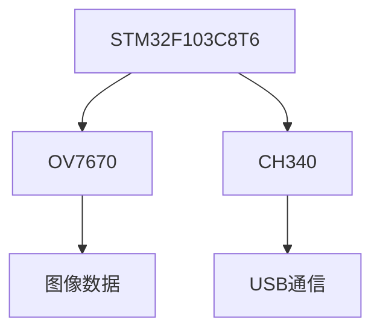

# 基于STM32的半尺寸智能电脑鼠设计与实现

## 1. 背景介绍

### 1.1 电脑鼠标的重要性

在现代计算机系统中,鼠标作为一种重要的人机交互设备,已经成为了用户与计算机进行交互和操作的必备工具。自从第一款鼠标问世以来,它的设计和功能不断得到优化和完善,以满足不同场景下的使用需求。

### 1.2 半尺寸鼠标的优势

尽管传统的全尺寸鼠标具有操作便捷、体积较大等优点,但在一些特殊场景下,如笔记本电脑使用、旅行携带等情况,全尺寸鼠标就显得笨重和不太实用。半尺寸鼠标凭借其小巧便携、节省空间的优势,成为了一种新的选择。

### 1.3 智能鼠标的发展趋势

随着科技的不断进步,鼠标的功能也在不断拓展。智能鼠标不仅具备基本的指针控制功能,还可以集成手势识别、语音控制等智能化功能,为用户带来更加人性化和高效的操作体验。

## 2. 核心概念与联系

### 2.1 STM32微控制器

STM32是意法半导体(ST)公司推出的一款基于ARM Cortex-M内核的32位微控制器系列。它具有高性能、低功耗、丰富的外设资源等特点,广泛应用于嵌入式系统、工业控制、物联网等领域。

### 2.2 光学鼠标原理

光学鼠标是利用光学传感器来检测鼠标在平面上的运动。它通过采集鼠标下方平面的图像,并通过图像处理算法计算出鼠标的移动距离和方向,从而实现鼠标指针的控制。

### 2.3 手势识别技术

手势识别技术是通过计算机视觉和模式识别算法,对人体手部或手指的动作进行检测和解释,将手势转换为相应的命令或操作。在智能鼠标中,手势识别技术可以实现更加自然和直观的人机交互方式。

## 3. 核心算法原理具体操作步骤

### 3.1 光学鼠标运动检测算法

光学鼠标的运动检测算法主要包括以下步骤:

1. 图像采集: 利用CMOS或CCD图像传感器采集鼠标下方平面的图像数据。
2. 图像预处理: 对采集的图像进行去噪、二值化等预处理,以提高图像质量。
3. 图像分割: 将预处理后的图像分割为多个小块,以便进行运动估计。
4. 运动估计: 利用图像块匹配算法(如相关算法、最小二乘法等)计算出当前图像与前一帧图像之间的位移向量。
5. 累加位移: 将计算出的位移向量累加,得到鼠标的总位移。
6. 指针控制: 根据累计的位移,控制鼠标指针在屏幕上的移动。

以上算法需要在STM32微控制器上实现,并与图像传感器和其他外设进行交互。

### 3.2 手势识别算法

手势识别算法通常包括以下几个主要步骤:

1. 手部检测: 利用图像处理技术(如肤色检测、边缘检测等)从图像中分割出手部区域。
2. 特征提取: 从手部区域中提取关键特征,如手指尖端坐标、手指弯曲角度等。
3. 模式匹配: 将提取的特征与预定义的手势模型进行匹配,识别出当前手势。
4. 命令映射: 将识别出的手势映射为相应的鼠标命令或操作。

常见的手势识别算法包括隐马尔可夫模型(HMM)、动态时间规整(DTW)、卷积神经网络(CNN)等。

## 4. 数学模型和公式详细讲解举例说明

### 4.1 图像块匹配算法

在光学鼠标运动检测算法中,图像块匹配是一个关键步骤。常用的块匹配算法包括相关算法(Correlation)和最小二乘法(Least Squares)等。

#### 4.1.1 相关算法

相关算法是基于两个图像块之间像素值的相似性来计算位移。设当前图像块为$f(x,y)$,前一帧图像块为$g(x,y)$,则相关系数$r$可以表示为:

$$r=\frac{\sum_{x,y}[f(x,y)-\overline{f}][g(x-u,y-v)-\overline{g}]}{\sqrt{\sum_{x,y}[f(x,y)-\overline{f}]^2\sum_{x,y}[g(x-u,y-v)-\overline{g}]^2}}$$

其中$\overline{f}$和$\overline{g}$分别表示$f$和$g$的均值,$(u,v)$为待估计的位移向量。通过枚举不同的$(u,v)$值,找到使$r$最大的位移向量即可。

#### 4.1.2 最小二乘法

最小二乘法是基于两个图像块之间像素值的差异最小化来计算位移。设当前图像块为$f(x,y)$,前一帧图像块为$g(x,y)$,则目标函数$E$可以表示为:

$$E=\sum_{x,y}[f(x,y)-g(x-u,y-v)]^2$$

通过求解$\frac{\partial E}{\partial u}=0$和$\frac{\partial E}{\partial v}=0$,可以得到位移向量$(u,v)$的估计值。

这两种算法都需要在一定的搜索范围内枚举不同的位移向量,计算出最优的位移估计值。在实际应用中,可以结合图像金字塔、循环累加等优化策略,提高算法的精度和效率。

### 4.2 手势识别算法中的HMM模型

隐马尔可夫模型(Hidden Markov Model, HMM)是一种常用的时序模式识别算法,在手势识别领域也有广泛应用。HMM模型由一个隐藏的马尔可夫链和一个观测序列组成,可以用来描述手势的时序特性。

设$Q=\{q_1,q_2,...,q_N\}$为隐藏的马尔可夫链的状态集合,$V=\{v_1,v_2,...,v_M\}$为观测序列的符号集合,则一个HMM模型可以由以下参数来表示:

- $\pi=\{\pi_i\}$,初始状态概率分布,其中$\pi_i=P(q_1=i),1\leq i\leq N$。
- $A=\{a_{ij}\}$,状态转移概率矩阵,其中$a_{ij}=P(q_{t+1}=j|q_t=i),1\leq i,j\leq N$。
- $B=\{b_j(k)\}$,观测概率分布,其中$b_j(k)=P(v_k|q_t=j),1\leq j\leq N,1\leq k\leq M$。

对于一个给定的观测序列$O=\{o_1,o_2,...,o_T\}$,可以使用前向-后向算法计算出该序列由某个特定的HMM模型生成的概率$P(O|\lambda)$,其中$\lambda=(\pi,A,B)$表示HMM模型的参数集合。

在手势识别中,可以针对每一种手势训练一个HMM模型,然后对新的观测序列进行评估,选择概率最大的那个HMM模型对应的手势作为识别结果。

## 5. 项目实践:代码实例和详细解释说明

在本节中,我们将提供一些基于STM32的半尺寸智能电脑鼠标项目的代码实例,并对关键部分进行详细解释。

### 5.1 硬件设计

本项目采用STM32F103C8T6作为主控制器,配合CMOS图像传感器OV7670和USB接口芯片CH340进行设计。硬件原理图如下所示:



其中,STM32F103C8T6通过SCCB总线控制OV7670进行图像采集,并对采集的图像数据进行处理;同时,它通过USB接口芯片CH340与上位机进行通信,将处理后的鼠标位移数据传输给上位机。

### 5.2 软件实现

#### 5.2.1 图像采集和预处理

```c
// 初始化OV7670
void OV7670_Init(void) {
    // 初始化SCCB总线
    SCCB_Init();
    
    // 写入OV7670寄存器配置
    OV7670_WriteReg(0x12, 0x80); // 复位OV7670
    // ... 其他寄存器配置
    
    // 设置图像输出窗口
    OV7670_WriteReg(0x17, 0x16); // 水平窗口起始高8位
    OV7670_WriteReg(0x18, 0x04); // 水平窗口起始低8位
    OV7670_WriteReg(0x19, 0x01); // 垂直窗口起始高8位
    OV7670_WriteReg(0x1A, 0x97); // 垂直窗口起始低8位
    // ...
}

// 采集并预处理图像数据
void OV7670_CaptureImage(uint8_t *imgBuf) {
    // 采集图像数据
    OV7670_ReadImageData(imgBuf);
    
    // 图像预处理
    for (int i = 0; i < IMAGE_SIZE; i++) {
        imgBuf[i] = imgBuf[i] > THRESHOLD ? 255 : 0; // 二值化
        // ... 其他预处理操作
    }
}
```

在上面的代码中,我们首先初始化OV7670图像传感器,配置好相关寄存器;然后在`OV7670_CaptureImage`函数中,采集图像数据并进行二值化等预处理操作。

#### 5.2.2 图像块匹配和位移计算

```c
// 相关算法实现
int16_t CorrelationMatch(uint8_t *prev, uint8_t *curr, int16_t *dx, int16_t *dy) {
    int32_t max_r = 0;
    int16_t u_max = 0, v_max = 0;
    
    for (int16_t u = -SEARCH_RANGE; u <= SEARCH_RANGE; u++) {
        for (int16_t v = -SEARCH_RANGE; v <= SEARCH_RANGE; v++) {
            int32_t sum_mul = 0, sum_sq1 = 0, sum_sq2 = 0;
            
            for (int y = 0; y < BLOCK_SIZE; y++) {
                for (int x = 0; x < BLOCK_SIZE; x++) {
                    int16_t idx1 = y * BLOCK_SIZE + x;
                    int16_t idx2 = (y + v) * IMAGE_WIDTH + (x + u);
                    sum_mul += prev[idx1] * curr[idx2];
                    sum_sq1 += prev[idx1] * prev[idx1];
                    sum_sq2 += curr[idx2] * curr[idx2];
                }
            }
            
            int32_t r = sum_mul / sqrt(sum_sq1 * sum_sq2);
            if (r > max_r) {
                max_r = r;
                u_max = u;
                v_max = v;
            }
        }
    }
    
    *dx = u_max;
    *dy = v_max;
    return max_r;
}

// 位移计算
void CalculateDisplacement(uint8_t *prev, uint8_t *curr, int16_t *dx, int16_t *dy) {
    int16_t u, v;
    int32_t max_r = CorrelationMatch(prev, curr, &u, &v);
    
    if (max_r > MATCH_THRESHOLD) {
        *dx = u;
        *dy = v;
    } else {
        *dx = 0;
        *dy = 0;
    }
}
```

在上面的代码中,我们实现了相关算法的`CorrelationMatch`函数,用于计算当前图像块与前一帧图像块之间的最佳匹配位移。在`CalculateDisplacement`函数中,我们调用`CorrelationMatch`计算位移,并根据相关系数的阈值判断是否有效,从而得到最终的位移值。

#### 5.2.3 USB通信和指针控制

```c
// USB发送鼠标数据
void SendMouseData(int16_t dx, int16_t dy) {
    uint8_t buf[4];
    buf[0] = 0x01; // 鼠标移动报文
    buf[1] = (uint8_t)dx