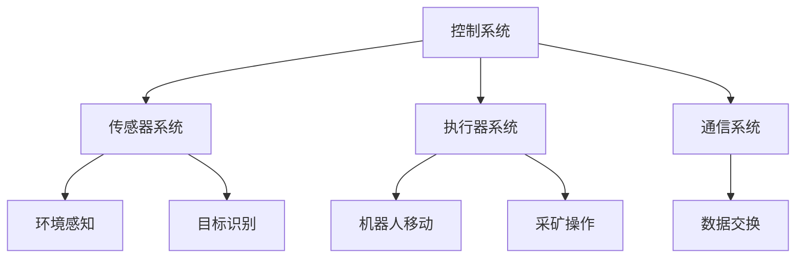

# 基于STM32的竞技对抗采矿机器人设计

作者：禅与计算机程序设计艺术

## 1. 背景介绍

### 1.1 竞技对抗采矿机器人的起源

竞技对抗采矿机器人是一种在特定场地内，通过控制和编程来完成采矿任务的机器人。它们广泛应用于教育、科研和娱乐领域，旨在提高参与者的编程能力、机器人控制技术和团队合作能力。随着技术的进步，这类机器人逐渐在各类机器人竞赛中崭露头角。

### 1.2 STM32微控制器的优势

STM32系列微控制器是由STMicroelectronics公司推出的高性能微控制器，因其强大的处理能力、低功耗和丰富的外设接口而广受欢迎。STM32微控制器在机器人控制领域具有以下优势：
- **高性能处理能力**：能够处理复杂的控制算法和实时任务。
- **丰富的外设接口**：支持多种传感器和执行器的连接。
- **低功耗设计**：延长机器人的续航时间。
- **广泛的开发资源**：提供丰富的开发工具和库函数，便于快速开发和调试。

### 1.3 设计目标

本项目的目标是设计一款基于STM32微控制器的竞技对抗采矿机器人，具备以下功能：
- **自主导航**：能够在复杂的环境中自主导航，避开障碍物。
- **采矿功能**：能够识别并采集指定目标物体。
- **对抗能力**：能够与其他机器人进行竞技对抗，保护自身和采集的资源。

## 2. 核心概念与联系

### 2.1 机器人系统架构

竞技对抗采矿机器人的系统架构主要包括以下几个部分：
- **控制系统**：由STM32微控制器组成，负责整个机器人的控制和协调。
- **传感器系统**：包括红外传感器、超声波传感器、摄像头等，用于环境感知和目标识别。
- **执行器系统**：包括电机、舵机、机械臂等，用于机器人移动和采矿操作。
- **通信系统**：用于机器人之间的通信和数据交换。



### 2.2 自主导航与避障

自主导航是竞技对抗采矿机器人实现自主行动的关键技术。通过传感器系统获取环境信息，结合路径规划算法，机器人能够自主选择最优路径，避开障碍物到达目标位置。

### 2.3 目标识别与采矿

目标识别是指机器人通过摄像头等传感器识别特定的目标物体，并通过机械臂等执行器进行采集。目标识别算法通常包括图像处理、特征提取和模式识别等步骤。

### 2.4 竞技对抗策略

竞技对抗策略是指机器人在与其他机器人对抗时采取的策略和行动计划。包括攻击、防御、资源保护等。通过合理的策略，机器人能够在竞技对抗中占据优势。

## 3. 核心算法原理具体操作步骤

### 3.1 自主导航算法

自主导航算法主要包括以下几个步骤：
1. **环境感知**：通过传感器获取环境信息，如障碍物位置、目标位置等。
2. **地图构建**：根据环境信息构建机器人所在区域的地图。
3. **路径规划**：基于地图信息，使用A*算法或Dijkstra算法规划最优路径。
4. **运动控制**：根据规划的路径，控制机器人的运动，避开障碍物到达目标位置。

### 3.2 目标识别算法

目标识别算法主要包括以下几个步骤：
1. **图像采集**：通过摄像头获取环境图像。
2. **图像预处理**：对图像进行灰度化、滤波等预处理操作。
3. **特征提取**：使用SIFT、SURF等算法提取图像特征。
4. **模式识别**：使用机器学习算法对提取的特征进行分类，识别目标物体。

### 3.3 竞技对抗策略

竞技对抗策略主要包括以下几个步骤：
1. **态势感知**：通过传感器和通信系统获取对手机器人的位置和状态。
2. **策略制定**：根据态势信息，制定攻击、防御、资源保护等策略。
3. **策略执行**：控制机器人执行制定的策略，与对手进行对抗。

## 4. 数学模型和公式详细讲解举例说明

### 4.1 自主导航中的路径规划

在路径规划中，我们常用A*算法来寻找从起点到终点的最优路径。A*算法的核心是评估函数 $f(n)$，其定义为：

$$
f(n) = g(n) + h(n)
$$

其中，$g(n)$ 是起点到节点 $n$ 的实际代价，$h(n)$ 是节点 $n$ 到终点的估计代价（通常使用曼哈顿距离或欧几里得距离）。

### 4.2 目标识别中的特征提取

在目标识别中，SIFT（尺度不变特征变换）算法是一种常用的特征提取方法。SIFT算法的核心步骤包括：
1. **尺度空间极值检测**：在不同尺度下检测图像的极值点。
2. **关键点定位**：精确定位极值点的位置和尺度。
3. **方向分配**：为每个关键点分配一个或多个方向。
4. **特征描述**：根据关键点的尺度和方向，生成特征向量。

### 4.3 竞技对抗中的策略优化

在竞技对抗中，我们可以使用博弈论来优化策略。假设有两个机器人A和B，分别采取策略 $S_A$ 和 $S_B$。它们的收益函数分别为 $R_A(S_A, S_B)$ 和 $R_B(S_A, S_B)$。通过求解纳什均衡，可以找到双方的最优策略组合 $(S_A^*, S_B^*)$，使得：

$$
R_A(S_A^*, S_B^*) \geq R_A(S_A, S_B^*)
$$

$$
R_B(S_A^*, S_B^*) \geq R_B(S_A^*, S_B)
$$

## 4. 项目实践：代码实例和详细解释说明

### 4.1 自主导航代码示例

以下是使用A*算法进行路径规划的代码示例：

```c
#include <stdio.h>
#include <stdlib.h>

#define MAX 100
#define INF 999999

typedef struct {
    int x, y;
} Point;

typedef struct {
    Point point;
    int g, h, f;
} Node;

int map[MAX][MAX];
int closed[MAX][MAX];
Node open[MAX * MAX];
int openCount;

int dx[] = {0, 1, 0, -1};
int dy[] = {1, 0, -1, 0};

int heuristic(Point a, Point b) {
    return abs(a.x - b.x) + abs(a.y - b.y);
}

void addOpen(Node node) {
    open[openCount++] = node;
}

Node removeOpen() {
    int minIndex = 0;
    for (int i = 1; i < openCount; i++) {
        if (open[i].f < open[minIndex].f) {
            minIndex = i;
        }
    }
    Node node = open[minIndex];
    open[minIndex] = open[--openCount];
    return node;
}

int isClosed(Point point) {
    return closed[point.x][point.y];
}

void setClosed(Point point) {
    closed[point.x][point.y] = 1;
}

void astar(Point start, Point goal) {
    Node startNode = {start, 0, heuristic(start, goal), 0};
    addOpen(startNode);

    while (openCount > 0) {
        Node current = removeOpen();
        if (current.point.x == goal.x && current.point.y == goal.y) {
            printf("Path found\n");
            return;
        }

        setClosed(current.point);

        for (int i = 0; i < 4; i++) {
            Point neighbor = {current.point.x + dx[i], current.point.y + dy[i]};
            if (map[neighbor.x][neighbor.y] == 0 && !isClosed(neighbor)) {
                Node neighborNode = {neighbor, current.g + 1, heuristic(neighbor, goal), 0};
                neighborNode.f = neighborNode.g + neighborNode.h;
                addOpen(neighborNode);
           