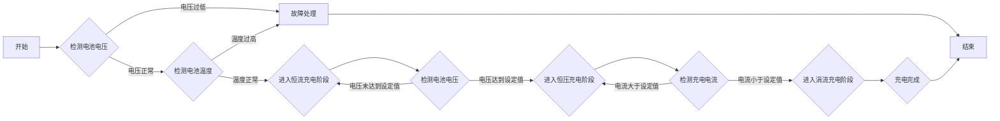

# 基于STM32的锂电池充电管理系统的设计

作者：禅与计算机程序设计艺术

## 1. 背景介绍

### 1.1 锂电池的优势与应用

锂离子电池以其高能量密度、长循环寿命、低自放电率等优点，成为便携式电子设备、电动汽车、储能系统等领域的首选电源。随着应用领域的不断扩大，对锂电池充电管理系统的要求也越来越高。

### 1.2 充电管理系统的意义

锂电池的性能和寿命与其充放电过程密切相关。不当的充电方式会导致电池过充、过放、过热等问题，严重影响电池的性能和寿命，甚至引发安全事故。因此，设计一个安全可靠、高效智能的充电管理系统至关重要。

### 1.3 本文研究内容概述

本文将介绍一种基于STM32微控制器的锂电池充电管理系统设计方案，详细阐述系统的硬件设计、软件算法、充电流程以及实际应用案例，并展望锂电池充电管理技术的发展趋势。

## 2. 核心概念与联系

### 2.1 锂电池充电特性

锂电池的充电过程可以分为三个阶段：恒流充电阶段、恒压充电阶段和涓流充电阶段。

- **恒流充电阶段:** 电池电压较低时，以恒定电流对电池进行充电，此时电池电压逐渐升高。
- **恒压充电阶段:** 当电池电压达到设定值后，充电电流逐渐减小，以恒定电压对电池进行充电，直到充电电流降低到设定值。
- **涓流充电阶段:** 当充电电流降低到设定值后，以极小的电流对电池进行补充充电，以补偿电池的自放电。

### 2.2 充电管理系统功能

锂电池充电管理系统的主要功能包括：

- **过压保护:** 当电池电压超过设定值时，切断充电电路，防止电池过充。
- **过流保护:** 当充电电流超过设定值时，切断充电电路，防止电池过流。
- **短路保护:** 当充电电路发生短路时，立即切断充电电路，保护电池和充电器。
- **温度保护:** 当电池温度超过设定值时，停止充电或减小充电电流，防止电池过热。
- **充电状态指示:** 通过LED灯或显示屏指示电池充电状态。
- **充电参数设置:** 用户可以通过按键或上位机设置充电电压、充电电流等参数。

### 2.3 STM32微控制器

STM32系列微控制器是意法半导体公司推出的32位ARM Cortex-M内核微控制器，具有高性能、低功耗、丰富的片上外设等特点，广泛应用于嵌入式系统开发。

### 2.4 核心概念联系

锂电池充电管理系统利用STM32微控制器的强大功能，实时监测电池电压、电流、温度等参数，并根据预设的充电算法控制充电过程，实现对锂电池的安全高效充电。

## 3. 核心算法原理具体操作步骤

### 3.1 充电算法流程图



### 3.2 具体操作步骤

1. **初始化:** 初始化STM32微控制器、ADC、定时器、GPIO等外设。
2. **检测电池电压:** 通过ADC模块采集电池电压值，并判断电池电压是否过低。如果电池电压过低，则进入故障处理流程。
3. **检测电池温度:** 通过温度传感器采集电池温度值，并判断电池温度是否过高。如果电池温度过高，则进入故障处理流程。
4. **恒流充电阶段:** 控制充电MOSFET导通，以恒定电流对电池进行充电。实时监测电池电压，当电池电压达到设定值时，进入恒压充电阶段。
5. **恒压充电阶段:** 控制充电MOSFET的导通占空比，以恒定电压对电池进行充电。实时监测充电电流，当充电电流降低到设定值时，进入涓流充电阶段。
6. **涓流充电阶段:** 以极小的电流对电池进行补充充电，以补偿电池的自放电。
7. **充电完成:** 当电池充满后，停止充电，并进行充电完成指示。
8. **故障处理:** 当出现过压、过流、短路、过温等故障时，立即切断充电电路，并进行故障指示。

## 4. 数学模型和公式详细讲解举例说明

### 4.1 充电电流计算

在恒流充电阶段，充电电流可以通过以下公式计算：

$$I_c = \frac{C_b \times \Delta V}{\Delta t}$$

其中：

- $I_c$ 为充电电流
- $C_b$ 为电池容量
- $\Delta V$ 为电池电压变化量
- $\Delta t$ 为充电时间

**举例说明:**

假设电池容量为2000mAh，充电时间为2小时，电池电压从3.7V上升到4.2V，则充电电流为：

$$I_c = \frac{2000mAh \times (4.2V - 3.7V)}{2h} = 500mA$$

### 4.2 充电时间计算

在恒流充电阶段，充电时间可以通过以下公式计算：

$$\Delta t = \frac{C_b \times \Delta V}{I_c}$$

**举例说明:**

假设电池容量为2000mAh，充电电流为500mA，电池电压从3.7V上升到4.2V，则充电时间为：

$$\Delta t = \frac{2000mAh \times (4.2V - 3.7V)}{500mA} = 2h$$

## 5. 项目实践：代码实例和详细解释说明

### 5.1 硬件电路设计

本项目采用STM32F103C8T6微控制器作为主控芯片，外围电路主要包括：

- 电源模块：将外部电源转换为系统所需的电压。
- 充电模块：控制充电电流和电压，并提供过压、过流、短路保护。
- 电池电压采集模块：通过电压传感器采集电池电压。
- 电池温度采集模块：通过温度传感器采集电池温度。
- 显示模块：显示电池电压、电流、温度等信息。
- 按键模块：用于设置充电参数。

### 5.2 软件代码实现

以下代码示例演示了STM32微控制器控制充电过程的关键部分：

```c
// 初始化ADC
ADC_InitTypeDef ADC_InitStructure;
ADC_InitStructure.ADC_Mode = ADC_Mode_Independent;
ADC_InitStructure.ADC_ScanConvMode = DISABLE;
ADC_InitStructure.ADC_ContinuousConvMode = ENABLE;
ADC_InitStructure.ADC_ExternalTrigConv = ADC_ExternalTrigConv_None;
ADC_InitStructure.ADC_DataAlign = ADC_DataAlign_Right;
ADC_InitStructure.ADC_NbrOfChannel = 1;
ADC_Init(ADC1, &ADC_InitStructure);

// 初始化定时器
TIM_TimeBaseInitTypeDef TIM_TimeBaseStructure;
TIM_TimeBaseStructure.TIM_Period = 1000 - 1;
TIM_TimeBaseStructure.TIM_Prescaler = 72 - 1;
TIM_TimeBaseStructure.TIM_ClockDivision = TIM_CKD_DIV1;
TIM_TimeBaseStructure.TIM_CounterMode = TIM_CounterMode_Up;
TIM_TimeBaseInit(TIM2, &TIM_TimeBaseStructure);

// 初始化GPIO
GPIO_InitTypeDef GPIO_InitStructure;
GPIO_InitStructure.GPIO_Pin = GPIO_Pin_0;
GPIO_InitStructure.GPIO_Mode = GPIO_Mode_Out_PP;
GPIO_InitStructure.GPIO_Speed = GPIO_Speed_50MHz;
GPIO_Init(GPIOA, &GPIO_InitStructure);

// 主循环
while (1)
{
    // 采集电池电压
    ADC_SoftwareStartConvCmd(ADC1, ENABLE);
    while (ADC_GetFlagStatus(ADC1, ADC_FLAG_EOC) == RESET);
    uint16_t batteryVoltage = ADC_GetConversionValue(ADC1);

    // 采集电池温度
    uint16_t batteryTemperature = GetBatteryTemperature();

    // 根据电池电压和温度控制充电过程
    if (batteryVoltage < BATTERY_VOLTAGE_LOW)
    {
        // 电池电压过低，进入故障处理流程
    }
    else if (batteryTemperature > BATTERY_TEMPERATURE_HIGH)
    {
        // 电池温度过高，进入故障处理流程
    }
    else
    {
        // 正常充电流程
        switch (chargeState)
        {
            case CONSTANT_CURRENT_CHARGE:
                // 恒流充电阶段
                SetChargeCurrent(CONSTANT_CURRENT);
                if (batteryVoltage >= BATTERY_VOLTAGE_HIGH)
                {
                    chargeState = CONSTANT_VOLTAGE_CHARGE;
                }
                break;
            case