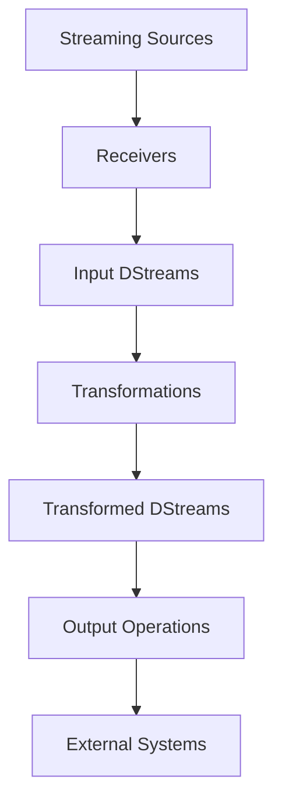
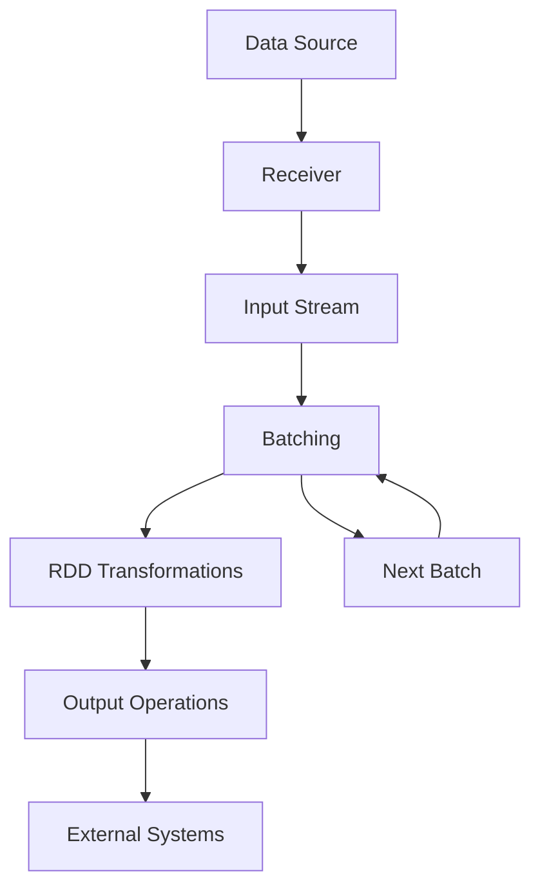

# 基于SparkStreaming的实时数据分析案例

## 1.背景介绍

### 1.1 大数据时代的到来

随着互联网、移动互联网和物联网的快速发展,海量的数据以前所未有的速度和规模不断产生和积累。这些数据来自于各种渠道,如网站点击流、移动应用程序、社交媒体平台、物联网设备等。传统的数据处理方式已经无法满足对大规模数据的实时处理和分析需求。因此,实时数据处理和分析成为了大数据时代的核心需求之一。

### 1.2 实时数据分析的重要性

实时数据分析可以帮助企业和组织从海量数据中及时获取有价值的洞见,从而做出更好的决策和采取行动。以下是实时数据分析的一些关键应用场景:

- 网络安全监控:实时检测和响应网络攻击和异常行为
- 金融交易监控:实时监控和发现欺诈行为
- 物联网数据分析:实时处理和分析来自各种传感器的数据流
- 网站/应用程序监控:实时监控网站/应用程序的性能和用户行为
- 社交媒体分析:实时分析社交媒体数据,了解热点话题和用户情绪

### 1.3 Spark Streaming简介

Apache Spark是一个开源的大数据处理框架,它提供了Spark Streaming组件用于实时数据处理和分析。Spark Streaming可以从诸如Kafka、Flume、Kinesis等数据源持续不断地获取数据流,并使用Spark的强大计算引擎对数据流进行转换、处理和分析。

Spark Streaming将数据流划分为一系列的小批次(micro-batches),并使用Spark的RDD(Resilient Distributed Dataset)抽象来处理这些批次。这种微批处理模式允许Spark Streaming利用Spark的容错和优化机制,从而提供了低延迟、高吞吐量和容错能力。

## 2.核心概念与联系

### 2.1 Spark Streaming架构

Spark Streaming的架构由以下几个核心组件组成:

1. **Spark Streaming上下文(StreamingContext)**: 是Spark Streaming应用程序的入口点,用于创建和配置流处理任务。

2. **接收器(Receiver)**: 从数据源(如Kafka、Flume等)接收数据流,并将其存储在Spark的内存中以供处理。

3. **流式数据集(DStream)**: 是Spark Streaming中的基本抽象,表示连续的数据流。每个DStream由一系列RDD组成,每个RDD包含一个时间窗口内的数据。

4. **输入DStream**: 由数据源生成的原始输入流。

5. **转换DStream**: 通过对输入DStream应用转换操作(如map、filter、reduceByKey等)生成的新DStream。

6. **输出操作**: 将处理后的DStream数据写入外部系统(如HDFS、数据库等)或执行其他操作(如foreach打印)。



### 2.2 Spark Streaming编程模型

Spark Streaming的编程模型与Spark的RDD操作非常相似。开发人员可以使用类似的转换操作(如map、filter、reduceByKey等)和输出操作(如saveAsTextFiles、foreachRDD等)来处理数据流。

以下是一个典型的Spark Streaming应用程序的基本结构:

1. 创建Spark Streaming上下文(StreamingContext)
2. 从数据源创建输入DStream
3. 对输入DStream应用转换操作以生成新的DStream
4. 对转换后的DStream执行输出操作
5. 启动Streaming上下文并等待停止

```python
# 创建Spark Streaming上下文
ssc = StreamingContext(sc, 2) # 批处理间隔为2秒

# 从数据源创建输入DStream
lines = ssc.socketTextStream("localhost", 9999)

# 对输入DStream应用转换操作
words = lines.flatMap(lambda line: line.split(" "))
pairs = words.map(lambda word: (word, 1))
wordCounts = pairs.reduceByKey(lambda x, y: x + y)

# 执行输出操作
wordCounts.pprint()

# 启动Streaming上下文
ssc.start()
ssc.awaitTermination()
```

## 3.核心算法原理具体操作步骤

### 3.1 Spark Streaming的工作原理

Spark Streaming的工作原理可以概括为以下几个步骤:

1. **数据接收**: 从数据源(如Kafka、Flume等)接收数据流,并将其存储在Spark的内存中。
2. **批处理**: 将连续的数据流划分为一系列小批次(micro-batches),每个批次包含一个时间窗口内的数据。
3. **RDD转换**: 对每个批次中的数据创建RDD,并应用Spark的RDD转换操作(如map、filter、reduceByKey等)进行处理。
4. **输出操作**: 执行输出操作,将处理后的RDD数据写入外部系统(如HDFS、数据库等)或执行其他操作(如foreach打印)。
5. **循环处理**: 重复步骤2-4,持续处理新到达的数据批次。



### 3.2 微批处理与DStream

Spark Streaming采用微批处理的方式来处理连续的数据流。它将数据流划分为一系列小批次(micro-batches),每个批次包含一个时间窗口内的数据。

每个批次都被转换为一个RDD,Spark Streaming可以在这些RDD上应用Spark的RDD转换操作(如map、filter、reduceByKey等)进行处理。处理后的RDD数据可以通过输出操作写入外部系统或执行其他操作。

DStream(Discretized Stream)是Spark Streaming中的基本抽象,表示连续的数据流。每个DStream由一系列RDD组成,每个RDD包含一个时间窗口内的数据。

DStream提供了类似RDD的转换操作,如map、flatMap、filter、reduceByKey等,用于对数据流进行处理。此外,DStream还提供了一些特定于流处理的转换操作,如window、updateStateByKey等。

### 3.3 Spark Streaming与批处理的关系

虽然Spark Streaming采用了微批处理的方式,但它与传统的批处理系统(如Apache Hadoop)有着本质的区别。

批处理系统通常是离线处理,需要等待所有数据都到达后才能开始处理。而Spark Streaming是在数据到达时就立即开始处理,并持续不断地处理新到达的数据。这种实时处理方式可以大大缩短数据处理的延迟,满足实时分析的需求。

另一方面,Spark Streaming也继承了Spark的优势,如容错性、内存计算、高吞吐量等。这使得Spark Streaming不仅适用于实时数据处理,也可以用于批处理场景。

## 4.数学模型和公式详细讲解举例说明

在实时数据分析中,常常需要使用一些数学模型和算法来处理和分析数据流。以下是一些常见的数学模型和算法:

### 4.1 滑动窗口模型

滑动窗口模型是一种常用的技术,用于在数据流上进行聚合和分析。它将数据流划分为一系列重叠的时间窗口,并对每个窗口内的数据进行聚合计算。

滑动窗口模型可以用以下公式表示:

$$
output_i = f(window_i) = f([x_j, x_{j+1}, ..., x_{j+n-1}])
$$

其中:
- $output_i$是第i个窗口的输出结果
- $f$是聚合函数,如sum、count、average等
- $window_i$是第i个窗口,包含$n$个数据点$[x_j, x_{j+1}, ..., x_{j+n-1}]$

在Spark Streaming中,可以使用`window`转换操作来实现滑动窗口模型:

```python
from pyspark.streaming import StreamingContext

# 创建DStream
lines = ssc.socketTextStream("localhost", 9999)
words = lines.flatMap(lambda line: line.split(" "))

# 应用window操作
windowedWords = words.window(30, 10)  # 窗口长度30秒,滑动间隔10秒
wordCounts = windowedWords.map(lambda x: (x, 1)).reduceByKey(lambda x, y: x + y)

wordCounts.pprint()
```

### 4.2 指数加权移动平均(EWMA)

指数加权移动平均(EWMA)是一种常用的技术,用于对时间序列数据进行平滑处理。它给予最近的观测值更高的权重,从而更好地反映数据的最新趋势。

EWMA的公式如下:

$$
S_t = \alpha X_t + (1 - \alpha) S_{t-1}
$$

其中:
- $S_t$是时间$t$的EWMA值
- $X_t$是时间$t$的观测值
- $\alpha$是平滑系数,介于0和1之间,越小表示平滑程度越高

在Spark Streaming中,可以使用`updateStateByKey`转换操作来实现EWMA:

```python
def updateEWMA(newValues, runningAvg):
    if runningAvg is None:
        runningAvg = 0.0
    
    alpha = 0.3  # 平滑系数
    
    for value in newValues:
        runningAvg = alpha * value + (1 - alpha) * runningAvg
    
    return runningAvg

# 创建DStream
lines = ssc.socketTextStream("localhost", 9999)
values = lines.map(lambda line: float(line))

# 应用updateStateByKey操作
ewma = values.updateStateByKey(updateEWMA)

ewma.pprint()
```

### 4.3 线性回归模型

线性回归是一种常用的监督学习算法,用于建立自变量和因变量之间的线性关系模型。在实时数据分析中,线性回归可以用于预测、异常检测等场景。

线性回归的数学模型如下:

$$
y = \beta_0 + \beta_1 x_1 + \beta_2 x_2 + ... + \beta_n x_n + \epsilon
$$

其中:
- $y$是因变量
- $x_1, x_2, ..., x_n$是自变量
- $\beta_0, \beta_1, ..., \beta_n$是回归系数
- $\epsilon$是误差项

可以使用最小二乘法来估计回归系数$\beta$:

$$
\hat{\beta} = (X^T X)^{-1} X^T y
$$

其中:
- $X$是自变量矩阵
- $y$是因变量向量
- $\hat{\beta}$是估计的回归系数向量

在Spark Streaming中,可以使用MLlib库中的线性回归算法来实现实时预测和异常检测。

```python
from pyspark.streaming import StreamingContext
from pyspark.mllib.regression import LabeledPoint, LinearRegressionWithSGD

# 创建DStream
lines = ssc.socketTextStream("localhost", 9999)
data = lines.map(lambda line: LabeledPoint(*[float(x) for x in line.split(',')]))

# 训练线性回归模型
model = LinearRegressionWithSGD.train(data)

# 使用模型进行预测
predictions = model.predict(data.map(lambda lp: lp.features))

# 输出预测结果
predictions.pprint()
```

## 4.项目实践: 代码实例和详细解释说明

在本节中,我们将通过一个实际项目案例来展示如何使用Spark Streaming进行实时数据分析。我们将构建一个简单的网站实时访问日志分析系统,用于统计网站的实时访问量、热门页面、地理位置分布等指标。

### 4.1 项目概述

我们将模拟一个网站服务器,生成访问日志数据流,并将其发送到Kafka消息队列中。然后,我们将使用Spark Streaming从Kafka中消费这些日志数据,并进行实时分析。

具体的分析任务包括:

1. 实时统计网站的总访问量
2. 统计热门页面的访问量
3. 统计访问者的地理位置分布

### 4.2 数据生成器

我们首先创建一个Python脚本`log_generator.py`,用于模拟网站服务器并生成访问日志数据。这些数据将以JSON格式发送到Kafka主题中。

```python
import json
import random
import datetime
from kafka import KafkaProducer

# 定义页面列表
pages = [
    "/home",
    "/products",
    "/about",
    "/contact",
    "/cart",
    "/checkout"