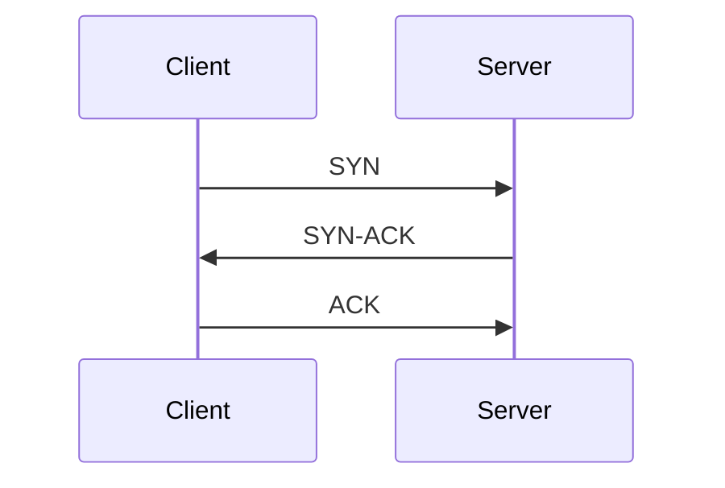
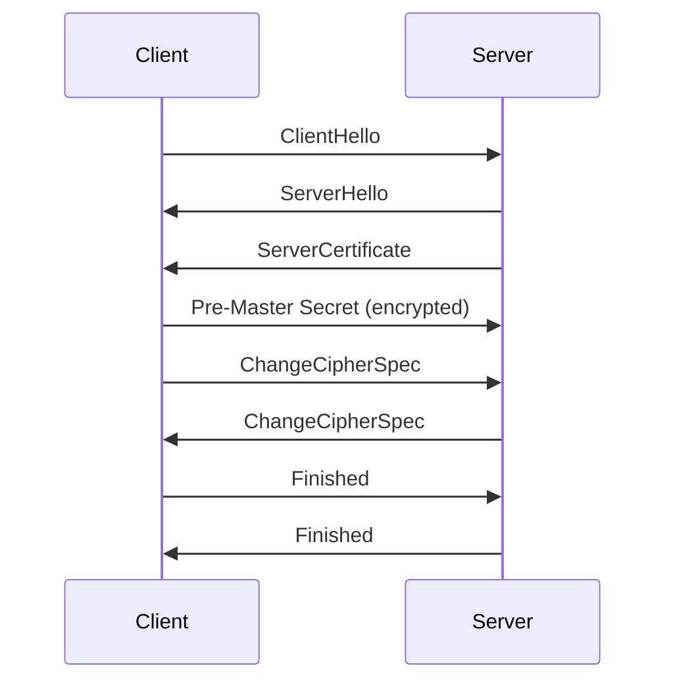

# 基于TCP的加密通讯的研究与系统实现

作者：禅与计算机程序设计艺术

## 1. 背景介绍

### 1.1 通信安全的重要性

在当今的数字化世界中，通信安全已经成为一个至关重要的话题。无论是个人通信、商业交易，还是政府机构的信息传输，确保数据在传输过程中不被窃取或篡改是绝对必要的。随着互联网的普及，越来越多的敏感信息通过网络进行传输，如何保护这些信息成为了一个亟待解决的问题。

### 1.2 TCP协议概述

传输控制协议（TCP）是互联网协议套件中的核心协议之一。它提供了一种可靠、有序且无差错的数据传输方式，广泛应用于各种网络通信中。TCP通过三次握手机制建立连接，通过序列号和确认号确保数据包按序到达，并通过校验和机制检测传输错误。然而，TCP本身并不提供数据加密功能，这使得传输的数据在网络中容易被窃听和篡改。

### 1.3 加密通信的必要性

为了在TCP通信中确保数据的机密性和完整性，我们需要引入加密技术。加密通信不仅可以防止数据被窃听，还可以确保数据在传输过程中不被篡改。通过加密，只有拥有正确密钥的接收方才能解密和读取数据，从而保护数据的机密性。

## 2. 核心概念与联系

### 2.1 对称加密与非对称加密

加密技术主要分为对称加密和非对称加密两种。

- **对称加密**：使用相同的密钥进行加密和解密。对称加密算法包括AES、DES等。其优点是加密速度快，适用于大数据量的加密；缺点是密钥管理困难，密钥一旦泄露，通信安全性将受到严重威胁。

- **非对称加密**：使用一对密钥（公钥和私钥）进行加密和解密。非对称加密算法包括RSA、ECC等。其优点是密钥管理相对简单，公钥可以公开而私钥保密；缺点是加密速度较慢，不适合大数据量加密。

### 2.2 混合加密系统

为了结合对称加密和非对称加密的优点，通常采用混合加密系统。在混合加密系统中，使用非对称加密算法加密对称密钥，然后使用对称加密算法加密实际数据。这种方式既能保证数据传输的安全性，又能提高加密效率。

### 2.3 SSL/TLS协议

SSL（Secure Sockets Layer）和TLS（Transport Layer Security）是目前最常用的基于TCP的加密通信协议。它们通过在TCP连接之上建立加密通道，确保数据在传输过程中的机密性和完整性。SSL/TLS协议使用混合加密系统，在握手阶段使用非对称加密算法交换对称密钥，然后使用对称加密算法加密数据。

## 3. 核心算法原理具体操作步骤

### 3.1 TCP三次握手

TCP的三次握手过程如下：

1. **客户端发送SYN**：客户端向服务器发送一个SYN（同步）包，请求建立连接。
2. **服务器回应SYN-ACK**：服务器收到SYN包后，回应一个SYN-ACK（同步-确认）包，表示同意建立连接。
3. **客户端发送ACK**：客户端收到SYN-ACK包后，发送一个ACK（确认）包，表示连接建立完成。



### 3.2 SSL/TLS握手过程

SSL/TLS握手过程如下：

1. **客户端Hello**：客户端向服务器发送一个ClientHello消息，包含支持的加密算法、SSL/TLS版本等信息。
2. **服务器Hello**：服务器回应一个ServerHello消息，选择加密算法和SSL/TLS版本。
3. **服务器证书**：服务器发送其数字证书，包含公钥。
4. **密钥交换**：客户端生成一个随机数（称为Pre-Master Secret），并使用服务器的公钥加密后发送给服务器。
5. **生成会话密钥**：双方使用Pre-Master Secret和其他协商参数生成会话密钥。
6. **完成握手**：双方使用会话密钥进行加密通信。



### 3.3 数据加密与解密

在握手阶段完成后，客户端和服务器使用会话密钥进行数据加密和解密。具体步骤如下：

1. **数据加密**：发送方使用会话密钥和对称加密算法（如AES）加密数据。
2. **数据传输**：加密后的数据通过TCP连接传输。
3. **数据解密**：接收方使用会话密钥解密数据，恢复原始数据。

## 4. 数学模型和公式详细讲解举例说明

### 4.1 对称加密算法（AES）

AES（Advanced Encryption Standard）是一种对称加密算法，常用于加密大数据量的通信数据。AES算法的核心是一个称为Rijndael的分组加密算法。其基本步骤如下：

1. **密钥扩展**：将原始密钥扩展为多个轮密钥。
2. **初始轮**：将明文分组与第一个轮密钥进行异或运算。
3. **主要轮**：对数据进行多轮加密操作，每轮包括字节替代、行移位、列混合和轮密钥加运算。
4. **最终轮**：进行最后一轮加密操作，但不进行列混合。

AES的数学公式表示如下：

$$
C = E_k(P)
$$

其中，$C$ 是密文，$E_k$ 是使用密钥 $k$ 的加密操作，$P$ 是明文。

### 4.2 非对称加密算法（RSA）

RSA（Rivest-Shamir-Adleman）是一种非对称加密算法，常用于加密对称密钥。RSA的核心是基于大整数的因数分解难题，其基本步骤如下：

1. **密钥生成**：选择两个大素数 $p$ 和 $q$，计算 $n = pq$ 和 $\phi(n) = (p-1)(q-1)$。选择一个整数 $e$，满足 $1 < e < \phi(n)$ 且 $gcd(e, \phi(n)) = 1$。计算 $d$，满足 $ed \equiv 1 \pmod{\phi(n)}$。公钥为 $(e, n)$，私钥为 $(d, n)$。
2. **加密**：使用公钥 $(e, n)$ 加密明文 $P$，得到密文 $C$，计算公式为：
   $$
   C = P^e \mod n
   $$
3. **解密**：使用私钥 $(d, n)$ 解密密文 $C$，得到明文 $P$，计算公式为：
   $$
   P = C^d \mod n
   $$

## 5. 项目实践：代码实例和详细解释说明

### 5.1 环境准备

在实际项目中，我们可以使用Python编程语言来实现基于TCP的加密通信。首先，我们需要安装相关的库：

```bash
pip install pycryptodome
pip install socket
```

### 5.2 服务器端代码

以下是一个简单的基于TCP的加密通信服务器端代码示例：

```python
import socket
from Crypto.Cipher import AES
from Crypto.Random import get_random_bytes

# 生成会话密钥
session_key = get_random_bytes(16)

# 初始化AES加密器
cipher = AES.new(session_key, AES.MODE_EAX)

# 创建TCP服务器
server_socket = socket.socket(socket.AF_INET, socket.SOCK_STREAM)
server_socket.bind(('0.0.0.0', 12345))
server_socket.listen(1)

print("服务器已启动，等待连接...")

# 接受客户端连接
client_socket, client_address = server_socket.accept()
print(f"客户端 {client_address} 已连接")

# 接收加密的数据
encrypted_data = client_socket.recv(1024)

# 解密数据
nonce = encrypted_data[:16]
ciphertext