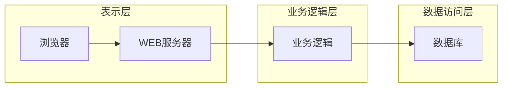

## 1. 背景介绍

### 1.1 纳税管理信息化的必然趋势

随着经济的快速发展和税收制度的不断完善，传统的纳税管理模式已经难以适应新形势的要求。纳税人数量的激增、税收政策的复杂化、纳税服务需求的多样化，都对纳税管理工作提出了更高的要求。为了提高纳税管理效率、降低管理成本、提升纳税服务水平，纳税管理信息化已经成为必然趋势。

### 1.2 WEB技术在信息化建设中的优势

WEB技术具有跨平台、易于维护、开发成本低等优势，已经成为信息化建设的首选技术方案。基于WEB的纳税查询管理系统可以方便纳税人随时随地查询纳税信息、办理纳税业务，同时也可以提高税务部门的工作效率，降低管理成本。

### 1.3 本系统的设计目标

本系统旨在设计和实现一个基于WEB的纳税查询管理系统，实现以下目标：

* 为纳税人提供便捷的纳税信息查询服务，包括税收政策法规、纳税申报指南、办税流程等。
* 为纳税人提供在线办理纳税业务的功能，例如纳税申报、税款缴纳、发票查询等。
* 为税务部门提供高效的纳税管理工具，例如纳税人信息管理、税款征收管理、税务稽查等。

## 2. 核心概念与联系

### 2.1 系统架构

本系统采用B/S架构，主要分为三层：

* **表示层：**负责用户界面的展示和用户交互，使用HTML、CSS、JavaScript等技术实现。
* **业务逻辑层：**负责处理业务逻辑，例如用户登录、信息查询、业务办理等，使用Java、Spring、Hibernate等技术实现。
* **数据访问层：**负责与数据库进行交互，例如数据的增删改查，使用JDBC、MyBatis等技术实现。

### 2.2 数据库设计

本系统使用关系型数据库MySQL存储数据，主要的数据表包括：

* **用户信息表：**存储纳税人的基本信息，例如纳税人识别号、纳税人名称、联系方式等。
* **税收政策法规表：**存储税收政策法规信息，例如政策文件标题、发布日期、政策内容等。
* **纳税申报信息表：**存储纳税人的申报信息，例如申报日期、申报税种、应纳税额等。
* **税款缴纳信息表：**存储纳税人的缴款信息，例如缴款日期、缴款金额、缴款方式等。
* **发票信息表：**存储发票信息，例如发票代码、发票号码、开票日期等。

### 2.3 系统功能模块

本系统主要包括以下功能模块：

* **用户登录注册模块：**纳税人可以通过该模块进行注册和登录。
* **纳税信息查询模块：**纳税人可以通过该模块查询税收政策法规、纳税申报指南、办税流程等信息。
* **纳税申报模块：**纳税人可以通过该模块在线填写和提交纳税申报表。
* **税款缴纳模块：**纳税人可以通过该模块在线缴纳税款。
* **发票查询模块：**纳税人可以通过该模块查询发票信息。
* **税务管理模块：**税务部门工作人员可以通过该模块进行纳税人信息管理、税款征收管理、税务稽查等操作。

## 3. 核心算法原理具体操作步骤

### 3.1 用户登录认证算法

本系统采用基于Session的用户登录认证机制，具体操作步骤如下：

1. 用户在登录页面输入用户名和密码，提交登录请求。
2. 系统验证用户名和密码是否正确。
3. 如果用户名和密码正确，则创建Session对象，并将用户信息存储到Session中。
4. 系统将Session ID写入Cookie，并返回登录成功信息。
5. 用户访问其他页面时，系统会检查Cookie中是否存在Session ID。
6. 如果存在Session ID，则根据Session ID获取用户信息，验证用户是否登录。
7. 如果用户已经登录，则允许访问页面；否则，跳转到登录页面。

### 3.2 纳税申报数据校验算法

为了保证纳税申报数据的准确性，本系统对纳税申报数据进行严格的校验，具体校验规则如下：

* **数据类型校验：**例如，纳税人识别号必须为15位数字，申报金额必须为数字类型。
* **数据范围校验：**例如，申报日期必须在规定的申报期限内。
* **逻辑关系校验：**例如，应纳税额必须等于销售额乘以税率。

## 4. 数学模型和公式详细讲解举例说明

本系统中未使用复杂的数学模型和公式。

## 5. 项目实践：代码实例和详细解释说明

### 5.1 用户登录功能实现

```java
@Controller
public class LoginController {

    @Autowired
    private UserService userService;

    @RequestMapping("/login")
    public String login(User user, HttpSession session) {
        // 验证用户名和密码
        User dbUser = userService.findByUsernameAndPassword(user.getUsername(), user.getPassword());
        if (dbUser != null) {
            // 登录成功，将用户信息存储到Session中
            session.setAttribute("user", dbUser);
            return "redirect:/index";
        } else {
            // 登录失败，返回登录页面
            return "login";
        }
    }
}
```

### 5.2 纳税申报数据校验实现

```java
public class TaxDeclarationValidator {

    public static boolean validate(TaxDeclaration taxDeclaration) {
        // 数据类型校验
        if (!StringUtils.isNumeric(taxDeclaration.getTaxpayerId())) {
            return false;
        }
        if (!NumberUtils.isNumber(taxDeclaration.getDeclarationAmount())) {
            return false;
        }

        // 数据范围校验
        Date currentDate = new Date();
        if (taxDeclaration.getDeclarationDate().after(currentDate)) {
            return false;
        }

        // 逻辑关系校验
        BigDecimal salesAmount = taxDeclaration.getSalesAmount();
        BigDecimal taxRate = taxDeclaration.getTaxRate();
        BigDecimal calculatedTaxAmount = salesAmount.multiply(taxRate);
        if (!calculatedTaxAmount.equals(taxDeclaration.getTaxAmount())) {
            return false;
        }

        return true;
    }
}
```

## 6. 实际应用场景

本系统可以应用于以下场景：

* **税务部门：**税务部门可以使用本系统进行纳税人信息管理、税款征收管理、税务稽查等工作。
* **企业：**企业可以使用本系统进行纳税申报、税款缴纳、发票查询等操作。
* **个人：**个人可以使用本系统查询税收政策法规、纳税申报指南、办税流程等信息。

## 7. 工具和资源推荐

* **开发工具：**Eclipse、IntelliJ IDEA
* **数据库：**MySQL
* **WEB服务器：**Tomcat、Jetty
* **框架：**Spring、Spring MVC、Hibernate
* **前端框架：**Bootstrap、jQuery

## 8. 总结：未来发展趋势与挑战

### 8.1 未来发展趋势

* **智能化：**随着人工智能技术的不断发展，纳税查询管理系统将会更加智能化，例如智能客服、智能审核等。
* **移动化：**随着移动互联网的普及，纳税查询管理系统将会更加移动化，例如手机APP、微信公众号等。
* **数据化：**纳税查询管理系统将会更加注重数据的分析和利用，例如纳税信用评价、税收风险预警等。

### 8.2 面临的挑战

* **数据安全：**纳税查询管理系统存储了大量的纳税人信息，数据安全是重中之重。
* **系统性能：**随着纳税人数量的不断增加，系统性能面临着巨大的挑战。
* **用户体验：**纳税查询管理系统需要不断提升用户体验，才能更好地服务于纳税人。

## 9. 附录：常见问题与解答

### 9.1  问：忘记密码怎么办？

答：您可以点击登录页面上的“忘记密码”链接，通过邮箱或手机号码找回密码。

### 9.2  问：如何开具发票？

答：您可以登录系统，进入“发票查询”模块，选择需要开具发票的业务，填写相关信息后提交申请即可。


## 10.  系统架构图


