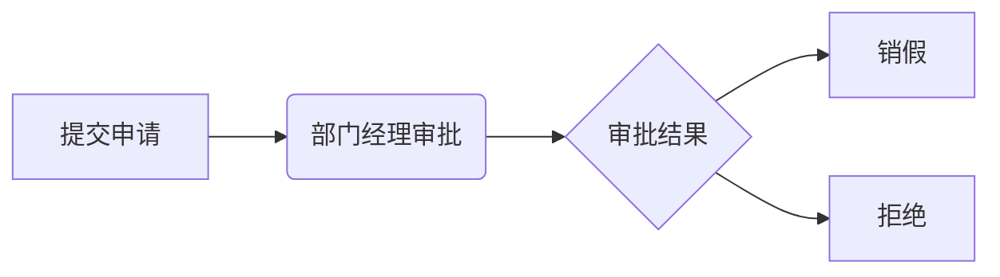
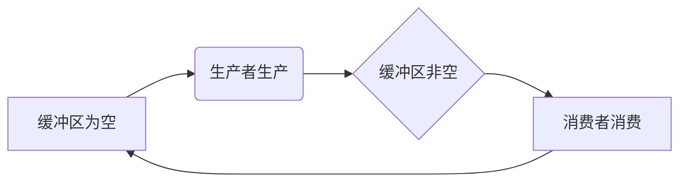

##  基于Web的办公自动化系统详细设计与具体代码实现

**作者：禅与计算机程序设计艺术**

## 1. 背景介绍

### 1.1  办公自动化的兴起与发展
随着信息技术的飞速发展，传统的手工办公方式已经难以满足现代企业高效、便捷、规范的管理需求。办公自动化（Office Automation，OA）应运而生，并迅速成为企业信息化建设的重要组成部分。办公自动化系统旨在利用计算机技术、网络技术和软件技术，实现办公业务流程的自动化处理，提高办公效率，降低运营成本，提升企业竞争力。

### 1.2  Web技术在办公自动化中的应用优势
Web技术以其开放性、跨平台性、易用性等优势，逐渐成为办公自动化系统的主流开发平台。基于Web的办公自动化系统，用户可以通过浏览器访问系统，不受时间和地点的限制，实现随时随地办公。

### 1.3  本系统的研究意义和目标
本系统旨在设计和实现一个功能完善、性能优越、易于使用和维护的基于Web的办公自动化系统，以满足现代企业对办公自动化的需求。系统将涵盖企业日常办公的各个方面，包括：

*   **信息管理：** 新闻公告、内部通知、规章制度、文件共享等。
*   **工作流程：**  请假申请、报销审批、会议安排、任务分配等。
*   **沟通协作：**  内部邮件、即时通讯、论坛讨论、在线会议等。
*   **人事管理：**  员工信息管理、考勤管理、绩效考核等。

## 2. 核心概念与联系

### 2.1 系统架构设计

本系统采用经典的三层架构设计，即表示层、业务逻辑层和数据访问层，以实现系统的高内聚、低耦合，提高系统的可维护性和可扩展性。

*   **表示层（Presentation Layer）：** 负责用户界面展示和用户交互，采用HTML、CSS、JavaScript等Web前端技术实现。
*   **业务逻辑层（Business Logic Layer）：**  负责处理业务逻辑，接收来自表示层的请求，调用数据访问层进行数据操作，并将处理结果返回给表示层。采用Java、Python等编程语言实现。
*   **数据访问层（Data Access Layer）：** 负责与数据库交互，进行数据的增删改查操作。采用JDBC、MyBatis等数据库访问技术实现。

### 2.2  技术选型

*   **前端框架：**  React、Vue.js、Angular等。
*   **后端框架：**  Spring Boot、Django、Flask等。
*   **数据库：**  MySQL、Oracle、PostgreSQL等。
*   **缓存：**  Redis、Memcached等。
*   **消息队列：**  RabbitMQ、Kafka等。
*   **搜索引擎：**  Elasticsearch、Solr等。

### 2.3  模块划分

系统主要模块包括：

*   **用户管理模块：**  实现用户注册、登录、权限管理等功能。
*   **信息发布模块：** 实现新闻公告、内部通知、规章制度发布等功能。
*   **工作流引擎模块：**  实现自定义工作流程、流程审批、流程监控等功能。
*   **文件管理模块：**  实现文件上传、下载、共享、版本控制等功能。
*   **沟通协作模块：**  实现内部邮件、即时通讯、论坛讨论、在线会议等功能。
*   **人事管理模块：**  实现员工信息管理、考勤管理、绩效考核等功能。
*   **系统管理模块：**  实现系统配置、日志管理、权限管理等功能。

## 3. 核心算法原理具体操作步骤

### 3.1  工作流引擎设计与实现

工作流引擎是办公自动化系统的核心模块之一，其主要功能是定义、执行和监控业务流程。本系统采用基于Petri网的工作流引擎，其基本原理如下：

1.  将业务流程抽象为Petri网模型，包括库所（Place）、变迁（Transition）、有向弧（Arc）等元素。
2.  每个库所代表一个业务状态，每个变迁代表一个业务操作，有向弧表示状态之间的转换关系。
3.  当业务流程启动时，系统会根据Petri网模型创建相应的实例，并在实例中创建相应的token，token代表业务流程当前所处的状态。
4.  当某个变迁满足触发条件时，该变迁就会被触发，token会沿着有向弧流转到下一个库所，从而实现业务流程的推进。

#### 3.1.1  Petri网建模

以请假审批流程为例，其Petri网模型如下：



#### 3.1.2  工作流引擎实现

工作流引擎主要包括以下几个核心组件：

*   **流程定义器：**  负责定义业务流程，包括流程图设计、节点属性设置、流转规则配置等。
*   **流程实例管理器：**  负责创建、启动、挂起、终止流程实例，并管理流程实例的生命周期。
*   **任务管理器：**  负责创建、分配、处理、监控任务，并将任务与流程实例关联起来。
*   **规则引擎：**  负责解析和执行流程定义中的流转规则，根据业务数据和规则判断流程走向。

### 3.2  权限管理设计与实现

权限管理是办公自动化系统的重要组成部分，其主要功能是控制用户对系统资源的访问权限。本系统采用基于角色的访问控制（RBAC）模型，其基本原理如下：

1.  将系统用户划分为不同的角色，每个角色对应一组权限。
2.  用户可以被赋予一个或多个角色，从而获得相应的权限。
3.  系统资源与权限关联，用户只有拥有访问资源所需权限的角色才能访问该资源。

#### 3.2.1  RBAC模型设计

RBAC模型主要包括以下几个核心元素：

*   **用户（User）：**  使用系统的个人或团体。
*   **角色（Role）：**  一组权限的集合，用于标识用户在系统中的身份和权限。
*   **权限（Permission）：**  对系统资源的操作许可，例如读取、写入、删除等。
*   **资源（Resource）：**  系统中的数据、功能或服务，例如菜单、按钮、页面、数据表等。

#### 3.2.2  RBAC模型实现

RBAC模型的实现主要包括以下几个步骤：

1.  定义角色和权限：根据系统功能和业务需求，定义不同的角色和权限。
2.  创建用户和分配角色：创建系统用户，并根据用户的工作职责和权限需求，将用户分配到相应的角色。
3.  为资源设置权限：为系统资源设置访问权限，将资源与权限关联起来。
4.  权限校验：在用户访问系统资源时，系统会校验用户是否拥有访问该资源所需的权限，如果用户拥有权限则允许访问，否则拒绝访问。

## 4. 数学模型和公式详细讲解举例说明

### 4.1  工作流引擎中的Petri网模型

Petri网是一种用于描述和分析并发系统的数学模型，其基本元素包括：

*   **库所（Place）：**  表示系统状态，用圆圈表示。
*   **变迁（Transition）：**  表示系统事件，用方框表示。
*   **有向弧（Arc）：**  表示库所和变迁之间的关系，用箭头表示。
*   **托肯（Token）：**  表示系统资源，用黑色圆点表示。

#### 4.1.1  Petri网的数学定义

一个Petri网可以定义为一个五元组：

$$PN = (P, T, F, W, M_0)$$

其中：

*   $P$ 是库所的集合；
*   $T$ 是变迁的集合；
*   $F \subseteq (P \times T) \cup (T \times P)$ 是有向弧的集合；
*   $W: F \rightarrow \{1, 2, ...\}$ 是权函数，表示有向弧上的权值；
*   $M_0: P \rightarrow \{0, 1, 2, ...\}$ 是初始标识，表示每个库所中初始托肯的数量。

#### 4.1.2  Petri网的运行规则

Petri网的运行规则如下：

1.  **变迁的触发条件：**  当且仅当一个变迁的所有输入库所中的托肯数量大于等于该变迁与该库所之间的有向弧上的权值时，该变迁才能被触发。
2.  **变迁的触发动作：**  当一个变迁被触发时，系统会从该变迁的所有输入库所中移除相应数量的托肯，并向该变迁的所有输出库所中添加相应数量的托肯。

#### 4.1.3  Petri网的应用举例

以生产者-消费者问题为例，其Petri网模型如下：



其中：

*   库所 $A$ 表示缓冲区为空；
*   库所 $C$ 表示缓冲区非空；
*   变迁 $B$ 表示生产者生产产品；
*   变迁 $D$ 表示消费者消费产品。

### 4.2  权限管理中的RBAC模型

#### 4.2.1  RBAC模型的数学定义

RBAC模型可以定义为一个四元组：

$$RBAC = (U, R, P, PA)$$

其中：

*   $U$ 是用户的集合；
*   $R$ 是角色的集合；
*   $P$ 是权限的集合；
*   $PA \subseteq P \times R$ 是权限分配关系，表示哪些权限分配给了哪些角色。

#### 4.2.2  RBAC模型的扩展

RBAC模型可以根据实际需求进行扩展，例如：

*   **角色层次结构（Role Hierarchy）：**  定义角色之间的继承关系，例如经理角色可以继承员工角色的所有权限。
*   **约束条件（Constraints）：**  定义权限分配和使用的限制条件，例如一个用户不能同时拥有两个互斥的角色。

#### 4.2.3  RBAC模型的应用举例

以一个简单的电商系统为例，其RBAC模型设计如下：

*   **用户：**  买家、卖家、管理员
*   **角色：**  普通用户、VIP用户、商家、管理员
*   **权限：**  浏览商品、购买商品、发布商品、管理订单、管理用户

权限分配关系如下：

| 角色         | 权限                                                         |
| ------------ | ------------------------------------------------------------ |
| 普通用户     | 浏览商品、购买商品                                             |
| VIP用户     | 浏览商品、购买商品（享受折扣）、查看专属商品                 |
| 商家         | 浏览商品、购买商品、发布商品、管理订单                       |
| 管理员         | 浏览商品、购买商品、发布商品、管理订单、管理用户             |

## 5. 项目实践：代码实例和详细解释说明

### 5.1  开发环境搭建

*   操作系统：Windows 10
*   开发工具：IntelliJ IDEA
*   数据库：MySQL 8.0
*   JDK版本：Java 11
*   前端框架：React
*   后端框架：Spring Boot

### 5.2  数据库设计

```sql
-- 创建用户表
CREATE TABLE `user` (
  `id` int NOT NULL AUTO_INCREMENT COMMENT '用户ID',
  `username` varchar(255) NOT NULL COMMENT '用户名',
  `password` varchar(255) NOT NULL COMMENT '密码',
  `name` varchar(255) DEFAULT NULL COMMENT '姓名',
  `email` varchar(255) DEFAULT NULL COMMENT '邮箱',
  `phone` varchar(255) DEFAULT NULL COMMENT '电话',
  `status` tinyint(1) NOT NULL DEFAULT '1' COMMENT '状态：1-正常，0-禁用',
  `create_time` datetime NOT NULL DEFAULT CURRENT_TIMESTAMP COMMENT '创建时间',
  `update_time` datetime NOT NULL DEFAULT CURRENT_TIMESTAMP ON UPDATE CURRENT_TIMESTAMP COMMENT '更新时间',
  PRIMARY KEY (`id`),
  UNIQUE KEY `username_UNIQUE` (`username`)
) ENGINE=InnoDB DEFAULT CHARSET=utf8mb4 COLLATE=utf8mb4_general_ci COMMENT='用户表';

-- 创建角色表
CREATE TABLE `role` (
  `id` int NOT NULL AUTO_INCREMENT COMMENT '角色ID',
  `name` varchar(255) NOT NULL COMMENT '角色名称',
  `description` varchar(255) DEFAULT NULL COMMENT '角色描述',
  `status` tinyint(1) NOT NULL DEFAULT '1' COMMENT '状态：1-正常，0-禁用',
  `create_time` datetime NOT NULL DEFAULT CURRENT_TIMESTAMP COMMENT '创建时间',
  `update_time` datetime NOT NULL DEFAULT CURRENT_TIMESTAMP ON UPDATE CURRENT_TIMESTAMP COMMENT '更新时间',
  PRIMARY KEY (`id`),
  UNIQUE KEY `name_UNIQUE` (`name`)
) ENGINE=InnoDB DEFAULT CHARSET=utf8mb4 COLLATE=utf8mb4_general_ci COMMENT='角色表';

-- 创建权限表
CREATE TABLE `permission` (
  `id` int NOT NULL AUTO_INCREMENT COMMENT '权限ID',
  `name` varchar(255) NOT NULL COMMENT '权限名称',
  `description` varchar(255) DEFAULT NULL COMMENT '权限描述',
  `status` tinyint(1) NOT NULL DEFAULT '1' COMMENT '状态：1-正常，0-禁用',
  `create_time` datetime NOT NULL DEFAULT CURRENT_TIMESTAMP COMMENT '创建时间',
  `update_time` datetime NOT NULL DEFAULT CURRENT_TIMESTAMP ON UPDATE CURRENT_TIMESTAMP COMMENT '更新时间',
  PRIMARY KEY (`id`),
  UNIQUE KEY `name_UNIQUE` (`name`)
) ENGINE=InnoDB DEFAULT CHARSET=utf8mb4 COLLATE=utf8mb4_general_ci COMMENT='权限表';

-- 创建用户角色关联表
CREATE TABLE `user_role` (
  `user_id` int NOT NULL COMMENT '用户ID',
  `role_id` int NOT NULL COMMENT '角色ID',
  PRIMARY KEY (`user_id`,`role_id`),
  KEY `role_id_FK` (`role_id`),
  CONSTRAINT `role_id_FK` FOREIGN KEY (`role_id`) REFERENCES `role` (`id`),
  CONSTRAINT `user_id_FK` FOREIGN KEY (`user_id`) REFERENCES `user` (`id`)
) ENGINE=InnoDB DEFAULT CHARSET=utf8mb4 COLLATE=utf8mb4_general_ci COMMENT='用户角色关联表';

-- 创建角色权限关联表
CREATE TABLE `role_permission` (
  `role_id` int NOT NULL COMMENT '角色ID',
  `permission_id` int NOT NULL COMMENT '权限ID',
  PRIMARY KEY (`role_id`,`permission_id`),
  KEY `permission_id_FK` (`permission_id`),
  CONSTRAINT `permission_id_FK` FOREIGN KEY (`permission_id`) REFERENCES `permission` (`id`),
  CONSTRAINT `role_id_FK2` FOREIGN KEY (`role_id`) REFERENCES `role` (`id`)
) ENGINE=InnoDB DEFAULT CHARSET=utf8mb4 COLLATE=utf8mb4_general_ci COMMENT='角色权限关联表';
```

### 5.3  后端代码实现

#### 5.3.1  用户管理

```java
@RestController
@RequestMapping("/api/user")
public class UserController {

    @Autowired
    private UserService userService;

    @PostMapping("/login")
    public Result login(@RequestBody UserLoginRequest request) {
        // 校验用户名和密码
        User user = userService.findByUsername(request.getUsername());
        if (user == null || !user.getPassword().equals(request.getPassword())) {
            return Result.error("用户名或密码错误");
        }

        // 生成token
        String token = JwtUtil.createToken(user.getId(), user.getUsername());

        // 返回用户信息和token
        Map<String, Object> data = new HashMap<>();
        data.put("user", user);
        data.put("token", token);
        return Result.success(data);
    }

    @GetMapping("/info")
    public Result info(@RequestHeader("Authorization") String token) {
        // 校验token
        Integer userId = JwtUtil.getUserIdFromToken(token);
        if (userId == null) {
            return Result.error("token无效");
        }

        // 获取用户信息
        User user = userService.findById(userId);
        if (user == null) {
            return Result.error("用户不存在");
        }

        // 返回用户信息
        return Result.success(user);
    }
}
```

#### 5.3.2  权限校验

```java
@Aspect
@Component
public class AuthAspect {

    @Autowired
    private PermissionService permissionService;

    @Pointcut("execution(public * com.example.demo.controller.*.*(..))")
    public void pointcut() {
    }

    @Around("pointcut()")
    public Object around(ProceedingJoinPoint point) throws Throwable {
        // 获取请求方法
        MethodSignature signature = (MethodSignature) point.getSignature();
        Method method = signature.getMethod();

        // 获取权限注解
        RequiresPermissions annotation = method.getAnnotation(RequiresPermissions.class);
        if (annotation == null) {
            return point.proceed();
        }

        // 获取用户ID
        HttpServletRequest request = ((ServletRequestAttributes) RequestContextHolder.getRequestAttributes()).getRequest