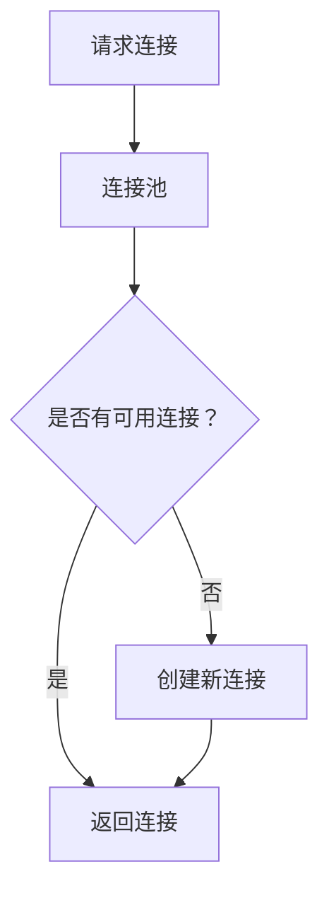
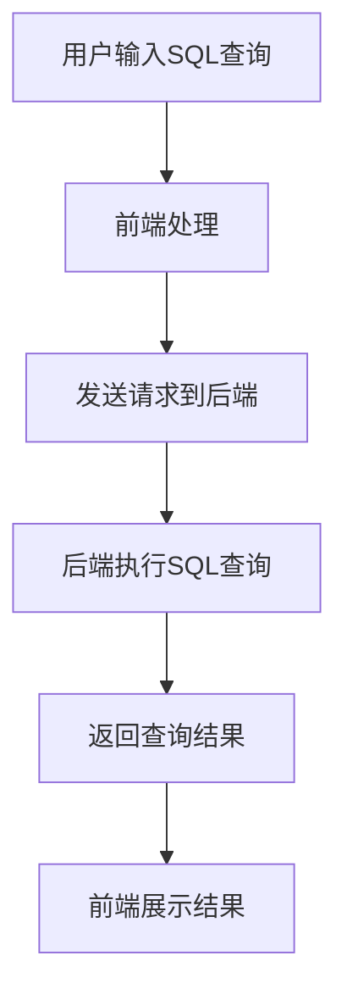
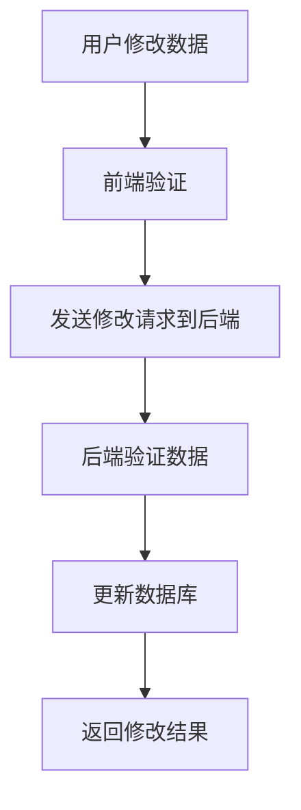
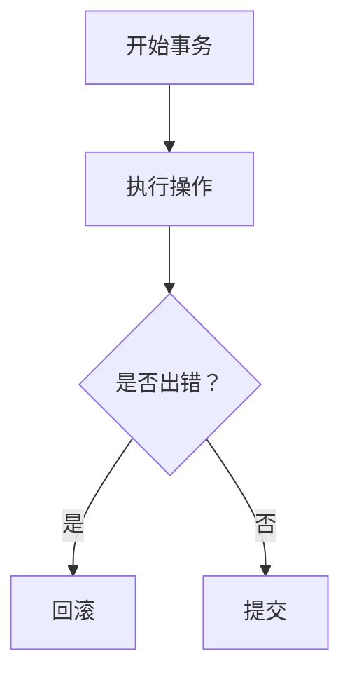

# 基于Web的可维护的数据库浏览器

作者：禅与计算机程序设计艺术

## 1. 背景介绍

### 1.1 数据库管理的挑战

在现代企业环境中，数据库的管理和维护是至关重要的。随着数据量的增长和业务需求的不断变化，传统的数据库管理工具和方法已经无法满足高效、灵活和可扩展的要求。尤其在多用户、多部门的环境中，如何确保数据库的安全性、可维护性和易用性，成为了一个亟待解决的问题。

### 1.2 Web技术的崛起

随着互联网技术的快速发展，基于Web的应用程序越来越受到欢迎。Web应用程序无需安装，跨平台兼容，用户只需通过浏览器即可访问。这些特性使得基于Web的数据库浏览器成为解决数据库管理问题的理想选择。

### 1.3 可维护性的重要性

在开发和运维过程中，可维护性是一个关键因素。一个可维护的系统不仅能够降低运维成本，还能提高系统的可靠性和可扩展性。对于数据库浏览器来说，可维护性体现在代码的清晰结构、易于理解和修改的逻辑、以及良好的文档和测试覆盖率。

## 2. 核心概念与联系

### 2.1 数据库浏览器的定义

数据库浏览器是一种工具，允许用户通过图形界面查看和管理数据库中的数据。它通常提供数据查询、数据修改、表结构查看等功能。基于Web的数据库浏览器通过浏览器访问，提供了更加便捷的用户体验。

### 2.2 Web技术与数据库的结合

Web技术的发展使得数据库浏览器不再局限于桌面应用程序。通过Web技术，用户可以在任何地方、任何设备上访问数据库。常见的Web技术包括HTML、CSS、JavaScript，以及后端技术如Node.js、Django、Flask等。

### 2.3 可维护性的原则

可维护性是指系统易于理解、修改和扩展的能力。对于数据库浏览器来说，可维护性体现在以下几个方面：

- **代码结构清晰**：模块化设计，功能分离，代码易于阅读和理解。
- **文档齐全**：详细的开发文档和用户手册，帮助开发者和用户快速上手。
- **测试覆盖率高**：单元测试、集成测试和端到端测试，确保系统的稳定性和可靠性。
- **持续集成和部署**：自动化的构建和部署流程，减少人为错误，提高开发效率。

## 3. 核心算法原理具体操作步骤

### 3.1 数据库连接与管理

#### 3.1.1 数据库连接池

为了提高数据库访问的效率，通常使用数据库连接池。连接池通过维护一个数据库连接的缓存池，减少了频繁创建和销毁连接的开销。



#### 3.1.2 数据库连接的实现

在Node.js环境下，可以使用`pg`模块连接PostgreSQL数据库。

```javascript
const { Pool } = require('pg');
const pool = new Pool({
  user: 'dbuser',
  host: 'database.server.com',
  database: 'mydb',
  password: 'secretpassword',
  port: 5432,
});

pool.query('SELECT NOW()', (err, res) => {
  console.log(err, res);
  pool.end();
});
```

### 3.2 数据查询与展示

#### 3.2.1 SQL查询的执行

执行SQL查询是数据库浏览器的核心功能之一。用户输入SQL查询语句，系统将其发送到数据库并返回结果。



#### 3.2.2 查询结果的分页展示

为了避免一次性加载大量数据，通常采用分页展示的方式。前端发送分页参数，后端根据参数查询数据并返回。

```javascript
const getUsers = async (page, limit) => {
  const offset = (page - 1) * limit;
  const res = await pool.query('SELECT * FROM users LIMIT $1 OFFSET $2', [limit, offset]);
  return res.rows;
};
```

### 3.3 数据修改与提交

#### 3.3.1 数据修改的流程

用户在前端界面修改数据后，系统需要将修改提交到数据库，并进行相应的验证和处理。



#### 3.3.2 数据修改的实现

在Node.js环境下，可以使用`pg`模块执行数据修改操作。

```javascript
const updateUser = async (id, name, email) => {
  const res = await pool.query('UPDATE users SET name = $1, email = $2 WHERE id = $3', [name, email, id]);
  return res.rowCount;
};
```

## 4. 数学模型和公式详细讲解举例说明

### 4.1 数据库索引的数学模型

数据库索引是提高查询效率的重要手段。常见的索引结构包括B树和哈希表。B树是一种平衡树，能够在对数时间内完成查找、插入和删除操作。

$$
\text{查找时间复杂度} = O(\log n)
$$

### 4.2 分页算法的数学模型

分页算法用于将大数据集分割成小块，以便于逐步加载和展示。假设有总记录数 $N$，每页显示 $M$ 条记录，第 $k$ 页的起始记录索引为 $(k-1)M$。

$$
\text{起始索引} = (k-1) \times M
$$

### 4.3 事务处理的数学模型

事务处理确保数据库操作的原子性、一致性、隔离性和持久性（ACID）。事务的执行可以用状态转移图来表示。



## 5. 项目实践：代码实例和详细解释说明

### 5.1 项目结构

一个基于Web的可维护数据库浏览器的项目结构如下：

```
project-root/
├── backend/
│   ├── controllers/
│   ├── models/
│   ├── routes/
│   └── app.js
├── frontend/
│   ├── components/
│   ├── pages/
│   └── App.js
├── tests/
│   ├── backend/
│   └── frontend/
└── README.md
```

### 5.2 后端实现

#### 5.2.1 数据库连接

在`backend/app.js`中，配置并初始化数据库连接。

```javascript
const express = require('express');
const { Pool } = require('pg');
const app = express();
const pool = new Pool({
  user: 'dbuser',
  host: 'database.server.com',
  database: 'mydb',
  password: 'secretpassword',
  port: 5432,
});

app.use(express.json());

app.get('/api/users', async (req, res) => {
  try {
    const result = await pool.query('SELECT * FROM users');
    res.json(result.rows);
  } catch (err) {
    res.status(500).json({ error: err.message });
  }
});

app.listen(3000, () => {
  console.log('Server is running on port 3000');
});
```

#### 5.2.2 路由与控制器

在`backend/routes`和`backend/controllers`中，定义路由和控制器逻辑。

```javascript
// routes/userRoutes.js
const express = require('express');
const router = express.Router();
const { getUsers, updateUser } = require('../controllers/userController');

router.get('/users', getUsers);
router.put('/users/:id', updateUser);

module.exports = router;
```

```javascript
// controllers/userController.js
const { Pool } = require('pg');
const pool = new Pool({
  user: 'dbuser',
  host: 'database.server.com',
  database: 'mydb',
  password: 'secretpassword',
  port: 5432,
});

const getUsers = async (req, res) => {
  try {
    const result = await pool.query('SELECT * FROM users');
    res.json(result.rows);
 