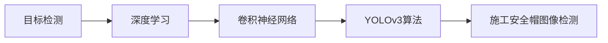

## 1. 背景介绍

### 1.1 施工安全现状与挑战

近年来，随着我国经济的快速发展和城镇化进程的加速，建筑行业蓬勃发展。然而，建筑施工现场环境复杂，安全事故频发，其中高空坠物是造成人员伤亡的主要原因之一。为了保障工人的生命安全，国家出台了一系列安全生产法律法规，强制要求施工人员必须佩戴安全帽。然而，在实际施工过程中，仍有部分工人存在侥幸心理，未按规定佩戴安全帽，给施工安全带来了极大的隐患。

### 1.2 图像识别技术在安全生产领域的应用

近年来，随着人工智能技术的飞速发展，图像识别技术在各个领域得到了广泛应用，尤其是在安全生产领域，图像识别技术可以有效地识别出违反安全规定的行为，例如：未佩戴安全帽、吸烟、玩手机等，并及时发出预警，从而有效地预防安全事故的发生。

### 1.3  YOLOv3算法的优势与适用性

YOLOv3（You Only Look Once version 3）是一种基于深度学习的目标检测算法，具有速度快、精度高等优点，在图像识别领域取得了显著的成果。相较于传统的目标检测算法，YOLOv3算法在处理速度和准确率方面具有明显优势，能够满足实时检测的需求，并且可以部署在各种硬件平台上，例如：服务器、嵌入式设备等，因此，YOLOv3算法非常适用于施工安全帽图像检测。

## 2. 核心概念与联系

### 2.1 目标检测

目标检测是计算机视觉领域的一个重要研究方向，其目的是识别图像或视频中存在的目标，并确定每个目标的位置和类别。目标检测技术在自动驾驶、安防监控、智能机器人等领域具有广泛的应用前景。

### 2.2 深度学习

深度学习是一种机器学习方法，通过构建多层神经网络来学习数据的特征表示，从而实现对数据的分类、回归等任务。深度学习在图像识别、语音识别、自然语言处理等领域取得了突破性进展。

### 2.3 卷积神经网络（CNN）

卷积神经网络是一种专门用于处理图像数据的深度学习模型，其核心是卷积层，通过卷积操作提取图像的特征。卷积神经网络在图像分类、目标检测、图像分割等任务中表现出色。

### 2.4 YOLOv3算法

YOLOv3算法是一种基于深度学习的目标检测算法，其核心思想是将目标检测问题转化为回归问题，通过一个卷积神经网络直接预测目标的类别和位置信息。YOLOv3算法具有速度快、精度高等优点，在目标检测领域取得了领先的性能。

### 2.5 核心概念联系图



## 3. 核心算法原理具体操作步骤

YOLOv3算法的核心原理是将目标检测问题转化为回归问题，通过一个卷积神经网络直接预测目标的类别和位置信息。具体操作步骤如下：

### 3.1 图像输入

将待检测的图像输入到YOLOv3网络中。

### 3.2 特征提取

YOLOv3网络使用Darknet-53作为特征提取网络，Darknet-53网络由多个卷积层、残差块和上采样层组成，可以提取图像的多尺度特征。

### 3.3 特征融合

YOLOv3网络使用FPN（Feature Pyramid Networks）结构进行特征融合，将不同尺度的特征图进行融合，以提高目标检测的精度。

### 3.4 目标预测

YOLOv3网络使用三个不同尺度的特征图进行目标预测，每个特征图负责预测不同大小的目标。对于每个预测框，YOLOv3网络预测其类别概率、置信度、中心点坐标、宽度和高度。

### 3.5 非极大值抑制（NMS）

YOLOv3网络使用非极大值抑制算法去除重叠的预测框，保留置信度最高的预测框。

## 4. 数学模型和公式详细讲解举例说明

### 4.1  预测框的表示

YOLOv3算法使用边界框（Bounding Box）来表示目标的位置信息，边界框由四个参数组成：中心点坐标 $(b_x, b_y)$、宽度 $b_w$ 和高度 $b_h$。

### 4.2  预测框的解码

YOLOv3网络输出的预测框是相对于特征图的相对坐标，需要将其解码为相对于原始图像的绝对坐标。解码公式如下：

$$
\begin{aligned}
b_x &= \sigma(t_x) + c_x \\
b_y &= \sigma(t_y) + c_y \\
b_w &= p_w e^{t_w} \\
b_h &= p_h e^{t_h}
\end{aligned}
$$

其中：

* $(t_x, t_y)$ 是预测框中心点相对于网格单元左上角的偏移量；
* $(c_x, c_y)$ 是网格单元左上角的坐标；
* $(p_w, p_h)$ 是先验框的宽度和高度；
* $(t_w, t_h)$ 是预测框的缩放因子。

### 4.3  损失函数

YOLOv3算法使用多任务损失函数来训练网络，损失函数包括三个部分：

* **目标置信度损失**：用于衡量预测框是否包含目标；
* **类别概率损失**：用于衡量预测框的类别概率；
* **边界框回归损失**：用于衡量预测框与真实框之间的距离。

## 5. 项目实践：代码实例和详细解释说明

### 5.1  环境搭建

* Python 3.6+
* TensorFlow 2.0+
* OpenCV 4.0+

### 5.2  数据集准备

使用公开的安全帽数据集进行模型训练和测试，例如：SHWD数据集。

### 5.3  模型训练

```python
# 导入必要的库
import tensorflow as tf
from tensorflow.keras.layers import Input, Conv2D, BatchNormalization, LeakyReLU, ZeroPadding2D, UpSampling2D
from tensorflow.keras.layers import add, concatenate
from tensorflow.keras.models import Model
from tensorflow.keras.optimizers import Adam
from tensorflow.keras.losses import (
    binary_crossentropy,
    sparse_categorical_crossentropy
)
from tensorflow.keras.utils import Sequence
import numpy as np
import cv2
import os

# 定义YOLOv3模型
def yolov3(input_shape=(416, 416, 3), num_classes=80):
    """
    创建YOLOv3模型

    参数：
        input_shape：输入图像的形状
        num_classes：目标类别的数量

    返回值：
        YOLOv3模型
    """

    # 定义输入层
    inputs = Input(shape=input_shape)

    # Darknet-53特征提取网络
    x = darknet_body(inputs)

    # YOLOv3输出层
    outputs = yolo_head(x, num_classes)

    # 创建模型
    model = Model(inputs, outputs)

    return model

# 定义Darknet-53特征提取网络
def darknet_body(x):
    """
    创建Darknet-53特征提取网络

    参数：
        x：输入张量

    返回值：
        特征张量列表
    """

    # ...

    return x, x_small

# 定义YOLOv3输出层
def yolo_head(x, num_classes):
    """
    创建YOLOv3输出层

    参数：
        x：特征张量列表
        num_classes：目标类别的数量

    返回值：
        输出张量列表
    """

    # ...

    return outputs

# 定义数据生成器
class DataGenerator(Sequence):
    """
    数据生成器
    """

    def __init__(self, image_paths, labels, batch_size, input_shape, anchors, num_classes):
        """
        初始化数据生成器

        参数：
            image_paths：图像路径列表
            labels：标签列表
            batch_size：批次大小
            input_shape：输入图像的形状
            anchors：锚框
            num_classes：目标类别的数量
        """

        # ...

    def __len__(self):
        """
        返回数据集的大小
        """

        # ...

    def __getitem__(self, index):
        """
        返回一个批次的数据

        参数：
            index：批次索引

        返回值：
            图像数据和标签数据
        """

        # ...

# 定义损失函数
def yolo_loss(y_true, y_pred, anchors, num_classes):
    """
    YOLOv3损失函数

    参数：
        y_true：真实标签
        y_pred：预测结果
        anchors：锚框
        num_classes：目标类别的数量

    返回值：
        损失值
    """

    # ...

# 创建YOLOv3模型
model = yolov3(input_shape=(416, 416, 3), num_classes=2)

# 编译模型
model.compile(optimizer=Adam(lr=1e-3), loss=yolo_loss)

# 加载数据集
train_image_paths = [...]
train_labels = [...]
val_image_paths = [...]
val_labels = [...]

# 创建数据生成器
train_generator = DataGenerator(
    train_image_paths,
    train_labels,
    batch_size=8,
    input_shape=(416, 416, 3),
    anchors=[...],
    num_classes=2
)
val_generator = DataGenerator(
    val_image_paths,
    val_labels,
    batch_size=8,
    input_shape=(416, 416, 3),
    anchors=[...],
    num_classes=2
)

# 训练模型
model.fit(
    train_generator,
    epochs=100,
    validation_data=val_generator,
    callbacks=[...]
)

# 保存模型
model.save('yolov3_helmet.h5')
```

### 5.4  模型评估

使用测试集对训练好的模型进行评估，计算模型的精度、召回率等指标。

### 5.5  模型部署

将训练好的模型部署到实际应用环境中，例如：嵌入式设备、服务器等。

## 6. 实际应用场景

### 6.1  施工现场安全监控

将基于YOLOv3的安全帽图像检测算法部署到施工现场的监控系统中，可以实时检测工人是否佩戴安全帽，并对未佩戴安全帽的工人进行预警，从而有效地预防高空坠物等安全事故的发生。

### 6.2  安全生产教育培训

将安全帽图像检测算法应用于安全生产教育培训中，可以直观地向工人展示未佩戴安全帽的危害，提高工人的安全意识。

### 6.3  其他应用场景

除了施工安全帽图像检测，YOLOv3算法还可以应用于其他安全生产领域，例如：

* **火焰烟雾检测**：检测工厂、仓库等场所的火焰和烟雾，及时发出火灾预警。
* **人员入侵检测**：检测 restricted area 的人员入侵行为，保障场所安全。
* **安全带检测**：检测高空作业人员是否佩戴安全带，防止高空坠落事故。

## 7. 工具和资源推荐

### 7.1  深度学习框架

* **TensorFlow**：由 Google 开发的开源深度学习框架，支持多种平台和语言。
* **PyTorch**：由 Facebook 开发的开源深度学习框架，具有灵活性和易用性。

### 7.2  数据集

* **SHWD数据集**：安全帽佩戴检测数据集，包含大量安全帽佩戴和未佩戴的图像数据。
* **COCO数据集**：通用目标检测数据集，包含 80 个类别，可以用于训练YOLOv3模型。

### 7.3  工具库

* **OpenCV**：开源计算机视觉库，提供图像处理、视频分析等功能。
* **Numpy**：Python 科学计算库，提供数组运算、线性代数等功能。

## 8. 总结：未来发展趋势与挑战

### 8.1  未来发展趋势

* **算法优化**：随着深度学习技术的不断发展，未来将会出现更加高效、准确的目标检测算法。
* **硬件加速**：GPU、FPGA等硬件加速技术的应用，将进一步提升目标检测算法的运行速度。
* **边缘计算**：将目标检测算法部署到边缘设备上，可以实现实时检测和预警，降低数据传输成本。

### 8.2  挑战

* **复杂场景下的检测精度**：在光线昏暗、目标遮挡等复杂场景下，目标检测算法的精度仍然有待提升。
* **小目标检测**：对于尺寸较小的目标，目标检测算法的检测精度较低。
* **模型轻量化**：深度学习模型通常较为庞大，需要大量的计算资源，如何实现模型轻量化是未来研究的重点。

## 9. 附录：常见问题与解答

### 9.1  YOLOv3算法的优缺点？

**优点：**

* 速度快：YOLOv3算法可以实现实时目标检测。
* 精度高：YOLOv3算法在目标检测领域取得了领先的性能。
* 易于部署：YOLOv3算法可以部署在各种硬件平台上。

**缺点：**

* 对小目标检测效果不佳。
* 容易受到遮挡的影响。

### 9.2  如何提高YOLOv3算法的检测精度？

* **增加训练数据**：使用更多的数据训练模型可以提高模型的泛化能力。
* **使用数据增强**：对训练数据进行随机旋转、缩放、裁剪等操作，可以增加数据的多样性。
* **调整模型参数**：根据实际情况调整模型的学习率、批次大小等参数。
* **使用预训练模型**：使用在 ImageNet 等大型数据集上预训练的模型可以提高模型的收敛速度和精度。

### 9.3  YOLOv3算法的应用场景有哪些？

YOLOv3算法可以应用于各种目标检测场景，例如：

* 自动驾驶
* 安防监控
* 智能机器人
* 工业检测
* 医疗影像分析

### 9.4  如何学习YOLOv3算法？

学习YOLOv3算法可以参考以下资源：

* YOLOv3论文：https://pjreddie.com/media/files/papers/YOLOv3.pdf
* YOLOv3代码实现：https://github.com/pjreddie/darknet
* YOLOv3教程：https://www.youtube.com/watch?v=MPU2HistivI