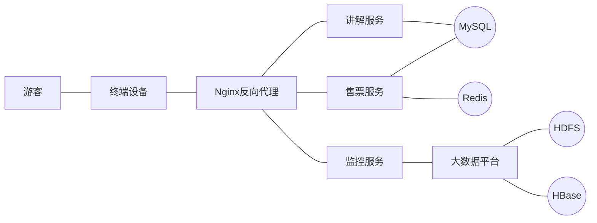

# 基于springboot的冕宁灵山寺庙景点系统

作者：禅与计算机程序设计艺术

## 1. 背景介绍

### 1.1 项目背景
冕宁县位于四川省西南部,属凉山彝族自治州,境内分布有多处著名的佛教寺庙景点,其中灵山寺最为著名。随着旅游业的蓬勃发展,传统的人工售票、讲解等方式已经无法满足日益增长的游客需求。为了提升景区的服务质量,提高游客满意度,迫切需要开发一套智慧化的景点管理系统。

### 1.2 开发技术选型
本项目基于Java语言,采用当前主流的SpringBoot框架进行开发。数据库选用MySQL,前端页面使用Vue.js,后台管理系统采用Element UI。同时会使用到人脸识别、大数据分析、电子地图等多项前沿技术,力争打造一个功能完善、易用性强的现代化景区管理系统。

## 2. 核心概念与关联

### 2.1 SpringBoot框架
SpringBoot是目前Java Web开发领域最流行的微服务框架之一。它基于"约定优于配置"的理念,内嵌Tomcat等Web服务器,采用starter机制简化依赖配置,可以实现快速开发、便捷部署。通过集成Spring家族的其他项目如Spring MVC、Spring Data JPA等,SpringBoot提供了完善的全栈开发支持。

### 2.2 微服务架构
微服务是一种架构风格,它将单一应用程序划分为一组小的服务,每个服务运行在其独立的进程中,服务间互相协调、互相配合,为用户提供最终价值。本项目将采用微服务架构,将各业务模块拆分为独立的服务,如售票服务、讲解服务、监控服务等,实现服务的解耦合和容错。

### 2.3 人脸识别技术
人脸识别是基于人的脸部特征信息进行身份识别的一种生物识别技术。通过摄像头采集人脸图像,运用人工智能算法如深度学习等,可以快速准确地识别游客身份。本项目将引入人脸识别技术,实现会员游客的自助验票、寻人等智能化服务。

### 2.4 大数据分析
景区每天会产生海量的结构化和非结构化数据,如游客量、消费金额、舆情信息等。运用大数据技术,可以对这些数据进行采集、清洗、分析,洞察游客行为特征,优化景区运营。本项目将引入Hadoop、Spark等大数据框架,搭建数据仓库和数据集市,为管理决策提供数据支持。

## 3. 核心算法原理与具体步骤 

### 3.1 人脸检测
人脸检测是人脸识别的前置步骤,目的是从图像中定位出人脸的位置。常用的算法有Haar特征分类器、HOG特征+SVM分类器等。以Haar算法为例,具体步骤如下:
1. 准备训练数据,包含大量的正样本(含人脸)和负样本(不含人脸)图像
2. 在样本图像上提取Haar特征,生成特征向量
3. 使用AdaBoost算法进行分类器训练,获得一系列弱分类器 
4. 将弱分类器级联,形成强分类器
5. 使用滑动窗口对新图像进行多尺度扫描,通过强分类器判断是否为人脸

### 3.2 人脸识别
在人脸检测的基础上,人脸识别需要提取人脸的身份特征,常用的算法有Eigenface、Fisherface、LBPH等。以LBPH为例,步骤如下:
1. 将检测到的人脸图像划分为若干个小单元
2. 对每个单元计算LBP(局部二值模式)特征,生成直方图
3. 将所有单元的直方图合并为一个特征向量
4. 将待识别人脸的特征向量与已知身份的特征向量进行比对,如欧氏距离等
5. 取距离最小的已知身份作为识别结果

### 3.3 大数据分析
大数据分析是一个涉及数据采集、存储、处理、分析、可视化等多个环节的复杂过程。以游客行为分析为例,具体步骤如下:
1. 数据采集:通过埋点、日志、IoT等方式采集各环节的用户数据
2. 数据预处理:对原始数据进行清洗、转换、集成,去除缺失值、异常值等
3. 数据存储:将结构化数据存入数据仓库,非结构化数据存入HDFS等
4. 数据分析:使用Spark SQL、机器学习算法等对数据进行探索性分析和预测性分析
5. 数据可视化:使用Echarts、Tableau等工具将分析结果以图表的形式展现
6. 结果应用:根据分析结果对游客进行个性化推荐,改进景区服务等

## 4. 数学模型与公式详解

### 4.1 Haar特征
Haar特征反映了图像的灰度变化,常见的有三类:边缘特征、线性特征、中心特征。特征值为黑白矩形像素和之差,公式为:

$f(x)=\sum\limits_{i\in \text{white}}p_i - \sum\limits_{i\in \text{black}}p_i$

其中,$p_i$为像素灰度值。使用积分图可以快速计算任意尺度的特征值。

### 4.2 LBP特征
LBP特征反映了图像的纹理信息,对光照有很强的鲁棒性。以3x3窗口为例,LBP值的计算公式为:

$LBP(x_c,y_c)=\sum_{p=0}^{7} s(i_p-i_c)2^p$

其中,$i_c$为中心像素灰度值,$i_p$为邻域像素灰度值,$s$为阈值函数:

$
s(x)=\begin{cases} 
1, & x\geq0 \\
0, & x<0
\end{cases}
$

将LBP值映射到直方图中,可以得到图像的特征向量。

### 4.3 SVM分类器
SVM分类器是一种二分类模型,其基本思想是在特征空间中寻找一个最优超平面,使得两类样本能够被超平面所分割。分类决策函数为:

$f(x)=sign(\omega^Tx+b)$

其中,$\omega$为超平面法向量,$b$为截距。要求$\omega,b$使得训练集满足:

$y_i(\omega^Tx_i+b)\geq 1$ 

同时,最大化分类间隔 $\frac{2}{||\omega||}$,这就转化为一个凸二次规划问题。引入拉格朗日乘子可得对偶问题:

$\max\limits_\alpha \sum\limits_{i=1}^N\alpha_i-\frac{1}{2}\sum\limits_{i,j=1}^Ny_iy_j\alpha_i\alpha_j(x_i \cdot x_j)\\
s.t. \ \  \alpha_i\geq0, \sum\limits_{i=1}^Ny_i\alpha_i$
 
求解出$\alpha$后,取$\alpha>0$的样本作为支持向量,代入即可得到$\omega$和$b$。

## 5. 项目实践

### 5.1 系统架构设计


### 5.2 SpringBoot项目搭建
1. 创建Maven项目,添加SpringBoot和其他依赖:
```xml
<parent>
    <groupId>org.springframework.boot</groupId>
    <artifactId>spring-boot-starter-parent</artifactId>
    <version>2.5.5</version>
</parent>

<dependencies>
    <dependency>
        <groupId>org.springframework.boot</groupId>
        <artifactId>spring-boot-starter-web</artifactId>
    </dependency>
    <dependency>
        <groupId>org.springframework.boot</groupId>
        <artifactId>spring-boot-starter-data-jpa</artifactId>
    </dependency>
    <dependency>
        <groupId>mysql</groupId>
        <artifactId>mysql-connector-java</artifactId>
        <scope>runtime</scope>
    </dependency>
    <dependency>
        <groupId>org.projectlombok</groupId>
        <artifactId>lombok</artifactId>
        <optional>true</optional>
    </dependency>
</dependencies>
```

2. 编写各层代码: Controller、Service、Repository等
如控制器:
```java
@RestController
@RequestMapping("/api/ticket")
public class TicketController {

    @Autowired
    private TicketService ticketService;
    
    @PostMapping("/buy")
    public Result buy(@RequestBody TicketBuyRequest request) {
        boolean ret = ticketService.buyTicket(request);
        return Result.success(ret);
    }
    
    @GetMapping("/{id}")
    public Result getTicketById(@PathVariable Long id) {
        Ticket ticket = ticketService.getTicketById(id);
        return Result.success(ticket);
    }
}
```

3. 配置数据源、日志等:
```yml
spring:
  datasource:
    driver-class-name: com.mysql.cj.jdbc.Driver
    url: jdbc:mysql://localhost:3306/temple?useUnicode=true&characterEncoding=utf8
    username: root 
    password: 123456
  jpa:
    hibernate:
      ddl-auto: update
    show-sql: true

logging:
  level:
    root: info
    org.springframework.web: info
```

### 5.3 人脸识别实现
可以使用OpenCV等开源库,调用其训练好的人脸检测和识别模型,如:
```java
// 初始化人脸识别器
FaceRecognizer recognizer = LBPHFaceRecognizer.create();
// 加载已训练的模型
recognizer.read("model.xml");

// 读取待识别图片
Mat image = Imgcodecs.imread("test.jpg");
// 转换为灰度图
Mat gray = new Mat();
Imgproc.cvtColor(image, gray, Imgproc.COLOR_BGR2GRAY);
// 直方图均衡化
Imgproc.equalizeHist(gray, gray);

// 人脸检测
MatOfRect faces = new MatOfRect();
faceCascade.detectMultiScale(gray, faces);

// 对每一个检测到的人脸进行识别
for (Rect rect : faces.toArray()) {
    Mat face = new Mat(gray, rect);
    // 调用识别器进行预测
    int label = recognizer.predict_label(face);
    double confidence = recognizer.predict_confidence(face);
    // 根据置信度阈值判断是否识别成功
    if (confidence < 60) {
        System.out.println("识别结果:" + label + ",置信度:" + confidence);
    } else {
        System.out.println("识别失败");
    }
}
```

### 5.4 大数据分析实现
使用Spark对HDFS中的数据进行分析,如:
```scala
// 创建Spark会话
val spark = SparkSession.builder()
  .appName("TempleAnalysis")
  .master("local[*]")
  .getOrCreate()

// 从HDFS加载数据  
val data = spark.read.parquet("/user/data/temple/pv.parquet")
data.createOrReplaceTempView("pv")

// 按日期统计PV
val pvByDay = spark.sql("SELECT day, COUNT(*) AS pv FROM pv GROUP BY day ORDER BY day") 
pvByDay.show()

// 统计热门景点
val hotSpot = spark.sql("SELECT spot, COUNT(*) AS times FROM pv GROUP BY spot ORDER BY times DESC LIMIT 10")  
hotSpot.show()

// 统计游客年龄分布
val ageDistribute = spark.sql(
  """
    |SELECT 
    | CASE 
    |   WHEN age < 20 THEN '20以下'
    |   WHEN age >= 20 AND age < 30 THEN '20-29岁'  
    |   WHEN age >= 30 AND age < 40 THEN '30-39岁'
    |   WHEN age >= 40 AND age < 50 THEN '40-49岁'
    |   WHEN age >= 50 AND age < 60 THEN '50-59岁'
    |   ELSE '60岁以上'
    | END AS ageRange,
    | COUNT(*) AS num
    |FROM pv
    |GROUP BY ageRange
    |ORDER BY num DESC
  """.stripMargin)
ageDistribute.show()

// 将分析结果写回HDFS
pvByDay.write.csv("/user/data/temple/pvByDay.csv")
```

## 6. 实际应用场景

本项目开发的智慧景区系统可应用于以下场景:

1. 售票管理:通过网上预约、移动支付等方式实现门票销售,并与入园验票系统联动,方便游客快速入园。

2. 语音讲解:游客可