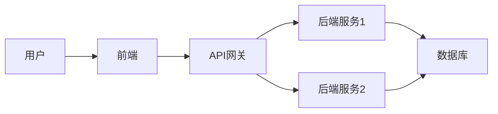
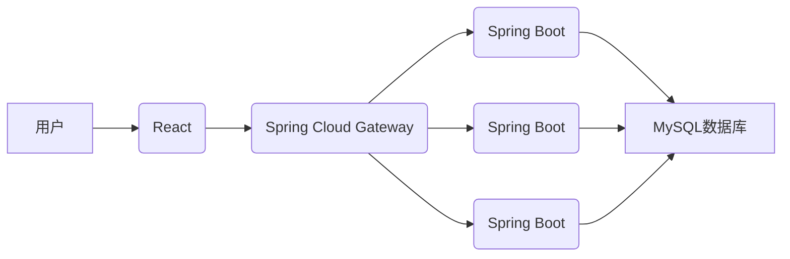
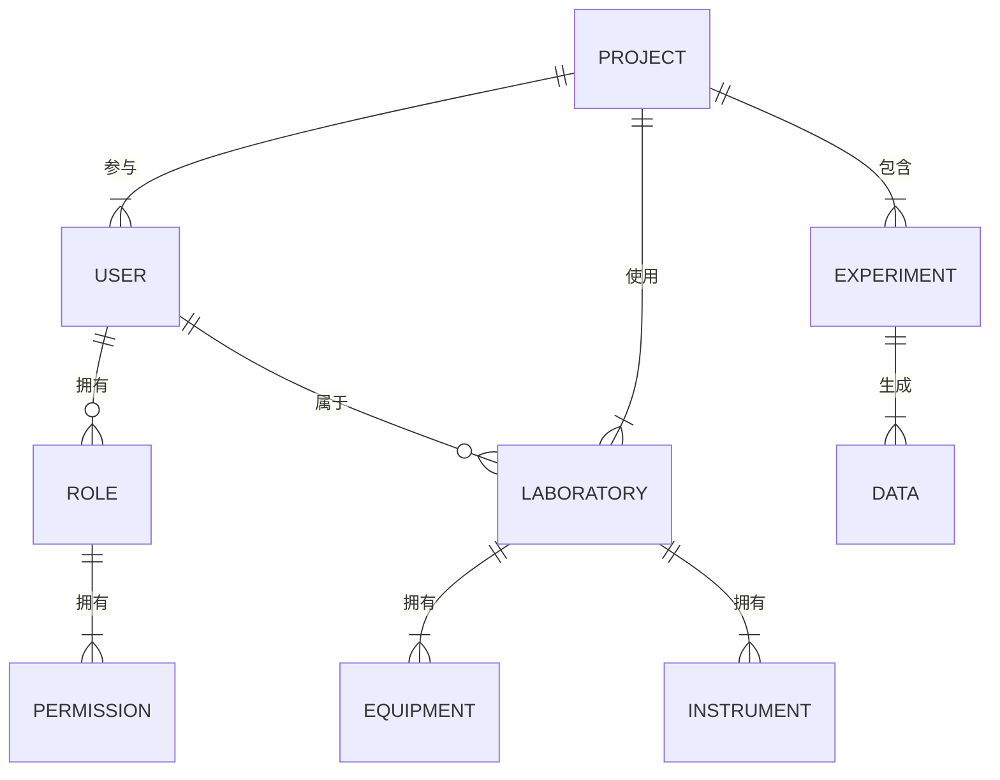

## 基于Spring Boot的前后端分离实验室管理系统

作者：禅与计算机程序设计艺术


## 1. 引言：迈向智能实验室管理的新时代

### 1.1  传统实验室管理的困境
传统的实验室管理模式往往依赖于纸质记录、人工统计和线下沟通，存在着效率低下、数据易丢失、信息不透明等弊端。随着信息技术的飞速发展，实验室管理迫切需要一种更加智能化、便捷化的解决方案。

### 1.2 前后端分离架构的优势
前后端分离架构作为一种现代化的Web应用程序开发模式，将前端开发和后端开发分离，使得开发人员可以专注于各自的领域，提高了开发效率和代码质量。同时，前后端分离架构也更易于维护和扩展，可以更好地适应未来实验室管理系统的需求变化。

### 1.3 Spring Boot框架的优势
Spring Boot是一个基于Spring框架的快速开发框架，它简化了Spring应用程序的创建和配置过程，并提供了一系列开箱即用的功能，例如自动配置、嵌入式Web服务器等，可以帮助开发者快速构建高效、可靠的Web应用程序。

## 2. 核心概念与联系

### 2.1 前后端分离架构

#### 2.1.1  概念解析
前后端分离架构是一种将Web应用程序的前端（用户界面）和后端（业务逻辑和数据处理）分离的开发模式。前端通过API与后端进行通信，获取数据和执行操作。

#### 2.1.2  架构图解



#### 2.1.3  优点分析

* **提高开发效率:** 前后端开发人员可以并行工作，缩短开发周期。
* **提高代码质量:** 前后端代码分离，更容易维护和测试。
* **提高可扩展性:** 可以方便地添加新的功能和服务。

### 2.2 Spring Boot框架

#### 2.2.1  概念解析
Spring Boot是基于Spring框架的快速开发框架，它简化了Spring应用程序的创建和配置过程，提供自动配置、嵌入式Web服务器等功能。

#### 2.2.2  核心组件

* **Spring Core:** 提供依赖注入、控制反转等核心功能。
* **Spring MVC:** 提供Web开发框架，处理HTTP请求和响应。
* **Spring Data:** 提供数据访问层，简化数据库操作。
* **Spring Security:** 提供安全框架，保护应用程序免受攻击。

#### 2.2.3  优点分析

* **快速开发:** 简化配置，提供开箱即用功能。
* **易于部署:** 内嵌Web服务器，可以直接运行。
* **易于测试:** 提供测试框架，方便进行单元测试和集成测试。

### 2.3 实验室管理系统

#### 2.3.1  系统概述
实验室管理系统是一个用于管理实验室资源、实验项目、实验数据的软件系统。

#### 2.3.2  主要功能模块

* **用户管理:** 管理用户信息，包括权限控制。
* **实验室管理:** 管理实验室信息，包括设备、仪器等。
* **实验项目管理:** 管理实验项目信息，包括项目进度、实验数据等。
* **数据统计分析:** 对实验数据进行统计分析，生成报表。

## 3. 核心算法原理具体操作步骤

### 3.1  系统架构设计

#### 3.1.1 架构图



#### 3.1.2  模块划分

* **用户服务:** 负责用户管理，包括用户注册、登录、权限控制等。
* **实验室服务:** 负责实验室管理，包括实验室信息管理、设备管理、仪器管理等。
* **实验项目服务:** 负责实验项目管理，包括项目信息管理、实验数据管理、实验报告管理等。

### 3.2  数据库设计

#### 3.2.1  E-R图



#### 3.2.2  表结构设计

* **user表:** 存储用户信息，包括用户名、密码、姓名、邮箱等。
* **role表:** 存储角色信息，包括角色名称、角色描述等。
* **permission表:** 存储权限信息，包括权限名称、权限描述等。
* **user_role表:** 存储用户和角色的关联关系。
* **role_permission表:** 存储角色和权限的关联关系。
* **laboratory表:** 存储实验室信息，包括实验室名称、实验室地址、实验室负责人等。
* **equipment表:** 存储设备信息，包括设备名称、设备型号、设备参数等。
* **instrument表:** 存储仪器信息，包括仪器名称、仪器型号、仪器参数等。
* **project表:** 存储项目信息，包括项目名称、项目负责人、项目开始时间、项目结束时间等。
* **user_project表:** 存储用户和项目的关联关系。
* **laboratory_project表:** 存储实验室和项目的关联关系。
* **experiment表:** 存储实验信息，包括实验名称、实验目的、实验步骤、实验结果等。
* **data表:** 存储实验数据，包括数据类型、数据值、数据单位等。

## 4. 数学模型和公式详细讲解举例说明

本系统不涉及复杂的数学模型和算法。

## 5. 项目实践：代码实例和详细解释说明

### 5.1  开发环境搭建

#### 5.1.1  安装JDK

下载并安装Java Development Kit (JDK) 11或更高版本。

#### 5.1.2  安装Maven

下载并安装Maven 3.6.0或更高版本。

#### 5.1.3  安装MySQL

下载并安装MySQL 8.0.23或更高版本。

#### 5.1.4  安装IntelliJ IDEA

下载并安装IntelliJ IDEA Ultimate版本。

### 5.2  创建Spring Boot项目

#### 5.2.1  使用Spring Initializr创建项目

访问 https://start.spring.io/ ，选择项目构建工具为Maven，语言为Java，Spring Boot版本为2.7.1，添加以下依赖：

* Spring Web
* Spring Data JPA
* MySQL Driver
* Spring Security
* Spring Cloud Starter Gateway

#### 5.2.2  导入项目到IntelliJ IDEA

将创建的项目导入到IntelliJ IDEA中。

### 5.3  编写代码

#### 5.3.1  创建实体类

```java
// User.java
@Entity
@Table(name = "user")
public class User {

    @Id
    @GeneratedValue(strategy = GenerationType.IDENTITY)
    private Long id;

    @Column(nullable = false, unique = true)
    private String username;

    @Column(nullable = false)
    private String password;

    @Column(nullable = false)
    private String name;

    @Column(nullable = false)
    private String email;

    // ... getters and setters
}
```

#### 5.3.2  创建Repository接口

```java
// UserRepository.java
@Repository
public interface UserRepository extends JpaRepository<User, Long> {

    User findByUsername(String username);
}
```

#### 5.3.3  创建Service接口和实现类

```java
// UserService.java
public interface UserService {

    User createUser(User user);

    User getUserByUsername(String username);
}
```

```java
// UserServiceImpl.java
@Service
public class UserServiceImpl implements UserService {

    @Autowired
    private UserRepository userRepository;

    @Override
    public User createUser(User user) {
        return userRepository.save(user);
    }

    @Override
    public User getUserByUsername(String username) {
        return userRepository.findByUsername(username);
    }
}
```

#### 5.3.4  创建Controller类

```java
// UserController.java
@RestController
@RequestMapping("/api/users")
public class UserController {

    @Autowired
    private UserService userService;

    @PostMapping
    public User createUser(@RequestBody User user) {
        return userService.createUser(user);
    }

    @GetMapping("/{username}")
    public User getUserByUsername(@PathVariable String username) {
        return userService.getUserByUsername(username);
    }
}
```

#### 5.3.5  配置Spring Security

```java
// SecurityConfig.java
@Configuration
@EnableWebSecurity
public class SecurityConfig extends WebSecurityConfigurerAdapter {

    @Autowired
    private UserDetailsService userDetailsService;

    @Override
    protected void configure(AuthenticationManagerBuilder auth) throws Exception {
        auth.userDetailsService(userDetailsService).passwordEncoder(passwordEncoder());
    }

    @Override
    protected void configure(HttpSecurity http) throws Exception {
        http.authorizeRequests()
                .antMatchers("/api/users").permitAll()
                .anyRequest().authenticated()
                .and()
                .httpBasic();
    }

    @Bean
    public PasswordEncoder passwordEncoder() {
        return new BCryptPasswordEncoder();
    }
}
```

#### 5.3.6  配置Spring Cloud Gateway

```yaml
# application.yml
spring:
  cloud:
    gateway:
      routes:
        - id: user-service
          uri: http://localhost:8081
          predicates:
            - Path=/api/users/**
```

### 5.4  运行项目

#### 5.4.1  启动Spring Boot应用程序

在IntelliJ IDEA中运行主类Application.java。

#### 5.4.2  访问API

使用Postman或浏览器访问API：

* `POST http://localhost:8080/api/users`：创建用户
* `GET http://localhost:8080/api/users/{username}`：获取用户信息

## 6. 实际应用场景

* 高校实验室管理
* 企业研发实验室管理
* 医疗机构实验室管理

## 7. 工具和资源推荐

* **Spring Boot官方文档:** https://spring.io/projects/spring-boot
* **Spring Cloud Gateway官方文档:** https://spring.io/projects/spring-cloud-gateway
* **React官方文档:** https://reactjs.org/
* **MySQL官方文档:** https://dev.mysql.com/doc/

## 8. 总结：未来发展趋势与挑战

### 8.1  未来发展趋势

* **云原生化:** 将实验室管理系统部署到云平台，实现弹性扩展、高可用性等。
* **人工智能化:** 利用人工智能技术，实现实验数据自动分析、实验结果预测等。
* **物联网化:** 将实验室设备接入物联网，实现设备状态监控、远程控制等。

### 8.2  挑战

* **数据安全:** 实验室数据敏感性高，需要采取严格的安全措施保护数据安全。
* **系统集成:** 实验室管理系统需要与其他系统进行集成，例如财务系统、人事系统等。
* **用户体验:** 实验室管理系统的用户体验至关重要，需要设计简洁易用的界面，提供完善的功能。


## 9. 附录：常见问题与解答

### 9.1  如何解决跨域问题？

在Spring Boot应用程序中添加以下配置：

```java
@Configuration
public class CorsConfig implements WebMvcConfigurer {

    @Override
    public void addCorsMappings(CorsRegistry registry) {
        registry.addMapping("/**")
                .allowedOrigins("*")
                .allowedMethods("GET", "POST", "PUT", "DELETE")
                .allowedHeaders("*");
    }
}
```

### 9.2  如何进行单元测试？

使用JUnit或Mockito等测试框架进行单元测试。例如：

```java
@SpringBootTest
class UserServiceTest {

    @Autowired
    private UserService userService;

    @Test
    void createUser() {
        User user = new User();
        user.setUsername("testuser");
        user.setPassword("password");
        user.setName("Test User");
        user.setEmail("testuser@example.com");

        User createdUser = userService.createUser(user);

        assertNotNull(createdUser.getId());
        assertEquals("testuser", createdUser.getUsername());
    }
}
```

### 9.3  如何进行性能优化？

* 使用缓存技术，例如Redis，缓存常用的数据。
* 使用数据库索引，提高查询效率。
* 使用异步处理，提高系统吞吐量。

##  结束语

本文详细介绍了基于Spring Boot的前后端分离实验室管理系统的开发过程，包括系统架构设计、数据库设计、代码实现、实际应用场景、工具和资源推荐、未来发展趋势与挑战等方面。希望本文能够为实验室管理系统的开发提供一些参考和帮助。