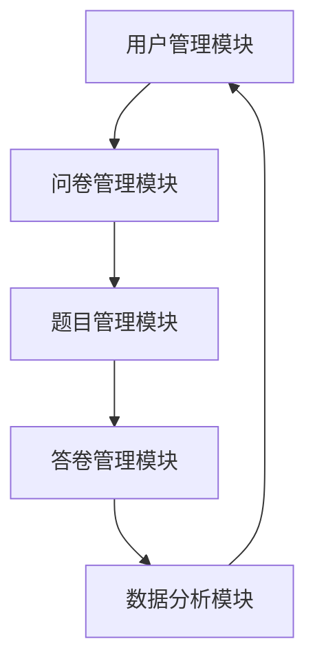

# 基于Spring Boot的问卷调查系统

作者：禅与计算机程序设计艺术

## 1.背景介绍

### 1.1 问卷调查系统的重要性

问卷调查系统在现代社会中扮演着重要角色，它们被广泛应用于市场研究、客户反馈、员工满意度调查等多个领域。一个高效的问卷调查系统不仅能够帮助企业和组织收集宝贵的数据，还能通过分析这些数据来做出明智的决策。

### 1.2 Spring Boot概述

Spring Boot是一个基于Spring框架的快速开发框架，旨在简化Spring应用的开发过程。它通过提供默认配置和自动化配置，使开发者能够专注于业务逻辑的实现，而无需担心繁琐的配置细节。Spring Boot的优点包括快速启动、自动配置、内嵌服务器、简化的依赖管理等。

### 1.3 本文目的

本文旨在通过一个具体的项目实例，详细讲解如何使用Spring Boot构建一个功能完善的问卷调查系统。我们将从系统的核心概念、算法原理、数学模型、代码实例、实际应用场景、工具和资源推荐等多个方面进行深入探讨，帮助读者全面了解和掌握基于Spring Boot的问卷调查系统的开发方法。

## 2.核心概念与联系

### 2.1 问卷调查系统的基本组成

一个完整的问卷调查系统通常包括以下几个核心模块：

- **用户管理模块**：负责用户的注册、登录、权限管理等功能。
- **问卷管理模块**：负责问卷的创建、编辑、发布、删除等功能。
- **题目管理模块**：负责问卷题目的添加、编辑、删除等功能。
- **答卷管理模块**：负责用户答卷的提交、存储、分析等功能。
- **数据分析模块**：负责对收集到的问卷数据进行统计分析，并生成报告。

### 2.2 Spring Boot与问卷调查系统的契合点

Spring Boot的快速开发特性非常适合构建问卷调查系统。通过Spring Boot，我们可以快速搭建一个高效、稳定的后端服务，支持问卷调查系统的各项功能。此外，Spring Boot强大的生态系统（如Spring Data JPA、Spring Security等）可以帮助我们简化数据库操作、增强系统安全性，从而提高开发效率和系统质量。

### 2.3 系统架构设计

为了更好地理解和实现基于Spring Boot的问卷调查系统，我们需要首先设计系统的整体架构。以下是系统的基本架构图：

## 3.核心算法原理具体操作步骤

### 3.1 用户管理模块

用户管理模块是问卷调查系统的基础模块，负责用户的注册、登录、权限管理等功能。其核心算法包括用户注册算法、用户登录算法、权限验证算法等。

#### 3.1.1 用户注册算法

用户注册算法主要包括以下步骤：

1. **输入校验**：校验用户输入的注册信息是否合法（如用户名是否已存在、密码是否符合要求等）。
2. **密码加密**：使用安全的加密算法对用户密码进行加密存储。
3. **数据存储**：将用户信息存储到数据库中。

#### 3.1.2 用户登录算法

用户登录算法主要包括以下步骤：

1. **输入校验**：校验用户输入的登录信息是否合法（如用户名是否存在、密码是否正确等）。
2. **密码验证**：使用加密算法验证用户输入的密码是否正确。
3. **生成Token**：如果登录成功，生成一个唯一的Token，用于后续的身份验证。

#### 3.1.3 权限验证算法

权限验证算法主要包括以下步骤：

1. **Token解析**：解析用户请求中的Token，获取用户身份信息。
2. **权限校验**：根据用户身份信息，校验用户是否具有访问某个资源的权限。

### 3.2 问卷管理模块

问卷管理模块负责问卷的创建、编辑、发布、删除等功能。其核心算法包括问卷创建算法、问卷编辑算法、问卷发布算法、问卷删除算法等。

#### 3.2.1 问卷创建算法

问卷创建算法主要包括以下步骤：

1. **输入校验**：校验用户输入的问卷信息是否合法（如问卷标题是否为空、问卷描述是否符合要求等）。
2. **数据存储**：将问卷信息存储到数据库中。

#### 3.2.2 问卷编辑算法

问卷编辑算法主要包括以下步骤：

1. **输入校验**：校验用户输入的问卷信息是否合法（如问卷标题是否为空、问卷描述是否符合要求等）。
2. **数据更新**：将问卷信息更新到数据库中。

#### 3.2.3 问卷发布算法

问卷发布算法主要包括以下步骤：

1. **状态校验**：校验问卷是否处于可发布状态（如问卷是否已完成编辑）。
2. **状态更新**：将问卷状态更新为已发布。

#### 3.2.4 问卷删除算法

问卷删除算法主要包括以下步骤：

1. **权限校验**：校验用户是否具有删除问卷的权限。
2. **数据删除**：将问卷信息从数据库中删除。

### 3.3 题目管理模块

题目管理模块负责问卷题目的添加、编辑、删除等功能。其核心算法包括题目添加算法、题目编辑算法、题目删除算法等。

#### 3.3.1 题目添加算法

题目添加算法主要包括以下步骤：

1. **输入校验**：校验用户输入的题目信息是否合法（如题目内容是否为空、题目类型是否符合要求等）。
2. **数据存储**：将题目信息存储到数据库中。

#### 3.3.2 题目编辑算法

题目编辑算法主要包括以下步骤：

1. **输入校验**：校验用户输入的题目信息是否合法（如题目内容是否为空、题目类型是否符合要求等）。
2. **数据更新**：将题目信息更新到数据库中。

#### 3.3.3 题目删除算法

题目删除算法主要包括以下步骤：

1. **权限校验**：校验用户是否具有删除题目的权限。
2. **数据删除**：将题目信息从数据库中删除。

### 3.4 答卷管理模块

答卷管理模块负责用户答卷的提交、存储、分析等功能。其核心算法包括答卷提交算法、答卷存储算法、答卷分析算法等。

#### 3.4.1 答卷提交算法

答卷提交算法主要包括以下步骤：

1. **输入校验**：校验用户输入的答卷信息是否合法（如答卷是否完整、答案是否符合要求等）。
2. **数据存储**：将答卷信息存储到数据库中。

#### 3.4.2 答卷存储算法

答卷存储算法主要包括以下步骤：

1. **数据格式化**：将答卷信息格式化为数据库可存储的格式。
2. **数据存储**：将格式化后的答卷信息存储到数据库中。

#### 3.4.3 答卷分析算法

答卷分析算法主要包括以下步骤：

1. **数据提取**：从数据库中提取答卷信息。
2. **数据统计**：对提取到的答卷信息进行统计分析（如计算各题目的选择分布、计算答卷的完成率等）。
3. **数据展示**：将统计分析结果以图表等形式展示给用户。

### 3.5 数据分析模块

数据分析模块负责对收集到的问卷数据进行统计分析，并生成报告。其核心算法包括数据提取算法、数据清洗算法、数据统计算法、数据可视化算法等。

#### 3.5.1 数据提取算法

数据提取算法主要包括以下步骤：

1. **数据查询**：从数据库中查询需要分析的数据。
2. **数据过滤**：根据分析需求，对查询到的数据进行过滤。

#### 3.5.2 数据清洗算法

数据清洗算法主要包括以下步骤：

1. **数据格式化**：将提取到的数据格式化为分析工具可处理的格式。
2. **数据去重**：去除重复的数据记录。
3. **数据修正**：修正数据中的错误和异常值。

#### 3.5.3 数据统计算法

数据统计算法主要包括以下步骤：

1. **数据分组**：根据分析需求，对数据进行分组。
2. **数据汇总**：对分组后的数据进行汇总统计（如计算平均值、最大值