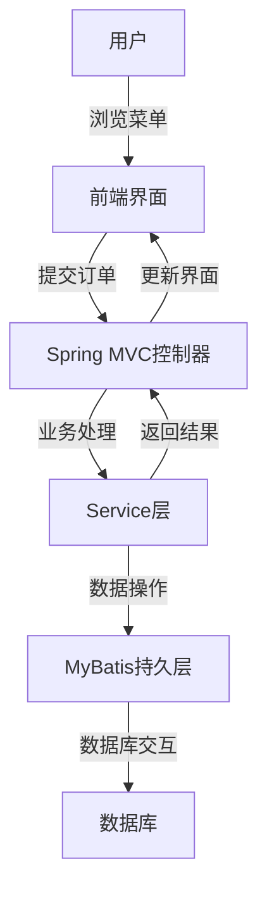

# 基于SSM的在线点餐系统

作者：禅与计算机程序设计艺术

## 1. 背景介绍

### 1.1 互联网与餐饮行业的融合

随着互联网技术的快速发展，传统餐饮行业正在经历一场深刻的变革。在线点餐系统的出现不仅提高了餐饮企业的运营效率，还为消费者提供了更加便捷的服务。在线点餐系统通过互联网连接餐厅与消费者，实现了点餐、支付、配送等全流程的数字化管理。

### 1.2 SSM框架概述

SSM（Spring、Spring MVC、MyBatis）框架是目前Java Web开发中非常流行的一种组合。它将Spring的依赖注入和面向切面编程、Spring MVC的模型视图控制器模式以及MyBatis的持久层框架有机结合在一起，提供了一整套解决方案，适用于开发高效、稳定、可维护的Web应用。

### 1.3 在线点餐系统的需求分析

一个典型的在线点餐系统需要满足以下需求：
- 用户注册与登录
- 餐厅信息展示
- 菜单展示与点餐
- 订单管理与支付
- 订单状态跟踪
- 后台管理系统

## 2. 核心概念与联系

### 2.1 Spring框架

Spring是一个开源的Java平台，提供了全面的基础设施支持，帮助开发者构建复杂的应用。Spring的核心特性包括依赖注入、面向切面编程、事务管理等。

### 2.2 Spring MVC

Spring MVC是Spring框架的一部分，专注于Web应用的开发。它采用了模型-视图-控制器（MVC）设计模式，帮助开发者将应用的业务逻辑与用户界面分离。

### 2.3 MyBatis

MyBatis是一个优秀的持久层框架，简化了数据库访问代码。与传统的JDBC相比，MyBatis通过XML或注解的方式将SQL语句与Java对象映射起来，使得数据库操作更加简洁、易维护。

### 2.4 在线点餐系统的架构设计

在线点餐系统采用SSM框架，整体架构如下：



## 3. 核心算法原理具体操作步骤

### 3.1 用户注册与登录

用户注册与登录是在线点餐系统的基础功能。主要步骤如下：

1. 用户在注册页面输入用户名、密码等信息。
2. 前端将用户信息发送到Spring MVC控制器。
3. 控制器调用Service层进行业务处理，包括数据校验和加密。
4. Service层调用MyBatis持久层，将用户信息存入数据库。
5. 返回注册结果给前端。

### 3.2 菜单展示与点餐

菜单展示与点餐是系统的核心功能。主要步骤如下：

1. 用户在菜单页面浏览菜品信息。
2. 前端将用户选择的菜品信息发送到Spring MVC控制器。
3. 控制器调用Service层进行业务处理，包括库存检查和价格计算。
4. Service层调用MyBatis持久层，生成订单并存入数据库。
5. 返回订单结果给前端。

### 3.3 订单管理与支付

订单管理与支付功能确保用户能够顺利完成交易。主要步骤如下：

1. 用户在订单页面查看订单详情。
2. 前端将支付请求发送到Spring MVC控制器。
3. 控制器调用Service层进行业务处理，包括支付验证和订单状态更新。
4. Service层调用MyBatis持久层，更新订单状态。
5. 返回支付结果给前端。

## 4. 数学模型和公式详细讲解举例说明

### 4.1 用户注册与登录的数学模型

用户注册与登录可以抽象为一个认证模型：

$$
Auth(U, P) = \begin{cases} 
1 & \text{if } U \in Users \text{ and } P = Users[U].password \\
0 & \text{otherwise}
\end{cases}
$$

其中，$U$ 表示用户名，$P$ 表示密码，$Users$ 是一个包含所有用户信息的集合。

### 4.2 订单价格计算公式

订单价格计算公式如下：

$$
Total = \sum_{i=1}^{n} (Price_i \times Quantity_i) + Tax + DeliveryFee
$$

其中，$Price_i$ 表示第 $i$ 个菜品的单价，$Quantity_i$ 表示第 $i$ 个菜品的数量，$Tax$ 表示税费，$DeliveryFee$ 表示配送费。

### 4.3 库存检查公式

库存检查公式如下：

$$
StockCheck = \begin{cases} 
1 & \text{if } \forall i, Quantity_i \leq Stock_i \\
0 & \text{otherwise}
\end{cases}
$$

其中，$Stock_i$ 表示第 $i$ 个菜品的库存量。

## 5. 项目实践：代码实例和详细解释说明

### 5.1 用户注册与登录

#### 5.1.1 前端代码

```html
<form id="registerForm">
  <input type="text" id="username" name="username" placeholder="用户名">
  <input type="password" id="password" name="password" placeholder="密码">
  <button type="button" onclick="register()">注册</button>
</form>

<script>
function register() {
  var username = document.getElementById('username').value;
  var password = document.getElementById('password').value;
  fetch('/register', {
    method: 'POST',
    headers: {
      'Content-Type': 'application/json'
    },
    body: JSON.stringify({ username: username, password: password })
  }).then(response => response.json())
    .then(data => {
      if (data.success) {
        alert('注册成功');
      } else {
        alert('注册失败');
      }
    });
}
</script>
```

#### 5.1.2 后端代码

```java
@RestController
@RequestMapping("/register")
public class RegisterController {

    @Autowired
    private UserService userService;

    @PostMapping
    public ResponseEntity<?> register(@RequestBody User user) {
        boolean success = userService.register(user);
        if (success) {
            return ResponseEntity.ok(new ApiResponse(true, "注册成功"));
        } else {
            return ResponseEntity.status(HttpStatus.BAD_REQUEST).body(new ApiResponse(false, "注册失败"));
        }
    }
}

@Service
public class UserService {

    @Autowired
    private UserMapper userMapper;

    public boolean register(User user) {
        if (userMapper.findByUsername(user.getUsername()) != null) {
            return false;
        }
        user.setPassword(encryptPassword(user.getPassword()));
        userMapper.insert(user);
        return true;
    }

    private String encryptPassword(String password) {
        // 密码加密逻辑
        return DigestUtils.md5DigestAsHex(password.getBytes());
    }
}

@Mapper
public interface UserMapper {
    User findByUsername(String username);
    void insert(User user);
}
```

### 5.2 菜单展示与点餐

#### 5.2.1 前端代码

```html
<div id="menu">
  <!-- 菜单项 -->
</div>
<button type="button" onclick="placeOrder()">下单</button>

<script>
function placeOrder() {
  var orderItems = getOrderItems(); // 获取用户选择的菜品信息
  fetch('/order', {
    method: 'POST',
    headers: {
      'Content-Type': 'application/json'
    },
    body: JSON.stringify({ items: orderItems })
  }).then(response => response.json())
    .then(data => {
      if (data.success) {
        alert('下单成功');
      } else {
        alert('下单失败');
      }
    });
}
</script>
```

#### 5.2.2 后端代码

```java
@RestController
@RequestMapping("/order")
public class OrderController {

    @Autowired
    private OrderService orderService;

    @PostMapping
    public ResponseEntity<?> placeOrder(@RequestBody OrderRequest orderRequest) {
        boolean success = orderService.placeOrder(orderRequest);
        if (success) {
            return ResponseEntity.ok(new ApiResponse(true, "下单成功"));
        } else {
            return ResponseEntity.status(HttpStatus.BAD_REQUEST).body(new ApiResponse(false, "下单失败"));
        }
    }
}

@Service
public class OrderService {

    @Autowired
    private OrderMapper orderMapper;
    @Autowired
    private MenuMapper menuMapper;

    public boolean placeOrder(OrderRequest orderRequest) {
        // 库存检查
        for (OrderItem item : orderRequest.getItems()) {
            Menu menu = menuMapper.findById(item.getMenuId());
            if (menu