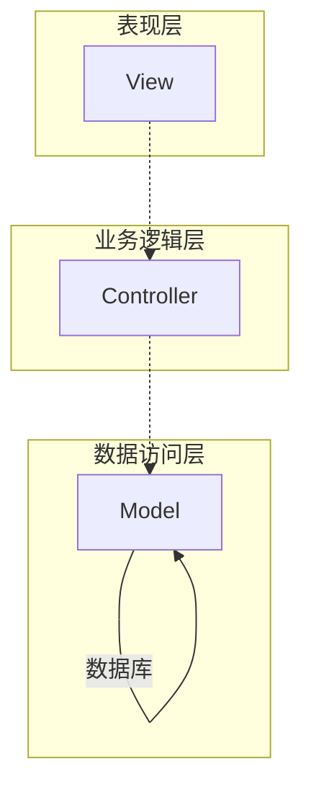
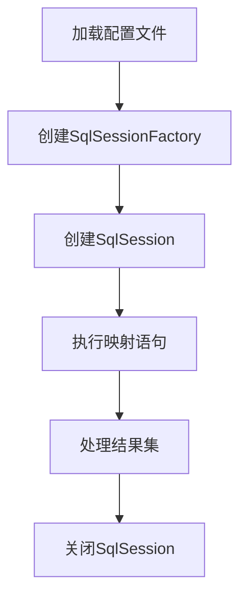

# 基于SSM的文物管理系统

## 1. 背景介绍

### 1.1 文物管理的重要性

文物是人类宝贵的历史和文化遗产,承载着我们祖先的智慧和创造力。保护和管理文物不仅是为了珍视历史,更是为了让后代能够了解和学习前人的成就。然而,传统的文物管理方式存在诸多挑战,例如人工管理效率低下、数据存储分散、查询不便利等问题。因此,构建一个高效、系统化的文物管理系统势在必行。

### 1.2 文物管理系统的作用

文物管理系统的主要作用包括:

1. 集中存储和管理文物信息,提高管理效率
2. 实现文物数字化,方便查询和展示
3. 加强文物保护,防止流失和损坏
4. 促进文物研究和文化传承

### 1.3 基于SSM框架的优势

SSM(Spring+SpringMVC+MyBatis)是Java企业级开发的主流框架,具有以下优势:

- 轻量级、高效、模块化
- 代码简洁,开发效率高
- 社区活跃,文档和资源丰富
- 适合构建分层架构的Web应用

基于经典的SSM框架开发文物管理系统,可以充分利用其优势,构建一个高效、安全、可扩展的系统。

## 2. 核心概念与联系

### 2.1 系统架构

文物管理系统采用经典的三层架构,包括表现层(View)、业务逻辑层(Controller)和数据访问层(Model)。



- 表现层(View): 负责与用户交互,展示数据和接收用户操作
- 业务逻辑层(Controller): 处理业务逻辑,调用Model层完成数据操作
- 数据访问层(Model): 负责与数据库交互,执行增删改查操作

### 2.2 核心技术

SSM框架的核心技术包括:

- Spring: 提供依赖注入(DI)和面向切面编程(AOP)等功能
- SpringMVC: 基于MVC设计模式的Web框架,处理请求和响应
- MyBatis: 对象关系映射(ORM)框架,简化数据库操作

### 2.3 关系梳理

Spring作为核心容器,管理整个应用的Bean生命周期。SpringMVC负责接收和处理Web请求,调用相应的Controller方法。Controller通过自动注入的Service层对象执行业务逻辑,Service层又通过MyBatis操作数据库,完成数据持久化。这种分层设计有利于代码的复用和维护。

## 3. 核心算法原理具体操作步骤

### 3.1 MyBatis工作原理

MyBatis作为ORM框架,主要解决了以下两个问题:

1. 将Java对象与数据库表建立映射关系
2. 通过动态SQL构建查询语句

MyBatis的工作原理可以概括为以下几个步骤:

1. 加载配置文件,构建SqlSessionFactory
2. 通过SqlSessionFactory创建SqlSession对象
3. 通过SqlSession执行映射语句,完成数据库操作
4. 释放资源,关闭SqlSession



### 3.2 动态SQL

MyBatis的核心特性之一是动态SQL,它可以根据不同的条件动态构建SQL语句。这种机制极大地提高了代码的灵活性和可维护性。

动态SQL主要通过以下几个元素实现:

- `<if>`元素: 根据条件决定是否包含某部分SQL
- `<choose>`、`<when>`、`<otherwise>`元素: 相当于Java中的switch语句
- `<foreach>`元素: 迭代一个集合,构建IN条件或者批量插入数据
- `<bind>`元素: 给参数起个别名,方便后面引用

以下是一个动态查询的示例:

```xml
<select id="selectByCondition" resultType="com.example.Domain">
  SELECT * FROM table
  <where>
    <if test="name != null">
      AND name = #{name}
    </if>
    <if test="age != null">
      AND age = #{age}
    </if>
  </where>
</select>
```

## 4. 数学模型和公式详细讲解举例说明

在文物管理系统中,可能需要使用一些数学模型和公式来处理数据。以下是一些常见的场景和对应的数学模型:

### 4.1 文物价值评估模型

文物的价值通常取决于多个因素,如年代、材质、保存状况等。我们可以使用多元线性回归模型来评估文物的价值:

$$
\begin{aligned}
\text{价值} &= \beta_0 + \beta_1 \times \text{年代} + \beta_2 \times \text{材质} + \beta_3 \times \text{保存状况} + \cdots \\
&= \sum_{i=0}^n \beta_i \times x_i
\end{aligned}
$$

其中,$\beta_i$是每个特征的权重系数,通过对历史数据进行训练得到。$x_i$是每个特征的取值。

### 4.2 文物流失风险评估模型

文物流失风险也受多个因素影响,如保管措施、地理位置、社会环境等。我们可以使用逻辑回归模型来评估文物的流失风险:

$$
\begin{aligned}
\text{风险} &= \frac{1}{1 + e^{-z}} \\
z &= \beta_0 + \beta_1 \times \text{保管措施} + \beta_2 \times \text{地理位置} + \beta_3 \times \text{社会环境} + \cdots \\
&= \sum_{i=0}^n \beta_i \times x_i
\end{aligned}
$$

其中,$z$是线性组合,$\beta_i$是每个特征的权重系数,$x_i$是每个特征的取值。$\text{风险}$的取值范围是$[0, 1]$,值越大,风险越高。

### 4.3 文物修复优先级模型

对于需要修复的文物,我们可以根据其价值和损坏程度,确定修复的优先级。我们可以使用简单的加权模型:

$$
\text{优先级} = \alpha \times \text{价值} + (1 - \alpha) \times \text{损坏程度}
$$

其中,$\alpha$是价值的权重系数,$0 \le \alpha \le 1$。优先级越高,则越应该优先修复。

以上仅是一些示例,在实际应用中,我们需要根据具体情况选择合适的数学模型,并对模型进行训练和调优,以获得更准确的结果。

## 5. 项目实践:代码实例和详细解释说明

### 5.1 系统架构代码实现

下面是基于SSM框架实现文物管理系统的核心代码:

#### 5.1.1 Spring配置

```xml
<!-- applicationContext.xml -->
<?xml version="1.0" encoding="UTF-8"?>
<beans xmlns="http://www.springframework.org/schema/beans"
       xmlns:xsi="http://www.w3.org/2001/XMLSchema-instance"
       xmlns:context="http://www.springframework.org/schema/context"
       xsi:schemaLocation="http://www.springframework.org/schema/beans
        http://www.springframework.org/schema/beans/spring-beans.xsd
        http://www.springframework.org/schema/context
        http://www.springframework.org/schema/context/spring-context.xsd">

    <!-- 开启注解扫描 -->
    <context:component-scan base-package="com.example.relics"/>

    <!-- 导入其他配置文件 -->
    <import resource="spring-mybatis.xml"/>
</beans>
```

#### 5.1.2 SpringMVC配置

```xml
<!-- servlet-context.xml -->
<?xml version="1.0" encoding="UTF-8"?>
<beans xmlns="http://www.springframework.org/schema/beans"
       xmlns:xsi="http://www.w3.org/2001/XMLSchema-instance"
       xmlns:context="http://www.springframework.org/schema/context"
       xmlns:mvc="http://www.springframework.org/schema/mvc"
       xsi:schemaLocation="http://www.springframework.org/schema/beans
        http://www.springframework.org/schema/beans/spring-beans.xsd
        http://www.springframework.org/schema/context
        http://www.springframework.org/schema/context/spring-context.xsd
        http://www.springframework.org/schema/mvc
        http://www.springframework.org/schema/mvc/spring-mvc.xsd">

    <!-- 开启注解扫描 -->
    <context:component-scan base-package="com.example.relics"/>

    <!-- 配置视图解析器 -->
    <bean class="org.springframework.web.servlet.view.InternalResourceViewResolver">
        <property name="prefix" value="/WEB-INF/views/"/>
        <property name="suffix" value=".jsp"/>
    </bean>

    <!-- 开启MVC注解驱动 -->
    <mvc:annotation-driven/>
</beans>
```

#### 5.1.3 MyBatis配置

```xml
<!-- spring-mybatis.xml -->
<?xml version="1.0" encoding="UTF-8"?>
<beans xmlns="http://www.springframework.org/schema/beans"
       xmlns:xsi="http://www.w3.org/2001/XMLSchema-instance"
       xsi:schemaLocation="http://www.springframework.org/schema/beans
        http://www.springframework.org/schema/beans/spring-beans.xsd">

    <!-- 配置数据源 -->
    <bean id="dataSource" class="org.apache.commons.dbcp.BasicDataSource">
        <property name="driverClassName" value="com.mysql.jdbc.Driver"/>
        <property name="url" value="jdbc:mysql://localhost:3306/relics"/>
        <property name="username" value="root"/>
        <property name="password" value="password"/>
    </bean>

    <!-- 配置SqlSessionFactory -->
    <bean id="sqlSessionFactory" class="org.mybatis.spring.SqlSessionFactoryBean">
        <property name="dataSource" ref="dataSource"/>
        <property name="mapperLocations" value="classpath:com/example/relics/mapper/*.xml"/>
    </bean>

    <!-- 配置Mapper扫描 -->
    <bean class="org.mybatis.spring.mapper.MapperScannerConfigurer">
        <property name="basePackage" value="com.example.relics.mapper"/>
    </bean>
</beans>
```

上面的代码展示了如何配置Spring容器、SpringMVC和MyBatis,以及它们之间的集成。这为后续的业务逻辑实现奠定了基础。

### 5.2 业务逻辑代码实现

#### 5.2.1 实体类

```java
// Relic.java
public class Relic {
    private Long id;
    private String name;
    private String category;
    private Integer age;
    private String material;
    private String condition;
    private Double value;
    // 省略getter/setter方法
}
```

#### 5.2.2 Mapper接口

```java
// RelicMapper.java
@Mapper
public interface RelicMapper {
    List<Relic> selectAll();
    Relic selectById(Long id);
    int insert(Relic relic);
    int update(Relic relic);
    int delete(Long id);
}
```

#### 5.2.3 Mapper映射文件

```xml
<!-- RelicMapper.xml -->
<?xml version="1.0" encoding="UTF-8" ?>
<!DOCTYPE mapper PUBLIC "-//mybatis.org//DTD Mapper 3.0//EN" "http://mybatis.org/dtd/mybatis-3-mapper.dtd">
<mapper namespace="com.example.relics.mapper.RelicMapper">
    <resultMap id="RelicResultMap" type="com.example.relics.model.Relic">
        <id property="id" column="id"/>
        <result property="name" column="name"/>
        <result property="category" column="category"/>
        <result property="age" column="age"/>
        <result property="material" column="material"/>
        <result property="condition" column="condition"/>
        <result property="value" column="value"/>
    </resultMap>

    <select id="selectAll" resultMap="RelicResultMap">
        SELECT * FROM relics
    </select>

    <select id="selectById" parameterType="long" resultMap="RelicResultMap">
        SELECT * FROM relics WHERE id = #{id}
    </select>

    <insert id="insert" parameterType="com.example.relics.model.Relic">
        INSERT INTO relics (name, category, age, material, condition, value)
        VALUES (#{name}, #{category}, #{age}, #{material}, #{condition}, #{value})
    </insert>

    <update id="update" parameterType="com.example.relics.model.Relic">
        UPDATE relics
        SET name = #{name},
            category = #{category},
            age = #{age},
            material = #{material},
            condition = #{condition},
            value = #{value}
        WHERE id = #{id}
    </update>

    <delete id="delete" parameterType="long">
        DELETE FROM relics WHERE id = #{id}
    </delete>
</mapper>
```

#### 5.2.4 Service接口

```java
// RelicService.java
public interface RelicService {
    List<Relic> findAll();
    Relic findById(Long id);
    void save(Relic relic);
    void update(Relic relic);