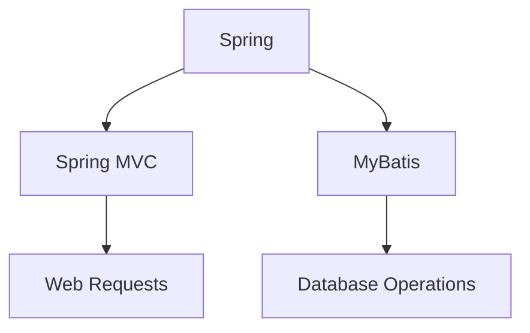

# 基于SSM的问卷调查平台

作者：禅与计算机程序设计艺术

## 1.背景介绍

### 1.1 问卷调查平台的需求

在现代社会中，问卷调查已成为收集数据和意见的常用工具。无论是市场调研、学术研究，还是企业内部的员工满意度调查，问卷调查平台都发挥着至关重要的作用。一个高效的问卷调查平台不仅需要提供用户友好的界面，还需要具备强大的数据处理和分析能力。

### 1.2 SSM框架简介

SSM（Spring、Spring MVC、MyBatis）是目前Java EE开发中常用的轻量级框架组合。它集成了Spring的依赖注入和事务管理功能，Spring MVC的Web层框架，以及MyBatis的持久层框架，提供了一套完整的解决方案来构建高效、可扩展的Web应用。

### 1.3 选择SSM的理由

选择SSM框架开发问卷调查平台的理由主要有以下几点：
- **轻量级**：SSM框架相较于传统的Java EE框架更加轻量级，易于上手和维护。
- **模块化**：SSM框架的各个组件功能明确，易于扩展和替换。
- **社区支持**：SSM框架拥有庞大的社区支持和丰富的文档资源，开发过程中遇到问题可以快速找到解决方案。

## 2.核心概念与联系

### 2.1 Spring框架

Spring是一个开源的Java平台，提供了全面的基础架构支持。它的核心特性包括依赖注入（DI）和面向切面编程（AOP），使得开发者可以更加专注于业务逻辑的实现。

### 2.2 Spring MVC

Spring MVC是Spring框架的一部分，负责处理Web请求。它采用了前端控制器模式，能够将请求分发到相应的处理器，并支持多种视图技术，如JSP、Thymeleaf等。

### 2.3 MyBatis

MyBatis是一个优秀的持久层框架，支持自定义SQL、存储过程以及高级映射。它简化了数据库访问层的开发，使得开发者能够更加灵活地操作数据库。

### 2.4 SSM框架的整合

SSM框架通过Spring的依赖注入机制，将Spring MVC和MyBatis无缝整合在一起。Spring负责管理应用程序的生命周期，Spring MVC处理Web请求，而MyBatis则负责数据库的操作。



## 3.核心算法原理具体操作步骤

### 3.1 用户注册与登录

#### 3.1.1 用户注册流程

用户注册是问卷调查平台的第一步。通过Spring MVC的表单处理功能，用户可以输入基本信息（如用户名、密码、邮箱等）进行注册。注册信息通过Spring的依赖注入机制传递给业务层，最终由MyBatis存储到数据库中。

#### 3.1.2 用户登录流程

用户登录通过Spring Security实现。用户输入用户名和密码后，系统会验证其身份，并生成相应的会话信息。Spring Security提供了丰富的认证和授权功能，确保用户数据的安全性。

### 3.2 问卷创建与管理

#### 3.2.1 问卷创建

问卷创建是平台的核心功能之一。用户可以通过表单输入问卷的基本信息（如标题、描述、问题列表等）。这些信息通过Spring MVC传递到业务层，并最终存储到数据库中。

#### 3.2.2 问卷管理

问卷管理包括问卷的编辑、删除和发布等操作。用户可以对已创建的问卷进行修改，并将其发布给目标用户。Spring MVC负责处理这些请求，并通过MyBatis与数据库交互。

### 3.3 数据收集与分析

#### 3.3.1 数据收集

数据收集是问卷调查平台的核心功能之一。当用户填写问卷并提交后，系统会将其答案存储到数据库中。通过Spring MVC的表单处理功能，数据可以被高效地收集和存储。

#### 3.3.2 数据分析

数据分析是问卷调查平台的高级功能。通过MyBatis的高级查询功能，系统可以对收集到的数据进行统计和分析。Spring提供的事务管理功能确保数据操作的原子性和一致性。

## 4.数学模型和公式详细讲解举例说明

### 4.1 数据统计模型

在数据分析中，常用的统计模型包括平均值、标准差、回归分析等。以下是一些常用的统计公式：

#### 4.1.1 平均值

平均值是最常用的统计量之一，表示数据的中心位置。其计算公式为：

$$
\bar{x} = \frac{1}{n} \sum_{i=1}^{n} x_i
$$

其中，$ \bar{x} $ 表示平均值，$ n $ 表示数据的数量，$ x_i $ 表示第 $ i $ 个数据。

#### 4.1.2 标准差

标准差表示数据的离散程度，其计算公式为：

$$
\sigma = \sqrt{\frac{1}{n} \sum_{i=1}^{n} (x_i - \bar{x})^2}
$$

其中，$ \sigma $ 表示标准差，$ \bar{x} $ 表示平均值，$ n $ 表示数据的数量，$ x_i $ 表示第 $ i $ 个数据。

#### 4.1.3 回归分析

回归分析用于研究变量之间的关系，其线性回归模型的公式为：

$$
y = \beta_0 + \beta_1 x + \epsilon
$$

其中，$ y $ 表示因变量，$ x $ 表示自变量，$ \beta_0 $ 和 $ \beta_1 $ 表示回归系数，$ \epsilon $ 表示误差项。

### 4.2 数据分析示例

假设我们需要分析某次问卷调查中用户对某产品的满意度评分，评分范围为1到5。我们可以使用上述统计模型来计算平均满意度和满意度的标准差。

#### 4.2.1 计算平均满意度

假设收集到的满意度评分为：3, 4, 5, 2, 4, 5, 3, 4, 5, 2。平均满意度的计算过程如下：

$$
\bar{x} = \frac{1}{10} \sum_{i=1}^{10} x_i = \frac{1}{10} (3 + 4 + 5 + 2 + 4 + 5 + 3 + 4 + 5 + 2) = 3.7
$$

#### 4.2.2 计算满意度的标准差

标准差的计算过程如下：

$$
\sigma = \sqrt{\frac{1}{10} \sum_{i=1}^{10} (x_i - 3.7)^2} = \sqrt{\frac{1}{10} ((3-3.7)^2 + (4-3.7)^2 + (5-3.7)^2 + (2-3.7)^2 + (4-3.7)^2 + (5-3.7)^2 + (3-3.7)^2 + (4-3.7)^2 + (5-3.7)^2 + (2-3.7)^2)} = 1.17
$$

## 5.项目实践：代码实例和详细解释说明

### 5.1 项目结构

项目结构采用典型的SSM框架，目录结构如下：

```
├── src
│   ├── main
│   │   ├── java
│   │   │   ├── com
│   │   │   │   ├── example
│   │   │   │   │   ├── controller
│   │   │   │   │   ├── mapper
│   │   │   │   │   ├── model
│   │   │   │   │   ├── service
│   │   │   │   │   ├── util
│   │   │   ├── resources
│   │   │   │   ├── mapper
│   │   │   │   ├── applicationContext.xml
│   │   │   │   ├── spring-mvc.xml
│   │   │   │   ├── mybatis-config.xml
│   │   ├── webapp
│   │   │   ├── WEB-INF
│   │   │   │   ├── jsp
│   │   │   │   ├── web.xml
```

### 5.2 配置文件

#### 5.2.1 applicationContext