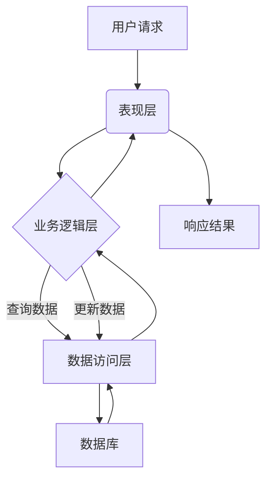

## 基于SSM的高校科研管理系统

### 1. 背景介绍

#### 1.1 高校科研管理现状与挑战

  随着高等教育的普及和科研投入的不断增加，高校科研工作日益繁重，传统的科研管理模式已经难以满足高校科研管理的需求。传统的科研管理模式主要依赖人工操作，存在着效率低下、信息不畅、数据统计困难等问题。同时，随着信息技术的快速发展，高校科研管理也面临着新的挑战，例如：

* **数据量大、类型多:** 高校科研数据涉及面广，包括项目信息、经费管理、成果管理、人员信息等，数据量庞大，类型多样，给数据的存储、管理和分析带来了很大的挑战。
* **信息孤岛现象严重:** 高校科研信息分散在各个部门和系统中，缺乏统一的平台进行整合和共享，导致信息孤岛现象严重，影响了科研效率。
* **科研管理效率低下:**  传统的科研管理流程繁琐，审批周期长，效率低下，难以满足高校科研快速发展的需求。

#### 1.2  系统建设目标与意义

  为了解决上述问题，提高高校科研管理水平，设计和开发一个基于SSM框架的高校科研管理系统势在必行。该系统旨在实现以下目标：

* **提高科研管理效率:** 通过信息化手段，简化科研管理流程，实现科研项目申报、评审、立项、中期检查、结题等全流程的在线管理，提高科研管理效率。
* **促进科研信息共享:** 建立统一的科研信息平台，实现科研项目、成果、人员等信息的共享，打破信息孤岛，促进科研合作与交流。
* **提升科研数据分析能力:**  通过对科研数据的收集、整理和分析，为高校科研决策提供数据支持，提升科研管理的科学化水平。

### 2. 核心概念与联系

#### 2.1 SSM框架

SSM框架是Spring + Spring MVC + MyBatis的缩写，是一个轻量级的Java EE开发框架，具有易用性、灵活性、可扩展性等特点，被广泛应用于企业级Web应用开发。

* **Spring:**  Spring是一个轻量级的IoC和AOP容器框架，提供了依赖注入、面向切面编程等功能，可以降低代码耦合度，提高代码复用性。
* **Spring MVC:** Spring MVC是一个基于MVC设计模式的Web框架，提供了请求调度、视图解析、数据绑定等功能，可以简化Web应用的开发。
* **MyBatis:** MyBatis是一个优秀的持久层框架，提供了数据库操作、SQL映射、缓存管理等功能，可以简化数据库访问代码的编写。

#### 2.2 高校科研管理系统

高校科研管理系统是一个面向高校科研管理部门、科研人员、管理人员的综合性信息管理系统，旨在提高科研管理效率、促进科研信息共享、提升科研数据分析能力。

#### 2.3 核心概念之间的联系

SSM框架作为高校科研管理系统的技术支撑，为系统的开发提供了技术保障。其中，Spring框架提供了依赖注入、面向切面编程等功能，可以降低代码耦合度，提高代码复用性；Spring MVC框架提供了请求调度、视图解析、数据绑定等功能，可以简化Web应用的开发；MyBatis框架提供了数据库操作、SQL映射、缓存管理等功能，可以简化数据库访问代码的编写。

### 3. 核心算法原理具体操作步骤

#### 3.1 系统架构设计

本系统采用经典的三层架构设计，即表现层、业务逻辑层和数据访问层。

* **表现层:** 负责与用户交互，接收用户请求，调用业务逻辑层处理请求，并将处理结果返回给用户。
* **业务逻辑层:**  负责处理业务逻辑，调用数据访问层进行数据操作。
* **数据访问层:** 负责与数据库交互，执行数据查询、插入、更新、删除等操作。

#### 3.2 数据库设计

数据库设计是系统开发的关键环节，本系统采用MySQL数据库，设计如下数据表：

* **用户表:** 用于存储用户信息，包括用户名、密码、姓名、角色等。
* **项目表:** 用于存储科研项目信息，包括项目名称、项目负责人、项目经费、项目起止时间等。
* **成果表:** 用于存储科研成果信息，包括成果名称、成果作者、成果类型、成果发表时间等。
* ...

#### 3.3 核心功能模块设计

本系统主要包括以下功能模块：

* **用户管理模块:**  实现用户的登录、注册、密码修改、权限管理等功能。
* **项目管理模块:**  实现科研项目的申报、评审、立项、中期检查、结题等全流程的在线管理。
* **成果管理模块:**  实现科研成果的录入、查询、统计、分析等功能。
* ...

#### 3.4 核心算法流程图



### 4. 数学模型和公式详细讲解举例说明

本系统不涉及复杂的数学模型和公式。

### 5. 项目实践：代码实例和详细解释说明

#### 5.1 项目搭建

* 创建Maven项目，添加Spring、Spring MVC、MyBatis等依赖。
* 配置web.xml文件，配置Spring MVC的DispatcherServlet。
* 配置Spring配置文件，配置数据源、事务管理器、MyBatis的SqlSessionFactory等。

#### 5.2 代码示例

**用户登录功能:**

```java
// Controller层
@Controller
public class UserController {

    @Autowired
    private UserService userService;

    @RequestMapping("/login")
    public String login(User user, Model model) {
        User u = userService.login(user);
        if (u != null) {
            // 登录成功，跳转到首页
            return "redirect:/index";
        } else {
            // 登录失败，返回登录页面
            model.addAttribute("msg", "用户名或密码错误");
            return "login";
        }
    }
}

// Service层
@Service
public class UserServiceImpl implements UserService {

    @Autowired
    private UserMapper userMapper;

    @Override
    public User login(User user) {
        return userMapper.login(user);
    }
}

// Mapper层
public interface UserMapper {

    User login(User user);
}
```

#### 5.3 代码解释

* Controller层负责接收用户请求，调用Service层进行登录验证，并将验证结果返回给用户。
* Service层负责处理业务逻辑，调用Mapper层进行数据库操作。
* Mapper层负责与数据库交互，执行SQL语句。

### 6. 实际应用场景

高校科研管理系统可以应用于高校的科研管理部门、科研人员、管理人员等，具体应用场景如下：

* **科研项目申报:** 科研人员可以通过系统在线填写项目申报书，提交项目申报材料，并实时跟踪项目申报进度。
* **科研项目评审:**  专家可以通过系统在线评审项目，给出评审意见，提高评审效率。
* **科研项目经费管理:**  科研人员可以通过系统在线查询项目经费使用情况，提交经费报销申请，方便科研经费的管理。
* **科研成果管理:**  科研人员可以通过系统在线录入科研成果信息，方便科研成果的统计和分析。

### 7. 工具和资源推荐

* **开发工具:**  Eclipse、IntelliJ IDEA等。
* **数据库:**  MySQL、Oracle等。
* **框架:**  Spring、Spring MVC、MyBatis等。

### 8. 总结：未来发展趋势与挑战

#### 8.1 未来发展趋势

* **智能化:**  随着人工智能技术的不断发展，高校科研管理系统将会更加智能化，例如，可以利用机器学习算法自动识别科研项目的研究方向、自动匹配评审专家等。
* **移动化:**  随着移动互联网的普及，高校科研管理系统将会更加移动化，科研人员可以通过手机APP随时随地进行科研管理操作。
* **数据化:**  高校科研管理系统将会更加注重数据的收集、分析和利用，为高校科研决策提供更加科学的数据支持。

#### 8.2 面临的挑战

* **数据安全:**  高校科研数据涉及面广，数据安全问题尤为重要，需要加强数据安全防护措施。
* **系统维护:**  高校科研管理系统功能复杂，需要专业的技术人员进行维护，维护成本较高。
* **用户体验:**  高校科研管理系统的用户群体广泛，需要不断优化系统界面和操作流程，提升用户体验。

### 9. 附录：常见问题与解答

#### 9.1  如何登录系统？

答：在浏览器中输入系统地址，进入登录页面，输入用户名和密码，点击“登录”按钮即可登录系统。

#### 9.2  忘记密码怎么办？

答：点击登录页面上的“忘记密码”链接，输入用户名和注册邮箱，系统会将重置密码链接发送到您的邮箱，点击链接即可重置密码。

#### 9.3  如何联系管理员？

答：在系统页面底部找到“联系我们”链接，点击进入联系我们页面，可以查看管理员的联系方式。
