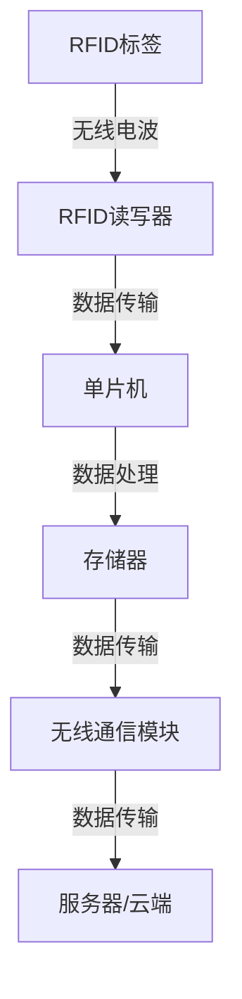
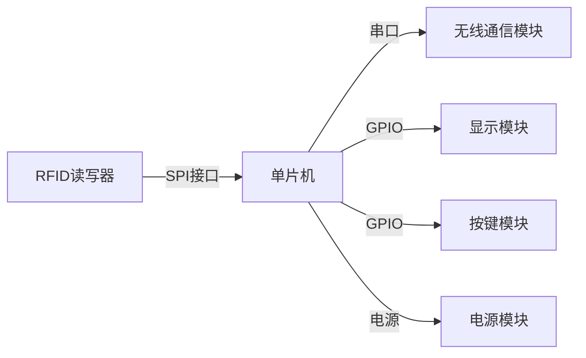

# 基于单片机RFID智能人流量计数统计的设计与实现

作者：禅与计算机程序设计艺术

## 1. 背景介绍

### 1.1 引言

在现代社会中，智能化和自动化技术的快速发展使得人流量计数统计系统在各个领域得到了广泛应用。无论是在商场、图书馆、机场还是在各种大型活动中，准确的人流量统计数据不仅能够帮助管理者优化资源配置，提高服务质量，还能够为商业决策提供重要的数据支持。基于单片机和RFID技术的人流量计数系统因其低成本、高精度和易于实现的特点，成为了当前研究和应用的热点。

### 1.2 单片机与RFID技术简介

单片机（Microcontroller Unit, MCU）是一种集成了计算、存储、输入输出控制等功能于一体的微控制器。由于其体积小、成本低、功能强大，广泛应用于各种电子产品中。RFID（Radio Frequency Identification）是一种通过无线电波进行非接触式数据传输和识别的技术。RFID系统通常由标签（Tag）和读写器（Reader）组成，标签内嵌有微小的集成电路和天线，读写器通过无线电波与标签进行通信，实现数据的读取和写入。

### 1.3 人流量计数系统的需求分析

一个有效的人流量计数系统需要满足以下几个需求：
1. **准确性**：能够准确地统计进出人数，避免重复计数或漏计。
2. **实时性**：能够实时反映人流量的变化，提供及时的数据支持。
3. **稳定性**：系统应具有较高的稳定性和可靠性，能够在各种环境下正常工作。
4. **可扩展性**：系统应具有良好的扩展性，能够根据实际需求进行功能扩展和升级。
5. **低成本**：系统应具有较低的成本，以便于大规模推广应用。

## 2. 核心概念与联系

### 2.1 RFID技术的工作原理

RFID技术通过无线电波进行数据传输，其工作原理如下：
1. **标签（Tag）**：标签内嵌有一块微小的集成电路和一根天线，当标签进入读写器的工作范围时，标签接收到读写器发送的无线电波，激活内部电路。
2. **读写器（Reader）**：读写器通过天线向外发送无线电波，同时接收标签返回的信号。读写器对接收到的信号进行解码，读取标签中的数据。
3. **数据传输**：标签与读写器之间的数据传输是通过无线电波进行的，传输距离和速度取决于标签和读写器的设计。

### 2.2 单片机的工作原理

单片机是一种集成了计算、存储、输入输出控制等功能的微控制器。其工作原理如下：
1. **中央处理器（CPU）**：单片机的核心部件，负责执行指令和处理数据。
2. **存储器**：包括程序存储器（ROM）和数据存储器（RAM），用于存储程序代码和数据。
3. **输入输出接口**：用于连接外部设备，实现数据的输入和输出。
4. **时钟电路**：提供时钟信号，控制单片机的工作节奏。

### 2.3 单片机与RFID技术的结合

将单片机与RFID技术结合，可以实现智能化的人流量计数系统。具体实现过程如下：
1. **RFID读写器与单片机连接**：通过串口、I2C或SPI等接口将RFID读写器与单片机连接，单片机通过接口与读写器进行通信。
2. **数据处理**：单片机接收来自RFID读写器的数据，对数据进行处理和分析，统计进出人数。
3. **数据存储与传输**：单片机将统计结果存储在内部存储器中，并通过无线通信模块（如Wi-Fi、蓝牙等）将数据传输到服务器或云端，实现远程监控和管理。

## 3. 核心算法原理具体操作步骤

### 3.1 系统架构设计

一个完整的人流量计数系统架构如下图所示：

### 3.2 RFID标签与读写器的通信

1. **标签进入读写器工作范围**：当一个人携带RFID标签进入读写器的工作范围时，标签接收到读写器发送的无线电波，激活内部电路。
2. **数据传输**：标签将存储的数据通过无线电波发送给读写器，读写器接收并解码数据。
3. **数据处理**：读写器将解码后的数据通过接口传输给单片机，单片机对数据进行处理和统计。

### 3.3 单片机的数据处理

1. **数据接收**：单片机通过接口接收来自读写器的数据。
2. **数据解析**：单片机对接收到的数据进行解析，提取标签ID等信息。
3. **状态判断**：根据标签ID和系统状态判断进出情况，统计进出人数。
4. **数据存储**：将统计结果存储在单片机的内部存储器中。

### 3.4 数据传输与显示

1. **数据传输**：单片机通过无线通信模块将统计数据传输到服务器或云端。
2. **数据显示与分析**：服务器或云端接收数据后，通过数据可视化工具对数据进行显示和分析，为管理者提供决策支持。

## 4. 数学模型和公式详细讲解举例说明

### 4.1 人流量计数的数学模型

假设在某一时间段内，进入区域的人数为 $N_{in}$，离开区域的人数为 $N_{out}$，则在该时间段内的净人流量 $N_{net}$ 可以表示为：

$$
N_{net} = N_{in} - N_{out}
$$

### 4.2 进出人数的统计公式

设在时间 $t$ 时刻，系统记录的进入人数为 $N_{in}(t)$，离开人数为 $N_{out}(t)$，则在时间 $t$ 时刻的净人流量 $N_{net}(t)$ 可以表示为：

$$
N_{net}(t) = N_{in}(t) - N_{out}(t)
$$

### 4.3 数据处理的数学模型

为了提高系统的准确性，可以对数据进行滤波处理。假设在时间 $t$ 时刻，系统记录的原始数据为 $x(t)$，滤波后的数据为 $y(t)$，则滤波过程可以表示为：

$$
y(t) = \alpha \cdot x(t) + (1 - \alpha) \cdot y(t-1)
$$

其中，$\alpha$ 为滤波系数，取值范围为 $0 < \alpha < 1$。

### 4.4 实际应用中的数学模型

在实际应用中，可以根据具体需求对数学模型进行调整和优化。例如，在大型商场中，可以对不同区域的人流量进行统计和分析，帮助管理者优化资源配置，提高服务质量。

## 4. 项目实践：代码实例和详细解释说明

### 4.1 系统硬件设计

#### 4.1.1 硬件组成

1. **单片机**：选用STM32系列单片机，具有较高的性能和丰富的外设接口。
2. **RFID读写器**：选用MFRC522模块，支持ISO14443A标准的RFID标签。
3. **无线通信模块**：选用ESP8266模块，实现数据的无线传输。
4. **其他外设**：包括电源模块、显示模块、按键模块等。

#### 4.1.2 硬件连接

### 4.2 系统软件设计

#### 4.2.1 软件架构

系统软件分为以下几个模块：
1. **RFID读写模块