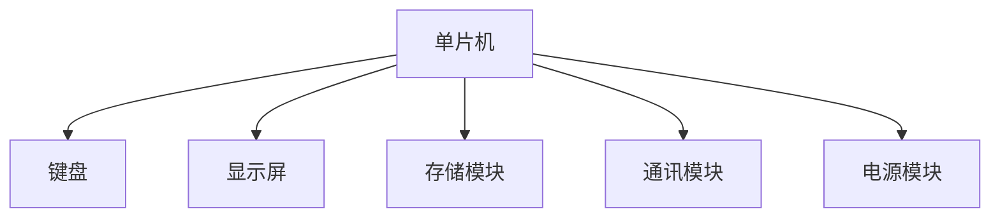

# 基于单片机快递柜验证码取货的设计与实现

作者：禅与计算机程序设计艺术

## 1. 背景介绍

### 1.1 快递柜的兴起

随着电子商务的迅猛发展，物流行业的需求量急剧增加。传统的快递方式已经不能满足日益增长的快递需求，快递柜作为一种新型的物流解决方案应运而生。快递柜不仅提高了快递员的派送效率，还为用户提供了更为便捷的取货方式。

### 1.2 快递柜的工作原理

快递柜的基本工作原理是通过快递员将包裹存入柜子，然后系统生成一个唯一的取货验证码发送给收件人。收件人到达快递柜后，通过输入验证码即可取走包裹。这种方式不仅节省了时间，还提高了安全性。

### 1.3 单片机在快递柜中的应用

单片机（Microcontroller Unit, MCU）作为一种集成了计算、存储、控制等功能的微型计算机，被广泛应用于各种嵌入式系统中。在快递柜中，单片机主要负责控制柜门的开关、验证码的生成与验证、用户界面的显示等功能。

## 2. 核心概念与联系

### 2.1 单片机的基本概念

单片机是一种集成了中央处理器（CPU）、内存（RAM、ROM）、输入输出接口（I/O）等功能的微型计算机。常见的单片机有8051、AVR、PIC和ARM等。

### 2.2 快递柜系统的组成

快递柜系统主要由以下几个部分组成：
- **单片机控制模块**：负责整个系统的控制和管理。
- **用户界面模块**：包括键盘和显示屏，用于用户输入验证码和显示相关信息。
- **存储模块**：用于存储包裹信息和验证码。
- **通讯模块**：用于与服务器进行数据交换。
- **电源模块**：为整个系统提供电力支持。

### 2.3 验证码的生成与验证

验证码的生成与验证是快递柜系统的核心功能之一。通常，验证码可以通过随机数生成器生成，并存储在系统中。用户输入验证码后，系统会进行验证，验证通过后即可打开柜门。

## 3. 核心算法原理具体操作步骤

### 3.1 验证码生成算法

验证码生成算法的核心是随机数生成。常见的随机数生成算法包括线性同余法（Linear Congruential Generator, LCG）、梅森旋转法（Mersenne Twister, MT）等。在本系统中，我们采用线性同余法生成验证码。

#### 3.1.1 线性同余法

线性同余法的公式如下：
$$
X_{n+1} = (aX_n + c) \mod m
$$
其中：
- \(X\) 是随机数序列
- \(a\) 是乘数
- \(c\) 是增量
- \(m\) 是模数

### 3.2 验证码验证算法

验证码验证算法的核心是字符串匹配。用户输入的验证码与系统存储的验证码进行比对，如果一致则验证通过。

#### 3.2.1 字符串匹配算法

常见的字符串匹配算法包括朴素算法（Naive Algorithm）、KMP算法（Knuth-Morris-Pratt Algorithm）等。在本系统中，我们采用朴素算法进行字符串匹配。

## 4. 数学模型和公式详细讲解举例说明

### 4.1 验证码生成的数学模型

线性同余法的数学模型如下：
$$
X_{n+1} = (aX_n + c) \mod m
$$

假设初始值 \(X_0 = 1\)，乘数 \(a = 5\)，增量 \(c = 3\)，模数 \(m = 16\)。则随机数序列为：
$$
X_1 = (5 \cdot 1 + 3) \mod 16 = 8
$$
$$
X_2 = (5 \cdot 8 + 3) \mod 16 = 11
$$
$$
X_3 = (5 \cdot 11 + 3) \mod 16 = 14
$$

### 4.2 验证码验证的数学模型

字符串匹配的数学模型如下：
$$
\text{匹配成功} \quad \text{if} \quad S_1[i] = S_2[i] \quad \text{for} \quad i = 0, 1, \ldots, n-1
$$
其中：
- \(S_1\) 是用户输入的验证码
- \(S_2\) 是系统存储的验证码
- \(n\) 是验证码的长度

## 5. 项目实践：代码实例和详细解释说明

### 5.1 硬件设计

#### 5.1.1 单片机选择

本项目选择STC89C52单片机作为控制核心。STC89C52具有丰富的I/O接口，适合用于快递柜的控制。

#### 5.1.2 电路设计

电路设计主要包括单片机与键盘、显示屏、存储模块、通讯模块的连接。具体电路图如下：



### 5.2 软件设计

#### 5.2.1 验证码生成代码

以下是线性同余法生成验证码的代码实例：

```c
#include <stdio.h>

unsigned int generate_code(unsigned int seed) {
    unsigned int a = 5;
    unsigned int c = 3;
    unsigned int m = 16;
    return (a * seed + c) % m;
}

int main() {
    unsigned int seed = 1;
    for (int i = 0; i < 10; i++) {
        seed = generate_code(seed);
        printf("验证码: %u\n", seed);
    }
    return 0;
}
```

#### 5.2.2 验证码验证代码

以下是朴素算法进行验证码验证的代码实例：

```c
#include <stdio.h>
#include <string.h>

int verify_code(char *input_code, char *stored_code) {
    return strcmp(input_code, stored_code) == 0;
}

int main() {
    char input_code[10];
    char stored_code[10] = "123456";
    
    printf("请输入验证码: ");
    scanf("%s", input_code);
    
    if (verify_code(input_code, stored_code)) {
        printf("验证通过，柜门已打开。\n");
    } else {
        printf("验证失败，请重试。\n");
    }
    return 0;
}
```

### 5.3 系统集成

将硬件设计与软件设计结合起来，完成快递柜系统的集成。具体步骤如下：
1. 连接硬件模块，确保电路正常工作。
2. 将生成验证码和验证验证码的代码烧录到单片机中。
3. 进行系统测试，确保各模块正常运行。

## 6. 实际应用场景

### 6.1 物流快递行业

在物流快递行业中，快递柜可以大大提高快递员的派送效率，减少派送时间。同时，用户可以根据自己的时间安排自由取货，提高了用户体验。

### 6.2 社区服务

在社区服务中，快递柜可以作为一种便民服务设施，方便居民收取快递，减少了快递员与用户之间的接触，提升了安全性。

### 6.3 商业办公楼

在商业办公楼中，快递柜可以集中管理各个公司的快递，减少了快递员在办公楼内的流动，提升了办公环境的整洁度和安全性。

## 7. 工具和资源推荐

### 7.1 硬件工具

- **STC89C52单片机开发板**：用于开发和调试单片机程序。
- **示波器**：用于测试和调试电路。
- **万用表**：用于测量电路参数。

### 7.2 软件工具

- **Keil uVision**：用于编写和调试单片机程序。
- **Proteus**：用于仿真和测试电路设计。
- **Git**：用于版本控制和代码管理。

### 7.3 在线资源

- **单片机论坛**：获取单片机相关的技术支持和交流。
- **技术博客**：阅读和学习其他开发者的经验和心得。
- **开源代码库**：获取和学习开源项目的代码和设计。

## 8. 总结：未来发展趋势与挑战