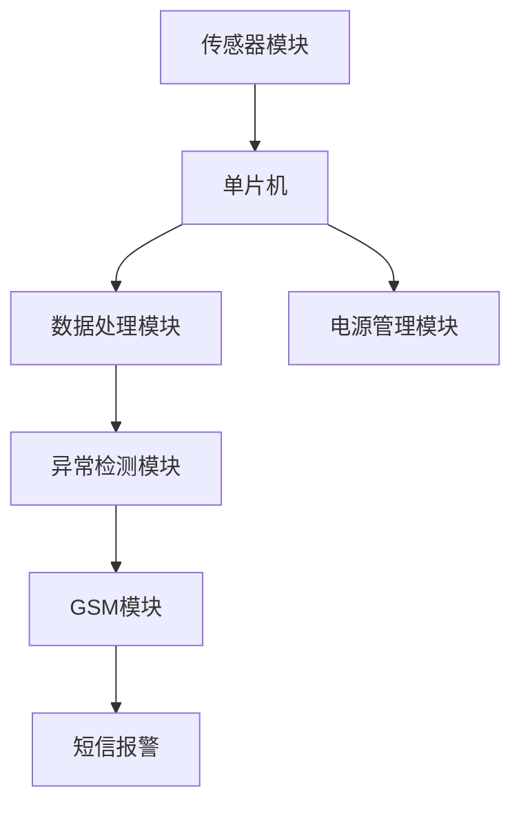

# 基于单片机智能手环老人生理监控短信报警设计的设计与实现

作者：禅与计算机程序设计艺术

## 1. 背景介绍

### 1.1 问题的提出

随着全球老龄化问题的日益严重，老年人的健康监控成为一个亟待解决的社会问题。传统的健康监控手段往往依赖于定期的体检和家人的照顾，但这些方法存在明显的局限性，无法实时监控老年人的身体状况。智能手环作为一种便携式、低成本的健康监控设备，能够实时采集佩戴者的生理数据，并在异常情况下及时发出报警信息，具有广泛的应用前景。

### 1.2 现有技术的局限

目前市面上的智能手环多以健身追踪为主，虽然也具备心率、血氧等生理参数监测功能，但在数据精度、实时性和报警机制上仍存在不足。此外，许多智能手环依赖于智能手机进行数据处理和报警，这对于老年用户来说不够友好。因此，设计一款基于单片机的智能手环，能够独立完成生理监控和短信报警功能，具有重要的现实意义。

### 1.3 设计目标

本项目旨在设计并实现一款基于单片机的智能手环，能够实时监控老年人的心率、血压等生理数据，并在检测到异常情况时通过短信报警通知家属或医疗机构。具体目标包括：
- 实现高精度的生理数据采集和处理。
- 设计可靠的短信报警机制。
- 确保设备的低功耗和长续航能力。
- 提供简单易用的用户界面和操作方式。

## 2. 核心概念与联系

### 2.1 单片机技术

单片机（Microcontroller Unit, MCU）是一种集成了CPU、存储器和输入输出接口于一体的微型计算机。它体积小、功耗低、成本低，广泛应用于嵌入式系统。常见的单片机品牌包括STMicroelectronics的STM32系列、Microchip的PIC系列和Atmel的AVR系列。本项目选用STM32系列单片机，因其性能稳定、开发资源丰富。

### 2.2 生理参数监测

生理参数监测是智能手环的核心功能之一。常见的生理参数包括心率、血压、血氧饱和度等。心率监测通常使用光电容积脉搏波（PPG）传感器，通过检测血液流动引起的光强变化来计算心率。血压监测可以采用脉搏传导时间（PTT）法，通过测量心电信号（ECG）和PPG信号之间的时间差来估算血压。

### 2.3 短信报警机制

短信报警机制是确保老年人安全的重要手段。通过使用GSM模块，智能手环可以在检测到异常生理数据时自动发送短信报警。GSM模块可以通过AT指令与单片机通信，实现短信的发送和接收功能。

### 2.4 系统架构

系统架构包括硬件和软件两部分。硬件部分主要包括单片机、传感器模块、GSM模块和电源管理模块。软件部分包括底层驱动、数据采集与处理、异常检测和短信报警等功能模块。

以下是系统架构的Mermaid流程图：

## 3. 核心算法原理具体操作步骤

### 3.1 数据采集

#### 3.1.1 心率数据采集

心率数据采集采用PPG传感器，通过LED光源和光电二极管检测血液流动引起的光强变化。具体步骤如下：
1. 启动PPG传感器，LED光源发出光线。
2. 光电二极管接收反射光，产生电信号。
3. 通过ADC（模数转换器）将模拟信号转换为数字信号。
4. 采集到的数字信号传输到单片机进行处理。

#### 3.1.2 血压数据采集

血压数据采集采用PTT方法，通过测量ECG和PPG信号之间的时间差来估算血压。具体步骤如下：
1. 采集ECG信号和PPG信号。
2. 计算ECG信号的R波峰值时间。
3. 计算PPG信号的脉搏波峰值时间。
4. 计算R波峰值时间和脉搏波峰值时间之间的时间差，即PTT。
5. 根据PTT值估算血压。

### 3.2 数据处理

#### 3.2.1 滤波处理

为了消除噪声和干扰，采集到的生理数据需要进行滤波处理。常用的滤波算法包括低通滤波、高通滤波和带通滤波。具体步骤如下：
1. 选择适当的滤波器类型和参数。
2. 对采集到的原始数据进行滤波处理。
3. 输出滤波后的数据。

#### 3.2.2 特征提取

特征提取是从滤波后的数据中提取有用信息的过程。对于心率数据，可以提取心率值和心率变异性（HRV）；对于血压数据，可以提取收缩压和舒张压。具体步骤如下：
1. 对滤波后的数据进行峰值检测。
2. 计算峰值之间的时间间隔。
3. 根据时间间隔计算心率或血压值。

### 3.3 异常检测

#### 3.3.1 阈值判断

阈值判断是最简单的异常检测方法。预设心率和血压的正常范围，当检测到的值超出范围时，触发报警。具体步骤如下：
1. 设定心率和血压的正常范围。
2. 实时监测心率和血压值。
3. 当检测到的值超出正常范围时，触发报警。

#### 3.3.2 机器学习方法

机器学习方法可以提高异常检测的准确性。通过训练模型，智能手环可以识别复杂的异常模式。常用的机器学习算法包括支持向量机（SVM）、随机森林和神经网络。具体步骤如下：
1. 收集大量正常和异常的生理数据。
2. 对数据进行预处理和特征提取。
3. 选择合适的机器学习算法，训练模型。
4. 使用训练好的模型进行实时异常检测。

### 3.4 短信报警

#### 3.4.1 GSM模块初始化

GSM模块初始化是短信报警的前提。通过AT指令对GSM模块进行配置，使其能够正常工作。具体步骤如下：
1. 通过串口与GSM模块建立通信。
2. 发送AT指令，检查GSM模块是否正常响应。
3. 配置GSM模块的工作参数，如波特率、短信中心号码等。

#### 3.4.2 发送短信

当检测到异常情况时，智能手环通过GSM模块发送短信报警。具体步骤如下：
1. 构建报警短信内容，包括异常类型、检测时间和生理数据等。
2. 通过AT指令将短信内容发送到指定号码。
3. 接收GSM模块的发送结果，确认短信是否发送成功。

## 4. 数学模型和公式详细讲解举例说明

### 4.1 心率计算公式

心率（HR）是通过检测心脏每分钟的跳动次数来计算的。假设在一定时间内检测到的心跳次数为 $N$，检测时间为 $T$，则心率的计算公式为：

$$
HR = \frac{N}{T} \times 60
$$

例如，在10秒钟内检测到的心跳次数为15次，则心率为：

$$
HR = \frac{15}{10} \times 60 = 90 \text{次/分钟}
$$

### 4.2 血压估算公式

血压（BP）可以通过脉搏传导时间（PTT）来估算。假设PTT为 $t_{PTT}$，则收缩压（SBP）和舒张压（DBP）的估算公式为：

$$
SBP = a \cdot t_{PTT} + b
$$

$$
DBP = c \cdot t_{PTT} + d
$$

其中，$a$、$b$、$c$ 和 $d$ 为通过实验确定