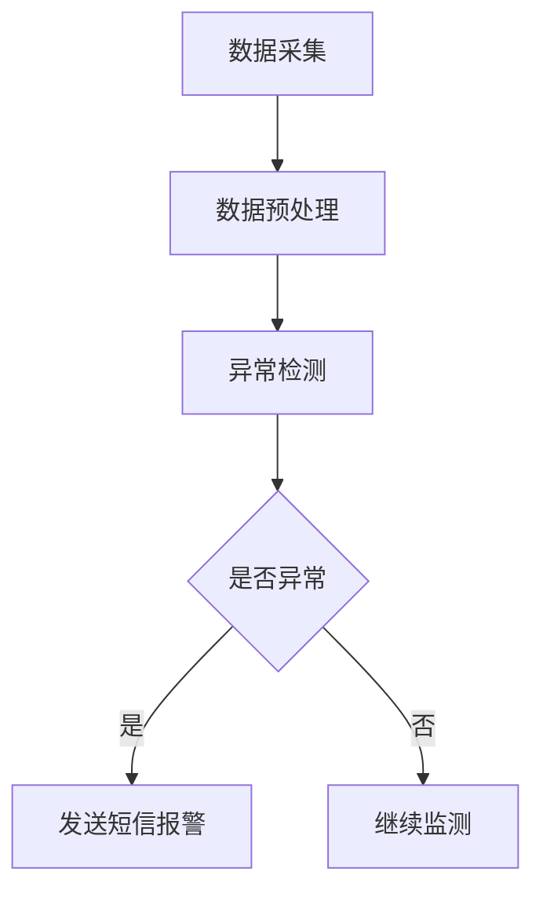
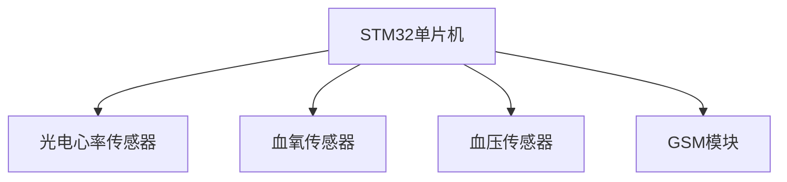

# 基于单片机智能手环老人生理监控短信报警设计的设计与实现

作者：禅与计算机程序设计艺术

## 1. 背景介绍

### 1.1 老年人口的健康监控需求

随着全球老龄化趋势的加剧，老年人口的健康问题日益受到关注。老年人群体由于身体机能的衰退，更容易出现各种健康问题，如心脏病、高血压、糖尿病等。为了提升老年人的生活质量，及时监控他们的生理状况并在紧急情况下提供快速响应变得尤为重要。

### 1.2 智能手环的兴起

智能手环作为一种便携式穿戴设备，近年来在健康监控领域得到了广泛应用。它们能够实时采集用户的生理数据，如心率、血氧饱和度、血压等，并通过无线通信技术将数据传输到云端进行分析。然而，现有的智能手环大多针对年轻人设计，缺乏针对老年人特殊需求的功能，如紧急短信报警。

### 1.3 本文的研究目标

本文旨在设计和实现一种基于单片机的智能手环，专门用于老年人的生理监控和短信报警。通过实时监测老年人的生理参数，并在检测到异常情况时自动发送短信报警，以便家属或医护人员能够及时采取行动。

## 2. 核心概念与联系

### 2.1 单片机的选择

单片机（Microcontroller）是一种集成了中央处理器（CPU）、存储器和输入/输出接口的微型计算机。它具有体积小、功耗低、成本低等优点，非常适合用于便携式设备。本文选择了STM32系列单片机作为智能手环的核心控制器。

### 2.2 生理参数的监测

智能手环需要实时监测老年人的多项生理参数，包括心率、血氧饱和度和血压。这些参数的测量需要使用不同的传感器，如光电心率传感器、血氧传感器和血压传感器。

### 2.3 短信报警系统

为了实现短信报警功能，智能手环需要集成GSM模块。GSM模块能够通过移动通信网络发送短信。当检测到老年人的生理参数异常时，单片机会通过GSM模块自动发送预设的报警短信到指定的手机号码。

## 3. 核心算法原理具体操作步骤

### 3.1 数据采集与预处理

#### 3.1.1 传感器数据采集

智能手环通过光电心率传感器、血氧传感器和血压传感器实时采集老年人的生理数据。传感器的数据通过ADC（模数转换器）转换为数字信号，并传输到单片机进行处理。

#### 3.1.2 数据滤波与去噪

采集到的原始数据通常会包含一定的噪声，需要进行滤波处理。常用的滤波算法包括低通滤波、高通滤波和带通滤波。本文采用卡尔曼滤波器对心率和血氧数据进行去噪处理。

### 3.2 异常检测算法

#### 3.2.1 心率异常检测

心率的正常范围因人而异，但通常在60-100次/分钟之间。通过设定上下限阈值，当心率超出正常范围时，触发报警。

#### 3.2.2 血氧饱和度异常检测

血氧饱和度的正常范围为95%-100%。当血氧饱和度低于90%时，表示可能存在缺氧风险，需要触发报警。

#### 3.2.3 血压异常检测

血压的正常范围为收缩压90-120 mmHg，舒张压60-80 mmHg。当检测到血压超出正常范围时，触发报警。

### 3.3 短信报警机制

#### 3.3.1 GSM模块初始化

在单片机启动时，首先初始化GSM模块，设置通信参数，如波特率、短信中心号码等。

#### 3.3.2 短信发送流程

当检测到异常生理参数时，单片机通过AT指令控制GSM模块发送预设的报警短信。短信内容包括老年人的当前生理参数和报警类型。

## 4. 数学模型和公式详细讲解举例说明

### 4.1 卡尔曼滤波器

卡尔曼滤波器是一种递归滤波算法，广泛应用于信号处理和控制系统中。其基本原理是通过先验估计和观测数据的加权平均，得到最优估计。

#### 4.1.1 状态方程和观测方程

卡尔曼滤波器的状态方程和观测方程分别为：

$$
x_{k} = A x_{k-1} + B u_{k} + w_{k}
$$

$$
z_{k} = H x_{k} + v_{k}
$$

其中，$x_{k}$ 为状态变量，$z_{k}$ 为观测变量，$A$ 为状态转移矩阵，$B$ 为控制输入矩阵，$H$ 为观测矩阵，$w_{k}$ 和 $v_{k}$ 分别为过程噪声和观测噪声。

#### 4.1.2 预测和更新步骤

卡尔曼滤波器的预测和更新步骤如下：

**预测步骤：**

$$
\hat{x}_{k|k-1} = A \hat{x}_{k-1|k-1} + B u_{k}
$$

$$
P_{k|k-1} = A P_{k-1|k-1} A^T + Q
$$

**更新步骤：**

$$
K_{k} = P_{k|k-1} H^T (H P_{k|k-1} H^T + R)^{-1}
$$

$$
\hat{x}_{k|k} = \hat{x}_{k|k-1} + K_{k} (z_{k} - H \hat{x}_{k|k-1})
$$

$$
P_{k|k} = (I - K_{k} H) P_{k|k-1}
$$

其中，$\hat{x}_{k|k-1}$ 为先验状态估计，$\hat{x}_{k|k}$ 为后验状态估计，$P_{k|k-1}$ 和 $P_{k|k}$ 分别为先验和后验估计误差协方差矩阵，$K_{k}$ 为卡尔曼增益，$Q$ 和 $R$ 分别为过程噪声协方差和观测噪声协方差。

### 4.2 异常检测阈值设定

#### 4.2.1 心率阈值设定

设定心率的正常范围为 $[HR_{min}, HR_{max}]$。当检测到的心率 $HR$ 满足 $HR < HR_{min}$ 或 $HR > HR_{max}$ 时，触发报警。

#### 4.2.2 血氧饱和度阈值设定

设定血氧饱和度的正常范围为 $[SpO2_{min}, SpO2_{max}]$。当检测到的血氧饱和度 $SpO2$ 满足 $SpO2 < SpO2_{min}$ 时，触发报警。

#### 4.2.3 血压阈值设定

设定血压的正常范围为 $[BP_{sys_{min}}, BP_{sys_{max}}]$ 和 $[BP_{dia_{min}}, BP_{dia_{max}}]$。当检测到的收缩压 $BP_{sys}$ 或舒张压 $BP_{dia}$ 超出正常范围时，触发报警。

## 5. 项目实践：代码实例和详细解释说明

### 5.1 硬件连接

#### 5.1.1 传感器连接

光电心率传感器、血氧传感器和血压传感器分别连接到单片机的ADC通道。以下是传感器连接示意图：

#### 5.1.2 GSM模块连接

GSM模块通过UART接口与单片机