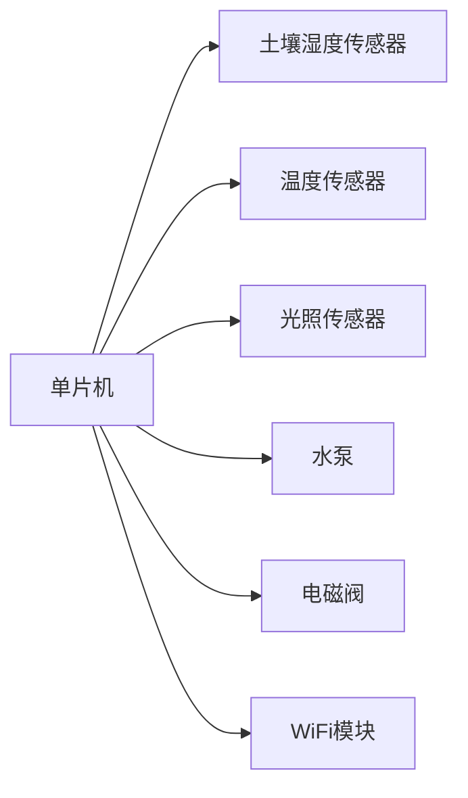

# 基于单片机智能浇花系统的设计与实现

作者：禅与计算机程序设计艺术

## 1.背景介绍

### 1.1 智能浇花系统的需求背景

随着城市化进程的加快和人们生活水平的提高，园艺和家庭种植成为了越来越多人的爱好。然而，如何在繁忙的生活中保持植物的健康生长成为了一个难题。传统的手动浇水方式不仅费时费力，还容易因人为因素导致植物浇水过多或过少。智能浇花系统的出现，为解决这一问题提供了有效的解决方案。

### 1.2 单片机在智能浇花系统中的应用

单片机作为一种集成了微处理器、存储器和多种外围设备的微型计算机，具有成本低、功耗小、体积小、易于编程等优点，非常适合用于智能浇花系统的开发。通过单片机，可以实现对土壤湿度、温度、光照等环境参数的实时监测，并根据这些参数自动控制浇水系统，从而保证植物的健康生长。

### 1.3 本文的主要内容和结构

本文将详细介绍基于单片机的智能浇花系统的设计与实现，内容包括系统的核心概念与联系、核心算法原理及具体操作步骤、数学模型和公式的详细讲解、项目实践中的代码实例及详细解释、实际应用场景、工具和资源推荐、未来发展趋势与挑战以及常见问题与解答。

## 2.核心概念与联系

### 2.1 智能浇花系统的基本组成

智能浇花系统主要由以下几个部分组成：

- 传感器模块：用于监测土壤湿度、温度、光照等环境参数。
- 控制模块：以单片机为核心，对传感器数据进行处理，并根据预设的算法控制浇水系统。
- 执行模块：包括水泵、电磁阀等，用于实际执行浇水操作。
- 通信模块：实现系统与用户之间的通信，可以通过WiFi、蓝牙等方式将数据传输到用户的手机或电脑上。

### 2.2 单片机的选择与功能

在智能浇花系统中，单片机的选择至关重要。常用的单片机有AVR、PIC、STM32等。本文选择了STM32单片机，主要原因是其性能强大、资源丰富、开发工具完善。STM32单片机具有以下功能：

- ADC（模数转换）：用于读取传感器的模拟信号。
- GPIO（通用输入输出）：用于控制水泵、电磁阀等执行器。
- UART/I2C/SPI：用于与其他模块进行通信。
- PWM（脉宽调制）：用于控制水泵的工作状态。

### 2.3 传感器的选择与工作原理

智能浇花系统中常用的传感器包括：

- 土壤湿度传感器：通过测量土壤的电导率来判断土壤的湿度。
- 温度传感器：常用的有DS18B20、DHT11等，通过测量环境温度来判断是否需要浇水。
- 光照传感器：通过测量光照强度来判断植物是否需要光照。

这些传感器将采集到的数据传输给单片机，单片机根据预设的算法进行处理，并控制浇水系统的工作。

## 3.核心算法原理具体操作步骤

### 3.1 数据采集与预处理

智能浇花系统的第一步是数据采集与预处理。传感器采集到的原始数据往往包含噪声，需要进行滤波处理。常用的滤波算法有均值滤波、中值滤波等。

#### 3.1.1 均值滤波算法

均值滤波是一种简单而有效的滤波方法，通过对一定范围内的数据求平均值来减小噪声。其公式为：

$$
\overline{x} = \frac{1}{N} \sum_{i=1}^{N} x_i
$$

其中，$x_i$ 为采集到的第 $i$ 个数据，$N$ 为数据的数量，$\overline{x}$ 为滤波后的数据。

#### 3.1.2 中值滤波算法

中值滤波通过取一定范围内数据的中值来消除噪声，特别适用于去除脉冲噪声。其步骤如下：

1. 将采集到的数据按大小排序。
2. 取排序后数据的中间值。

### 3.2 数据处理与决策算法

数据处理是智能浇花系统的核心，主要包括数据的归一化处理、阈值判断和决策算法。

#### 3.2.1 数据归一化处理

不同传感器的数据范围不同，需要进行归一化处理，以便统一处理。常用的归一化方法有最大最小归一化、Z-score归一化等。

最大最小归一化公式为：

$$
x' = \frac{x - x_{\min}}{x_{\max} - x_{\min}}
$$

其中，$x$ 为原始数据，$x_{\min}$ 和 $x_{\max}$ 分别为数据的最小值和最大值，$x'$ 为归一化后的数据。

#### 3.2.2 阈值判断

根据植物的生长需求，设定土壤湿度、温度、光照强度等参数的阈值。当传感器数据超过或低于阈值时，系统将自动进行浇水操作。

#### 3.2.3 决策算法

决策算法是智能浇花系统的核心，常用的算法有基于规则的决策树算法和基于机器学习的决策算法。

- 基于规则的决策树算法：根据预设的规则进行决策，简单易实现，但灵活性较差。
- 基于机器学习的决策算法：通过训练模型进行决策，具有更高的准确性和灵活性，但需要大量的数据和计算资源。

### 3.3 控制执行模块

控制执行模块包括水泵、电磁阀等，用于实际执行浇水操作。单片机通过GPIO口控制这些执行器的开关状态。

#### 3.3.1 水泵控制

水泵的控制可以通过PWM信号实现，通过调节PWM的占空比来控制水泵的工作状态。

#### 3.3.2 电磁阀控制

电磁阀的控制相对简单，通过单片机的GPIO口输出高低电平信号来控制电磁阀的开关状态。

## 4.数学模型和公式详细讲解举例说明

### 4.1 土壤湿度模型

土壤湿度模型用于描述土壤湿度随时间的变化。假设土壤湿度的变化主要受浇水和蒸发影响，可以建立如下数学模型：

$$
\frac{dH}{dt} = -E + I
$$

其中，$H$ 为土壤湿度，$E$ 为蒸发速率，$I$ 为浇水速率。

### 4.2 蒸发速率模型

蒸发速率 $E$ 受温度、湿度、风速等因素影响，可以表示为：

$$
E = f(T, H, W)
$$

其中，$T$ 为温度，$H$ 为空气湿度，$W$ 为风速。

### 4.3 浇水速率模型

浇水速率 $I$ 受水泵工作状态和浇水时间影响，可以表示为：

$$
I = P \cdot t
$$

其中，$P$ 为水泵的流量，$t$ 为浇水时间。

### 4.4 数学模型的求解

通过求解上述微分方程，可以得到土壤湿度随时间的变化情况，从而指导智能浇花系统的浇水决策。

## 5.项目实践：代码实例和详细解释说明

### 5.1 硬件连接图

### 5.2 硬件连接说明

- 土壤湿度传感器、温度传感器、光照传感器通过ADC接口与单片机连接。
- 水泵通过PWM接口与单片机连接。
- 电磁阀通过GPIO接口与单片机连接。
- WiFi模块通过UART接口与单片机连接。

