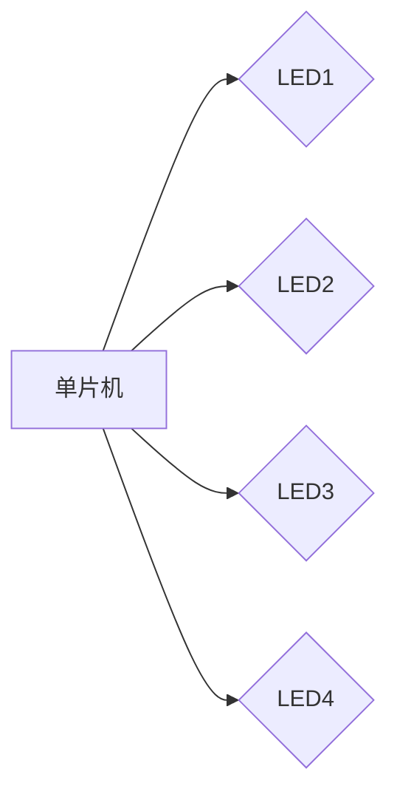
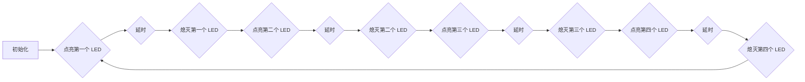

# 基于单片机花样流水灯的设计与实现

作者：禅与计算机程序设计艺术

## 1. 背景介绍

### 1.1 流水灯的魅力与应用

流水灯，作为一种经典的电子设计，以其简单结构和绚丽效果，一直以来深受电子爱好者和工程师们的喜爱。从简单的跑马灯到复杂的图案显示，流水灯不仅可以作为电子电路学习的入门项目，也广泛应用于各种指示、装饰和娱乐领域。

### 1.2 单片机控制的优势

传统的流水灯设计往往采用分立元件搭建，电路复杂且难以实现复杂的灯光效果。而随着单片机技术的快速发展，利用单片机控制流水灯，可以极大地简化电路设计，并实现更加灵活多变的灯光控制。

### 1.3 本文目标

本文将介绍如何利用单片机设计和实现一款花样流水灯。文章将从硬件电路设计、软件编程、调试技巧等方面进行详细阐述，并结合实际案例，帮助读者快速掌握基于单片机控制流水灯的方法。

## 2. 核心概念与联系

### 2.1 单片机

#### 2.1.1 定义与功能

单片机，全称单片微型计算机，是一种将中央处理器、存储器、输入输出接口等集成在一块芯片上的微型计算机系统。它具有体积小、功耗低、价格便宜等优点，广泛应用于各种嵌入式系统中。

#### 2.1.2 工作原理

单片机通过执行预先存储在程序存储器中的指令来控制外部设备。程序指令以二进制代码的形式存储，单片机按照指令顺序逐条执行，实现对外部设备的控制。

### 2.2 LED 发光二极管

#### 2.2.1 工作原理

LED 是一种半导体器件，当电流通过时会发光。LED 的正向导通电压一般为 1.5V-3.3V，工作电流一般为几毫安到几十毫安。

#### 2.2.2 控制方式

可以通过控制 LED 两端的电压或电流来控制其亮度。

### 2.3 I/O 端口

#### 2.3.1 定义与功能

单片机的 I/O 端口是单片机与外部设备进行数据交换的接口。通过 I/O 端口，单片机可以读取外部设备的状态，也可以向外部设备发送控制信号。

#### 2.3.2 工作方式

I/O 端口可以配置为输入模式或输出模式。在输出模式下，单片机可以通过 I/O 端口输出高电平或低电平，控制外部设备；在输入模式下，单片机可以通过 I/O 端口读取外部设备的电平状态。

## 3. 核心算法原理具体操作步骤

### 3.1 硬件电路设计

#### 3.1.1 电路原理图



#### 3.1.2 元器件选择

- 单片机：STC89C52
- LED：红色 LED
- 电阻：220Ω

#### 3.1.3 电路连接

将 LED 的正极连接到单片机的 I/O 口，负极连接到电阻，电阻的另一端连接到 GND。

### 3.2 软件编程

#### 3.2.1 程序流程图



#### 3.2.2 代码实现

```c
#include <reg52.h>

sbit LED1 = P1^0;
sbit LED2 = P1^1;
sbit LED3 = P1^2;
sbit LED4 = P1^3;

void delay(unsigned int ms)
{
    unsigned int i, j;
    for (i = 0; i < ms; i++)
        for (j = 0; j < 110; j++);
}

void main()
{
    while (1)
    {
        LED1 = 0;
        delay(500);
        LED1 = 1;

        LED2 = 0;
        delay(500);
        LED2 = 1;

        LED3 = 0;
        delay(500);
        LED3 = 1;

        LED4 = 0;
        delay(500);
        LED4 = 1;
    }
}
```

### 3.3 调试技巧

#### 3.3.1 硬件调试

- 检查电路连接是否正确
- 使用万用表测量 LED 两端的电压和电流

#### 3.2.2 软件调试

- 使用仿真器进行单步调试
- 使用串口打印调试信息

## 4. 数学模型和公式详细讲解举例说明

本项目中，不需要用到复杂的数学模型和公式。

## 5. 项目实践：代码实例和详细解释说明

### 5.1 代码实例

```c
#include <reg52.h>

sbit LED1 = P1^0;
sbit LED2 = P1^1;
sbit LED3 = P1^2;
sbit LED4 = P1^3;

void delay(unsigned int ms)
{
    unsigned int i, j;
    for (i = 0; i < ms; i++)
        for (j = 0; j < 110; j++);
}

void main()
{
    unsigned char i;
    while (1)
    {
        for (i = 0; i < 4; i++)
        {
            P1 = ~(0x01 << i);
            delay(500);
        }
    }
}
```

### 5.2 代码解释

- `#include <reg52.h>`：包含单片机头文件，定义了单片机的寄存器和特殊功能寄存器。
- `sbit LED1 = P1^0;`：定义 LED1 连接到 P1 口的第 0 位。
- `void delay(unsigned int ms)`：延时函数，用于控制流水灯的闪烁速度。
- `void main()`：主函数，程序的入口。
- `unsigned char i;`：定义一个无符号字符型变量 i，用于循环控制 LED 的亮灭。
- `for (i = 0; i < 4; i++)`：循环 4 次，控制 4 个 LED 的亮灭。
- `P1 = ~(0x01 << i);`：将 P1 口的对应位清零，点亮对应的 LED。
- `delay(500);`：延时 500 毫秒，控制 LED 的亮度。

## 6. 实际应用场景

- **指示灯：** 可以用作各种设备的电源指示灯、工作状态指示灯等。
- **装饰灯：** 可以制作各种图案的装饰灯，例如星星灯、心形灯等。
- **玩具：** 可以制作各种发光玩具，例如发光陀螺、发光飞机等。

## 7. 总结：未来发展趋势与挑战

### 7.1 未来发展趋势

- **集成化：** 随着集成电路技术的不断发展，未来单片机的集成度将越来越高，功能也将更加强大。
- **智能化：** 随着人工智能技术的不断发展，未来单片机将更加智能化，可以实现更加复杂的控制功能。
- **低功耗：** 随着物联网技术的不断发展，未来单片机将更加注重低功耗设计，以延长电池寿命。

### 7.2 面临的挑战

- **软件复杂度：** 随着单片机功能的不断增强，软件的复杂度也越来越高，对软件开发人员提出了更高的要求。
- **功耗控制：** 随着单片机应用领域的不断扩大，功耗控制成为了一个重要的挑战。
- **安全性：** 随着物联网技术的不断发展，单片机的安全性也越来越重要。

## 8. 附录：常见问题与解答

### 8.1 为什么我的流水灯不亮？

- 检查电路连接是否正确。
- 检查 LED 是否损坏。
- 检查代码是否正确。

### 8.2 如何改变流水灯的闪烁速度？

- 改变延时函数中的延时时间。

### 8.3 如何实现更加复杂的流水灯效果？

- 可以使用定时器中断来控制 LED 的亮灭。
- 可以使用不同的 LED 连接方式来实现不同的灯光效果。


希望本文能够帮助读者了解基于单片机控制流水灯的基本原理和方法，并能够根据自己的需求设计和实现更加复杂、更加炫丽的流水灯效果。 
