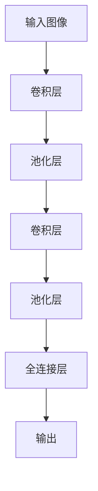
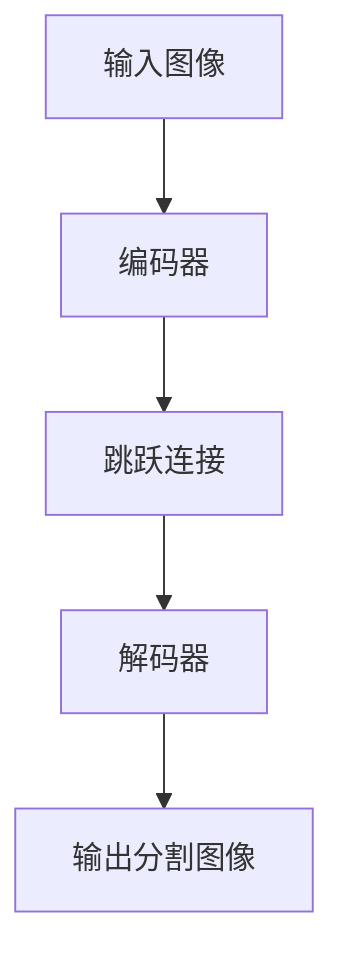

# 基于卷积神经网络的医学图像分割

作者：禅与计算机程序设计艺术

## 1. 背景介绍

### 1.1 医学图像分割的重要性

医学图像分割是现代医学影像分析中的一项关键技术。通过将医学图像中的不同组织、器官和病变区域进行精确分割，医生可以更好地进行诊断、治疗计划和术后评估。传统的分割方法依赖于手工标注和简单的图像处理技术，效率低且准确性不高。随着深度学习技术的快速发展，卷积神经网络（CNN）在医学图像分割中展现出了强大的能力。

### 1.2 卷积神经网络的崛起

卷积神经网络（Convolutional Neural Network, CNN）是一种专门用于处理具有网格结构数据（如图像）的深度学习模型。其通过卷积层、池化层和全连接层的组合，能够自动学习图像中的特征，从而实现高效的图像识别和分割。CNN 在 ImageNet 大赛上的成功引起了广泛关注，并迅速在医学图像处理领域得到了应用。

### 1.3 医学图像分割的挑战

尽管 CNN 在医学图像分割中展现了巨大的潜力，但仍然面临诸多挑战：
- **数据获取和标注困难**：医学图像数据通常需要专业医生进行标注，成本高且耗时。
- **图像质量和多样性**：医学图像质量参差不齐，且不同设备、不同病人的图像差异较大。
- **精度和速度的平衡**：分割模型需要在保证高精度的同时，具备较快的处理速度。

## 2. 核心概念与联系

### 2.1 卷积神经网络的基本结构

卷积神经网络的基本结构包括卷积层、池化层和全连接层：

- **卷积层**：通过卷积核对输入图像进行卷积操作，提取图像的局部特征。
- **池化层**：通过下采样操作减少特征图的尺寸，降低计算复杂度，同时保留重要特征。
- **全连接层**：将高维特征映射到分类空间，实现最终的分类或分割。



### 2.2 U-Net：医学图像分割的经典模型

U-Net 是一种专门为生物医学图像分割设计的卷积神经网络结构。其特点是通过对称的编码器-解码器结构，实现了对图像的高效分割。

- **编码器**：通过一系列卷积和池化操作，逐步提取图像的高层特征。
- **解码器**：通过反卷积和上采样操作，逐步恢复图像的空间分辨率。
- **跳跃连接**：在编码器和解码器之间引入跳跃连接，保留高分辨率特征，提高分割精度。



### 2.3 其他常见的分割模型

除了 U-Net，还有一些常见的医学图像分割模型，如 SegNet、DeepLab 和 Mask R-CNN 等。这些模型在不同的应用场景中展现了各自的优势。

## 3. 核心算法原理具体操作步骤

### 3.1 数据预处理

在进行医学图像分割之前，需要对数据进行预处理，以提高模型的性能和稳定性。常见的数据预处理步骤包括：

- **图像归一化**：将图像像素值归一化到[0, 1]或[-1, 1]区间，消除不同图像间的亮度差异。
- **数据增强**：通过旋转、平移、翻转等操作增加数据的多样性，防止模型过拟合。
- **图像裁剪和缩放**：将图像裁剪或缩放到固定尺寸，保证输入数据的一致性。

### 3.2 模型构建

以 U-Net 为例，构建一个医学图像分割模型的步骤如下：

1. **编码器部分**：
    - 使用多层卷积和池化操作提取图像特征。
    - 每层卷积后使用 ReLU 激活函数，增强非线性表达能力。

2. **解码器部分**：
    - 使用反卷积和上采样操作恢复图像尺寸。
    - 与编码器部分的对应层进行跳跃连接，融合高分辨率特征。

3. **输出层**：
    - 使用 1x1 卷积将特征图映射到分割结果。
    - 使用 Softmax 激活函数输出每个像素的类别概率。

### 3.3 模型训练

模型训练的步骤包括：

- **损失函数**：常用的损失函数有交叉熵损失和 Dice 损失，前者适用于多分类问题，后者适用于不平衡数据。
- **优化器**：常用的优化器有 Adam 和 SGD，前者收敛速度快，后者适用于大规模数据。
- **训练策略**：使用交叉验证评估模型性能，调整超参数如学习率、批量大小等。

### 3.4 模型评估

模型评估的指标包括：

- **准确率**：分割结果中正确分类的像素占总像素的比例。
- **召回率**：正确分类的正样本占所有正样本的比例。
- **F1-score**：准确率和召回率的调和平均值，综合评估模型性能。

## 4. 数学模型和公式详细讲解举例说明

### 4.1 卷积操作

卷积操作是 CNN 的核心，通过卷积核对输入图像进行局部加权求和，提取特征。卷积操作的数学表示为：

$$
y(i, j) = \sum_{m=0}^{M-1} \sum_{n=0}^{N-1} x(i+m, j+n) \cdot w(m, n)
$$

其中，$x$ 为输入图像，$w$ 为卷积核，$y$ 为输出特征图。

### 4.2 池化操作

池化操作通过下采样减少特征图的尺寸，常用的池化操作有最大池化和平均池化。最大池化的数学表示为：

$$
y(i, j) = \max_{m=0}^{M-1} \max_{n=0}^{N-1} x(i+m, j+n)
$$

### 4.3 反卷积操作

反卷积操作用于恢复图像尺寸，其数学表示为：

$$
y(i, j) = \sum_{m=0}^{M-1} \sum_{n=0}^{N-1} x(i-m, j-n) \cdot w(m, n)
$$

### 4.4 损失函数

交叉熵损失函数用于衡量分割结果与真实标签之间的差异，其数学表示为：

$$
L = -\sum_{i=1}^{N} \sum_{c=1}^{C} y_{i,c} \log(p_{i,c})
$$

其中，$N$ 为像素数，$C$ 为类别数，$y_{i,c}$ 为第 $i$ 个像素的真实标签，$p_{i,c}$ 为第 $i$ 个像素属于类别 $c$ 的概率。

### 4.5 Dice 损失

Dice 损失用于不平衡数据的分割，其数学表示为：

$$
L_{Dice} = 1 - \frac{2 \sum_{i=1}^{N} y_{i} p_{i}}{\sum_{i=1}^{N} y_{i} + \sum_{i=1}^{N} p_{i}}
$$

其中，$y_{i}$ 为第 $i$ 个像素的真实标签，$p_{i}$ 为第 $i$ 个像素的预测概率。

## 5. 项目实践：代码实例和详细解释说明

### 5.1 数据预处理

```python
import numpy as np
import cv2
from tensorflow.keras.preprocessing.image import ImageDataGenerator

def preprocess_image(image):
    # 图像归一化
    image = image / 255.0
    return image

def augment_data(image, mask):
    # 数据增强
    data_gen_args = dict(rotation_range=