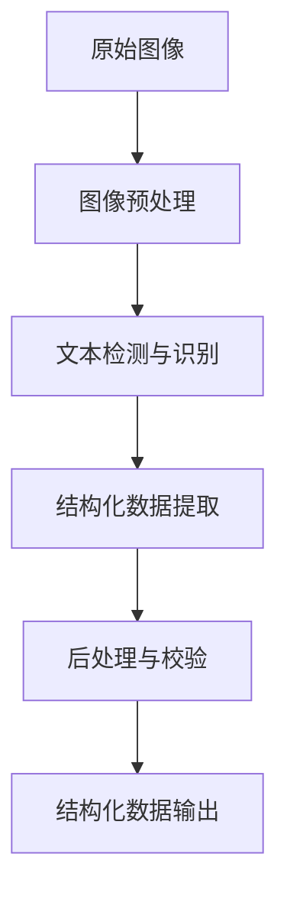

# 基于图像的结构化数值识别系统的设计与实现

## 1. 背景介绍

在当今数字化时代,结构化数据的采集和处理成为了许多行业的关键需求。传统的人工输入方式不仅效率低下,而且容易出现错误。因此,自动化的结构化数据识别技术应运而生,其中基于图像的结构化数值识别系统就是一种非常有用的解决方案。

该系统旨在从图像中自动提取结构化的数值数据,广泛应用于银行支票、发票、表格、测量仪表等多个领域。它可以大幅提高数据采集效率,降低人工成本,并确保数据准确性,为企业带来巨大价值。

### 1.1 传统数据采集方式的挑战

- 人工输入效率低下且容易出错
- 无法快速处理大量图像数据
- 对于特殊格式的数据难以识别

### 1.2 基于图像的结构化数值识别系统的优势

- 自动化程度高,减少人工干预
- 能够快速高效处理海量图像数据
- 准确率高,可识别特殊格式数据
- 可集成到不同业务系统中使用

## 2. 核心概念与联系 

### 2.1 计算机视觉

计算机视觉(Computer Vision)是该系统的理论基础,它赋予计算机以"视觉"的能力,使之能够从图像或视频中获取有意义的高层次信息。主要包括以下几个方面:

- 图像处理:对原始图像进行预处理,如降噪、增强、分割等
- 特征提取:从图像中提取有用的特征,如边缘、角点、纹理等
- 模式识别:基于提取的特征对图像进行分类和识别

### 2.2 光学字符识别(OCR)

OCR(Optical Character Recognition)技术是将图像上的文字转换为机器可编辑格式的过程。它是结构化数值识别系统的核心部分,用于识别和提取图像中的数字和文本信息。

### 2.3 模式匹配

模式匹配是计算机视觉中的一个重要概念,指的是在图像中查找与给定模板相匹配的区域。在结构化数值识别中,它可用于定位特定的数值区域,如表格单元格、仪表读数等。

### 2.4 机器学习

机器学习算法在该系统中发挥着重要作用,尤其是深度学习技术。通过大量标注数据进行训练,可以学习到有效的特征表示和分类模型,提高数值识别的准确性。

## 3. 核心算法原理具体操作步骤

结构化数值识别系统的核心算法一般包括以下几个主要步骤:

### 3.1 图像预处理

1. **图像去噪**:使用滤波等方法消除图像中的噪声,提高图像质量。
2. **图像增强**:对比度拉伸、直方图均衡等技术,增强图像的对比度和清晰度。
3. **图像分割**:将图像分割为不同的区域,如文本区域、表格区域等。

### 3.2 文本检测与识别

1. **文本区域检测**:使用基于连通区域分析或深度学习模型对图像进行扫描,定位文本区域。
2. **文本行构造**:将检测到的文本区域按行构造,为后续的OCR识别做准备。
3. **OCR识别**:采用经过训练的OCR模型,对构造好的文本行进行字符识别,得到原始文本。

### 3.3 结构化数据提取

1. **模板匹配**:将预定义的数值区域模板(如表格单元格、仪表刻度等)在图像中进行匹配,定位数值区域。
2. **数值解析**:对定位到的数值区域应用OCR或其他算法进行解析,得到对应的数值。
3. **上下文理解**:结合周围的文本信息,对提取的数值进行语义解析,确定其含义。
4. **结构化存储**:将提取和解析的结果按照预定义的数据模型存储为结构化数据。

### 3.4 后处理与校验

1. **数据规范化**:对提取的数值进行格式统一、单位转换等规范化处理。
2. **异常值检测**:检测并过滤掉明显异常的数值,提高数据质量。
3. **人工校验**:可选的人工审核环节,对识别结果进行抽样检查和反馈。

整个流程可以用下面的流程图直观地展示:



## 4. 数学模型和公式详细讲解举例说明

在结构化数值识别系统中,常用的数学模型和公式主要集中在以下几个方面:

### 4.1 图像处理

**1. 图像滤波**

图像滤波是去除图像噪声、模糊等的重要手段。常用的滤波方法包括均值滤波、高斯滤波、中值滤波等。以高斯滤波为例,其数学表达式为:

$$
G(x,y) = \frac{1}{2\pi\sigma^2}e^{-\frac{x^2+y^2}{2\sigma^2}}
$$

其中$(x,y)$是滤波掩模的坐标,而$\sigma$是标准差,用于控制滤波强度。

**2. 直方图均衡**

直方图均衡是一种常用的图像增强技术,它通过拉伸图像的对比度来增强细节。设原始图像的灰度级为$r_k$,其概率密度函数为$p_r(r_k)$,则经过直方图均衡后的图像灰度级$s_k$为:

$$
s_k = T(r_k) = \sum_{j=0}^{k}(L-1)p_r(r_j)
$$

其中$L$是可能的灰度级数。

### 4.2 文本检测

**1. 基于连通区域分析的文本检测**

连通区域分析是一种传统的文本检测方法,它根据像素的连通性将图像分割为不同的区域。设$R$为一个连通区域,其水平、垂直投影可表示为:

$$
\begin{aligned}
P_h(y) &= \sum_{x}R(x,y) \\
P_v(x) &= \sum_{y}R(x,y)
\end{aligned}
$$

通过分析投影特征,可以判断该区域是否为文本区域。

**2. 基于深度学习的文本检测**

深度学习模型在文本检测任务中表现出色,如CTPN(Connectionist Text Proposal Network)。它将文本检测问题建模为回归问题,预测文本区域的垂直坐标和分数,可表示为:

$$
y^* = (v_c, h_c, \theta_c, \alpha_c, \beta_c)
$$

其中$v_c$和$h_c$分别表示文本区域的垂直坐标,$\theta_c$为旋转角度,$\alpha_c$和$\beta_c$控制文本区域的宽高比。

### 4.3 光学字符识别(OCR)

**1. 基于模板匹配的OCR**

早期的OCR系统常采用模板匹配的方式进行字符识别。设$T(x,y)$为字符模板,$I(x,y)$为输入图像,则两者的相似度可用平方差公式计算:

$$
D(T,I) = \sum_{x,y}[T(x,y) - I(x+u,y+v)]^2
$$

识别结果即为与输入图像最相似的模板字符。

**2. 基于深度学习的OCR**

现代OCR系统多采用深度学习模型,如CRNN(Convolutional Recurrent Neural Network)。它由卷积层提取特征,循环层捕获上下文信息,最终输出每个字符的概率分布:

$$
P(l_t|I,\theta) = \text{CRNN}(I,\theta)
$$

其中$l_t$表示时间步$t$的字符标签,$I$为输入图像,$\theta$为模型参数。通过beam search等算法可得到最终的文本输出。

### 4.4 模式匹配

模式匹配是结构化数值识别的重要环节,用于定位数值区域。常用的相似度度量包括归一化互相关(NCC)、平方差(SSD)等。以NCC为例,设$T(x,y)$为模板图像,$I(x,y)$为输入图像,则它们在位移$(u,v)$处的相似度为:

$$
\gamma(u,v) = \frac{\sum_{x,y}[T(x,y)-\bar{T}][I(x+u,y+v)-\bar{I}]}{\sqrt{\sum_{x,y}[T(x,y)-\bar{T}]^2\sum_{x,y}[I(x+u,y+v)-\bar{I}]^2}}
$$

其中$\bar{T}$和$\bar{I}$分别表示模板和输入图像的均值。相似度越高,匹配度越好。

以上是结构化数值识别系统中常用的一些数学模型和公式,实际应用中还有许多其他方法,如形状匹配、投影分析等,根据具体场景进行选择和组合。

## 5. 项目实践:代码实例和详细解释说明

为了更好地理解结构化数值识别系统的实现,我们将通过一个实际项目案例来演示关键代码和实现细节。这个项目旨在从表格图像中提取结构化数据。

我们将使用Python编程语言,并利用流行的计算机视觉库OpenCV和深度学习框架PyTorch来实现该系统。

### 5.1 环境配置

首先,我们需要安装必要的Python包:

```bash
pip install opencv-python torch torchvision
```

### 5.2 图像预处理

```python
import cv2

def preprocess_image(image_path):
    """
    预处理输入图像
    :param image_path: 图像路径
    :return: 预处理后的图像
    """
    # 读取图像
    image = cv2.imread(image_path)
    
    # 转换为灰度图像
    gray = cv2.cvtColor(image, cv2.COLOR_BGR2GRAY)
    
    # 应用高斯滤波去噪
    blurred = cv2.GaussianBlur(gray, (5, 5), 0)
    
    # 应用自适应阈值二值化
    thresh = cv2.adaptiveThreshold(blurred, 255, cv2.ADAPTIVE_THRESH_GAUSSIAN_C, cv2.THRESH_BINARY_INV, 11, 2)
    
    return thresh
```

在这个函数中,我们首先读取输入图像,然后转换为灰度图像。接下来,我们使用高斯滤波去除图像噪声,最后应用自适应阈值二值化,得到二值图像。这些步骤有助于提高后续处理的准确性。

### 5.3 文本检测与识别

```python
import pytesseract

def detect_and_recognize_text(image):
    """
    检测和识别图像中的文本
    :param image: 输入图像
    :return: 识别结果字典,包含文本和对应的边界框坐标
    """
    # 检测文本区域
    data = pytesseract.image_to_data(image, output_type=pytesseract.Output.DICT)
    
    text_boxes = []
    for i in range(len(data['text'])):
        if data['text'][i].strip():
            x, y, w, h = data['left'][i], data['top'][i], data['width'][i], data['height'][i]
            text = data['text'][i]
            text_boxes.append({'text': text, 'box': [x, y, x+w, y+h]})
    
    return text_boxes
```

在这个函数中,我们使用pytesseract库来检测和识别图像中的文本。pytesseract是一个开源的OCR引擎,它封装了Google的Tesseract-OCR引擎。

首先,我们调用`image_to_data`函数,它会返回一个字典,包含文本、边界框坐标等信息。然后,我们遍历这个字典,提取出有效的文本和对应的边界框坐标,存储在一个列表中返回。

### 5.4 结构化数据提取

```python
import re

def extract_structured_data(text_boxes, table_template):
    """
    从文本框中提取结构化数据
    :param text_boxes: 文本框列表
    :param table_template: 表格模板
    :return: 提取的结构化数据
    """
    structured_data = []
    
    # 遍历文本框
    for text_box in text_boxes:
        text = text_box['text']
        box = text_box['box']
        
        # 使用正则