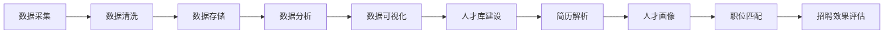

# 基于大数据的招聘数据分析与应用

## 1. 背景介绍

### 1.1 招聘行业现状与挑战

随着互联网和信息技术的快速发展，全球经济一体化进程不断加快，企业间的竞争日益激烈，对人才的需求也越来越高。传统的招聘模式已经难以满足企业的需求，主要体现在以下几个方面：

* **信息不对称:**  求职者与企业之间存在严重的信息不对称问题，求职者难以获取到企业的真实招聘需求，企业也难以找到真正符合要求的人才。
* **招聘效率低下:**  传统的招聘流程繁琐，效率低下，企业需要花费大量的时间和精力筛选简历、安排面试等，而求职者也需要花费大量的时间和精力投递简历、参加面试等。
* **招聘成本高昂:**  企业需要在招聘过程中投入大量的资金，包括招聘网站费用、猎头费用、面试差旅费用等。
* **人才流失率高:**  由于招聘过程中的信息不对称和效率低下，导致企业招聘到的人才与实际需求不符，从而导致人才流失率居高不下。

### 1.2 大数据技术为招聘带来的机遇

近年来，大数据技术飞速发展，为解决传统招聘行业面临的挑战提供了新的思路和方法。大数据技术可以帮助企业：

* **精准画像:** 通过对海量数据的分析，可以精准刻画出目标人才的画像，包括技能、经验、性格、兴趣爱好等，从而帮助企业更精准地定位目标人才。
* **智能匹配:**  利用机器学习算法，可以将求职者与企业的招聘需求进行智能匹配，提高招聘效率。
* **数据驱动决策:**  通过对招聘数据的分析，可以帮助企业更好地了解招聘市场趋势、人才流动情况等，为企业的招聘决策提供数据支持。

## 2. 核心概念与联系

### 2.1  大数据在招聘领域的应用场景

* **人才库建设:**  利用爬虫技术从各大招聘网站、社交平台等渠道抓取海量简历数据，构建企业自己的人才库。
* **简历解析:**  利用自然语言处理技术对简历进行结构化解析，提取关键信息，如工作经历、教育背景、项目经验、技能特长等。
* **人才画像:**  基于简历数据、社交数据、行为数据等多维度数据，构建人才画像模型，对人才进行精准刻画。
* **职位匹配:**  基于人才画像和职位需求，利用机器学习算法进行智能匹配，推荐最合适的候选人。
* **招聘效果评估:**  对招聘过程中的各个环节进行数据跟踪和分析，评估招聘效果，优化招聘流程。

### 2.2  关键技术

* **数据采集:**  爬虫技术、API接口调用等。
* **数据清洗:**  数据去重、缺失值处理、异常值处理等。
* **数据存储:**  关系型数据库、NoSQL数据库等。
* **数据分析:**  统计分析、机器学习、深度学习等。
* **数据可视化:**  图表、报表、地图等。

### 2.3  核心概念之间的联系



## 3. 核心算法原理具体操作步骤

### 3.1  人才画像构建

#### 3.1.1  数据准备

* 收集简历数据、社交数据、行为数据等。
* 对数据进行清洗、去重、格式转换等预处理操作。

#### 3.1.2  特征工程

* 从原始数据中提取出能够反映人才特征的变量，例如：
    * 工作年限、教育背景、技能特长、项目经验、工作内容、兴趣爱好、性格特点等。
* 对特征进行编码，例如：
    * one-hot编码、label-encoding、embedding等。

#### 3.1.3  模型训练

* 选择合适的机器学习算法，例如：
    * 聚类算法：K-Means、DBSCAN等。
    * 分类算法：逻辑回归、支持向量机、决策树等。
* 利用历史数据对模型进行训练，并对模型进行评估和优化。

#### 3.1.4  人才画像生成

* 利用训练好的模型对新的人才数据进行预测，生成人才画像标签。

### 3.2  职位匹配

#### 3.2.1  职位需求分析

* 对职位描述进行文本分析，提取出关键信息，例如：
    * 职位名称、职位职责、任职要求、薪资待遇等。
* 将职位需求转化为结构化的数据，例如：
    * 技能要求：Python、Java、机器学习等。
    * 经验要求：3年以上工作经验、有大型项目经验等。

#### 3.2.2  相似度计算

* 利用余弦相似度、Jaccard相似度等算法计算人才画像与职位需求之间的相似度。

#### 3.2.3  候选人排序

* 根据相似度得分对候选人进行排序，推荐最匹配的候选人。

## 4. 数学模型和公式详细讲解举例说明

### 4.1  TF-IDF算法

TF-IDF（Term Frequency-Inverse Document Frequency）是一种用于信息检索与数据挖掘的常用加权技术。它是一种统计方法，用以评估一字词对于一个文件集或一个语料库中的其中一份文件的重要程度。字词的重要性随着它在文件中出现的次数成正比增加，但同时会随着它在语料库中出现的频率成反比下降。

**TF:** 词频，是指某个词在该文档中出现的频率。

$$
TF_{i,j} = \frac{n_{i,j}}{\sum_{k}n_{k,j}}
$$

其中，$n_{i,j}$ 表示词语 $i$ 在文档 $j$ 中出现的次数，$\sum_{k}n_{k,j}$ 表示文档 $j$ 中所有词语的出现次数之和。

**IDF:** 逆文档频率，是指包含某个词的文档在所有文档中所占的比例的倒数的对数。

$$
IDF_i = log(\frac{|D|}{|\{j:t_i \in d_j\}|})
$$

其中，$|D|$ 表示文档总数，$|\{j:t_i \in d_j\}|$ 表示包含词语 $i$ 的文档数。

**TF-IDF:** 词频-逆文档频率，将 TF 和 IDF 相乘，即可得到词语的 TF-IDF 值。

$$
TF-IDF_{i,j} = TF_{i,j} \times IDF_i
$$

**举例说明：**

假设我们有以下三个文档：

* 文档 1: "我喜欢吃苹果"
* 文档 2: "我喜欢吃香蕉"
* 文档 3: "我喜欢吃苹果和香蕉"

现在我们想要计算词语 "苹果" 在每个文档中的 TF-IDF 值。

**步骤 1：计算词频 (TF)**

| 词语 | 文档 1 | 文档 2 | 文档 3 |
|---|---|---|---|
| 我 | 1/4 | 1/4 | 1/6 |
| 喜欢 | 1/4 | 1/4 | 1/6 |
| 吃 | 1/4 | 1/4 | 1/6 |
| 苹果 | 1/4 | 0 | 1/6 |
| 香蕉 | 0 | 1/4 | 1/6 |

**步骤 2：计算逆文档频率 (IDF)**

| 词语 | 包含该词语的文档数 | IDF |
|---|---|---|
| 我 | 3 | log(3/3) = 0 |
| 喜欢 | 3 | log(3/3) = 0 |
| 吃 | 3 | log(3/3) = 0 |
| 苹果 | 2 | log(3/2) = 0.405 |
| 香蕉 | 2 | log(3/2) = 0.405 |

**步骤 3：计算 TF-IDF**

| 词语 | 文档 1 | 文档 2 | 文档 3 |
|---|---|---|---|
| 我 | 0 | 0 | 0 |
| 喜欢 | 0 | 0 | 0 |
| 吃 | 0 | 0 | 0 |
| 苹果 | 0.101 | 0 | 0.067 |
| 香蕉 | 0 | 0.101 | 0.067 |

从结果可以看出，词语 "苹果" 在文档 1 和文档 3 中的 TF-IDF 值较高，说明该词语在这两个文档中具有较高的重要性。

### 4.2  余弦相似度

余弦相似度是一种度量两个向量之间相似度的方法，其计算方法是计算两个向量夹角的余弦值。

**公式：**

$$
similarity = cos(\theta) = \frac{\vec{a} \cdot \vec{b}}{||\vec{a}|| \times ||\vec{b}||}
$$

其中，$\vec{a}$ 和 $\vec{b}$ 分别表示两个向量，$\cdot$ 表示向量点积，$||\vec{a}||$ 和 $||\vec{b}||$ 分别表示两个向量的模长。

**举例说明：**

假设我们有两个向量：

* $\vec{a} = (1, 2, 3)$
* $\vec{b} = (4, 5, 6)$

**步骤 1：计算向量点积**

$\vec{a} \cdot \vec{b} = 1 \times 4 + 2 \times 5 + 3 \times 6 = 32$

**步骤 2：计算向量模长**

$||\vec{a}|| = \sqrt{1^2 + 2^2 + 3^2} = \sqrt{14}$

$||\vec{b}|| = \sqrt{4^2 + 5^2 + 6^2} = \sqrt{77}$

**步骤 3：计算余弦相似度**

$similarity = cos(\theta) = \frac{32}{\sqrt{14} \times \sqrt{77}} = 0.974$

因此，向量 $\vec{a}$ 和 $\vec{b}$ 的余弦相似度为 0.974，说明这两个向量非常相似。

## 5. 项目实践：代码实例和详细解释说明

### 5.1  数据采集

```python
# 导入库
import requests
from bs4 import BeautifulSoup

# 设置请求头
headers = {
    'User-Agent': 'Mozilla/5.0 (Windows NT 10.0; Win64; x64) AppleWebKit/537.36 (KHTML, like Gecko) Chrome/58.0.3029.110 Safari/537.36'
}

# 发送请求
response = requests.get('https://www.zhaopin.com/', headers=headers)

# 解析网页
soup = BeautifulSoup(response.content, 'html.parser')

# 提取数据
jobs = soup.find_all('div', class_='job-info')
for job in jobs:
    title = job.find('h3').text.strip()
    company = job.find('p', class_='company-name').text.strip()
    location = job.find('p', class_='job-location').text.strip()
    salary = job.find('p', class_='job-salary').text.strip()

    print(f'职位名称：{title}')
    print(f'公司名称：{company}')
    print(f'工作地点：{location}')
    print(f'薪资待遇：{salary}')
    print('-' * 50)
```

**代码解释：**

* 首先，我们导入了 `requests` 和 `BeautifulSoup` 库，用于发送 HTTP 请求和解析 HTML 网页。
* 然后，我们设置了请求头，模拟浏览器发送请求，避免被网站识别为爬虫程序。
* 接着，我们发送 HTTP 请求，获取招聘网站的网页内容。
* 使用 `BeautifulSoup` 库解析网页，并使用 `find_all()` 方法找到所有包含职位信息的 `div` 元素。
* 遍历所有职位信息，使用 `find()` 方法提取职位名称、公司名称、工作地点和薪资待遇等信息。
* 最后，将提取到的信息打印输出。

### 5.2  简历解析

```python
# 导入库
import re

# 定义正则表达式
name_regex = r'姓名[:|：](.*)'
phone_regex = r'手机[:|：](.*)'
email_regex = r'邮箱[:|：](.*)'

# 读取简历内容
with open('resume.txt', 'r', encoding='utf-8') as f:
    resume = f.read()

# 提取姓名
name = re.findall(name_regex, resume)
if name:
    name = name[0].strip()
else:
    name = ''

# 提取手机号码
phone = re.findall(phone_regex, resume)
if phone:
    phone = phone[0].strip()
else:
    phone = ''

# 提取邮箱地址
email = re.findall(email_regex, resume)
if email:
    email = email[0].strip()
else:
    email = ''

# 打印提取结果
print(f'姓名：{name}')
print(f'手机号码：{phone}')
print(f'邮箱地址：{email}')
```

**代码解释：**

* 首先，我们导入了 `re` 模块，用于正则表达式操作。
* 然后，我们定义了三个正则表达式，用于匹配姓名、手机号码和邮箱地址。
* 接着，我们读取简历文件的内容。
* 使用 `re.findall()` 方法根据正则表达式提取相应的信息。
* 最后，将提取到的信息打印输出。

### 5.3  人才画像构建

```python
# 导入库
from sklearn.feature_extraction.text import TfidfVectorizer
from sklearn.cluster import KMeans

# 读取简历数据
resumes = []
with open('resumes.txt', 'r', encoding='utf-8') as f:
    for line in f:
        resumes.append(line.strip())

# 创建 TF-IDF 向量化器
vectorizer = TfidfVectorizer()

# 将简历数据转换为 TF-IDF 向量
vectors = vectorizer.fit_transform(resumes)

# 创建 KMeans 聚类模型
kmeans = KMeans(n_clusters=3)

# 对 TF-IDF 向量进行聚类
kmeans.fit(vectors)

# 获取每个简历所属的类别
labels = kmeans.labels_

# 打印聚类结果
for i, label in enumerate(labels):
    print(f'简历 {i+1} 所属类别：{label}')
```

**代码解释：**

* 首先，我们导入了 `TfidfVectorizer` 和 `KMeans` 类，用于 TF-IDF 向量化和 KMeans 聚类。
* 然后，我们读取简历数据，并将每条简历存储在一个列表中。
* 创建 `TfidfVectorizer` 对象，并将简历数据转换为 TF-IDF 向量。
* 创建 `KMeans` 对象，并设置聚类数为 3。
* 使用 `fit()` 方法对 TF-IDF 向量进行聚类。
* 使用 `labels_` 属性获取每个简历所属的类别。
* 最后，打印聚类结果，显示每个简历所属的类别。

## 6. 实际应用场景

* **大型企业招聘:**  大型企业招聘需求量大，候选人数量多，传统招聘方式效率低下，大数据招聘可以通过人才画像和智能匹配技术提高招聘效率和质量。
* **猎头公司:**  猎头公司需要快速、精准地找到符合客户需求的候选人，大数据招聘可以通过人才库和职位匹配技术提高猎头效率。
* **人力资源服务平台:**  人力资源服务平台可以利用大数据技术为企业提供人才画像、职位匹配、招聘效果评估等服务。

## 7. 工具和资源推荐

### 7.1  数据采集工具

* **八爪鱼:**  一款可视化爬虫软件，操作简单，功能强大。
* **火车采集器:**  一款老牌爬虫软件，功能强大，但操作相对复杂。
* **Python 爬虫库:**  requests、BeautifulSoup、Scrapy 等。

### 7.2  数据分析工具

* **Python 数据科学库:**  NumPy、Pandas、Scikit-learn 等。
* **R 语言:**  一款开源的数据分析和统计软件。

### 7.3  数据可视化工具

* **Tableau:**  一款商业数据可视化软件，功能强大，操作简单。
* **Power BI:**  微软公司开发的数据可视化工具，功能强大，与 Office 软件深度集成。

## 8. 总结：未来发展趋势与挑战

### 8.1  未来发展趋势

* **人工智能技术将更加深入地应用于招聘领域:**  例如，自然语言处理技术可以用于自动筛选简历、智能问答等场景，机器学习算法可以用于人才推荐、招聘预测等场景。
* **招聘流程将更加个性化和智能化:**  例如，企业可以根据候选人的不同特点，定制不同的招聘流程，提高候选人体验。
* **数据安全和隐私保护将更加受到重视:**  企业在使用大数据技术进行招聘时，需要更加重视数据安全和隐私保护问题，避免数据泄露和滥用。

### 8.2  挑战

* **