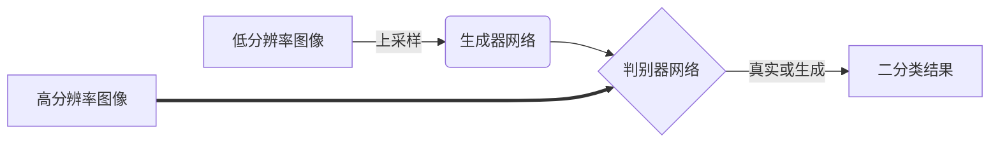
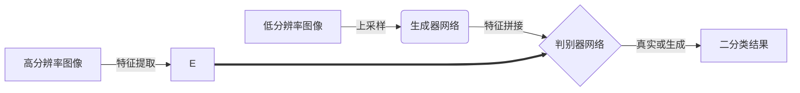

# 基于对抗神经网络的图像超分辨率算法研究

## 1. 背景介绍

### 1.1 图像超分辨率的重要性

在当今的数字时代,高质量图像在各个领域都扮演着重要角色。从医学成像到卫星遥感,从安防监控到视频增强,清晰的图像不仅能提供更多细节信息,还能为后续的图像处理和分析任务奠定基础。然而,由于成本、硬件限制或其他因素,我们获取的图像往往分辨率较低,影响了图像质量和应用效果。

图像超分辨率(Super-Resolution,SR)技术旨在从一个或多个低分辨率(Low-Resolution,LR)图像重建出高分辨率(High-Resolution,HR)图像,提高图像的清晰度和细节层次。这种技术在许多领域都有广泛的应用前景,例如:

- **医学成像**: 提高医学影像的分辨率和质量,有助于医生更精确地诊断疾病。
- **安防监控**: 对视频监控系统中的模糊图像进行超分辨率处理,提取更多细节信息,提高犯罪侦查的成功率。
- **卫星遥感**: 增强卫星遥感图像的分辨率,获取更高精度的地理信息数据。
- **多媒体增强**: 对于低分辨率的图像和视频进行超分辨率处理,提升观看体验。

### 1.2 传统超分辨率方法的局限性

早期的图像超分辨率算法主要基于插值、重建或统计学习等传统方法。这些方法虽然在特定场景下取得了一定效果,但也存在一些明显的局限性:

1. **效果有限**: 传统方法很难有效重建图像中的高频细节信息,超分辨率效果受到严重限制。
2. **缺乏灵活性**: 大多数传统算法是为特定的降质因子(如双线性插值)设计的,缺乏通用性和灵活性。
3. **计算复杂度高**: 一些基于优化的方法需要大量的迭代计算,计算效率低下。
4. **难以处理复杂降质情况**: 现实世界中的图像降质过程往往涉及多种复杂因素,传统方法难以很好地建模和解决。

为了突破传统方法的瓶颈,研究人员开始探索基于深度学习的超分辨率算法,其中以对抗神经网络(Generative Adversarial Networks,GANs)为代表的生成模型取得了突破性的进展,展现出了强大的图像细节重建能力。

## 2. 核心概念与联系

### 2.1 对抗神经网络(GANs)

对抗神经网络是一种全新的生成模型框架,由Ian Goodfellow等人于2014年提出。它由两个神经网络模型组成:生成器(Generator)和判别器(Discriminator),两者相互对抗地训练。

生成器的目标是生成尽可能逼真的数据分布,而判别器则需要对生成器产生的数据和真实数据进行判别。在不断的对抗训练中,生成器逐步优化生成数据的分布,使其更加接近真实数据分布;而判别器也在努力提高判别能力。最终,生成器和判别器达到一种平衡状态,此时生成器就能够生成高质量的数据。

GANs模型可以概括为一个两参与者的minimax游戏,生成器和判别器相互对抗,最终达到纳什均衡。GANs的目标函数可以表示为:

$$\min_{G} \max_{D} V(D,G) = \mathbb{E}_{x \sim p_{data}(x)}[\log D(x)] + \mathbb{E}_{z \sim p_{z}(z)}[\log(1-D(G(z)))]$$

其中,$ G $表示生成器网络,将噪声 $ z $映射到数据空间,$ D $表示判别器网络,用于区分真实数据 $ x $和生成数据 $ G(z) $。

GANs自问世以来,在图像生成、图像翻译、图像超分辨率等领域展现出了强大的能力,成为深度生成模型的研究热点。

### 2.2 基于GAN的超分辨率方法

将GANs应用于图像超分辨率任务,可以将其视为一个从低分辨率图像到高分辨率图像的条件生成过程。生成器的输入是低分辨率图像,输出是对应的高分辨率图像;判别器则需要区分生成的高分辨率图像和真实的高分辨率图像。

与传统超分辨率方法相比,基于GAN的方法具有以下优势:

1. **端到端训练**:不需要分步骤设计手工特征,可以端到端地从数据中自动学习最优映射。
2. **生成高质量细节**:生成对抗网络能够生成逼真的高频细节,突破了传统方法的瓶颈。
3. **无需降质模型**:不需要显式对降质过程建模,具有更好的通用性。
4. **上下文理解能力**:卷积神经网络具有很强的上下文理解能力,有利于重建细节。

目前,基于GAN的超分辨率算法已成为研究热点,各种创新型网络结构和损失函数不断涌现,取得了卓越的超分辨率效果。

## 3. 核心算法原理与操作步骤

### 3.1 SRGAN 算法

SRGAN是第一个将GAN应用于超分辨率任务的开创性工作,由Twitter的Christian Ledig等人于2017年提出。它的生成器基于残差网络结构,判别器使用卷积网络,并引入了新颖的感知损失函数。SRGAN的总体框架如下图所示:

SRGAN的生成过程可以概括为以下几个步骤:

1. **上采样**: 首先将低分辨率输入图像进行上采样(如双线性插值),得到一个初始的高分辨率图像。
2. **生成器**: 将上采样后的图像输入到生成器网络中,生成器基于残差网络结构对图像进行进一步处理。
3. **判别器**: 将生成器输出的高分辨率图像和真实的高分辨率图像输入到判别器网络中,判别器对图像的真实性进行二分类。
4. **损失函数**: SRGAN使用了像素损失函数和感知损失函数的加权和作为总损失函数,像素损失函数用于保证生成图像的整体清晰度,而感知损失函数则有助于生成逼真的纹理细节。
5. **对抗训练**:生成器和判别器通过对抗训练相互优化,生成器努力生成更加逼真的高分辨率图像以欺骗判别器,而判别器则不断提高判别能力。

SRGAN取得了很好的超分辨率效果,但也存在一些缺陷,如生成图像存在棉绒状的不真实纹理等。后续工作对SRGAN的网络结构和损失函数进行了改进。

### 3.2 Enhanced SRGAN

为了解决SRGAN生成图像存在不自然纹理的问题,Enhanced SRGAN在原始SRGAN的基础上提出了一些改进措施:

1. **去除批归一化层**:去除了生成器中的批归一化(Batch Normalization)层,因为批归一化会引入不理想的艺术纹理。
2. **增加残差跳跃连接**:在生成器中增加了残差跳跃连接,以缓解梯度消失问题,提高网络的表达能力。
3. **改进判别器结构**:优化了判别器的网络结构,加入了局部和全局两种感知野。
4. **引入相对论损失函数**:除了像素损失和感知损失之外,还加入了相对论损失函数,有助于生成更加自然、无伪影的图像。

Enhanced SRGAN在保持SRGAN高质量超分辨率效果的同时,有效地消除了生成图像中的不自然纹理,显著提升了视觉质量。

### 3.3 ESRGAN 算法

ESRGAN(Enhanced Super-Resolution Generative Adversarial Networks)是目前公认的最佳GAN超分辨率方案,由微软等机构于2018年提出。相比于Enhanced SRGAN,ESRGAN在以下几个方面做了进一步改进:

1. **改进网络结构**:生成器采用了新的残差密集块结构,提高了网络的表达能力;判别器采用相对论平均池化结构,增强了感知野。

2. **新的感知损失函数**:使用了基于VGG特征的新的感知损失函数,具有更好的纹理表达能力。

3. **特征拼接**:在生成器和判别器之间引入了特征拼接操作,增强了低分辨率输入和高分辨率输出之间的关联性。

4. **优化训练策略**:采用了新的渐进式权重策略,先预训练感知损失,再对抗训练,最后微调模型。

ESRGAN在多个公开数据集上都取得了最优的超分辨率效果,在保持高质量细节的同时,生成图像拥有更加自然逼真的视觉质量。其网络结构如下图所示:

## 4. 数学模型与公式详解

在基于GAN的超分辨率算法中,损失函数的设计是非常关键的一个环节。合理的损失函数能够很好地约束生成器和判别器的训练,从而生成高质量的超分辨率图像。下面我们来详细介绍ESRGAN中使用的几种损失函数。

### 4.1 像素损失函数

像素损失函数是最基本的损失函数,直接计算生成图像与真实图像在像素级别的差异。通常使用均方误差(Mean Squared Error, MSE)或绝对误差(Mean Absolute Error, MAE)作为像素损失:

$$\mathcal{L}_\text{pixel} = \frac{1}{N}\sum_{i=1}^{N}\|G(I_i^\text{LR}) - I_i^\text{HR}\|_p$$

其中,$I_i^\text{LR}$和$I_i^\text{HR}$分别表示第$i$个低分辨率和高分辨率图像,$G(\cdot)$表示生成器网络,$\|\cdot\|_p$表示$L_p$范数,当$p=2$时对应均方误差,$p=1$时对应绝对误差。$N$是训练批次的大小。

像素损失函数能够在一定程度上保证生成图像的整体清晰度,但往往会导致生成图像失去细节和纹理,因此需要结合其他损失函数使用。

### 4.2 感知损失函数

感知损失函数是SRGAN中提出的一种新颖损失函数,它基于深度特征的差异而不是像素差异来度量图像质量。具体来说,感知损失函数是在预训练的特征提取网络(如VGG)上,计算生成图像特征和真实图像特征之间的距离:

$$\mathcal{L}_\text{percep} = \frac{1}{N}\sum_{i=1}^{N}\sum_{j=1}^{J}\frac{1}{H_jW_j}\|f_j(G(I_i^\text{LR})) - f_j(I_i^\text{HR})\|_2^2$$

其中,$f_j(\cdot)$表示第$j$层特征提取网络的激活输出,$H_j$和$W_j$分别是该层特征图的高度和宽度。$J$表示使用的特征层数量。

感知损失函数能够很好地约束生成图像的纹理细节,使其更加逼真自然。但过于追求感知质量也可能导致生成的图像存在不真实的伪影等缺陷,因此需要与其他损失函数相结合。

### 4.3 相对论损失函数

相对论损失函数是Enhanced SRGAN提出的新型损失函数,用于约束生成图像的自然性和真实性。其基本思想是,对于一个图像块,如果其周围邻域内的像素值都接近该图像块,那么该图像块就可能是真实的;反之,如果与周围邻域存在较大差异,