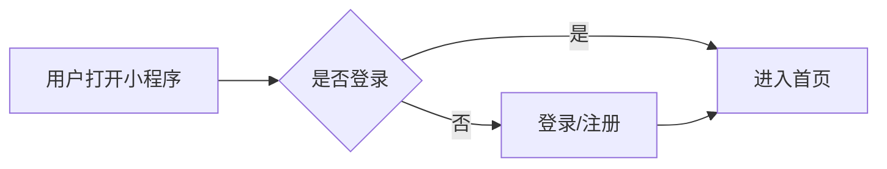
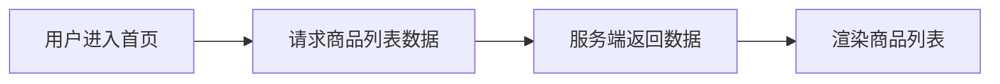
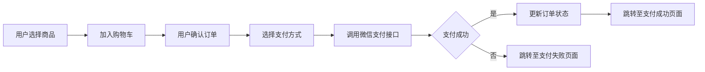

## 1. 背景介绍

### 1.1 水产行业现状与挑战

随着人们生活水平的提高，水产品因其丰富的营养价值和独特的风味越来越受到消费者的青睐。然而，传统的水产销售模式存在着诸多弊端：

* **信息不对称：**消费者难以获取水产品的真实信息，例如产地、养殖方式、新鲜度等。
* **中间环节多：**从养殖户到消费者手中需要经过多个中间环节，导致价格高昂且产品质量难以保证。
* **销售渠道单一：**传统的水产销售主要依赖于线下渠道，例如农贸市场、超市等，限制了销售范围和效率。

### 1.2 微信小程序的优势

微信小程序作为一种轻量级的应用程序，具有以下优势：

* **无需下载安装：**用户只需通过微信扫码即可使用，方便快捷。
* **开发成本低：**相比于传统的APP开发，小程序开发成本更低，周期更短。
* **用户群体庞大：**微信拥有超过10亿的活跃用户，为小程序提供了巨大的潜在用户群体。

### 1.3 本文研究目的

针对传统水产销售模式存在的问题，本文旨在设计并实现一个基于微信小程序的水产销售系统，利用微信小程序的优势，构建一个连接养殖户和消费者的桥梁，提高水产销售效率，保障产品质量，提升消费者体验。

## 2. 核心概念与联系

### 2.1 系统架构

本系统采用前后端分离的架构，主要包括以下模块：

* **客户端（微信小程序）：** 为用户提供浏览商品、下单购买、在线支付、订单查询、评价晒单等功能。
* **服务端（API接口）：** 为小程序提供数据接口，实现用户管理、商品管理、订单管理、支付管理等功能。
* **数据库：** 存储用户信息、商品信息、订单信息等数据。

### 2.2 技术选型

* **前端开发：** 微信小程序原生框架
* **后端开发：** Python + Django框架
* **数据库：** MySQL
* **支付接口：** 微信支付

### 2.3 模块间联系

* 客户端通过API接口与服务端进行数据交互。
* 服务端通过数据库连接访问数据库。
* 支付功能通过调用微信支付接口实现。

## 3. 核心算法原理具体操作步骤

### 3.1 用户登录注册

* **流程图：**



* **步骤：**

1. 用户打开小程序，判断用户是否已登录。
2. 若已登录，则直接进入首页；否则，跳转至登录/注册页面。
3. 用户输入手机号，获取验证码并进行验证。
4. 验证通过后，完成登录或注册。

### 3.2 商品展示

* **流程图：**



* **步骤：**

1. 用户进入首页，小程序向服务端请求商品列表数据。
2. 服务端查询数据库，返回商品列表数据。
3. 小程序接收数据，渲染商品列表页面。

### 3.3 下单支付

* **流程图：**



* **步骤：**

1. 用户选择商品，加入购物车。
2. 用户确认订单信息，选择收货地址、支付方式等。
3. 用户选择微信支付，小程序调用微信支付接口。
4. 用户输入支付密码，完成支付。
5. 支付成功后，服务端更新订单状态，小程序跳转至支付成功页面。
6. 支付失败，小程序跳转至支付失败页面。

## 4. 数学模型和公式详细讲解举例说明

本系统中未使用复杂的数学模型和算法。

## 5. 项目实践：代码实例和详细解释说明

### 5.1 前端代码示例

```javascript
// pages/index/index.js
Page({
   {
    goodsList: [], // 商品列表
  },

  onLoad: function () {
    // 获取商品列表数据
    wx.request({
      url: 'https://api.example.com/goods/',
      method: 'GET',
      success: (res) => {
        this.setData({
          goodsList: res.data,
        });
      },
    });
  },
});
```

### 5.2 后端代码示例

```python
# views.py
from django.shortcuts import render
from .models import Goods

def goods_list(request):
    """获取商品列表数据"""
    goods_list = Goods.objects.all()
    return render(request, 'goods_list.html', {'goods_list': goods_list})
```

## 6. 实际应用场景

* **水产养殖户：** 可以通过该系统直接向消费者销售水产品，减少中间环节，提高收益。
* **消费者：** 可以通过该系统方便快捷地购买到新鲜、优质的水产品，享受更便捷的购物体验。
* **水产批发商：** 可以通过该系统拓展销售渠道，提高销售效率。

## 7. 工具和资源推荐

* **微信开发者工具：** 用于开发和调试微信小程序。
* **Django框架：** 用于快速开发Web应用。
* **MySQL数据库：** 用于存储数据。
* **微信支付官方文档：** 用于集成微信支付功能。

## 8. 总结：未来发展趋势与挑战

### 8.1 未来发展趋势

* **线上线下融合：** 将线上销售与线下体验相结合，为消费者提供更全面的服务。
* **数据驱动运营：** 利用用户数据分析，进行精准营销，提高销售转化率。
* **人工智能应用：** 利用图像识别、自然语言处理等技术，提升用户体验和运营效率。

### 8.2 面临的挑战

* **用户习惯培养：** 需要引导用户使用小程序进行水产品购买。
* **物流配送问题：** 需要解决水产品的冷链物流配送问题，保证产品质量。
* **食品安全问题：** 需要加强食品安全监管，确保消费者购买到安全放心的水产品。

## 9. 附录：常见问题与解答

### 9.1 如何注册账号？

用户打开小程序后，点击“我的”页面，选择“登录/注册”，输入手机号，获取验证码并进行验证，即可完成注册。

### 9.2 如何下单购买商品？

用户选择心仪的商品，点击“加入购物车”，确认订单信息后，选择支付方式，完成支付即可。

### 9.3 如何联系客服？

用户在小程序“我的”页面，点击“联系客服”，即可联系在线客服。
