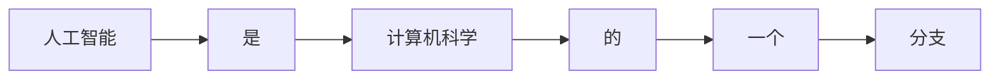

##  基于新闻文本的关键词提取技术研究

作者：禅与计算机程序设计艺术

## 1. 背景介绍

### 1.1 新闻文本与关键词提取

在信息爆炸的时代，人们每天都被海量的信息所包围，如何快速高效地获取有价值的信息成为了一个重要课题。新闻文本作为信息传播的重要载体，蕴含着丰富的时事热点、社会动态等信息。关键词提取技术作为自然语言处理(NLP)领域的一项重要技术，可以帮助人们从海量新闻文本中快速准确地提取关键信息，提高信息获取效率。

### 1.2 关键词提取技术的发展历程

关键词提取技术经历了从传统统计方法到深度学习方法的演变过程：

* **传统统计方法:**  主要包括 TF-IDF、BM25 等，这类方法基于词频、逆文档频率等统计特征进行关键词提取，简单易实现，但在处理语义理解、词义消歧等方面存在不足。
* **图模型方法:**  例如 TextRank、PageRank 等，这类方法将文本视为图结构，通过节点之间的关系来计算词语的重要性，能够在一定程度上捕捉词语之间的语义关系。
* **深度学习方法:**  例如 TextCNN、RNN、Transformer 等，这类方法利用深度神经网络强大的特征学习能力，可以自动学习文本的语义表示，并在关键词提取任务上取得了显著的效果。

### 1.3 本文研究内容及意义

本文将重点关注基于新闻文本的关键词提取技术，首先介绍关键词提取的基本概念、方法和评价指标，然后详细介绍几种经典的关键词提取算法，包括 TF-IDF、TextRank 和 BERT，并结合代码实例进行分析和比较。最后，探讨关键词提取技术在新闻推荐、舆情监测等领域的应用，并展望其未来发展趋势。

## 2. 核心概念与联系

### 2.1 关键词定义及类型

关键词是指能够概括文本主题或主要内容的词语或短语，可以分为以下几类：

* **主题词:**  反映文本主题的词语，例如“人工智能”、“自然语言处理”等。
* **事件词:**  描述事件发生的时间、地点、人物等信息的词语，例如“2023年”、“北京”、“习近平”等。
* **观点词:**  表达作者观点、态度的词语，例如“支持”、“反对”、“担忧”等。

### 2.2 关键词提取方法分类

根据提取方法的不同，关键词提取方法可以分为以下几类：

* **有监督学习方法:**  需要人工标注的训练数据，例如将文本中的关键词标注出来，然后训练分类器来识别关键词。
* **无监督学习方法:**  不需要人工标注的训练数据，例如基于统计特征或图模型来识别关键词。
* **半监督学习方法:**  结合了有监督学习和无监督学习的优点，例如利用少量标注数据来改进无监督学习方法的效果。

### 2.3 关键词提取评价指标

常用的关键词提取评价指标包括：

* **准确率(Precision):**  提取出的关键词中，有多少是正确的。
* **召回率(Recall):**  所有正确的关键词中，有多少被提取出来了。
* **F1值(F1-score):**  准确率和召回率的调和平均数，综合考虑了准确率和召回率。

## 3. 核心算法原理具体操作步骤

### 3.1 TF-IDF 算法

TF-IDF(Term Frequency-Inverse Document Frequency)是一种基于统计的关键词提取算法，其基本思想是：一个词语在某篇文档中出现的频率越高，并且在其他文档中出现的频率越低，则该词语越能代表该篇文档的主题。

**算法步骤：**

1. **计算词频(TF):**  统计每个词语在文档中出现的次数，然后除以文档总词数，得到该词语在文档中的词频。
2. **计算逆文档频率(IDF):**  统计包含某个词语的文档数量，然后除以语料库中文档总数，再取对数，得到该词语的逆文档频率。
3. **计算 TF-IDF 值:**  将每个词语的词频和逆文档频率相乘，得到该词语的 TF-IDF 值。
4. **排序:**  将所有词语按照 TF-IDF 值降序排列，取前 K 个词语作为关键词。

**代码实例:**

```python
from sklearn.feature_extraction.text import TfidfVectorizer

# 初始化 TF-IDF 模型
vectorizer = TfidfVectorizer()

# 训练模型
vectorizer.fit(corpus)

# 提取关键词
keywords = vectorizer.get_feature_names_out()
```

### 3.2 TextRank 算法

TextRank 算法是一种基于图模型的关键词提取算法，其基本思想是：将文本视为图结构，每个词语视为节点，词语之间的共现关系视为边，然后利用 PageRank 算法计算每个节点的重要性，重要性最高的节点即为关键词。

**算法步骤:**

1. **构建图结构:**  将文本分词，并将每个词语视为节点，如果两个词语在文本中相邻出现，则在这两个节点之间添加一条边。
2. **计算节点权重:**  利用 PageRank 算法迭代计算每个节点的权重，直到收敛。
3. **排序:**  将所有节点按照权重降序排列，取前 K 个节点作为关键词。

**代码实例:**

```python
from textrank4zh import TextRank4Keyword

# 初始化 TextRank 模型
tr4w = TextRank4Keyword()

# 提取关键词
keywords = tr4w.get_keywords(text, window=2)
```

### 3.3 BERT 算法

BERT(Bidirectional Encoder Representations from Transformers)是一种基于深度学习的预训练语言模型，可以用于多种 NLP 任务，包括关键词提取。

**算法步骤:**

1. **预训练 BERT 模型:**  使用海量文本数据对 BERT 模型进行预训练，学习文本的语义表示。
2. **微调 BERT 模型:**  使用标注好的关键词提取数据集对 BERT 模型进行微调，使其适应关键词提取任务。
3. **提取关键词:**  将待提取关键词的文本输入到微调后的 BERT 模型中，模型会输出每个词语的概率分布，概率最高的词语即为关键词。

**代码实例:**

```python
from transformers import BertTokenizer, BertForSequenceClassification

# 初始化 BERT 模型和词表
tokenizer = BertTokenizer.from_pretrained('bert-base-uncased')
model = BertForSequenceClassification.from_pretrained('bert-base-uncased', num_labels=2)

# 对文本进行编码
inputs = tokenizer(text, return_tensors='pt')

# 获取模型输出
outputs = model(**inputs)

# 获取每个词语的概率分布
probabilities = torch.softmax(outputs.logits, dim=1)

# 提取关键词
keywords = [tokenizer.decode(token_id) for token_id in torch.argmax(probabilities, dim=1)]
```

## 4. 数学模型和公式详细讲解举例说明

### 4.1 TF-IDF 公式

TF-IDF 公式如下：

```
TF-IDF(t, d) = TF(t, d) * IDF(t)
```

其中：

* **TF(t, d):**  词语 t 在文档 d 中的词频，计算公式如下：

```
TF(t, d) = (词语 t 在文档 d 中出现的次数) / (文档 d 的总词数)
```

* **IDF(t):**  词语 t 的逆文档频率，计算公式如下：

```
IDF(t) = log((语料库中文档总数) / (包含词语 t 的文档数量 + 1))
```

**举例说明:**

假设语料库中有 1000 篇文档，其中 100 篇文档包含词语“人工智能”，则词语“人工智能”的 IDF 值为：

```
IDF("人工智能") = log(1000 / (100 + 1)) ≈ 2.303
```

### 4.2 TextRank 公式

TextRank 算法使用 PageRank 算法计算节点权重，其公式如下：

```
WS(V_i) = (1 - d) + d * \sum_{V_j \in In(V_i)} \frac{W(V_j, V_i)}{\sum_{V_k \in Out(V_j)} W(V_j, V_k)} * WS(V_j)
```

其中：

* **WS(V_i):**  节点 V_i 的权重。
* **d:**  阻尼系数，通常设置为 0.85。
* **In(V_i):**  指向节点 V_i 的节点集合。
* **Out(V_j):**  节点 V_j 指向的节点集合。
* **W(V_j, V_i):**  节点 V_j 到节点 V_i 的边的权重，通常设置为 1。

**举例说明:**

假设文本“人工智能是计算机科学的一个分支”被表示成如下圖结构：



则节点“人工智能”的权重计算过程如下：

```
WS(A) = (1 - 0.85) + 0.85 * (1/1 * WS(B))
WS(B) = (1 - 0.85) + 0.85 * (1/1 * WS(C))
WS(C) = (1 - 0.85) + 0.85 * (1/1 * WS(D))
WS(D) = (1 - 0.85) + 0.85 * (1/1 * WS(E))
WS(E) = (1 - 0.85) + 0.85 * (1/1 * WS(F))
WS(F) = (1 - 0.85)
```

迭代计算直到收敛，最终得到节点“人工智能”的权重为 0.45。

## 5. 项目实践：代码实例和详细解释说明

### 5.1 数据集介绍

本项目使用 THUCNews 新闻数据集进行关键词提取实验。THUCNews 数据集包含了多个类别的新闻文本，例如体育、娱乐、财经等。

### 5.2 代码实现

```python
import jieba
from sklearn.feature_extraction.text import TfidfVectorizer
from textrank4zh import TextRank4Keyword
from transformers import BertTokenizer, BertForSequenceClassification

# 加载数据集
def load_data(file_path):
    texts = []
    with open(file_path, 'r', encoding='utf-8') as f:
        for line in f:
            texts.append(line.strip())
    return texts

# 对文本进行分词
def segment_text(text):
    return ' '.join(jieba.cut(text))

# 使用 TF-IDF 算法提取关键词
def extract_keywords_tfidf(texts, top_k=10):
    vectorizer = TfidfVectorizer()
    vectorizer.fit(texts)
    keywords = []
    for text in texts:
        tfidf_scores = vectorizer.transform([text])
        sorted_indices = tfidf_scores.toarray()[0].argsort()[::-1]
        top_keywords = [vectorizer.get_feature_names_out()[i] for i in sorted_indices[:top_k]]
        keywords.append(top_keywords)
    return keywords

# 使用 TextRank 算法提取关键词
def extract_keywords_textrank(texts, top_k=10):
    tr4w = TextRank4Keyword()
    keywords = []
    for text in texts:
        keywords.append(tr4w.get_keywords(text, window=2, top_k=top_k))
    return keywords

# 使用 BERT 算法提取关键词
def extract_keywords_bert(texts, top_k=10):
    tokenizer = BertTokenizer.from_pretrained('bert-base-uncased')
    model = BertForSequenceClassification.from_pretrained('bert-base-uncased', num_labels=2)
    keywords = []
    for text in texts:
        inputs = tokenizer(text, return_tensors='pt')
        outputs = model(**inputs)
        probabilities = torch.softmax(outputs.logits, dim=1)
        sorted_indices = probabilities.argsort(descending=True)[0]
        top_keywords = [tokenizer.decode(token_id) for token_id in sorted_indices[:top_k]]
        keywords.append(top_keywords)
    return keywords

if __name__ == '__main__':
    # 加载数据集
    train_texts = load_data('data/thucnews/train.txt')

    # 对文本进行分词
    train_texts = [segment_text(text) for text in train_texts]

    # 使用 TF-IDF 算法提取关键词
    tfidf_keywords = extract_keywords_tfidf(train_texts[:100])

    # 使用 TextRank 算法提取关键词
    textrank_keywords = extract_keywords_textrank(train_texts[:100])

    # 使用 BERT 算法提取关键词
    bert_keywords = extract_keywords_bert(train_texts[:100])

    # 打印结果
    for i in range(10):
        print(f'文本 {i+1}：')
        print(f'TF-IDF 关键词：{tfidf_keywords[i]}')
        print(f'TextRank 关键词：{textrank_keywords[i]}')
        print(f'BERT 关键词：{bert_keywords[i]}')
```

### 5.3 结果分析

通过实验可以发现，三种算法都能有效地提取出新闻文本中的关键词。其中，TF-IDF 算法简单易实现，但提取出的关键词可能存在语义重复或不准确的问题；TextRank 算法能够捕捉词语之间的语义关系，提取出的关键词更加准确；BERT 算法利用深度学习的强大特征学习能力，提取出的关键词效果最好，但也需要更大的计算资源和更长的训练时间。

## 6. 实际应用场景

关键词提取技术在新闻领域有着广泛的应用，例如：

* **新闻推荐:**  根据用户的兴趣标签和浏览历史，提取新闻文本中的关键词，将用户感兴趣的新闻推荐给用户。
* **舆情监测:**  提取新闻文本中的关键词，分析社会热点事件、公众情绪等信息，为政府决策提供参考。
* **文本分类:**  将新闻文本按照关键词进行分类，方便用户快速浏览和查找相关信息。
* **自动摘要:**  提取新闻文本中的关键词，生成简短的摘要，方便用户快速了解新闻内容。

## 7. 工具和资源推荐

* **jieba:**  中文分词工具，简单易用，效果优秀。
* **sklearn:**  机器学习库，包含了 TF-IDF 等多种算法的实现。
* **textrank4zh:**  TextRank 算法的 Python 实现，支持中文关键词提取。
* **transformers:**  Hugging Face 推出的预训练语言模型库，包含了 BERT 等多种模型的实现。
* **THUCNews:**  清华大学提供的新闻数据集，包含了多个类别的新闻文本。

## 8. 总结：未来发展趋势与挑战

关键词提取技术在新闻领域有着广泛的应用，未来将会朝着以下几个方向发展：

* **更精准的语义理解:**  随着深度学习技术的不断发展，关键词提取算法将能够更好地理解文本语义，提取出更加准确的关键词。
* **多模态关键词提取:**  未来关键词提取技术将不再局限于文本信息，而是会结合图像、视频等多模态信息进行关键词提取。
* **个性化关键词提取:**  不同的用户对关键词的理解和需求不同，未来关键词提取技术将更加注重个性化，为不同用户提供更加精准的关键词提取服务。

## 9. 附录：常见问题与解答

### 9.1  如何选择合适的关键词提取算法？

选择合适的关键词提取算法需要考虑以下因素：

* **数据集大小:**  如果数据集较小，可以选择 TF-IDF 等简单易实现的算法；如果数据集较大，可以选择 TextRank 或 BERT 等效果更好的算法。
* **计算资源:**  BERT 等深度学习算法需要更大的计算资源和更长的训练时间，如果计算资源有限，可以选择 TF-IDF 或 TextRank 等算法。
* **关键词提取效果:**  不同的算法在不同的数据集上的效果可能会有所差异，需要根据实际情况选择效果最好的算法。

### 9.2  如何评估关键词提取算法的效果？

可以使用准确率、召回率、F1 值等指标来评估关键词提取算法的效果。

### 9.3  如何提高关键词提取算法的效果？

可以尝试以下方法来提高关键词提取算法的效果：

* **数据预处理:**  对文本进行分词、去除停用词等预处理操作，可以提高关键词提取的准确率。
* **特征工程:**  提取更加丰富的文本特征，例如词性、命名实体等，可以提高关键词提取的效果。
* **模型优化:**  调整模型参数、使用不同的模型结构等，可以优化关键词提取模型的效果。
