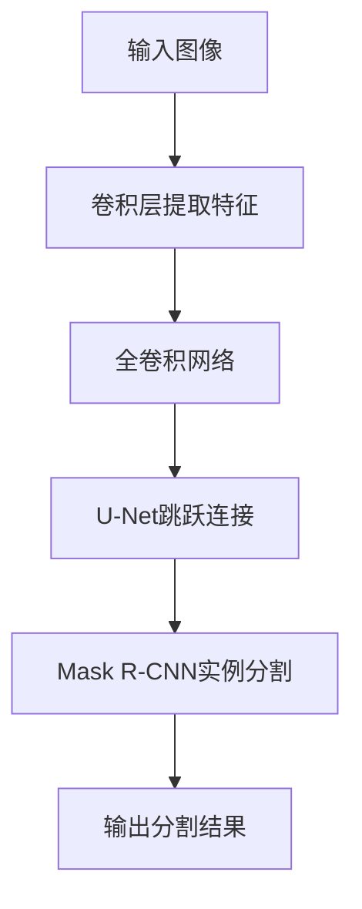

# 基于深度学习的图像分割算法研究

作者：禅与计算机程序设计艺术

## 1. 背景介绍

### 1.1 图像分割的重要性

图像分割是计算机视觉领域的核心任务之一，旨在将图像划分为多个有意义的区域，从而使得每个区域可以单独处理和分析。其应用范围广泛，包括医学影像分析、自动驾驶、卫星图像处理等。在这些应用场景中，图像分割的准确性和效率直接影响到后续任务的效果和可靠性。

### 1.2 传统图像分割方法

传统的图像分割方法包括阈值分割、区域生长、边缘检测和聚类算法等。这些方法在特定场景下表现良好，但在处理复杂图像时，往往难以取得令人满意的效果。尤其是当图像中存在大量噪声、遮挡或复杂背景时，传统方法的性能会显著下降。

### 1.3 深度学习在图像分割中的应用

近年来，深度学习技术的迅猛发展为图像分割带来了新的契机。基于卷积神经网络（CNN）的深度学习模型在图像分割任务中展现出了卓越的性能。尤其是全卷积网络（FCN）、U-Net、Mask R-CNN等模型的提出，使得图像分割的精度和效率得到了显著提升。

## 2. 核心概念与联系

### 2.1 卷积神经网络（CNN）

卷积神经网络（CNN）是深度学习中处理图像数据的基础模型。其核心思想是通过卷积操作提取图像的空间特征，并通过多层网络结构逐步抽象和组合这些特征，从而实现对图像的分类、检测和分割等任务。

### 2.2 全卷积网络（FCN）

全卷积网络（FCN）是首个将卷积神经网络应用于图像分割任务的模型。其主要特点是将传统CNN中的全连接层替换为卷积层，从而使得网络能够处理任意尺寸的输入图像，并生成与输入图像尺寸相同的分割结果。

### 2.3 U-Net

U-Net 是一种专门为生物医学图像分割设计的网络结构，其特点是在编码器和解码器之间通过跳跃连接（skip connections）融合不同尺度的特征，从而提高分割的精度。U-Net 的成功使得其广泛应用于各种图像分割任务中。

### 2.4 Mask R-CNN

Mask R-CNN 是一种基于区域卷积神经网络（R-CNN）的实例分割模型。其在 Faster R-CNN 的基础上增加了一个并行的分割分支，从而实现了对每个检测到的目标进行精细的像素级分割。

## 3. 核心算法原理具体操作步骤

### 3.1 全卷积网络（FCN）

#### 3.1.1 网络架构

全卷积网络（FCN）的核心思想是将传统卷积神经网络中的全连接层替换为卷积层，从而使得网络能够处理任意尺寸的输入图像。具体步骤如下：

1. **卷积层提取特征**：通过多层卷积操作提取图像的空间特征。
2. **池化层降维**：通过池化操作降低特征图的尺寸，同时保留重要的特征信息。
3. **上采样恢复尺寸**：通过反卷积（转置卷积）操作将特征图恢复到原始图像的尺寸。
4. **像素级分类**：通过1x1卷积对每个像素进行分类，生成与输入图像尺寸相同的分割结果。

#### 3.1.2 实现细节

在实现过程中，需要注意以下几点：

- **卷积核的选择**：卷积核的大小和数量直接影响特征提取的效果和计算复杂度。
- **池化操作的选择**：常用的池化操作包括最大池化和平均池化，不同的池化方式对特征图的影响不同。
- **上采样方法**：上采样可以通过反卷积、双线性插值等方法实现，不同的方法对分割结果的精度和计算复杂度有不同的影响。

### 3.2 U-Net

#### 3.2.1 网络架构

U-Net 的网络结构由编码器和解码器两部分组成，并通过跳跃连接（skip connections）将编码器和解码器的特征图进行融合。具体步骤如下：

1. **编码器部分**：通过多层卷积和池化操作提取不同尺度的特征图。
2. **跳跃连接**：将编码器不同层的特征图与解码器对应层的特征图进行拼接，从而融合不同尺度的特征。
3. **解码器部分**：通过多层反卷积和卷积操作逐步恢复特征图的尺寸，并生成分割结果。

#### 3.2.2 实现细节

在实现过程中，需要注意以下几点：

- **跳跃连接的选择**：跳跃连接的层数和方式对特征融合的效果有重要影响。
- **反卷积的实现**：反卷积操作可以通过转置卷积、上采样等方法实现，不同的方法对计算复杂度和分割精度有不同的影响。
- **损失函数的选择**：常用的损失函数包括交叉熵损失、Dice系数损失等，不同的损失函数对模型的训练效果有不同的影响。

### 3.3 Mask R-CNN

#### 3.3.1 网络架构

Mask R-CNN 是在 Faster R-CNN 的基础上增加了一个并行的分割分支，从而实现了对每个检测到的目标进行精细的像素级分割。具体步骤如下：

1. **目标检测**：通过区域提议网络（RPN）生成候选区域，并通过卷积神经网络对每个候选区域进行分类和边界框回归。
2. **实例分割**：在每个候选区域上增加一个并行的分割分支，通过全卷积网络生成像素级的分割掩码。

#### 3.3.2 实现细节

在实现过程中，需要注意以下几点：

- **区域提议网络的选择**：区域提议网络的结构和参数直接影响候选区域的生成效果和计算复杂度。
- **分割分支的设计**：分割分支的网络结构和损失函数对分割结果的精度有重要影响。
- **多任务学习**：Mask R-CNN 同时进行目标检测和实例分割，因此需要设计合理的多任务损失函数和训练策略。

## 4. 数学模型和公式详细讲解举例说明

### 4.1 卷积操作

卷积操作是卷积神经网络的核心，其数学表达式为：

$$
Y(i, j) = \sum_{m=0}^{M-1} \sum_{n=0}^{N-1} X(i+m, j+n) \cdot K(m, n)
$$

其中，$Y(i, j)$ 是输出特征图，$X(i+m, j+n)$ 是输入图像，$K(m, n)$ 是卷积核，$M$ 和 $N$ 分别是卷积核的高度和宽度。

### 4.2 反卷积操作

反卷积操作用于将特征图上采样到原始图像的尺寸，其数学表达式为：

$$
Y(i, j) = \sum_{m=0}^{M-1} \sum_{n=0}^{N-1} X(i-m, j-n) \cdot K(m, n)
$$

其中，$Y(i, j)$ 是上采样后的特征图，$X(i-m, j-n)$ 是输入特征图，$K(m, n)$ 是反卷积核，$M$ 和 $N$ 分别是卷积核的高度和宽度。

### 4.3 损失函数

#### 4.3.1 交叉熵损失

交叉熵损失用于衡量分类任务中的预测结果与真实标签之间的差异，其数学表达式为：

$$
L_{CE} = - \sum_{i=1}^{N} y_i \log(p_i)
$$

其中，$N$ 是样本数量，$y_i$ 是真实标签，$p_i$ 是预测概率。

#### 4.3.2 Dice系数损