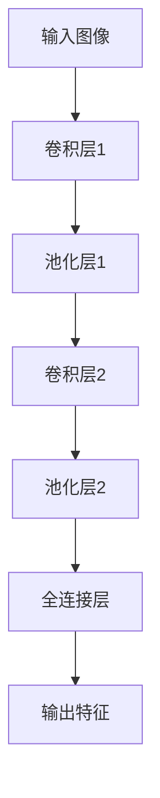
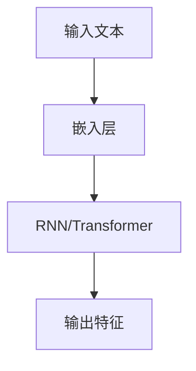
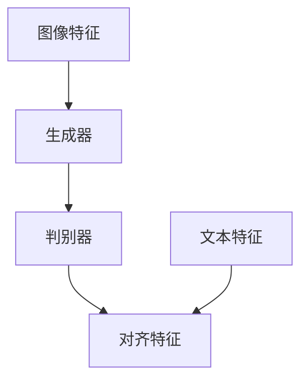
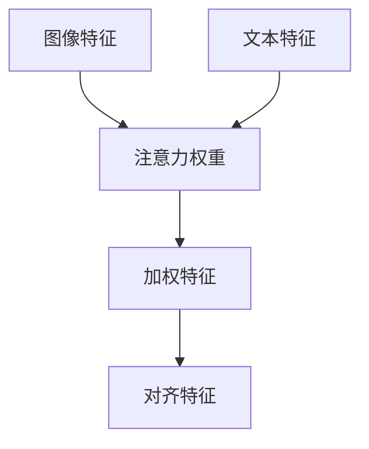

# 基于深度学习的多模态检索

作者：禅与计算机程序设计艺术

## 1.背景介绍

### 1.1 多模态检索的定义与重要性

多模态检索（Multimodal Retrieval）是指同时利用多种数据模态（如文本、图像、音频、视频等）进行信息检索的技术。随着互联网的快速发展，数据类型变得越来越多样化，传统的单模态检索方式已经无法满足用户的需求。多模态检索通过融合不同模态的数据，可以提供更全面和准确的检索结果。

### 1.2 深度学习在多模态检索中的应用

深度学习在处理复杂数据模式和特征提取方面具有显著优势，使其成为多模态检索的核心技术。通过深度神经网络（DNN），我们可以有效地提取和融合不同模态的数据特征，从而提高检索的准确性和效率。

### 1.3 研究现状与挑战

尽管多模态检索技术已经取得了显著进展，但仍面临诸多挑战，包括数据的异质性、模态间的对齐问题、跨模态特征融合的有效性等。这些问题需要通过更先进的算法和模型来解决。

## 2.核心概念与联系

### 2.1 多模态数据

多模态数据指的是来自不同来源或形式的数据，例如文本、图像、音频、视频等。每种数据模态都有其独特的特征和结构，因此在处理和融合这些数据时需要采用不同的方法。

### 2.2 特征提取与表示

特征提取是多模态检索的关键步骤。通过深度学习模型，我们可以从原始数据中提取出高层次的特征表示。例如，卷积神经网络（CNN）可以用于图像特征提取，而循环神经网络（RNN）则适用于处理序列数据如文本和音频。

### 2.3 跨模态对齐与融合

跨模态对齐是指将不同模态的数据映射到同一个特征空间中，使得它们可以进行比较和融合。常见的方法包括基于对抗学习的对齐、基于注意力机制的对齐等。特征融合则是将对齐后的特征进行组合，形成更丰富的表示。

## 3.核心算法原理具体操作步骤

### 3.1 数据预处理

数据预处理是多模态检索的基础步骤，包括数据的清洗、归一化、分割等。对于不同模态的数据，需要采用不同的预处理方法。例如，对于图像数据，可以进行图像增强和缩放；对于文本数据，可以进行分词和嵌入表示。

### 3.2 特征提取

#### 3.2.1 图像特征提取

图像特征提取通常采用卷积神经网络（CNN）。典型的CNN架构包括多个卷积层、池化层和全连接层，通过这些层的组合，可以提取到图像的多层次特征。



#### 3.2.2 文本特征提取

文本特征提取可以采用循环神经网络（RNN）或基于注意力机制的Transformer模型。RNN适用于处理序列数据，而Transformer则在处理长序列文本时表现出色。



### 3.3 特征对齐与融合

#### 3.3.1 基于对抗学习的对齐

对抗学习通过生成对抗网络（GAN）实现不同模态特征的对齐。生成器和判别器相互博弈，使得生成器能够生成与真实数据分布相似的特征表示。



#### 3.3.2 基于注意力机制的对齐

注意力机制通过计算不同模态特征之间的相关性权重，实现特征的对齐和融合。常见的注意力机制包括Self-Attention和Cross-Attention。



### 3.4 模型训练与优化

模型训练包括损失函数的设计、优化算法的选择和超参数的调整。常用的损失函数包括交叉熵损失、对比损失等。优化算法则包括随机梯度下降（SGD）、Adam等。

## 4.数学模型和公式详细讲解举例说明

### 4.1 卷积神经网络（CNN）

卷积神经网络通过卷积操作提取图像特征。卷积操作的数学表示如下：

$$
y_{i,j,k} = \sum_{m=0}^{M-1} \sum_{n=0}^{N-1} x_{i+m,j+n} \cdot w_{m,n,k}
$$

其中，$x$ 是输入图像，$w$ 是卷积核，$y$ 是卷积后的输出特征图。

### 4.2 循环神经网络（RNN）

循环神经网络通过递归计算序列数据的特征。RNN的状态更新公式如下：

$$
h_t = \sigma(W_h \cdot h_{t-1} + W_x \cdot x_t + b)
$$

其中，$h_t$ 是当前时刻的隐藏状态，$x_t$ 是当前时刻的输入，$W_h$ 和 $W_x$ 是权重矩阵，$b$ 是偏置，$\sigma$ 是激活函数。

### 4.3 注意力机制

注意力机制通过计算不同模态特征之间的相关性权重。自注意力机制的计算公式如下：

$$
\text{Attention}(Q, K, V) = \text{softmax}\left(\frac{QK^T}{\sqrt{d_k}}\right)V
$$

其中，$Q$ 是查询矩阵，$K$ 是键矩阵，$V$ 是值矩阵，$d_k$ 是键的维度。

## 5.项目实践：代码实例和详细解释说明

### 5.1 数据预处理

```python
import cv2
import numpy as np
from sklearn.preprocessing import StandardScaler

# 图像数据预处理
def preprocess_image(image_path):
    image = cv2.imread(image_path)
    image = cv2.resize(image, (224, 224))
    image = image / 255.0
    return image

# 文本数据预处理
def preprocess_text(text):
    tokens = text.split()
    return tokens

# 数据归一化
scaler = StandardScaler()
data = scaler.fit_transform(data)
```

### 5.2 特征提取

```python
import tensorflow as tf
from tensorflow.keras.models import Model
from tensorflow.keras.applications import VGG16

# 图像特征提取
def extract_image_features(image):
    base_model = VGG16(weights='imagenet', include_top=False)
    model = Model(inputs=base_model.input, outputs=base_model.output)
    features = model.predict(image)
    return features

# 文本特征提取
def extract_text_features(text):
    tokenizer = tf.keras.preprocessing.text.Tokenizer()
    tokenizer.fit_on_texts(text)
    sequences = tokenizer.texts_to_sequences(text)
    return sequences
```

### 5.3 特征对齐与融合

```python
import tensorflow as tf
from tensorflow.keras.layers import Dense, Concatenate

# 特征对齐
def align_features(image_features, text_features):
    image_dense = Dense(128, activation='relu')(image_features)
    text_dense = Dense(128, activation='relu')(text_features)
    return image_dense, text_dense

# 特征融合
def fuse_features(image_features, text_features):
    aligned_image, aligned_text = align_features(image_features, text_features)
    fused_features = Concatenate()([aligned_image, aligned_text])
    return fused_features
```

### 5.4 模型训练

```python
from tensorflow.keras.optimizers import Adam
from tensorflow.keras.losses import BinaryCrossentropy

# 模型定义
def build_model():
    image_input = tf.keras.Input(shape=(224, 224, 3))
    text_input = tf.keras.Input(shape=(None,))

    image_features = extract_image_features(image_input)
    text_features = extract_text