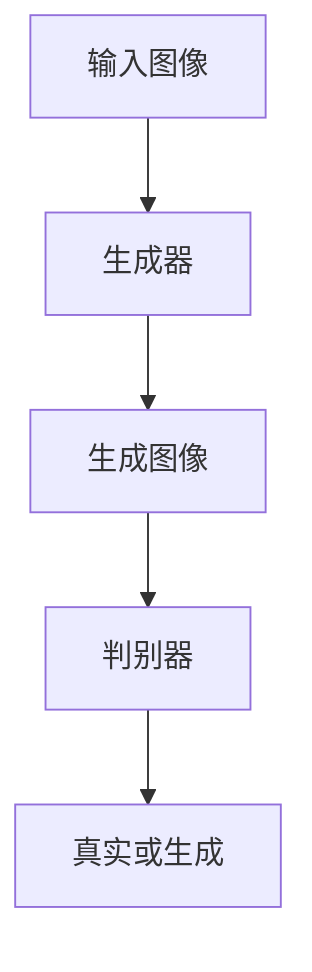

# 基于生成对抗网络的图像内容保留下的风格迁移方法

作者：禅与计算机程序设计艺术

## 1.背景介绍

风格迁移（Style Transfer）是一种计算机视觉技术，旨在将一种图像的风格应用到另一种图像的内容上，从而生成具有原始图像内容的新风格图像。自从Gatys等人提出基于卷积神经网络（CNN）的风格迁移方法以来，这一领域取得了显著进展。然而，传统的风格迁移方法在保留图像内容的细节方面存在一定的局限性。生成对抗网络（GAN）的引入为风格迁移提供了新的思路，能够在更好地保留图像内容的同时，实现更为逼真的风格转换。

### 1.1 风格迁移的历史与发展

风格迁移的概念最早可以追溯到图像处理和计算机视觉领域中的滤镜和图像增强技术。然而，真正的突破出现在2015年，Gatys等人提出了基于CNN的风格迁移方法。这种方法利用预训练的深度神经网络（如VGG网络）提取图像的内容特征和风格特征，通过优化过程将两者结合，从而生成新的图像。

### 1.2 生成对抗网络的引入

生成对抗网络（GAN）由Ian Goodfellow等人在2014年提出，主要由生成器（Generator）和判别器（Discriminator）组成。生成器负责生成逼真的图像，而判别器则负责区分生成图像和真实图像。通过两者的对抗训练，GAN能够生成高度逼真的图像。近年来，GAN在图像生成、图像修复、超分辨率等领域取得了显著的成果。

### 1.3 风格迁移与GAN的结合

传统的风格迁移方法虽然在某些情况下效果显著，但在处理复杂场景或高分辨率图像时，往往会出现内容细节丢失或风格不自然的问题。将GAN引入风格迁移，可以利用其强大的生成能力和对抗训练机制，在保留图像内容的同时，实现更为自然和逼真的风格转换。

## 2.核心概念与联系

在基于GAN的风格迁移方法中，关键的概念包括生成器、判别器、对抗损失、内容损失和风格损失等。理解这些概念及其相互关系是实现高质量风格迁移的基础。

### 2.1 生成器与判别器

生成器（G）和判别器（D）是GAN的核心组成部分。生成器接收随机噪声或输入图像，通过一系列卷积和反卷积操作生成新的图像。判别器则是一个二分类器，用于判断输入图像是真实图像还是生成图像。

### 2.2 对抗损失

对抗损失（Adversarial Loss）是GAN训练的关键。生成器的目标是生成能够欺骗判别器的图像，而判别器的目标是尽可能准确地区分真实图像和生成图像。对抗损失可以表示为：

$$
\mathcal{L}_{adv} = \mathbb{E}_{x \sim p_{data}(x)}[\log D(x)] + \mathbb{E}_{z \sim p_{z}(z)}[\log (1 - D(G(z)))]
$$

其中，$x$为真实图像，$z$为随机噪声，$G(z)$为生成图像，$D(x)$和$D(G(z))$分别表示判别器对真实图像和生成图像的判断。

### 2.3 内容损失与风格损失

内容损失（Content Loss）和风格损失（Style Loss）是风格迁移中的关键损失函数。内容损失用于保证生成图像与内容图像在内容上的相似性，而风格损失则用于保证生成图像与风格图像在风格上的一致性。

内容损失通常通过预训练的CNN提取内容图像和生成图像的特征图，并计算二者的欧氏距离：

$$
\mathcal{L}_{content} = \frac{1}{2} \sum_{i,j} (F_{ij}^C - F_{ij}^G)^2
$$

其中，$F_{ij}^C$和$F_{ij}^G$分别表示内容图像和生成图像在第$i$层、第$j$个位置的特征图。

风格损失则通过计算风格图像和生成图像特征图的Gram矩阵的差异来实现：

$$
\mathcal{L}_{style} = \sum_{l=0}^L \frac{1}{N_l^2 M_l^2} \sum_{i,j} (G_{ij}^l - A_{ij}^l)^2
$$

其中，$G_{ij}^l$和$A_{ij}^l$分别表示生成图像和风格图像在第$l$层的Gram矩阵，$N_l$和$M_l$分别表示第$l$层特征图的通道数和空间维度。

### 2.4 总损失函数

在基于GAN的风格迁移方法中，总损失函数通常是对抗损失、内容损失和风格损失的加权和：

$$
\mathcal{L}_{total} = \lambda_{adv} \mathcal{L}_{adv} + \lambda_{content} \mathcal{L}_{content} + \lambda_{style} \mathcal{L}_{style}
$$

其中，$\lambda_{adv}$、$\lambda_{content}$和$\lambda_{style}$是相应损失项的权重参数。

## 3.核心算法原理具体操作步骤

在理解了核心概念之后，我们可以详细探讨基于GAN的风格迁移方法的具体操作步骤。这些步骤包括数据准备、模型设计、损失函数定义、训练过程和生成图像的后处理等。

### 3.1 数据准备

数据准备是任何深度学习任务的基础。在风格迁移任务中，我们需要准备内容图像和风格图像。内容图像是我们希望保留其内容的图像，而风格图像则是我们希望应用其风格的图像。

### 3.2 模型设计

模型设计包括生成器和判别器的架构设计。生成器通常采用U-Net或ResNet架构，通过一系列卷积、反卷积和跳跃连接实现图像的生成。判别器则通常采用PatchGAN架构，通过一系列卷积层实现图像的判别。

### 3.3 损失函数定义

在定义损失函数时，我们需要结合对抗损失、内容损失和风格损失。对抗损失用于训练生成器和判别器，内容损失和风格损失则用于指导生成器生成具有特定内容和风格的图像。

### 3.4 训练过程

训练过程包括生成器和判别器的交替训练。在每个训练步骤中，我们首先固定生成器，训练判别器以提高其判别能力；然后固定判别器，训练生成器以生成能够欺骗判别器的图像。

### 3.5 生成图像的后处理

在训练完成后，我们可以使用生成器生成新的图像。生成的图像通常需要进行后处理，包括去噪、增强对比度等，以提高图像的视觉效果。

## 4.数学模型和公式详细讲解举例说明

在这一部分，我们将详细讲解基于GAN的风格迁移方法的数学模型和公式，并通过具体例子进行说明。

### 4.1 对抗损失的计算

对抗损失是GAN训练的核心。生成器的目标是最小化对抗损失，而判别器的目标是最大化对抗损失。对抗损失的计算公式如下：

$$
\mathcal{L}_{adv} = \mathbb{E}_{x \sim p_{data}(x)}[\log D(x)] + \mathbb{E}_{z \sim p_{z}(z)}[\log (1 - D(G(z)))]
$$

其中，$x$为真实图像，$z$为随机噪声，$G(z)$为生成图像，$D(x)$和$D(G(z))$分别表示判别器对真实图像和生成图像的判断。

### 4.2 内容损失的计算

内容损失用于保证生成图像与内容图像在内容上的相似性。内容损失的计算公式如下：

$$
\mathcal{L}_{content} = \frac{1}{