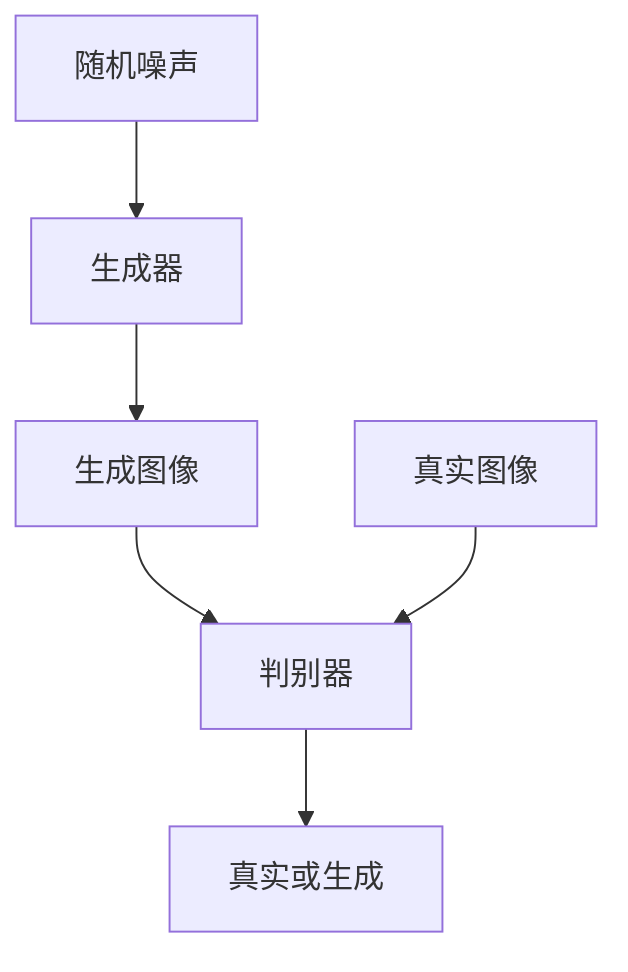

# 基于生成对抗网络的图像风格迁移异常检测与修正

作者：禅与计算机程序设计艺术

## 1.背景介绍

### 1.1 什么是图像风格迁移

图像风格迁移（Image Style Transfer）是一种计算机视觉技术，它利用神经网络将一种图像的风格应用到另一种图像上。通过这种技术，用户可以将一幅图像的内容与另一幅图像的艺术风格相结合，从而生成具有独特视觉效果的新图像。

### 1.2 生成对抗网络简介

生成对抗网络（Generative Adversarial Networks，简称GAN）由Ian Goodfellow等人在2014年提出。GAN由两个神经网络组成：生成器（Generator）和判别器（Discriminator）。生成器负责生成逼真的图像，而判别器则负责区分生成图像和真实图像。两个网络通过对抗训练不断提升彼此的性能。

### 1.3 异常检测与修正的重要性

在图像风格迁移过程中，生成的图像可能会出现各种异常，如色彩失真、纹理不自然等。这些异常不仅影响图像的美观度，还可能在实际应用中带来误导。因此，研究如何检测和修正这些异常具有重要意义。

## 2.核心概念与联系

### 2.1 生成对抗网络的基本结构

生成对抗网络由生成器和判别器组成。生成器接受随机噪声作为输入，输出生成图像。判别器接受图像作为输入，输出一个概率值，表示图像是真实图像的可能性。



### 2.2 图像风格迁移的实现

图像风格迁移通常通过卷积神经网络（Convolutional Neural Networks，CNN）实现。具体方法包括使用预训练的VGG网络提取图像特征，然后通过优化算法将目标图像的内容特征与风格图像的风格特征结合。

### 2.3 异常检测与修正的联系

在图像风格迁移中，生成对抗网络可以用于检测和修正生成图像中的异常。判别器可以识别生成图像中的异常区域，而生成器则可以通过调整生成过程来修正这些异常。

## 3.核心算法原理具体操作步骤

### 3.1 生成对抗网络的训练

生成对抗网络的训练过程包括以下步骤：

1. 初始化生成器和判别器的参数。
2. 从真实数据集中采样一批真实图像。
3. 从随机噪声中生成一批生成图像。
4. 使用真实图像和生成图像训练判别器。
5. 使用生成图像训练生成器。
6. 重复步骤2-5，直到生成图像足够逼真。

### 3.2 图像风格迁移的实现步骤

图像风格迁移的实现步骤如下：

1. 使用预训练的VGG网络提取内容图像和风格图像的特征。
2. 定义内容损失和风格损失。
3. 使用优化算法最小化总损失。
4. 生成最终图像。

### 3.3 异常检测与修正的步骤

异常检测与修正的步骤如下：

1. 使用判别器识别生成图像中的异常区域。
2. 调整生成器的参数，修正异常区域。
3. 重新生成图像。
4. 重复步骤1-3，直到异常消失。

## 4.数学模型和公式详细讲解举例说明

### 4.1 生成对抗网络的数学模型

生成对抗网络的目标是找到生成器和判别器之间的纳什均衡。生成器的目标是最大化判别器认为生成图像为真实图像的概率，而判别器的目标是最大化区分真实图像和生成图像的概率。

生成对抗网络的损失函数如下：

$$
\min_G \max_D V(D, G) = \mathbb{E}_{x \sim p_{data}(x)}[\log D(x)] + \mathbb{E}_{z \sim p_z(z)}[\log(1 - D(G(z)))]
$$

### 4.2 图像风格迁移的数学模型

图像风格迁移的目标是最小化内容损失和风格损失的加权和。内容损失用于保持目标图像的内容特征，风格损失用于保持风格图像的风格特征。

内容损失的公式如下：

$$
L_{content} = \frac{1}{2} \sum_{i,j} (F_{ij}^p - F_{ij}^x)^2
$$

风格损失的公式如下：

$$
L_{style} = \sum_{l=0}^L \frac{1}{4N_l^2 M_l^2} \sum_{i,j} (G_{ij}^l - A_{ij}^l)^2
$$

总损失的公式如下：

$$
L_{total} = \alpha L_{content} + \beta L_{style}
$$

### 4.3 异常检测与修正的数学模型

在异常检测与修正中，判别器的输出可以视为异常评分。生成器的目标是最小化异常评分，从而生成无异常的图像。

异常评分的公式如下：

$$
L_{anomaly} = \mathbb{E}_{x \sim p_{data}(x)}[\log D(x)] - \mathbb{E}_{z \sim p_z(z)}[\log D(G(z))]
$$

生成器的目标是最小化异常评分：

$$
\min_G L_{anomaly}
$$

## 5.项目实践：代码实例和详细解释说明

### 5.1 生成对抗网络的实现

下面是一个简单的生成对抗网络实现示例：

```python
import torch
import torch.nn as nn
import torch.optim as optim

class Generator(nn.Module):
    def __init__(self):
        super(Generator, self).__init__()
        self.main = nn.Sequential(
            nn.Linear(100, 256),
            nn.ReLU(True),
            nn.Linear(256, 512),
            nn.ReLU(True),
            nn.Linear(512, 1024),
            nn.ReLU(True),
            nn.Linear(1024, 784),
            nn.Tanh()
        )

    def forward(self, input):
        return self.main(input)

class Discriminator(nn.Module):
    def __init__(self):
        super(Discriminator, self).__init__()
        self.main = nn.Sequential(
            nn.Linear(784, 1024),
            nn.LeakyReLU(0.2, inplace=True),
            nn.Linear(1024, 512),
            nn.LeakyReLU(0.2, inplace=True),
            nn.Linear(512, 256),
            nn.LeakyReLU(0.2, inplace=True),
            nn.Linear(256, 1),
            nn.Sigmoid()
        )

    def forward(self, input):
        return self.main(input)

# 初始化生成器和判别器
netG = Generator()
netD = Discriminator()

# 损失函数和优化器
criterion = nn.BCELoss()
optimizerD = optim.Adam(netD.parameters(), lr=0.0002)
optimizerG = optim.Adam(netG.parameters(), lr=0.0002)

# 训练循环
for epoch in range(100):
    # 训练判别器
    optimizerD.zero_grad()
    real_data = torch.randn(64, 784)
    label = torch.ones(64, 1)
    output = netD(real_data)
    lossD_real = criterion(output, label)
    lossD_real.backward()

    noise = torch.randn(64, 100)
    fake_data = netG(noise)
    label = torch.zeros(64, 1)
    output = netD(fake_data.detach())
    lossD_fake = criterion(output, label)
    lossD_fake.backward()
    optimizerD.step()

    # 训练生成器
    optimizerG.zero_grad()
    label = torch.ones(64, 1)
    output = netD(fake_data)
    lossG = criterion(output, label)
    lossG.backward()
    optimizerG.step()

    print(f'Epoch [{epoch+1}/100], Loss D: {lossD_real.item() + lossD_fake.item()}, Loss G: {lossG.item()}')
```

### 5.2 图像风格迁移的实现

下面是一个图像风格迁移的实现示例：

```python
import torch
import torch.nn as nn
import torch.optim as optim
from torchvision import models, transforms
from PIL import Image

# 加载预训练的VGG19模型
vgg = models.vgg19(pretrained=True).features

# 定义内容损失和风格损失
class ContentLoss(nn.Module):
    def