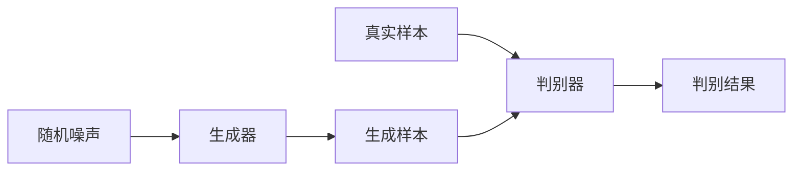

# 基于生成对抗网络的图像风格迁移竞赛平台建设

作者：禅与计算机程序设计艺术

## 1.背景介绍

### 1.1 生成对抗网络简介

生成对抗网络（Generative Adversarial Networks, GANs）是一种深度学习模型，由Ian Goodfellow及其同事在2014年提出。GANs由两个神经网络组成：生成器（Generator）和判别器（Discriminator）。生成器的任务是生成看起来真实的样本，而判别器的任务是区分这些生成样本和真实样本。通过这种对抗过程，生成器不断改进其生成能力，最终能够生成高质量的样本。

### 1.2 图像风格迁移的意义

图像风格迁移（Image Style Transfer）是一种利用深度学习技术将一种图像的风格应用到另一种图像上的技术。其应用范围广泛，包括艺术创作、图像处理、游戏开发等领域。通过风格迁移，可以将普通的照片转换成艺术作品，或者将不同风格的图像融合在一起，创造出新的视觉效果。

### 1.3 竞赛平台的必要性

随着GANs和图像风格迁移技术的发展，越来越多的研究人员和开发者希望通过竞赛平台来展示和提升他们的技术水平。一个完善的竞赛平台不仅可以提供公平、公正的竞赛环境，还可以促进技术的交流和合作，推动整个领域的发展。因此，建设一个基于生成对抗网络的图像风格迁移竞赛平台具有重要意义。

## 2.核心概念与联系

### 2.1 生成对抗网络的基本结构

GANs的基本结构包括生成器和判别器两个部分。生成器的输入通常是随机噪声，通过神经网络生成样本。判别器的输入是生成样本和真实样本，通过神经网络判断输入样本的真实性。生成器和判别器的关系可以用以下Mermaid流程图表示：



### 2.2 图像风格迁移的基本原理

图像风格迁移的基本原理是通过深度神经网络将风格图像的特征应用到内容图像上。通常使用卷积神经网络（Convolutional Neural Networks, CNNs）来提取图像的内容特征和风格特征，然后通过优化过程将这两种特征结合起来，生成具有目标风格的图像。

### 2.3 生成对抗网络与图像风格迁移的结合

将GANs应用于图像风格迁移，可以提高生成图像的质量和多样性。通过对抗训练，生成器可以学习到更加复杂和细腻的风格特征，从而生成更加逼真的风格迁移图像。这种结合方式不仅提升了图像风格迁移的效果，还为技术竞赛提供了新的可能性和挑战。

## 3.核心算法原理具体操作步骤

### 3.1 生成器的设计与训练

生成器的设计通常采用深度卷积神经网络（Deep Convolutional Neural Networks, DCNNs）。其输入是随机噪声，输出是生成的图像。生成器的训练目标是最大化判别器判定为真实的概率。具体步骤如下：

1. 初始化生成器和判别器的参数。
2. 从随机噪声分布中采样，生成初始样本。
3. 使用判别器对生成样本和真实样本进行判别，计算判别器的损失。
4. 反向传播，更新生成器的参数，使生成样本更接近真实样本。
5. 重复上述步骤，直到生成器生成的样本足够逼真。

### 3.2 判别器的设计与训练

判别器的设计通常也是采用深度卷积神经网络。其输入是生成样本和真实样本，输出是样本的真实性概率。判别器的训练目标是最大化区分真实样本和生成样本的能力。具体步骤如下：

1. 初始化判别器的参数。
2. 使用生成器生成样本，并从真实数据集中采样真实样本。
3. 使用判别器对生成样本和真实样本进行判别，计算判别器的损失。
4. 反向传播，更新判别器的参数，使其更好地区分真实样本和生成样本。
5. 重复上述步骤，直到判别器的判别能力达到预期水平。

### 3.3 图像风格迁移的优化过程

图像风格迁移的优化过程通常采用基于梯度下降的优化算法。其目标是最小化内容损失和风格损失的加权和。具体步骤如下：

1. 使用预训练的卷积神经网络提取内容图像和风格图像的特征。
2. 初始化生成图像，通常为内容图像的副本。
3. 计算生成图像与内容图像的内容损失，以及生成图像与风格图像的风格损失。
4. 计算总损失，即内容损失和风格损失的加权和。
5. 反向传播，更新生成图像，使其同时匹配内容特征和风格特征。
6. 重复上述步骤，直到生成图像达到预期效果。

## 4.数学模型和公式详细讲解举例说明

### 4.1 生成对抗网络的数学模型

生成对抗网络的数学模型可以表示为一个极小极大问题：

$$
\min_G \max_D V(D, G) = \mathbb{E}_{x \sim p_{\text{data}}(x)}[\log D(x)] + \mathbb{E}_{z \sim p_z(z)}[\log(1 - D(G(z)))]
$$

其中，$G$ 是生成器，$D$ 是判别器，$p_{\text{data}}(x)$ 是真实数据的分布，$p_z(z)$ 是随机噪声的分布。

### 4.2 图像风格迁移的数学模型

图像风格迁移的数学模型包括内容损失和风格损失。内容损失通常使用欧氏距离来衡量生成图像与内容图像的特征差异：

$$
L_{\text{content}}(p, x, l) = \frac{1}{2} \sum_{i,j} (F_{ij}^l - P_{ij}^l)^2
$$

其中，$F_{ij}^l$ 是生成图像在第$l$层的特征，$P_{ij}^l$ 是内容图像在第$l$层的特征。

风格损失通常使用Gram矩阵来衡量生成图像与风格图像的风格差异：

$$
L_{\text{style}}(a, x) = \sum_{l=0}^{L} \frac{1}{4N_l^2M_l^2} \sum_{i,j} (G_{ij}^l - A_{ij}^l)^2
$$

其中，$G_{ij}^l$ 是生成图像在第$l$层的Gram矩阵，$A_{ij}^l$ 是风格图像在第$l$层的Gram矩阵。

### 4.3 总损失函数

总损失函数是内容损失和风格损失的加权和：

$$
L_{\text{total}}(p, a, x) = \alpha L_{\text{content}}(p, x) + \beta L_{\text{style}}(a, x)
$$

其中，$\alpha$ 和 $\beta$ 是权重系数，用于平衡内容损失和风格损失的影响。

## 5.项目实践：代码实例和详细解释说明

### 5.1 环境准备

在开始项目实践之前，需要准备好开发环境。以下是所需的工具和库：

- Python 3.8+
- TensorFlow 2.4+
- NumPy
- Matplotlib

可以使用以下命令安装所需的库：

```bash
pip install tensorflow numpy matplotlib
```

### 5.2 数据准备

在进行图像风格迁移之前，需要准备好内容图像和风格图像。这里使用TensorFlow提供的示例图像：

```python
import tensorflow as tf
import numpy as np
import matplotlib.pyplot as plt

content_image = tf.keras.utils.get_file('content.jpg', 'https://example.com/content.jpg')
style_image = tf.keras.utils.get_file('style.jpg', 'https://example.com/style.jpg')

def load_img(path_to_img):
    max_dim = 512
    img = tf.io.read_file(path_to_img)
    img = tf.image.decode_image(img, channels=3)
   