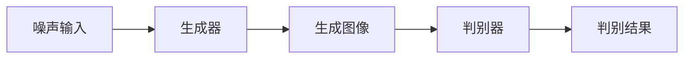

# 基于生成对抗网络的图像风格迁移竞赛平台建设

作者：禅与计算机程序设计艺术

## 1. 背景介绍

### 1.1 生成对抗网络（GAN）的发展

生成对抗网络（Generative Adversarial Network，简称GAN）自2014年由Ian Goodfellow等人提出以来，迅速成为机器学习和计算机视觉领域的热门研究方向。GAN通过两个神经网络——生成器（Generator）和判别器（Discriminator）之间的对抗训练，实现了数据生成的突破性进展。尤其在图像生成和风格迁移任务中，GAN展现出了强大的能力。

### 1.2 图像风格迁移的应用

图像风格迁移是一种将一幅图像的内容与另一幅图像的风格相结合的技术。该技术在艺术创作、图像增强、虚拟现实等领域有广泛应用。例如，通过风格迁移，可以将普通照片转换成名画风格，或将白天的场景变为夜晚的效果。

### 1.3 竞赛平台的意义

随着GAN和图像风格迁移技术的发展，越来越多的研究者和开发者希望通过竞赛平台进行技术交流和创新。一个良好的竞赛平台不仅能提供公平的竞赛环境，还能促进技术的快速迭代和应用推广。

## 2. 核心概念与联系

### 2.1 生成对抗网络的基本原理

GAN由两个主要部分组成：生成器和判别器。生成器试图生成逼真的图像以欺骗判别器，而判别器则试图区分真实图像和生成图像。两者通过对抗训练，不断提升各自的能力。



### 2.2 图像风格迁移的基本原理

图像风格迁移利用深度神经网络提取图像的内容特征和风格特征。通过优化生成图像，使其内容特征接近目标图像的内容特征，风格特征接近风格图像的风格特征，从而实现风格迁移。

### 2.3 GAN与图像风格迁移的结合

GAN在图像风格迁移中的应用主要体现在生成器的设计上。生成器通过学习不同风格图像的特征，能够生成具有特定风格的图像。判别器则用于评估生成图像的质量，从而指导生成器的优化。

## 3. 核心算法原理具体操作步骤

### 3.1 数据准备

风格迁移任务需要大量的图像数据集，包括内容图像和风格图像。常用的数据集有COCO、ImageNet等。

### 3.2 网络架构设计

#### 3.2.1 生成器网络

生成器网络通常采用卷积神经网络（CNN）结构，通过多个卷积层和反卷积层实现图像的生成。

#### 3.2.2 判别器网络

判别器网络同样采用CNN结构，通过多层卷积层对输入图像进行判别，输出图像是真实图像还是生成图像的概率。

### 3.3 损失函数设计

#### 3.3.1 对抗损失

对抗损失用于衡量生成图像与真实图像的差异。生成器和判别器的损失函数分别为：

$$
L_{G} = \mathbb{E}_{z \sim p_z(z)}[\log(1 - D(G(z)))]
$$

$$
L_{D} = -\mathbb{E}_{x \sim p_{data}(x)}[\log D(x)] - \mathbb{E}_{z \sim p_z(z)}[\log(1 - D(G(z)))]
$$

#### 3.3.2 内容损失与风格损失

内容损失用于保持生成图像的内容特征，风格损失用于保持生成图像的风格特征。常用的内容损失和风格损失定义如下：

$$
L_{content} = \frac{1}{2} \sum_{i=1}^N (F_{i}^{G} - F_{i}^{C})^2
$$

$$
L_{style} = \sum_{j=1}^M \frac{1}{4N_j^2} \sum_{i=1}^{N_j} (G_{i}^{G} - G_{i}^{S})^2
$$

### 3.4 训练过程

训练过程包括生成器和判别器的交替优化。具体步骤如下：

1. 初始化生成器和判别器的参数。
2. 从噪声分布中采样生成图像，通过判别器计算对抗损失。
3. 优化生成器参数，使生成图像更逼真。
4. 优化判别器参数，提高判别器的判别能力。
5. 重复步骤2-4，直到损失函数收敛。

## 4. 数学模型和公式详细讲解举例说明

### 4.1 生成对抗网络的数学模型

GAN的数学模型可以表示为一个极小极大（minimax）问题：

$$
\min_G \max_D V(D, G) = \mathbb{E}_{x \sim p_{data}(x)}[\log D(x)] + \mathbb{E}_{z \sim p_z(z)}[\log(1 - D(G(z)))]
$$

### 4.2 图像风格迁移的数学模型

图像风格迁移的数学模型包括内容损失和风格损失的加权和：

$$
L_{total} = \alpha L_{content} + \beta L_{style}
$$

其中，$\alpha$ 和 $\beta$ 为内容损失和风格损失的权重。

### 4.3 举例说明

假设我们有一幅内容图像 $C$ 和一幅风格图像 $S$，通过风格迁移生成的图像 $G$ 应该满足以下条件：

1. $G$ 的内容特征与 $C$ 的内容特征相似。
2. $G$ 的风格特征与 $S$ 的风格特征相似。

通过优化 $L_{total}$，我们可以得到满足上述条件的生成图像 $G$。

## 5. 项目实践：代码实例和详细解释说明

### 5.1 环境准备

首先，我们需要准备好开发环境，包括安装必要的库和工具。常用的库有TensorFlow、PyTorch等。

```python
# 安装必要的库
!pip install tensorflow
!pip install numpy
!pip install matplotlib
```

### 5.2 数据加载与预处理

加载内容图像和风格图像，并进行预处理。

```python
import tensorflow as tf
import numpy as np
import matplotlib.pyplot as plt

# 加载图像
def load_image(image_path):
    img = tf.io.read_file(image_path)
    img = tf.image.decode_image(img, channels=3)
    img = tf.image.convert_image_dtype(img, tf.float32)
    img = tf.image.resize(img, [256, 256])
    img = img[tf.newaxis, :]
    return img

content_image = load_image('content.jpg')
style_image = load_image('style.jpg')
```

### 5.3 模型构建

构建生成器和判别器模型。

```python
from tensorflow.keras import layers

# 生成器模型
def build_generator():
    model = tf.keras.Sequential()
    model.add(layers.Conv2D(64, (3, 3), padding='same', input_shape=(256, 256, 3)))
    model.add(layers.ReLU())
    model.add(layers.Conv2DTranspose(3, (3, 3), padding='same'))
    return model

# 判别器模型
def build_discriminator():
    model = tf.keras.Sequential()
    model.add(layers.Conv2D(64, (3, 3), padding='same', input_shape=(256, 256, 3)))
    model.add(layers.ReLU())
    model.add(layers.Conv2D(1, (3, 3), padding='same'))
    return model

generator = build_generator()
discriminator = build_discriminator()
```

### 5.4 训练模型

训练生成器和判别器。

```python
# 损失函数
cross_entropy = tf.keras.losses.BinaryCrossentropy(from_logits=True)

def generator_loss(fake_output):
    return cross_entropy(tf.ones_like(fake_output), fake_output)

def discriminator_loss(real_output, fake_output):
    real_loss = cross_entropy(tf.ones_like(real_output), real_output)
    fake_loss = cross_entropy(tf.zeros_like(fake_output), fake_output)
    return real_loss + fake_loss

# 优化器
generator_optimizer = tf.keras.optimizers.Adam(1e-4)
discriminator_optimizer = tf.keras.optimizers.Adam(1e