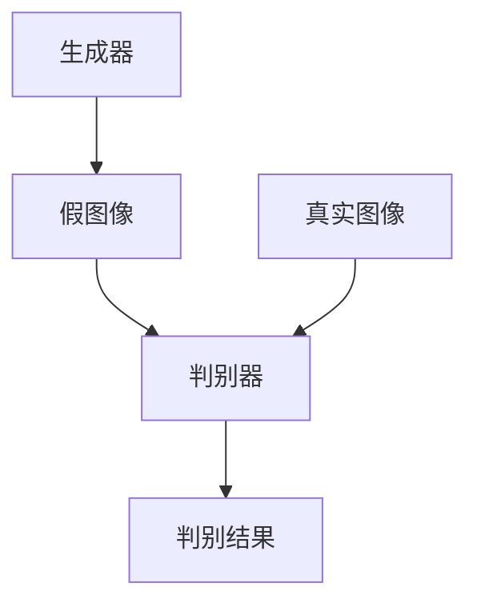

# 基于生成对抗网络的抽象艺术图像风格迁移机制

作者：禅与计算机程序设计艺术

## 1. 背景介绍

### 1.1 生成对抗网络的兴起

自2014年Ian Goodfellow等人提出生成对抗网络（Generative Adversarial Networks, GANs）以来，GANs在图像生成和图像处理领域取得了显著的进展。GANs通过两个相互竞争的神经网络——生成器（Generator）和判别器（Discriminator）——相互博弈，使得生成器能够生成与真实数据分布相似的图像。GANs的这种对抗训练机制使得其在图像生成、图像修复、图像超分辨率等任务中表现出色。

### 1.2 艺术图像风格迁移的需求

风格迁移（Style Transfer）是一种将一种图像的风格应用到另一种图像上的技术。对于艺术图像，风格迁移可以将经典艺术家的风格（如梵高、毕加索）应用到任何图像上，创造出新的艺术作品。这种技术不仅在艺术创作中有广泛应用，还可以用于广告设计、电影制作等领域。

### 1.3 抽象艺术的独特挑战

抽象艺术不同于具象艺术，其特点在于不依赖于现实世界的形象，而是通过颜色、形状和线条来表达情感和思想。这种独特的艺术形式对风格迁移提出了更高的要求，因为需要捕捉和转换的不仅是视觉特征，还有艺术家的创作意图和情感表达。

## 2. 核心概念与联系

### 2.1 生成对抗网络（GANs）

生成对抗网络由两个主要部分组成：

- **生成器（Generator）**：负责生成假图像，试图欺骗判别器。
- **判别器（Discriminator）**：负责区分真实图像和生成图像，试图识别出生成的假图像。

这两个网络通过对抗训练相互提升，最终生成器能够生成足以乱真的图像。



### 2.2 风格迁移

风格迁移的目标是将一幅图像的内容与另一幅图像的风格结合起来。通常使用卷积神经网络（CNN）来提取图像的内容特征和风格特征，然后通过优化技术将两者融合。

### 2.3 抽象艺术的特征

抽象艺术的特征包括：

- **颜色和色调**：抽象艺术常常使用大胆的颜色和独特的色调组合。
- **形状和线条**：抽象艺术通过形状和线条的组合来传达情感和思想。
- **纹理**：抽象艺术中的纹理可以表现出艺术家的独特风格。

## 3. 核心算法原理具体操作步骤

### 3.1 数据准备

为了进行风格迁移，需要准备两类图像数据：

- **内容图像**：包含我们希望保留的内容信息的图像。
- **风格图像**：包含我们希望应用到内容图像上的风格信息的图像。

### 3.2 网络架构设计

我们采用基于GANs的网络架构进行风格迁移。生成器的任务是生成具有目标风格的图像，而判别器的任务是区分生成图像和真实图像。

### 3.3 损失函数设计

风格迁移的损失函数通常包含三个部分：

- **内容损失**：衡量生成图像与内容图像在内容特征上的差异。
- **风格损失**：衡量生成图像与风格图像在风格特征上的差异。
- **对抗损失**：衡量生成图像与真实图像的相似程度。

### 3.4 训练过程

训练过程包括以下步骤：

1. **初始化生成器和判别器**。
2. **输入内容图像和风格图像**。
3. **生成器生成带有风格的图像**。
4. **判别器评估生成图像的真实性**。
5. **计算损失并更新生成器和判别器的参数**。
6. **重复上述步骤，直到生成图像达到预期效果**。

## 4. 数学模型和公式详细讲解举例说明

### 4.1 内容损失

内容损失用于保持生成图像的内容与原始内容图像一致，通常使用卷积神经网络的中间层特征来计算。

$$
\mathcal{L}_{\text{content}}(G, C) = \sum_{i=1}^{L} \left\| \phi_i(G(x)) - \phi_i(C) \right\|^2
$$

其中，$G$ 是生成器，$C$ 是内容图像，$\phi_i$ 是卷积神经网络第 $i$ 层的特征映射。

### 4.2 风格损失

风格损失用于保持生成图像的风格与目标风格图像一致，通常使用Gram矩阵来计算。

$$
\mathcal{L}_{\text{style}}(G, S) = \sum_{i=1}^{L} \left\| G_{\phi_i}(G(x)) - G_{\phi_i}(S) \right\|^2
$$

其中，$S$ 是风格图像，$G_{\phi_i}$ 是第 $i$ 层特征映射的Gram矩阵。

### 4.3 对抗损失

对抗损失用于评估生成图像的真实性，使生成器能够生成更加逼真的图像。

$$
\mathcal{L}_{\text{adv}}(G, D) = \mathbb{E}_{x \sim p_{\text{data}}(x)}[\log D(x)] + \mathbb{E}_{z \sim p_z(z)}[\log(1 - D(G(z)))]
$$

其中，$D$ 是判别器，$p_{\text{data}}$ 是真实数据分布，$p_z$ 是噪声分布。

### 4.4 总损失

总损失是内容损失、风格损失和对抗损失的加权和。

$$
\mathcal{L}_{\text{total}} = \alpha \mathcal{L}_{\text{content}} + \beta \mathcal{L}_{\text{style}} + \gamma \mathcal{L}_{\text{adv}}
$$

其中，$\alpha$、$\beta$ 和 $\gamma$ 是权重参数。

## 5. 项目实践：代码实例和详细解释说明

### 5.1 环境配置

首先，我们需要配置开发环境。假设我们使用的是Python和TensorFlow。

```python
import tensorflow as tf
from tensorflow.keras import layers, models

# 设置随机种子以确保结果可重复
tf.random.set_seed(42)
```

### 5.2 数据加载

加载内容图像和风格图像。

```python
import numpy as np
from PIL import Image

def load_image(path, max_size=400):
    img = Image.open(path)
    if max(img.size) > max_size:
        scale = max_size / max(img.size)
        img = img.resize((int(img.size[0] * scale), int(img.size[1] * scale)), Image.ANTIALIAS)
    img = np.array(img)
    img = img / 255.0  # 归一化
    return img

content_image = load_image('path/to/content_image.jpg')
style_image = load_image('path/to/style_image.jpg')
```

### 5.3 网络架构

定义生成器和判别器的网络架构。

```python
def build_generator():
    model = models.Sequential()
    model.add(layers.Conv2D(64, (3, 3), padding='same', input_shape=(None, None, 3)))
    model.add(layers.Activation('relu'))
    # 添加更多层...
    return model

def build_discriminator():
    model = models.Sequential()
    model.add(layers.Conv2D(64, (3, 3), padding='same', input_shape=(None, None, 3)))
    model.add(layers.LeakyReLU(alpha=0.2))
    # 添加更多层...
    return model

generator = build_generator()
discriminator = build_discriminator()
```

### 5.4 损失函数

定义内容损失、风格损失和对抗损失。

```python
def content_loss(content, generated):
    return tf.reduce_mean(tf.square(content - generated))

def gram_matrix(tensor):
    channels = int(tensor.shape[-1])
    a = tf.reshape(tensor, [-1, channels])
    n = tf.shape(a)[0]
   