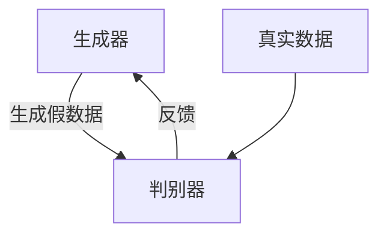

# 基于生成对抗网络的街景图像风格化和季节转换研究

作者：禅与计算机程序设计艺术

## 1. 背景介绍

### 1.1 生成对抗网络简介

生成对抗网络（Generative Adversarial Networks, GANs）是由Ian Goodfellow等人于2014年提出的一种深度学习模型。GANs由两个神经网络组成：生成器（Generator）和判别器（Discriminator）。生成器的目标是生成逼真的数据，而判别器的目标是区分真实数据和生成数据。这种对抗性的训练方式使得GANs在图像生成、图像修复等领域表现出色。

### 1.2 图像风格化与季节转换的需求

图像风格化和季节转换是计算机视觉领域的重要研究方向。图像风格化旨在将图像转换为特定的艺术风格，例如将照片变成油画风格。而季节转换则涉及将图像从一个季节转换到另一个季节，例如将夏季的街景转换为冬季的街景。这些任务在自动驾驶、虚拟现实、游戏开发等领域有广泛的应用。

### 1.3 本文研究的意义

本文将探讨如何利用生成对抗网络实现街景图像的风格化和季节转换。通过详细介绍GANs的原理、具体操作步骤、数学模型和公式，并结合项目实践中的代码实例，帮助读者深入理解这一技术并能在实际应用中加以利用。

## 2. 核心概念与联系

### 2.1 生成器和判别器

生成对抗网络的核心在于生成器和判别器的对抗训练。生成器的任务是从随机噪声中生成逼真的图像，而判别器则需要判断输入图像是真实的还是生成的。两者通过不断的对抗训练，生成器生成的图像会越来越逼真。

### 2.2 损失函数

在GANs中，损失函数是关键的一部分。生成器和判别器都有各自的损失函数。生成器的目标是最大化判别器的误判率，而判别器的目标是最小化误判率。常用的损失函数有交叉熵损失、均方误差等。

### 2.3 图像风格化与季节转换的联系

图像风格化和季节转换在技术实现上有很多相似之处。两者都需要在保持图像基本结构不变的情况下，对图像的某些特征进行修改。风格化主要关注颜色和纹理的变化，而季节转换则涉及更多的场景元素变化，如树木、天气等。

## 3. 核心算法原理具体操作步骤

### 3.1 数据准备

数据准备是实现图像风格化和季节转换的第一步。需要收集大量的图像数据，包含不同风格和季节的街景图像。数据集的质量和多样性直接影响模型的效果。

### 3.2 模型架构设计

设计一个合适的模型架构是成功的关键。常用的架构包括DCGAN、CycleGAN等。CycleGAN特别适用于无监督学习任务，如季节转换，因为它能够在没有成对训练数据的情况下进行图像到图像的转换。



### 3.3 模型训练

模型训练是核心步骤。生成器和判别器通过交替训练来优化各自的参数。训练过程中需要注意避免模式崩溃（Mode Collapse）等常见问题。

### 3.4 模型评估

模型评估主要包括主观评估和客观评估。主观评估依赖于人眼的判断，而客观评估可以使用一些图像质量评价指标，如SSIM、PSNR等。

## 4. 数学模型和公式详细讲解举例说明

### 4.1 生成对抗网络的数学模型

生成对抗网络的目标是通过生成器 $G$ 和判别器 $D$ 的对抗训练，使得生成器生成的图像尽可能接近真实图像。其数学模型可以表示为：

$$
\min_G \max_D V(D, G) = \mathbb{E}_{x \sim p_{data}(x)}[\log D(x)] + \mathbb{E}_{z \sim p_z(z)}[\log(1 - D(G(z)))]
$$

其中，$p_{data}(x)$ 表示真实数据的分布，$p_z(z)$ 表示噪声的分布。

### 4.2 损失函数的详细解释

生成器和判别器的损失函数分别为：

生成器的损失函数：

$$
L_G = -\mathbb{E}_{z \sim p_z(z)}[\log D(G(z))]
$$

判别器的损失函数：

$$
L_D = -\mathbb{E}_{x \sim p_{data}(x)}[\log D(x)] - \mathbb{E}_{z \sim p_z(z)}[\log(1 - D(G(z)))]
$$

### 4.3 CycleGAN的数学模型

CycleGAN的目标是实现无监督的图像到图像转换，其核心思想是通过循环一致性损失来确保转换后的图像能够恢复到原始图像。其损失函数包括对抗损失和循环一致性损失：

对抗损失：

$$
L_{GAN}(G, D_Y, X, Y) = \mathbb{E}_{y \sim p_{data}(y)}[\log D_Y(y)] + \mathbb{E}_{x \sim p_{data}(x)}[\log(1 - D_Y(G(x)))]
$$

循环一致性损失：

$$
L_{cyc}(G, F) = \mathbb{E}_{x \sim p_{data}(x)}[\|F(G(x)) - x\|_1] + \mathbb{E}_{y \sim p_{data}(y)}[\|G(F(y)) - y\|_1]
$$

总损失函数：

$$
L(G, F, D_X, D_Y) = L_{GAN}(G, D_Y, X, Y) + L_{GAN}(F, D_X, Y, X) + \lambda L_{cyc}(G, F)
$$

其中，$G$ 和 $F$ 分别表示两个生成器，$D_X$ 和 $D_Y$ 分别表示两个判别器，$\lambda$ 是权重系数。

## 5. 项目实践：代码实例和详细解释说明

### 5.1 数据集准备

首先，我们需要准备数据集。这里我们使用开源的Cityscapes数据集，该数据集包含大量的城市街景图像，适合用于图像风格化和季节转换任务。

```python
import os
import cv2
import numpy as np

def load_images_from_folder(folder):
    images = []
    for filename in os.listdir(folder):
        img = cv2.imread(os.path.join(folder, filename))
        if img is not None:
            images.append(img)
    return images

train_images = load_images_from_folder('path/to/train/images')
test_images = load_images_from_folder('path/to/test/images')
```

### 5.2 模型架构设计

我们使用CycleGAN架构来实现季节转换。以下是CycleGAN的生成器和判别器的代码实现。

```python
import torch
import torch.nn as nn

class Generator(nn.Module):
    def __init__(self):
        super(Generator, self).__init__()
        # 定义生成器的网络结构
        self.main = nn.Sequential(
            nn.Conv2d(3, 64, kernel_size=4, stride=2, padding=1),
            nn.ReLU(True),
            # 添加更多的卷积层和激活函数
        )

    def forward(self, x):
        return self.main(x)

class Discriminator(nn.Module):
    def __init__(self):
        super(Discriminator, self).__init__()
        # 定义判别器的网络结构
        self.main = nn.Sequential(
            nn.Conv2d(3, 64, kernel_size=4, stride=2, padding=1),
            nn.LeakyReLU(0.2, inplace=True),
            # 添加更多的卷积层和激活函数
        )

    def forward(self, x):
        return self.main(x)
```

### 5.3 模型训练

模型训练需要定义优化器和损失函数，并进行迭代训练。

```python
import torch.optim as optim

# 初始化生成器和判别器
G = Generator()
D = Discriminator()

# 定义优化器
optimizer_G = optim.Adam(G.parameters(), lr=0.0002, betas=(0.5, 0.999))
optimizer_D = optim.Adam(D.parameters(), lr=0.0002, betas=(0.5