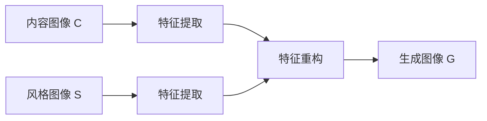

# 基于生成对抗网络的集成学习风格迁移策略优化

作者：禅与计算机程序设计艺术

## 1.背景介绍

### 1.1 风格迁移概述

风格迁移（Style Transfer）是一种计算机视觉技术，旨在将一幅图像的内容与另一幅图像的风格相结合，从而生成既保留内容又具有特定风格的图像。自2015年Gatys等人提出基于卷积神经网络（CNN）的风格迁移方法以来，风格迁移技术得到了广泛的研究和应用。

### 1.2 生成对抗网络（GAN）简介

生成对抗网络（Generative Adversarial Networks, GANs）由Ian Goodfellow等人在2014年提出，是一种通过两个网络（生成器和判别器）之间的对抗性训练来生成数据的模型。生成器（Generator）试图生成逼真的数据，而判别器（Discriminator）则试图区分真实数据和生成数据。通过这种对抗性训练，生成器能够生成越来越逼真的数据。

### 1.3 集成学习的概念

集成学习（Ensemble Learning）是一种将多个模型的预测结果进行组合，从而提高整体预测性能的机器学习方法。常见的集成学习方法包括Bagging、Boosting和Stacking等。集成学习在提高模型的泛化能力和稳定性方面具有显著优势。

### 1.4 研究动机与目的

尽管风格迁移技术取得了显著进展，但在实际应用中仍然存在一些挑战，如生成图像的质量不稳定、风格迁移的灵活性不足等。本文提出一种基于生成对抗网络的集成学习风格迁移策略优化方法，旨在通过集成学习的思想，结合GAN的强大生成能力，优化风格迁移的效果，提高生成图像的质量和多样性。

## 2.核心概念与联系

### 2.1 风格迁移与GAN的结合

风格迁移和GAN的结合主要体现在利用GAN的生成能力来实现风格迁移。通过GAN的生成器生成具有特定风格的图像，同时利用判别器进行对抗性训练，最终实现高质量的风格迁移效果。

### 2.2 集成学习在风格迁移中的应用

集成学习在风格迁移中的应用主要体现在以下几个方面：

- **提高生成图像的质量**：通过集成多个生成器的输出，可以有效提高生成图像的质量和稳定性。
- **增加风格迁移的多样性**：通过集成不同风格的生成器，可以实现多样化的风格迁移效果。
- **优化训练过程**：通过集成学习的方法，可以优化GAN的训练过程，提高训练效率和效果。

### 2.3 核心算法的联系

本文提出的基于生成对抗网络的集成学习风格迁移策略优化方法，核心在于将GAN和集成学习的方法有机结合，通过对生成器和判别器的集成优化，实现高质量、多样化的风格迁移效果。

## 3.核心算法原理具体操作步骤

### 3.1 GAN的基本结构

生成对抗网络由生成器和判别器组成，生成器负责生成逼真的数据，判别器负责区分真实数据和生成数据。具体结构如下：

```mermaid
graph LR
    A[噪声 z] --> B[生成器 G]
    B --> C[生成图像 G(z)]
    D[真实图像 x] --> E[判别器 D]
    C --> E
    E --> F[判别结果]
```

### 3.2 风格迁移的基本流程

风格迁移的基本流程包括内容图像和风格图像的输入，通过神经网络进行特征提取和重构，最终生成具有特定风格的图像。具体流程如下：



### 3.3 集成学习风格迁移策略

集成学习风格迁移策略包括多个生成器和判别器的集成，通过对多个生成器的输出进行加权平均，得到最终的生成图像。具体步骤如下：

1. **初始化多个生成器和判别器**：初始化多个生成器和判别器，分别进行训练。
2. **生成图像**：利用多个生成器生成图像。
3. **判别器评估**：利用判别器对生成图像进行评估，计算损失函数。
4. **加权平均**：对多个生成器的输出进行加权平均，得到最终的生成图像。
5. **优化训练**：通过对生成器和判别器的集成优化，提高训练效果。

## 4.数学模型和公式详细讲解举例说明

### 4.1 GAN的数学模型

生成对抗网络的目标是通过对抗性训练，使生成器生成的图像尽可能接近真实图像。其数学模型可以表示为：

$$
\min_G \max_D V(D, G) = \mathbb{E}_{x \sim p_{data}(x)}[\log D(x)] + \mathbb{E}_{z \sim p_z(z)}[\log (1 - D(G(z)))]
$$

其中，$G$ 是生成器，$D$ 是判别器，$p_{data}(x)$ 是真实数据的分布，$p_z(z)$ 是噪声的分布。

### 4.2 风格迁移的损失函数

风格迁移的损失函数包括内容损失和风格损失，具体表示为：

$$
L_{total} = \alpha L_{content} + \beta L_{style}
$$

其中，内容损失 $L_{content}$ 和风格损失 $L_{style}$ 分别表示为：

$$
L_{content} = \sum_{i=1}^n \| F_i(C) - F_i(G) \|^2
$$

$$
L_{style} = \sum_{j=1}^m \| G_j(S) - G_j(G) \|^2
$$

其中，$F_i$ 和 $G_j$ 分别表示内容图像和风格图像在第 $i$ 层和第 $j$ 层的特征表示。

### 4.3 集成学习的加权平均

集成学习的加权平均可以表示为：

$$
G_{final} = \sum_{k=1}^K w_k G_k
$$

其中，$G_k$ 表示第 $k$ 个生成器的输出，$w_k$ 表示第 $k$ 个生成器的权重，满足 $\sum_{k=1}^K w_k = 1$。

## 4.项目实践：代码实例和详细解释说明

### 4.1 环境配置与依赖安装

在开始项目实践之前，需要配置环境并安装必要的依赖库。以下是一个示例的环境配置和依赖安装步骤：

```bash
# 创建虚拟环境
python -m venv gan_style_transfer

# 激活虚拟环境
source gan_style_transfer/bin/activate

# 安装必要的依赖库
pip install torch torchvision matplotlib
```

### 4.2 生成对抗网络的实现

以下是一个简单的生成对抗网络的实现代码：

```python
import torch
import torch.nn as nn
import torch.optim as optim
import torchvision.datasets as dsets
import torchvision.transforms as transforms
from torch.autograd import Variable

# 定义生成器
class Generator(nn.Module):
    def __init__(self):
        super(Generator, self).__init__()
        self.main = nn.Sequential(
            nn.ConvTranspose2d(100, 512, 4, 1, 0, bias=False),
            nn.BatchNorm2d(512),
            nn.ReLU(True),
            nn.ConvTranspose2d(512, 256, 4, 2, 1, bias=False),
            nn.BatchNorm2d(256),
            nn.ReLU(True),
            nn.ConvTranspose2d(256, 128, 4, 2, 1, bias=False),
            nn.BatchNorm2d(128),
            nn.ReLU(True),
            nn.ConvTranspose2d(128, 64, 4, 2, 1, bias=False),
            nn.BatchNorm2d(64),
            nn.ReLU(True),
            nn.ConvTranspose2d(64, 3, 4, 2, 1, bias=False),
            nn.Tanh()
        )

    def forward(self, input):
        return self.main(input)

# 定义判别器
class Discriminator(nn.Module):
    def __init__(self):
        super(Discriminator, self).__init__()
        self.main = nn.Sequential(
            nn.Conv2d(3, 64, 