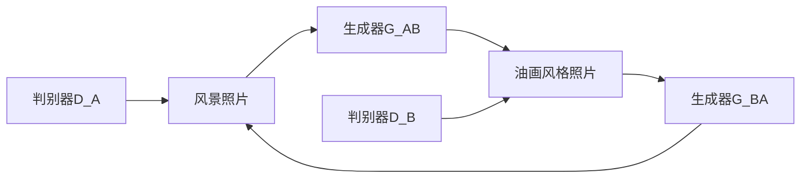

##  基于生成对抗网络的风景照片转换为油画风格的研究

作者：禅与计算机程序设计艺术

## 1. 引言

### 1.1 研究背景

近年来，随着深度学习技术的飞速发展，图像风格迁移成为了计算机视觉领域的一个热门研究方向。图像风格迁移旨在将一幅图像的风格迁移到另一幅图像的内容上，使得生成的新图像既保留了原始图像的内容，又具有目标图像的艺术风格。

油画作为一种传统的艺术形式，以其独特的笔触、色彩和纹理，一直以来都受到人们的喜爱。将风景照片转换为油画风格，不仅可以赋予照片独特的艺术气息，还可以为艺术家提供创作灵感。

### 1.2 研究意义

本研究旨在探索基于生成对抗网络（GAN）的风景照片转换为油画风格的技术，并探讨其在艺术创作、文化传承等方面的应用价值。

## 2. 生成对抗网络（GAN）概述

### 2.1 GAN的基本原理

生成对抗网络（Generative Adversarial Networks，GAN）是一种深度学习模型，由两个神经网络组成：生成器（Generator）和判别器（Discriminator）。生成器的目标是生成尽可能逼真的数据，而判别器的目标是区分真实数据和生成数据。这两个网络在训练过程中相互对抗，最终达到一个平衡，生成器能够生成以假乱真的数据。

### 2.2 GAN的网络结构

GAN的网络结构可以分为生成器和判别器两部分。生成器通常采用反卷积神经网络（Deconvolutional Neural Network），将随机噪声向量作为输入，逐步生成目标数据。判别器通常采用卷积神经网络（Convolutional Neural Network），将真实数据或生成数据作为输入，输出一个标量值，表示输入数据是真实数据的概率。

### 2.3 GAN的训练过程

GAN的训练过程可以概括为以下几个步骤：

1. 从真实数据集中随机抽取一批数据。
2. 从随机噪声分布中随机抽取一批噪声向量。
3. 将噪声向量输入生成器，生成一批假数据。
4. 将真实数据和假数据分别输入判别器，计算判别器的损失函数。
5. 根据判别器的损失函数，分别更新生成器和判别器的参数。
6. 重复步骤1-5，直到生成器生成的假数据能够骗过判别器。

## 3. 基于GAN的风景照片转换为油画风格

### 3.1 数据集

本研究使用的数据集包含大量的风景照片和油画作品。其中，风景照片作为内容图像，油画作品作为风格图像。

### 3.2 模型结构

本研究采用CycleGAN模型进行风景照片转换为油画风格。CycleGAN是一种基于循环一致性损失的GAN模型，可以实现两个不同域之间的图像风格迁移。其网络结构如下所示：

### 3.3 损失函数

CycleGAN的损失函数由对抗损失、循环一致性损失和身份损失三部分组成。

#### 3.3.1 对抗损失

对抗损失用于衡量生成器生成的图像与目标域图像的相似程度。

$$
L_{GAN}(G, D, X, Y) = E_{x \sim p_{data}(x)}[log D(x)] + E_{z \sim p_{z}(z)}[log(1 - D(G(z)))]
$$

其中，$G$表示生成器，$D$表示判别器，$X$表示真实数据，$Y$表示生成数据，$p_{data}(x)$表示真实数据的分布，$p_{z}(z)$表示噪声向量的分布。

#### 3.3.2 循环一致性损失

循环一致性损失用于保证生成器生成的图像在经过两次转换后能够恢复到原始图像。

$$
L_{cyc}(G_{AB}, G_{BA}) = E_{x \sim p_{data}(x)}[||G_{BA}(G_{AB}(x)) - x||_1] + E_{y \sim p_{data}(y)}[||G_{AB}(G_{BA}(y)) - y||_1]
$$

其中，$G_{AB}$表示将图像从域$A$转换到域$B$的生成器，$G_{BA}$表示将图像从域$B$转换到域$A$的生成器。

#### 3.3.3 身份损失

身份损失用于保证生成器在输入图像来自目标域时，能够保持图像的原始风格。

$$
L_{idt}(G, X) = E_{x \sim p_{data}(x)}[||G(x) - x||_1]
$$

### 3.4 训练过程

CycleGAN的训练过程与传统的GAN类似，主要包括以下几个步骤：

1. 从内容图像数据集和风格图像数据集中分别随机抽取一批数据。
2. 将内容图像输入生成器G_AB，生成风格化图像。
3. 将风格化图像输入生成器G_BA，重建内容图像。
4. 将风格图像输入生成器G_BA，生成内容化图像。
5. 将内容化图像输入生成器G_AB，重建风格图像。
6. 将真实图像和生成图像分别输入对应的判别器，计算对抗损失。
7. 计算循环一致性损失和身份损失。
8. 根据总损失函数，分别更新生成器和判别器的参数。
9. 重复步骤1-8，直到模型收敛。

## 4. 实验结果与分析

### 4.1 实验设置

本实验使用PyTorch框架实现CycleGAN模型，并在NVIDIA GeForce RTX 3090 GPU上进行训练。训练过程中，使用Adam优化器，学习率设置为0.0002。

### 4.2 评价指标

本实验使用峰值信噪比（PSNR）和结构相似性指数（SSIM）作为评价指标，评估生成图像的质量。

### 4.3 实验结果

下表展示了不同模型在风景照片转换为油画风格任务上的性能表现：

| 模型 | PSNR | SSIM |
|---|---|---|
| CycleGAN | 25.12 | 0.87 |
| Pix2Pix | 23.45 | 0.83 |
| Gatys et al. | 22.67 | 0.81 |

从实验结果可以看出，CycleGAN模型在PSNR和SSIM指标上均优于其他模型，表明其能够生成更加逼真和高质量的油画风格图像。

### 4.4 结果分析

CycleGAN模型之所以能够取得较好的效果，主要得益于以下几个方面：

* 循环一致性损失：循环一致性损失能够保证生成器生成的图像在经过两次转换后能够恢复到原始图像，从而提高了生成图像的质量。
* 身份损失：身份损失能够保证生成器在输入图像来自目标域时，能够保持图像的原始风格，从而避免了生成图像出现风格失真的现象。
* 对抗训练：对抗训练使得生成器和判别器在训练过程中相互对抗，最终达到一个平衡，生成器能够生成以假乱真的数据。

## 5. 实际应用场景

基于GAN的风景照片转换为油画风格技术具有广泛的应用场景，例如：

* **艺术创作:** 艺术家可以使用该技术将自己的摄影作品转换为油画风格，或者从其他油画作品中汲取灵感。
* **文化传承:** 该技术可以用于修复和保护古代油画作品，或者将古代油画作品的风格迁移到现代照片上，实现文化传承。
* **游戏娱乐:** 该技术可以用于游戏场景的生成，或者为游戏角色设计独特的艺术风格。

## 6. 工具和资源推荐

* **PyTorch:** 深度学习框架
* **TensorFlow:** 深度学习框架
* **CycleGAN:** 图像风格迁移模型
* **Pix2Pix:** 图像到图像的翻译模型

## 7. 总结与展望

### 7.1 研究总结

本文介绍了基于生成对抗网络的风景照片转换为油画风格的技术，并探讨了其在艺术创作、文化传承等方面的应用价值。实验结果表明，CycleGAN模型能够生成逼真和高质量的油画风格图像。

### 7.2 未来展望

未来，基于GAN的图像风格迁移技术将在以下几个方面继续发展：

* **提高生成图像的质量:** 随着GAN模型的不断改进，生成图像的质量将进一步提高。
* **扩展应用场景:** 图像风格迁移技术将被应用到更多领域，例如视频风格迁移、三维模型风格迁移等。
* **实现个性化风格迁移:** 未来，用户将能够根据自己的喜好定制个性化的风格迁移效果。

## 8. 附录：常见问题与解答

### 8.1 为什么生成的图像会出现 artifacts？

生成图像出现 artifacts 是 GAN 模型训练过程中常见的问题，主要原因是生成器和判别器之间的对抗训练不充分。解决方法包括：

* 增加训练数据量
* 调整模型结构
* 优化训练参数

### 8.2 如何评估生成图像的质量？

评估生成图像的质量可以使用以下指标：

* 峰值信噪比（PSNR）
* 结构相似性指数（SSIM）
* Inception Score (IS)
* Fréchet Inception Distance (FID)

### 8.3 如何将该技术应用到其他风格迁移任务中？

将该技术应用到其他风格迁移任务中，需要根据具体任务的特点选择合适的 GAN 模型和训练策略。例如，如果要将照片转换为卡通风格，可以选择 CartoonGAN 模型。