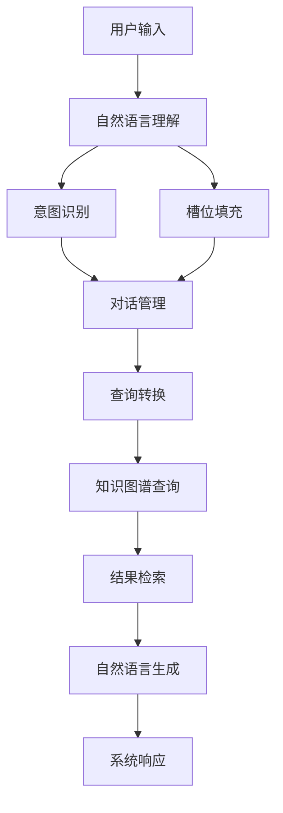

# 基于知识图谱的检索式对话系统详细设计与具体代码实现

作者：禅与计算机程序设计艺术

## 1. 背景介绍

### 1.1 对话系统的现状与挑战

对话系统（Conversational Systems）在现代科技中占据了重要地位，从智能客服到虚拟助手，它们的应用范围广泛。然而，现有的对话系统主要分为生成式和检索式两种。生成式对话系统依赖于生成模型，能够产生自然语言输出，但往往存在内容不准确或不连贯的问题。相较之下，检索式对话系统通过从预先定义的知识库中检索最相关的回答，具有更高的准确性和一致性。

### 1.2 知识图谱在对话系统中的应用

知识图谱（Knowledge Graph）是一种结构化的知识表示方式，通过实体和关系的图结构展示知识。它能够有效地组织和存储大量信息，并支持复杂的查询操作。在对话系统中，知识图谱可以提供丰富的背景知识和语义理解能力，使得系统能够更准确地理解用户意图并提供相关回答。

### 1.3 本文的目标与结构

本文旨在详细介绍基于知识图谱的检索式对话系统的设计与实现。我们将从核心概念、算法原理、数学模型、项目实践、实际应用场景、工具和资源推荐、未来发展趋势与挑战等方面进行深入探讨，并提供具体的代码实例和详细解释。

## 2. 核心概念与联系

### 2.1 知识图谱的基本概念

知识图谱由节点（实体）和边（关系）组成，节点代表现实世界中的实体，边表示实体之间的关系。知识图谱的构建通常包括数据采集、数据清洗、实体识别、关系抽取和图构建等步骤。

### 2.2 对话系统的基本概念

对话系统的主要任务是理解用户输入并生成合适的响应。检索式对话系统通过查询知识库来找到最相关的回答。其核心组件包括自然语言理解（NLU）、对话管理（DM）和自然语言生成（NLG）。

### 2.3 知识图谱与对话系统的结合

知识图谱为对话系统提供了丰富的背景知识和语义理解能力，使得系统能够更准确地理解用户意图并提供相关回答。通过将知识图谱与对话系统结合，可以实现更智能、更高效的对话系统。

## 3. 核心算法原理具体操作步骤

### 3.1 数据采集与预处理

#### 3.1.1 数据来源

数据来源可以是结构化数据（如数据库）、半结构化数据（如JSON、XML）和非结构化数据（如文本、网页）。

#### 3.1.2 数据清洗与转换

数据清洗包括去除噪声数据、填补缺失值、数据格式统一等步骤。数据转换则是将原始数据转换为知识图谱所需的格式。

### 3.2 知识图谱构建

#### 3.2.1 实体识别

实体识别（Named Entity Recognition, NER）是识别文本中的实体并将其分类为预定义的类别，如人名、地名、机构名等。

#### 3.2.2 关系抽取

关系抽取是识别实体之间的关系，并将其表示为知识图谱中的边。

#### 3.2.3 图构建

将识别出的实体和关系构建成图结构，并存储在图数据库中。

### 3.3 检索式对话系统设计

#### 3.3.1 自然语言理解

自然语言理解包括意图识别和槽位填充。意图识别是识别用户的意图，槽位填充是提取用户输入中的关键信息。

#### 3.3.2 对话管理

对话管理负责维护对话状态，并根据用户输入和对话历史生成适当的响应。

#### 3.3.3 自然语言生成

自然语言生成是将系统的响应生成自然语言文本。

### 3.4 查询处理与结果检索

#### 3.4.1 查询转换

将用户输入转换为知识图谱查询语言（如SPARQL）。

#### 3.4.2 结果检索

在知识图谱中执行查询，并返回最相关的结果。

### 3.5 系统架构设计

使用Mermaid流程图展示系统架构设计：



## 4. 数学模型和公式详细讲解举例说明

### 4.1 实体识别模型

实体识别通常使用序列标注模型，如条件随机场（CRF）或双向长短期记忆网络（BiLSTM-CRF）。其目标是给定一个输入序列 $X = (x_1, x_2, ..., x_n)$，预测对应的标签序列 $Y = (y_1, y_2, ..., y_n)$。

$$
P(Y|X) = \frac{\exp(\sum_{i=1}^{n} \psi(y_i, y_{i-1}, X, i))}{\sum_{Y'} \exp(\sum_{i=1}^{n} \psi(y_i', y_{i-1}', X, i))}
$$

### 4.2 关系抽取模型

关系抽取可以使用分类模型或序列标注模型。假设有两个实体 $e_1$ 和 $e_2$，其关系可以表示为：

$$
P(r|e_1, e_2, X) = \text{softmax}(W_r \cdot f(e_1, e_2, X) + b_r)
$$

其中，$f(e_1, e_2, X)$ 是表示实体和上下文的特征向量，$W_r$ 和 $b_r$ 是模型参数。

### 4.3 意图识别模型

意图识别通常使用分类模型，如卷积神经网络（CNN）或长短期记忆网络（LSTM）。给定输入序列 $X$，意图识别模型的目标是预测意图类别 $c$：

$$
P(c|X) = \text{softmax}(W_c \cdot g(X) + b_c)
$$

其中，$g(X)$ 是表示输入序列的特征向量，$W_c$ 和 $b_c$ 是模型参数。

### 4.4 槽位填充模型

槽位填充可以使用序列标注模型，如条件随机场（CRF）或双向长短期记忆网络（BiLSTM-CRF）。其目标是给定一个输入序列 $X$，预测对应的槽位标签序列 $Y$：

$$
P(Y|X) = \frac{\exp(\sum_{i=1}^{n} \phi(y_i, y_{i-1}, X, i))}{\sum_{Y'} \exp(\sum_{i=1}^{n} \phi(y_i', y_{i-1}', X, i))}
$$

## 5. 项目实践：代码实例和详细解释说明

### 5.1 数据采集与预处理

以下代码示例展示了如何从文本数据中提取实体和关系，并构建知识图谱。

```python
import spacy
import pandas as pd
from py2neo import Graph, Node, Relationship

# 加载Spacy模型
nlp = spacy.load("en_core_web_sm")

# 数据采集
data = pd.read_csv("data.csv")

# 数据清洗与转换
def clean_data(text):
    doc = nlp(text)
    entities = [(ent.text, ent.label_) for ent in doc.ents]
    return entities

data['entities'] = data['text'].apply(clean_data)

# 知识图谱构建
graph = Graph("bolt://localhost:7687", auth=("neo4j", "password"))

for index, row in data.iterrows():
    entities = row['entities']
    for entity in entities:
        node = Node("Entity", name=entity[0], label=entity[1])
        graph.create(node)

# 关系抽取和图构建
for index, row in data.iterrows():
    entities = row['entities']
    for i in range(len(entities) - 1):
        node1 = graph.nodes.match("Entity", name=entities[i][0]).first()
        node2 = graph.nodes.match("Entity", name=entities[i+1][0]).first()
        rel = Relationship(node1, "RELATED_TO", node2)
        graph.create(rel)
